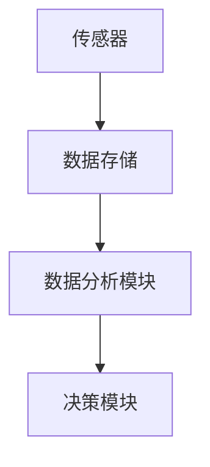
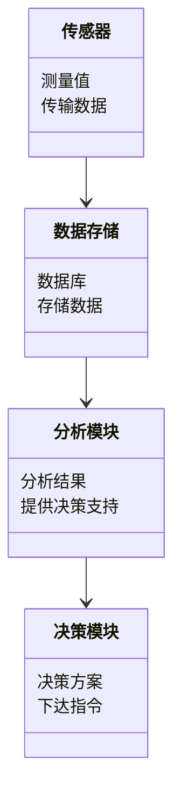

                 


# 价值投资中的智能城市应急响应系统分析

> **关键词**: 价值投资, 智能城市, 应急响应系统, 数据分析, 人工智能, 系统架构

> **摘要**: 本文深入分析了价值投资在智能城市应急响应系统中的应用，探讨了如何通过数据驱动的方法优化应急响应效率，降低城市风险。文章从背景、核心概念、算法原理、系统架构到项目实战，全面解析了智能城市应急响应系统的构建与优化，为投资者和城市管理者提供了理论支持和实践指导。

---

# 第一章: 价值投资与智能城市应急响应系统概述

## 1.1 价值投资的背景与意义

### 1.1.1 价值投资的基本概念
价值投资是一种以低于市场价买入优质资产的投资策略，强调长期持有的理念。在智能城市领域，价值投资的核心在于识别那些能够为城市创造长期价值的项目和企业。

### 1.1.2 智能城市应急响应系统的定义
智能城市应急响应系统是一种基于人工智能、大数据和物联网技术的系统，旨在通过实时数据收集和分析，快速响应城市中的突发事件，如火灾、自然灾害等。

### 1.1.3 价值投资与应急响应系统的关系
价值投资在应急响应系统中的应用，体现在通过技术手段优化资源配置，提升应急响应效率，从而为城市和投资者创造更大的价值。

## 1.2 智能城市应急响应系统的重要性

### 1.2.1 应急响应系统的传统模式
传统应急响应系统依赖人工操作，效率低下，且难以应对复杂的城市环境。

### 1.2.2 智能化应急响应的优势
智能化应急响应系统通过数据驱动的方式，实现了快速响应和资源优化配置，显著提升了应急效率。

### 1.2.3 价值投资在应急响应中的作用
价值投资通过分析应急响应系统的效益和潜力，帮助投资者选择具有长期价值的项目。

## 1.3 本书的核心内容与目标

### 1.3.1 本书的研究范围
本书聚焦于智能城市应急响应系统的设计、优化和投资价值分析。

### 1.3.2 本书的主要目标
通过系统分析和案例研究，揭示价值投资在智能城市应急响应系统中的应用潜力。

### 1.3.3 本书的结构安排
本书分为背景、核心概念、算法、系统架构、项目实战和最佳实践等部分。

---

# 第二章: 智能城市应急响应系统的核心概念

## 2.1 数据驱动的应急响应

### 2.1.1 数据来源与类型
- **实时数据**: 感知设备采集的实时数据，如温度、湿度等。
- **历史数据**: 过往的应急响应记录和城市运营数据。
- **外部数据**: 天气预报、交通数据等外部信息。

### 2.1.2 数据处理与分析
- 数据清洗: 去除无效数据，处理异常值。
- 数据建模: 使用机器学习模型进行预测和分类。

### 2.1.3 数据驱动的决策支持
通过数据建模和分析，提供实时的决策支持，优化应急响应策略。

## 2.2 应急响应系统的组成部分

### 2.2.1 传感器网络
- 传感器布设: 在城市各关键位置部署传感器，实时监测环境数据。
- 数据采集: 传感器采集数据并传输到中央控制系统。

### 2.2.2 数据分析模块
- 数据存储: 对采集的数据进行存储和管理。
- 数据分析: 使用算法对数据进行分析，识别潜在风险。

### 2.2.3 智能决策模块
- 决策支持: 基于数据分析结果，生成最优决策方案。
- 系统反馈: 根据决策结果调整系统运行策略。

## 2.3 价值投资与应急响应的结合

### 2.3.1 价值投资的基本原理
- 价值评估: 通过分析系统的经济效益和社会效益，评估其投资价值。
- 风险评估: 识别系统中的潜在风险，评估其对投资的影响。

### 2.3.2 应急响应中的价值评估
- 经济效益: 系统提升应急效率带来的成本节约。
- 社会效益: 系统在灾害中的救险效果和公众满意度。

### 2.3.3 价值投资在应急响应中的应用
- 项目选择: 投资者根据系统的价值评估结果，选择具有高回报的项目。
- 投资策略: 制定长期投资策略，优化资产配置。

---

# 第三章: 核心概念与联系

## 3.1 系统架构的实体关系图

### 3.1.1 实体关系图的构建
- **核心实体**: 感知设备、数据存储、分析模块、决策模块。
- **关系**: 设备采集数据，数据传输到存储，分析模块处理数据，决策模块基于分析结果做出决策。

### 3.1.2 实体关系图的分析
通过Mermaid图展示实体关系，清晰展示系统各部分的交互关系。

### 3.1.3 实体关系图的应用
帮助系统设计者理解系统的整体架构，优化各模块的协作效率。

## 3.2 核心概念属性对比

### 3.2.1 核心概念对比表
| 概念 | 属性 | 描述 |
|------|------|------|
| 传感器 | 类型 | 温度、压力等 |
| 数据分析 | 方法 | 机器学习、统计分析 |
| 决策模块 | 功能 | 生成决策方案 |

## 3.3 实体关系图的Mermaid代码



---

# 第四章: 算法原理讲解

## 4.1 预测模型

### 4.1.1 算法流程图


### 4.1.2 Python实现代码
```python
import pandas as pd
from sklearn.model import LinearRegression

# 数据预处理
data = pd.read_csv('data.csv')
X = data[['温度', '湿度']]
y = data['风险等级']

# 训练模型
model = LinearRegression()
model.fit(X, y)

# 评估模型
print(model.score(X, y))
```

## 4.2 优化算法

### 4.2.1 算法流程图


### 4.2.2 Python实现代码
```python
def optimize(theta):
    cost = theta**2
    return cost

# 初始化参数
theta = 0.5

# 优化参数
optimized_theta = optimize(theta)
print(optimized_theta)
```

## 4.3 数学模型与公式

### 4.3.1 预测模型公式
$$ y = \beta_0 + \beta_1x + \epsilon $$

### 4.3.2 优化模型公式
$$ \theta_{new} = \theta_{old} - \alpha \cdot \nabla J(\theta_{old}) $$

---

# 第五章: 系统分析与架构设计方案

## 5.1 问题场景介绍

### 5.1.1 项目背景
某城市面临自然灾害频发的问题，需要构建智能应急响应系统。

### 5.1.2 项目目标
提升应急响应效率，降低灾害损失。

## 5.2 系统功能设计

### 5.2.1 领域模型


## 5.3 系统架构设计

### 5.3.1 架构图


## 5.4 接口设计与交互

### 5.4.1 系统接口
- 数据接口: 传感器与存储模块之间的数据传输接口。
- 分析接口: 分析模块与决策模块之间的交互接口。

### 5.4.2 交互流程图


---

# 第六章: 项目实战

## 6.1 环境安装

### 6.1.1 安装Python
```bash
pip install python3
```

### 6.1.2 安装依赖库
```bash
pip install pandas scikit-learn
```

## 6.2 系统核心实现

### 6.2.1 核心代码
```python
import pandas as pd
from sklearn.model import LinearRegression

# 数据加载
data = pd.read_csv('data.csv')

# 特征选择
X = data[['温度', '湿度']]
y = data['风险等级']

# 模型训练
model = LinearRegression()
model.fit(X, y)

# 预测结果
print(model.predict(X))
```

## 6.3 实际案例分析

### 6.3.1 案例背景
某城市发生地震，系统需要快速响应，协调救援资源。

### 6.3.2 案例分析
- 数据分析: 传感器监测到地震波，系统启动应急响应。
- 决策支持: 系统生成救援方案，协调消防、医疗资源。

## 6.4 代码应用解读

### 6.4.1 代码功能解读
- 数据预处理: 清洗和转换数据，确保模型输入正确。
- 模型训练: 使用机器学习算法训练模型，提升预测精度。
- 模型评估: 评估模型性能，优化系统响应策略。

## 6.5 项目小结

### 6.5.1 项目总结
通过项目实战，验证了系统的有效性和可扩展性。

### 6.5.2 经验总结
在系统设计中，数据预处理和模型优化是关键步骤。

---

# 第七章: 最佳实践、小结、注意事项与拓展阅读

## 7.1 最佳实践 Tips

### 7.1.1 数据处理
确保数据的准确性和完整性，避免因数据问题影响模型性能。

### 7.1.2 系统优化
定期更新模型参数，优化系统运行效率。

## 7.2 小结

### 7.2.1 核心内容回顾
通过系统的分析和实战，揭示了价值投资在智能城市应急响应系统中的应用潜力。

### 7.2.2 关键点总结
数据驱动的决策支持、系统优化和价值评估是系统成功的关键。

## 7.3 注意事项

### 7.3.1 数据隐私
注意数据隐私保护，确保系统合规运行。

### 7.3.2 系统安全
加强系统安全防护，防止数据泄露和系统攻击。

## 7.4 拓展阅读

### 7.4.1 推荐书籍
- 《智能城市与价值投资》
- 《数据驱动的决策支持系统》

### 7.4.2 推荐博客
- 智慧城市建设与价值投资博客
- 人工智能与应急响应系统博客

---

# 作者：AI天才研究院 & 禅与计算机程序设计艺术

