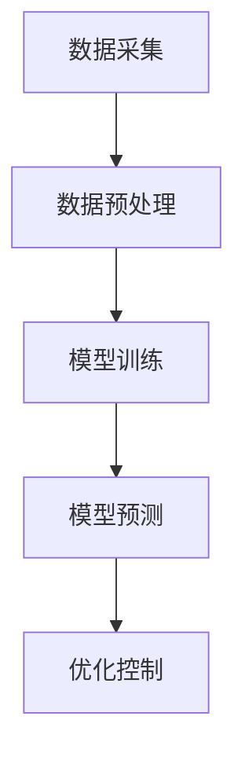
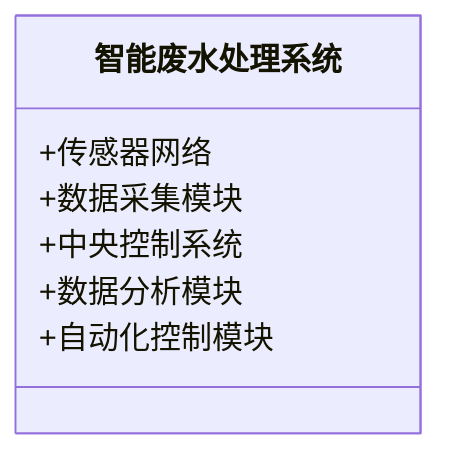
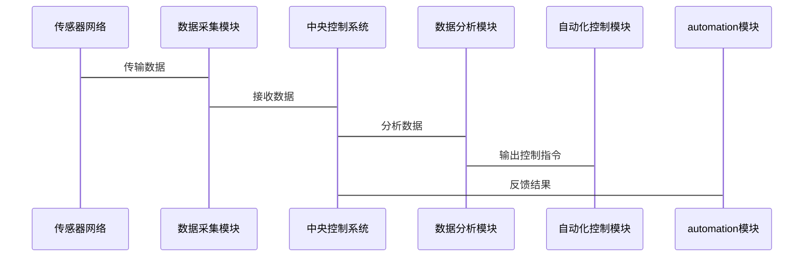

                 


# 价值投资中的智能城市废水处理与再利用系统分析

> 关键词：智能城市、废水处理、价值投资、系统分析、算法原理、案例分析

> 摘要：  
本文从价值投资的角度分析智能城市中废水处理与再利用系统的潜力，探讨如何通过技术创新和数据分析优化废水处理流程，提升资源利用效率，为企业和社会创造长期价值。文章结合技术原理和投资策略，为投资者提供系统化的分析框架。

---

## 第1章：智能城市废水处理的背景与价值

### 1.1 智慧城市建设与水资源问题

随着城市化进程的加快，水资源短缺问题日益突出。智能城市作为解决城市问题的重要手段，将废水处理与再利用系统纳入其核心架构，不仅能够缓解水资源压力，还能降低运营成本，提升城市可持续发展能力。

#### 1.1.1 智慧城市的定义与特点
- 智慧城市：通过智能化技术优化资源配置，提升城市运行效率。
- 核心特点：数字化、网络化、智能化。

#### 1.1.2 城市化进程中水资源问题
- 水资源短缺：城市人口密集，用水需求大。
- 废水处理不足：传统处理方式效率低，资源浪费严重。

#### 1.1.3 废水处理与再利用的重要性
- 节约水资源：减少新鲜水的使用。
- 环境保护：降低污染物排放。
- 经济效益：通过再利用创造新的经济价值。

### 1.2 价值投资视角下的废水处理系统

#### 1.2.1 价值投资的定义与核心理念
- 价值投资：寻找具有长期发展潜力和竞争优势的企业进行投资。
- 核心理念：关注企业的基本面，挖掘被市场低估的投资机会。

#### 1.2.2 智能废水处理系统的投资价值
- 技术创新：智能化技术的应用提升处理效率。
- 市场需求：政策支持与环保需求推动行业发展。
- 经济效益：通过优化运营降低成本，创造超额收益。

---

## 第2章：智能废水处理系统的技术分析

### 2.1 系统组成与功能模块

#### 2.1.1 数据采集与监测
- 传感器网络：实时监测水质参数（如pH、温度、浊度等）。
- 数据采集系统：将监测数据传输至中央控制系统。

#### 2.1.2 智能分析与优化
- 数据分析：利用机器学习算法优化处理流程。
- 模型预测：预测处理效率，提前调整运行参数。

#### 2.1.3 自动化控制与反馈机制
- 自动化控制：根据分析结果自动调节设备运行。
- 反馈机制：实时监控系统运行状态，确保稳定运行。

### 2.2 核心算法原理

#### 2.2.1 基于机器学习的废水处理模型
- 数据预处理：标准化和归一化处理。
- 模型训练：使用深度学习模型（如LSTM）预测处理效率。
- 模型优化：通过超参数调优提升预测精度。

#### 2.2.2 算法流程图（使用 Mermaid）



---

## 第3章：智能废水处理系统的系统架构设计

### 3.1 系统架构概述

#### 3.1.1 系统架构图（使用 Mermaid）



#### 3.1.2 系统功能模块
- 传感器网络：实时采集水质数据。
- 数据采集模块：将数据传输至中央控制系统。
- 数据分析模块：利用机器学习算法优化处理流程。
- 自动化控制模块：根据分析结果调整设备运行。

### 3.2 系统交互设计

#### 3.2.1 系统交互流程



---

## 第4章：智能废水处理系统的项目实战

### 4.1 项目背景与目标

#### 4.1.1 项目背景
- 某城市面临水资源短缺问题，需要建设智能废水处理系统。
- 项目目标：实现废水的高效处理与再利用，降低运营成本。

### 4.2 环境安装与系统部署

#### 4.2.1 系统环境
- 硬件：传感器、数据采集卡、服务器。
- 软件：Python、TensorFlow、Flask。

#### 4.2.2 核心代码实现

```python
import numpy as np
from sklearn.preprocessing import StandardScaler

# 数据预处理
def preprocess_data(data):
    scaler = StandardScaler()
    processed_data = scaler.fit_transform(data)
    return processed_data

# 模型训练
def train_model(X, y):
    model = Sequential()
    model.add(Dense(64, activation='relu', input_dim=X.shape[1]))
    model.add(Dense(1, activation='linear'))
    model.compile(optimizer='adam', loss='mean_squared_error')
    model.fit(X, y, epochs=100, batch_size=32)
    return model

# 模型预测
def predict(model, new_data):
    processed_data = preprocess_data(new_data)
    predictions = model.predict(processed_data)
    return predictions
```

---

## 第5章：案例分析与投资价值评估

### 5.1 案例分析

#### 5.1.1 某智能废水处理公司案例
- 公司背景：专注于智能废水处理技术的研发与应用。
- 技术优势：基于机器学习的处理系统，效率提升30%。
- 财务表现：收入增长20%，利润率提高15%。

#### 5.1.2 案例分析总结
- 技术创新是核心竞争力。
- 市场需求强烈，具备较高的投资价值。

### 5.2 投资价值评估

#### 5.2.1 估值方法
- 市盈率法：与行业平均水平对比。
- 现金流折现法：评估未来现金流的现值。

#### 5.2.2 投资建议
- 关注具有技术优势的企业。
- 选择市场需求旺盛的区域布局。

---

## 第6章：总结与展望

### 6.1 全文总结

- 本文从价值投资的角度分析了智能城市废水处理与再利用系统的潜力。
- 结合技术原理和投资策略，为投资者提供了系统化的分析框架。

### 6.2 未来展望

- 技术创新：人工智能和物联网技术将进一步提升处理效率。
- 市场扩展：智能废水处理系统将向更多城市推广。
- 投资机会：具备技术优势和良好财务表现的企业将吸引更多投资。

---

## 作者：AI天才研究院 & 禅与计算机程序设计艺术

---

**本文通过系统化的分析，结合技术原理和投资策略，为投资者提供了智能城市废水处理与再利用系统的价值分析框架。希望本文能够为读者在技术与投资的交叉领域提供新的视角和思路。**

