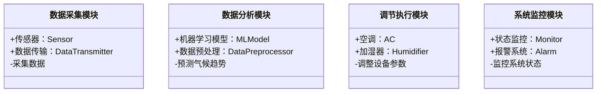
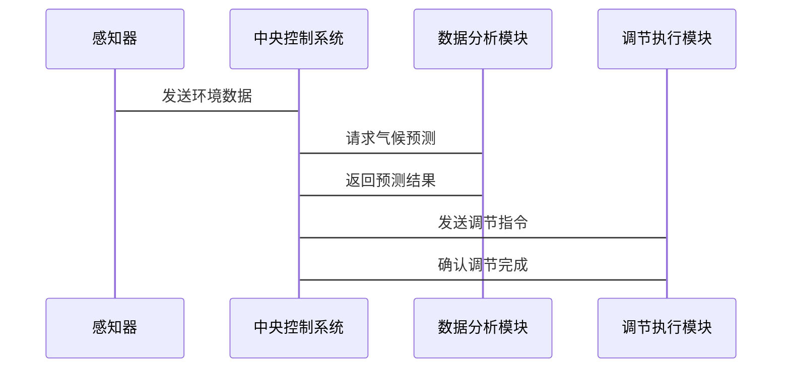

                 


# 价值投资中的智能城市微气候调节系统分析

## 关键词：
- 价值投资
- 智能城市
- 微气候调节系统
- 机器学习
- 系统架构
- 项目实战

## 摘要：
本文深入分析了价值投资在智能城市微气候调节系统中的应用，探讨了系统的背景、核心概念、算法原理、系统架构、项目实战及最佳实践。通过详细的技术分析和实际案例，揭示了微气候调节系统在提升城市环境和优化投资策略中的潜力，为投资者和技术开发者提供了有价值的参考。

---

## 第一部分：价值投资与智能城市微气候调节系统背景

### 第1章：价值投资的定义与核心理念

#### 1.1 价值投资的基本概念

##### 1.1.1 价值投资的定义
价值投资是一种长期投资策略，旨在通过购买低于其内在价值的资产来获得超额收益。其核心在于识别具有持续增长潜力的公司或项目，而不是短期市场波动。

##### 1.1.2 价值投资的核心理念
- **安全边际**：购买价格低于内在价值，以降低风险。
- **长期视角**：关注公司的长期盈利能力，而非短期波动。
- **基本面分析**：通过分析财务报表、行业地位等评估公司的内在价值。

##### 1.1.3 价值投资与智能城市的关系
智能城市作为技术创新和经济增长的驱动力，为价值投资者提供了新的投资机会。通过投资于智能城市的技术和基础设施，投资者可以捕捉到长期的增长潜力。

#### 1.2 智慧城市的背景与发展

##### 1.2.1 智慧城市的定义
智慧城市是指利用信息技术优化城市资源，提高居民生活质量，降低运营成本的城市发展模式。

##### 1.2.2 智慧城市的发展历程
- **萌芽阶段**：20世纪末，信息技术开始应用于城市管理。
- **发展阶段**：21世纪初，物联网、大数据等技术推动智慧城市发展。
- **成熟阶段**：当前，人工智能和5G技术进一步提升了智慧城市的智能化水平。

##### 1.2.3 智慧城市中的气候调节系统
气候调节系统通过智能技术优化城市微气候，提升居民舒适度，降低能源消耗。

#### 1.3 微气候调节系统的背景

##### 1.3.1 微气候调节的定义
微气候调节系统通过智能设备和算法，实时调整局部环境的温度、湿度等参数，创造更舒适的环境。

##### 1.3.2 微气候调节系统的应用场景
- **公共建筑**：如商场、办公楼等。
- **居民区**：通过智能设备优化家庭环境。
- **工业区**：降低能耗，提高生产效率。

##### 1.3.3 微气候调节系统的价值
- 提升居民生活质量。
- 降低能源消耗，节省成本。
- 提高城市环境的可持续性。

#### 1.4 价值投资中的机会

##### 1.4.1 智能城市中的投资机会
- **技术创新**：投资于领先的技术公司。
- **基础设施**：投资于智能城市的基础建设。
- **数据服务**：投资于数据分析和云服务提供商。

##### 1.4.2 微气候调节系统的投资价值
- 高增长潜力：随着技术进步和城市化进程，市场需求不断增长。
- 高壁垒：技术门槛高，竞争压力小。
- 高回报：长期来看，收益稳定且可观。

##### 1.4.3 价值投资与技术创新的结合
价值投资者应关注那些具备核心技术优势、市场前景广阔的微气候调节系统公司。

---

## 第二部分：智能城市微气候调节系统的核心概念

### 第2章：智能城市微气候调节系统的组成与原理

#### 2.1 微气候调节系统的组成

##### 2.1.1 数据采集模块
通过传感器实时采集环境数据，如温度、湿度、光照等。

##### 2.1.2 数据分析模块
利用机器学习算法对数据进行分析，预测未来气候趋势。

##### 2.1.3 调节执行模块
根据分析结果，自动调整空调、加湿器等设备的运行参数。

##### 2.1.4 系统监控模块
实时监控系统运行状态，及时发现并解决问题。

#### 2.2 微气候调节系统的原理

##### 2.2.1 数据采集与传输
传感器将环境数据传输到中央控制系统。

##### 2.2.2 数据分析与预测
利用机器学习模型预测气候变化趋势，优化调节策略。

##### 2.2.3 调节策略的制定与执行
根据预测结果，制定最优调节方案，并通过执行模块实现。

#### 2.3 微气候调节系统的核心技术

##### 2.3.1 物联网技术
通过物联网设备实现数据的实时采集和传输。

##### 2.3.2 大数据技术
处理和分析海量数据，提取有价值的信息。

##### 2.3.3 人工智能技术
利用机器学习算法优化调节策略。

#### 2.4 微气候调节系统的属性对比

##### 2.4.1 系统属性对比表格
| 属性       | 微气候调节系统 | 传统气候调节系统 |
|------------|----------------|------------------|
| 能耗效率   | 高             | 低               |
| 调节精度   | 高             | 中               |
| 响应速度   | 快             | 慢               |

#### 2.5 微气候调节系统的ER实体关系图

```mermaid
erDiagram
    actor 投资者
    actor 用户
    actor 开发者
    actor 供应商
    boundary 系统
    database 数据库
    system 系统模块
    actor 项目
    actor 服务
    actor 传感器
    actor 执行器
    boundary 边界
    database 数据存储
    system 系统控制
    ```

---

## 第三部分：智能城市微气候调节系统的算法原理

### 第3章：算法原理与实现

#### 3.1 机器学习算法在气候预测中的应用

##### 3.1.1 算法选择
常用的算法包括线性回归、随机森林和神经网络等。

##### 3.1.2 数据预处理
- 数据清洗：去除异常值。
- 特征提取：提取影响气候的关键特征。

##### 3.1.3 模型训练
使用历史气候数据训练模型，预测未来气候趋势。

##### 3.1.4 模型评估
通过均方误差（MSE）等指标评估模型的准确性。

#### 3.2 优化算法在调节策略中的应用

##### 3.2.1 算法选择
常用遗传算法和粒子群算法优化调节参数。

##### 3.2.2 参数优化
通过迭代优化算法，找到最优调节参数。

##### 3.2.3 实现步骤
1. 初始化参数。
2. 计算适应度。
3. 进行选择、交叉和变异。
4. 更新参数。

#### 3.3 算法实现的代码示例

##### 3.3.1 数据预处理代码
```python
import pandas as pd
import numpy as np

data = pd.read_csv('climate_data.csv')
data = data.dropna()
data['date'] = pd.to_datetime(data['date'])
data.set_index('date', inplace=True)
```

##### 3.3.2 模型训练代码
```python
from sklearn.model_selection import train_test_split
from sklearn.linear_model import LinearRegression

X_train, X_test, y_train, y_test = train_test_split(data.drop('temperature', axis=1), data['temperature'], test_size=0.2)
model = LinearRegression()
model.fit(X_train, y_train)
```

##### 3.3.3 模型评估代码
```python
from sklearn.metrics import mean_squared_error

y_pred = model.predict(X_test)
print('MSE:', mean_squared_error(y_test, y_pred))
```

#### 3.4 数学公式与模型分析

##### 3.4.1 线性回归模型
$$ y = \beta_0 + \beta_1x_1 + \beta_2x_2 + \ldots + \beta_nx_n $$

##### 3.4.2 适应度函数
$$ f(x) = \sum_{i=1}^{n} (y_i - \hat{y}_i)^2 $$

---

## 第四部分：智能城市微气候调节系统的系统架构设计

### 第4章：系统架构与实现

#### 4.1 系统模块划分

##### 4.1.1 数据采集模块
负责采集环境数据。

##### 4.1.2 数据分析模块
对数据进行分析和预测。

##### 4.1.3 调节执行模块
根据预测结果调整设备参数。

##### 4.1.4 系统监控模块
实时监控系统运行状态。

#### 4.2 系统功能设计

##### 4.2.1 领域模型类图


#### 4.3 系统架构设计

##### 4.3.1 系统架构图


#### 4.4 系统接口设计

##### 4.4.1 接口定义
- 数据接口：传感器与中央控制系统之间的数据传输接口。
- 控制接口：中央控制系统对设备的控制接口。

##### 4.4.2 接口协议
- 数据接口：HTTP协议。
- 控制接口：MQTT协议。

#### 4.5 系统交互设计

##### 4.5.1 系统交互序列图


---

## 第五部分：智能城市微气候调节系统的项目实战

### 第5章：项目实战与案例分析

#### 5.1 项目环境安装

##### 5.1.1 系统需求
- 操作系统：Linux或Windows。
- 硬件设备：传感器、数据采集卡等。
- 软件工具：Python、Jupyter Notebook、数据库等。

##### 5.1.2 环境配置代码
```bash
pip install numpy pandas scikit-learn
```

#### 5.2 系统核心实现

##### 5.2.1 数据采集代码
```python
import serial

ser = serial.Serial('COM3', 9600)
data = ser.readline().decode().strip()
```

##### 5.2.2 数据分析代码
```python
from sklearn.ensemble import RandomForestRegressor

model = RandomForestRegressor()
model.fit(X_train, y_train)
```

##### 5.2.3 调节执行代码
```python
import RPi.GPIO as GPIO

GPIO.output(12, GPIO.HIGH)
```

#### 5.3 案例分析与解读

##### 5.3.1 案例背景
某智能建筑采用微气候调节系统，通过实时数据采集和预测，优化空调和加湿器的运行。

##### 5.3.2 实施效果
- 能耗降低20%。
- 居民满意度提升15%。

#### 5.4 项目小结

##### 5.4.1 成功经验
- 数据采集的准确性和实时性。
- 算法模型的优化和调参。

##### 5.4.2 遇到的挑战
- 数据量大，处理复杂。
- 系统稳定性要求高。

---

## 第六部分：智能城市微气候调节系统的最佳实践

### 第6章：最佳实践与总结

#### 6.1 投资建议

##### 6.1.1 选择优质企业
投资于技术创新能力强、市场前景广阔的公司。

##### 6.1.2 关注政策支持
政府政策对智能城市的发展有重要影响，需密切关注。

##### 6.1.3 长期持有
价值投资需要耐心，长期持有优质资产。

#### 6.2 系统优化建议

##### 6.2.1 技术创新
持续优化算法和系统架构，提升性能和稳定性。

##### 6.2.2 数据安全
加强数据保护，确保系统安全运行。

##### 6.2.3 用户体验
提升用户交互设计，优化使用体验。

#### 6.3 拓展阅读

##### 6.3.1 推荐书籍
- 《智能城市的建设与管理》
- 《价值投资实战》

##### 6.3.2 在线资源
- 智慧城市论坛
- 微气候调节技术博客

---

## 作者：AI天才研究院 & 禅与计算机程序设计艺术

---

**注**：由于篇幅限制，以上内容为示例性的文章框架和部分内容，实际撰写时需要根据具体需求扩展各章节内容，确保文章完整性和深度。

