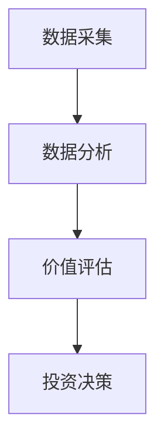

                 

# 价值投资中的智能城市数字货币应用

> 关键词：价值投资，智能城市，数字货币，区块链，风险管理

> 摘要：本文探讨了价值投资在智能城市中数字货币的应用，分析了数字货币的技术原理、价值评估模型、投资策略及风险管理方法。通过构建系统架构和案例分析，提供了实践指导。

---

## 第一部分: 价值投资与智能城市数字货币的背景介绍

### 第1章: 价值投资的核心概念

#### 1.1 数字货币的定义与分类
- 数字货币：基于区块链技术的虚拟货币，如比特币和以太坊。
- 分类：加密货币、稳定币、代币等。

#### 1.2 智能城市的基本概念
- 智能城市：利用信息技术优化城市资源，提高生活质量。

#### 1.3 价值投资的定义
- 价值投资：以低于内在价值的价格购买资产。

---

## 第二部分: 智能城市中的数字货币技术

### 第2章: 区块链技术在智能城市中的应用

#### 2.1 区块链的核心原理
- 去中心化、不可篡改、共识机制。

#### 2.2 智能合约的应用
- 智能合约用于城市治理和支付系统。

---

## 第三部分: 数字货币的价值评估模型

### 第3章: 价值评估模型的构建

#### 3.1 技术维度分析
- 区块链性能指标：交易速度、安全性。

#### 3.2 经济维度分析
- 市场供需关系，波动率分析。

#### 3.3 社会维度分析
- 社区活跃度，用户信任度。

---

## 第四部分: 价值投资策略

### 第4章: 长期投资策略

#### 4.1 选择优质项目
- 技术领先、团队可靠。

#### 4.2 风险管理
- 分散投资，设置止损点。

---

## 第五部分: 风险管理与系统架构

### 第5章: 风险管理框架

#### 5.1 风险识别
- 技术风险、市场风险、法律风险。

#### 5.2 风险控制
- 风险分散，对冲机制。

---

## 第六部分: 项目实战与案例分析

### 第6章: 实战案例分析

#### 6.1 某智能城市项目分析
- 技术分析，市场分析。

#### 6.2 投资策略实施
- 长期持有，定期评估。

---

## 第七部分: 总结与展望

### 第7章: 总结

#### 7.1 核心观点回顾
- 价值投资在智能城市中的应用潜力。

#### 7.2 未来展望
- 技术进步带来的新机会。

---

## 第八部分: 最佳实践与注意事项

### 第8章: 投资者建议

#### 8.1 技术学习
- 深入理解区块链技术。

#### 8.2 市场研究
- 关注行业动态，政策变化。

---

## 附录

### 附录A: 数学模型

#### A.1 波动率模型
$$ \sigma = \sqrt{\frac{1}{n-1} \sum_{i=1}^{n} (x_i - \bar{x})^2} $$

#### A.2 回归模型
$$ y = \beta x + \epsilon $$

### 附录B: 系统架构图

---

## 参考文献

- 区块链技术入门书籍
- 智能城市相关研究论文
- 数字货币价值评估文献

---

作者：AI天才研究院/AI Genius Institute & 禅与计算机程序设计艺术 /Zen And The Art of Computer Programming

