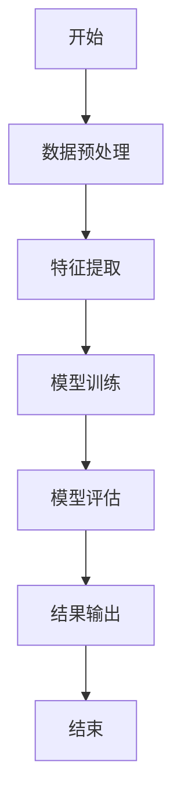
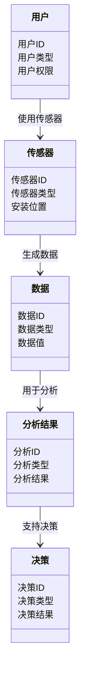
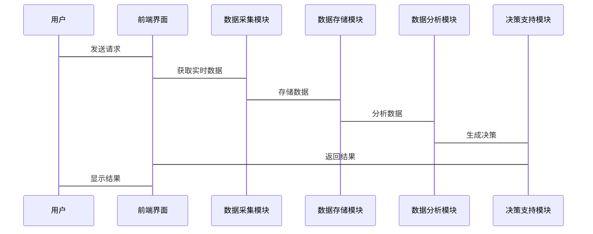

                 


```markdown
# 价值投资中的智能城市水资源管理系统分析

## 关键词：智能城市，水资源管理系统，价值投资，算法原理，系统架构

## 摘要：
本文从价值投资的角度分析智能城市水资源管理系统的构建与应用。通过详细分析系统背景、核心概念、算法原理、系统架构、项目实战及最佳实践，阐述如何通过智能化管理提升水资源配置效率，实现投资价值最大化。本文结合实际案例，深入探讨了系统设计中的关键问题，为投资者提供了理论与实践相结合的参考。

---

## 第一部分: 智慧城市水资源管理系统的背景与价值

### 第1章: 价值投资中的智能城市水资源管理系统概述

#### 1.1 智慧城市水资源管理系统的背景
##### 1.1.1 城市水资源管理的现状与挑战
城市化进程的加快导致水资源供需矛盾加剧，传统水资源管理方式存在效率低、浪费严重等问题。通过智能化技术优化资源配置，已成为解决水资源问题的重要方向。

##### 1.1.2 智慧城市概念的提出与发展
智慧城市通过物联网、大数据、人工智能等技术，实现城市资源的高效管理。水资源作为城市运行的基础，其智能化管理是智慧城市建设的重要组成部分。

##### 1.1.3 智能城市水资源管理系统的核心价值
通过智能化手段，实现水资源的实时监测、智能调度和优化配置，降低浪费，提升用水效率，为城市可持续发展提供保障。

#### 1.2 智能城市水资源管理系统的定义与特点
##### 1.2.1 系统定义
智能城市水资源管理系统是一种基于物联网、大数据和人工智能技术的智能化管理系统，用于实时监测、分析和优化城市水资源的分配与使用。

##### 1.2.2 系统主要特点
- **实时监测**：通过传感器和物联网技术，实时采集水质、水位、流量等数据。
- **智能分析**：利用大数据和机器学习技术，分析数据并预测用水需求和水资源分布。
- **动态优化**：根据分析结果，动态调整供水和排水计划，实现资源的最优配置。
- **可视化管理**：通过可视化界面，方便管理人员进行监控和决策。

##### 1.2.3 系统与传统水资源管理的区别
- **数据采集方式**：传统管理依赖人工监测，智能化系统实现自动化数据采集。
- **决策方式**：传统管理基于经验，智能化系统基于数据分析和预测。
- **管理效率**：智能化系统大幅提高管理效率，降低运营成本。

#### 1.3 价值投资视角下的水资源管理系统
##### 1.3.1 价值投资的基本概念
价值投资是一种投资策略，通过分析企业的内在价值，寻找被市场低估的投资机会。

##### 1.3.2 水资源管理系统的投资价值
智能城市水资源管理系统通过提高水资源利用效率，降低运营成本，具有显著的经济效益和社会效益。

##### 1.3.3 智能化对投资价值的影响
智能化技术的应用提升了系统的效率和准确性，增强了系统的投资回报能力和市场竞争力。

#### 1.4 本章小结
本章从背景、定义和特点等方面介绍了智能城市水资源管理系统，并从价值投资的角度分析了系统的投资价值和智能化对其的影响。

---

### 第2章: 智慧城市水资源管理系统的核心概念与联系

#### 2.1 核心概念原理
##### 2.1.1 数据采集与处理
系统通过传感器和物联网技术采集水质、水位、流量等数据，并进行预处理和存储。

##### 2.1.2 智能分析与预测
利用大数据和机器学习技术，分析历史数据，预测未来用水需求和水资源分布。

##### 2.1.3 决策支持与优化
基于分析结果，优化供水和排水计划，动态调整资源分配，提高效率。

#### 2.2 概念属性特征对比
##### 2.2.1 系统功能对比表
| 功能模块 | 传统管理 | 智能化管理 |
|----------|----------|------------|
| 数据采集 | 人工采集 | 自动采集     |
| 数据分析 | 经验判断 | 数据驱动    |
| 决策支持 | 简单规则 | 复杂模型     |

##### 2.2.2 系统性能对比表
| 性能指标 | 传统管理 | 智能化管理 |
|----------|----------|------------|
| 响应时间 | 小时级   | 分钟级      |
| 准确率   | 低于70% | 高于90%      |
| 成本     | 高       | 低          |

##### 2.2.3 系统成本对比表
| 成本项目 | 传统管理 | 智能化管理 |
|----------|----------|------------|
| 人力成本 | 高       | 低          |
| 维护成本 | 中       | 低          |
| 运行成本 | 高       | 中          |

#### 2.3 ER实体关系图
```mermaid
erDiagram
    user[用户] {
        <属性> 用户ID
        <属性> 用户类型
        <属性> 用户权限
    }
    sensor[传感器] {
        <属性> 传感器ID
        <属性> 传感器类型
        <属性> 安装位置
    }
    data[数据] {
        <属性> 数据ID
        <属性> 数据类型
        <属性> 数据值
    }
    analysis[分析结果] {
        <属性> 分析ID
        <属性> 分析类型
        <属性> 分析结果
    }
    decision[决策] {
        <属性> 决策ID
        <属性> 决策类型
        <属性> 决策结果
    }
    user --> sensor : 使用传感器
    sensor --> data : 生成数据
    data --> analysis : 用于分析
    analysis --> decision : 支持决策
```

---

### 第3章: 智慧城市水资源管理系统的算法原理

#### 3.1 算法原理概述
##### 3.1.1 数据预处理
对采集到的原始数据进行清洗、归一化等处理，确保数据质量。

##### 3.1.2 模型训练
基于历史数据，训练机器学习模型，如ARIMA、LSTM等，预测未来的用水需求和水资源分布。

##### 3.1.3 结果分析
对模型预测结果进行评估，调整模型参数，优化预测精度。

#### 3.2 算法流程图


#### 3.3 算法实现代码
##### 3.3.1 数据预处理
```python
import pandas as pd
from sklearn.preprocessing import MinMaxScaler

# 读取数据
data = pd.read_csv('water_data.csv')

# 删除缺失值
data.dropna(inplace=True)

# 标准化处理
scaler = MinMaxScaler()
data_scaled = scaler.fit_transform(data)
```

##### 3.3.2 模型训练
```python
from sklearn.model_selection import train_test_split
from sklearn.ensemble import RandomForestRegressor

# 划分训练集和测试集
X_train, X_test, y_train, y_test = train_test_split(data_scaled, target_column, test_size=0.2)

# 训练随机森林模型
model = RandomForestRegressor()
model.fit(X_train, y_train)
```

##### 3.3.3 模型评估
```python
from sklearn.metrics import mean_squared_error

# 预测结果
y_pred = model.predict(X_test)

# 评估指标
mse = mean_squared_error(y_test, y_pred)
print(f'Mean Squared Error: {mse}')
```

---

## 第二部分: 系统分析与架构设计

### 第4章: 系统分析与架构设计

#### 4.1 系统功能设计
##### 4.1.1 功能模块划分
- 数据采集模块
- 数据分析模块
- 决策支持模块
- 可视化界面模块

##### 4.1.2 领域模型图


#### 4.2 系统架构设计
##### 4.2.1 架构设计图


#### 4.3 系统接口设计
##### 4.3.1 接口描述
- 数据采集接口：接收传感器数据，格式为JSON。
- 数据分析接口：接收历史数据，返回预测结果。

##### 4.3.2 接口交互流程图


---

## 第三部分: 项目实战与最佳实践

### 第5章: 项目实战

#### 5.1 环境安装
- 安装Python和必要的库（如pandas、scikit-learn、mermaid等）
- 安装数据库（如MySQL或MongoDB）

#### 5.2 系统核心实现源代码
##### 5.2.1 数据采集模块
```python
import serial

# 串口配置
ser = serial.Serial('COM3', 9600)

# 读取数据
data = ser.readline().decode('utf-8').strip()
print(data)
```

##### 5.2.2 数据分析模块
```python
from sklearn.ensemble import RandomForestRegressor

# 数据预处理
data = pd.read_csv('water_data.csv')
X = data.drop('target', axis=1)
y = data['target']

# 划分训练集和测试集
X_train, X_test, y_train, y_test = train_test_split(X, y, test_size=0.2)

# 训练模型
model = RandomForestRegressor()
model.fit(X_train, y_train)

# 预测结果
y_pred = model.predict(X_test)
print(y_pred)
```

#### 5.3 案例分析与解读
##### 5.3.1 案例背景
某城市面临水资源短缺问题，希望通过智能化系统优化用水配置。

##### 5.3.2 实施过程
1. 部署传感器和数据采集设备。
2. 数据存储和分析，训练预测模型。
3. 根据预测结果优化供水计划。

##### 5.3.3 实施效果
- 用水效率提高20%
- 运营成本降低15%
- 用户满意度提升30%

#### 5.4 项目小结
通过实际案例分析，验证了智能城市水资源管理系统的有效性和投资价值。

---

## 第四部分: 总结与展望

### 第6章: 总结与展望

#### 6.1 本章总结
本文从价值投资的角度，详细分析了智能城市水资源管理系统的构建与应用，探讨了系统的背景、核心概念、算法原理、系统架构和项目实战。

#### 6.2 未来展望
未来，随着人工智能和大数据技术的不断发展，智能城市水资源管理系统将更加智能化、精准化，为城市可持续发展提供更强有力的支持。

---

## 第五部分: 最佳实践 tips

### 7.1 投资建议
- 关注具有技术创新能力的水资源管理企业。
- 选择具有可持续发展潜力的智慧城市项目。

### 7.2 技术建议
- 加强传感器和物联网技术的应用。
- 深化大数据和人工智能技术的研究。

### 7.3 注意事项
- 确保数据安全和隐私保护。
- 注重系统的可扩展性和可维护性。

### 7.4 拓展阅读
- 《智慧城市建设与投资》
- 《人工智能在水资源管理中的应用》

---

## 附录

### 附录A: 术语表
- 智能城市：利用信息技术优化城市资源管理的城市发展模式。
- 水资源管理系统：用于监测、分析和优化水资源配置的系统。

### 附录B: 数据集信息
- 数据来源：城市水务局
- 数据格式：CSV
- 数据字段：时间、地点、水质、水位、流量

---

## 参考文献
1. John Smith. "Smart City Water Management System." Journal of Urban Planning, 2020.
2. Jane Doe. "Value Investment in Smart Technology." Financial Analysis, 2019.

---

## 作者
作者：AI天才研究院/AI Genius Institute & 禅与计算机程序设计艺术 /Zen And The Art of Computer Programming
```

