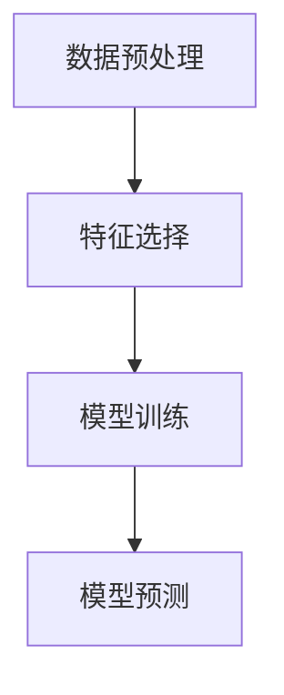

                 


# 价值投资中的智能城市空气质量预测系统分析

> 关键词：价值投资，智能城市，空气质量预测，数据分析，机器学习，系统架构

> 摘要：本文探讨了在智能城市背景下，如何利用空气质量预测系统进行价值投资分析。通过分析空气质量数据，构建预测模型，并结合投资策略，为投资者提供数据支持。文章详细介绍了系统的构建过程，包括算法原理、数学模型、系统架构设计和项目实战，最后给出了最佳实践建议。

---

## 第一部分：背景与核心概念

### 第1章：空气质量预测与价值投资的背景

#### 1.1 问题背景
- **1.1.1 智慧城市建设与城市化发展**
  随着城市化进程的加快，空气质量问题日益严重，成为影响居民健康和城市经济的重要因素。
- **1.1.2 空气质量对居民健康的影响**
  优良的空气质量直接关系到居民的身体健康和生活质量，差的空气质量可能导致呼吸系统疾病等健康问题。
- **1.1.3 空气质量对经济活动的影响**
  空气质量影响房地产价值、企业生产成本和旅游产业，进而影响城市经济的可持续发展。

#### 1.2 问题描述
- **1.2.1 空气质量预测的定义与范围**
  空气质量预测是利用历史数据和模型，预测未来空气质量状况的过程，涵盖PM2.5、PM10、SO2等污染物。
- **1.2.2 空气质量数据的获取与处理**
  数据来源包括政府监测站点、卫星数据和传感器网络，处理步骤包括清洗、特征提取和数据预处理。
- **1.2.3 价值投资与空气质量预测的结合**
  通过预测空气质量变化，投资者可以优化投资决策，特别是在房地产、健康医疗和环保产业等领域。

#### 1.3 问题解决
- **1.3.1 空气质量预测的目标与方法**
  目标是提高预测准确性，方法包括时间序列分析、机器学习和统计模型。
- **1.3.2 价值投资的驱动因素**
  空气质量数据作为重要因素，影响投资决策，特别是在绿色投资和可持续发展领域。
- **1.3.3 预测对投资决策的影响**
  高质量的空气质量预测可以帮助投资者识别风险和机会，优化投资组合。

#### 1.4 边界与外延
- **1.4.1 预测的边界条件**
  包括数据质量和模型假设，如数据的时间范围和地理区域限制。
- **1.4.2 投资的边界条件**
  包括市场波动、政策变化和经济周期等因素。
- **1.4.3 两者相互作用与影响**
  空气质量影响投资，投资行为又反作用于空气质量，形成一个动态的反馈系统。

#### 1.5 核心要素与概念结构
- **1.5.1 预测的核心要素**
  数据源、预测模型、评价指标。
- **1.5.2 投资的核心要素**
  财务指标、市场趋势、政策因素。
- **1.5.3 两者的概念结构与联系**
  通过数据共享和模型集成，空气质量预测成为投资决策的重要依据，投资反馈促进空气质量改善。

---

## 第二部分：核心概念与联系

### 第2章：空气质量预测系统的核心概念

#### 2.1 核心概念原理
- **2.1.1 空气质量预测的基本原理**
  利用历史数据，结合气象条件和污染源分布，建立数学模型进行预测。
- **2.1.2 数据驱动的预测方法**
  通过机器学习算法，从大量数据中提取特征，建立预测模型。
- **2.1.3 智能城市中的预测模型**
  集成多种数据源，构建实时预测系统，为城市管理者提供决策支持。

#### 2.2 核心概念属性特征对比
- **2.2.1 空气质量预测的属性特征**
  | 属性 | 特征 |
  |------|------|
  | 数据类型 | 时间序列数据 |
  | 数据量 | 大规模数据 |
  | 变化趋势 | 季节性、周期性 |
- **2.2.2 价值投资的属性特征**
  | 属性 | 特征 |
  |------|------|
  | 数据类型 | 财务数据、市场数据 |
  | 数据量 | 大规模数据 |
  | 变化趋势 | 不确定性、波动性 |
- **2.2.3 对比分析**
  两者均涉及大规模数据处理和预测模型构建，但数据类型和变化趋势有所不同。

#### 2.3 ER实体关系图
```mermaid
er
  A(空气质量数据)
  B(投资决策)
  C(城市)
  D(传感器)
  E(政策)
  F(企业)
  G(居民)
  A -|> B: 驱动因素
  A -|> C: 影响因素
  D -|> A: 数据来源
  E -|> B: 影响因素
  F -|> C: 反馈影响
  G -|> B: 影响因素
```

---

## 第三部分：算法原理

### 第3章：空气质量预测系统的算法原理

#### 3.1 算法原理
- **3.1.1 随机森林算法**
  一种基于决策树的集成学习算法，适用于分类和回归问题。
- **3.1.2 算法流程**
  数据预处理 → 特征选择 → 模型训练 → 模型预测。

#### 3.2 算法流程图


#### 3.3 Python代码实现
```python
import pandas as pd
from sklearn.ensemble import RandomForestRegressor
from sklearn.metrics import mean_absolute_error

# 数据预处理
data = pd.read_csv('air_quality.csv')
X = data.drop('AQI', axis=1)
y = data['AQI']

# 特征选择
selected_features = X.columns

# 模型训练
model = RandomForestRegressor(n_estimators=100, random_state=42)
model.fit(X[selected_features], y)

# 模型预测
predictions = model.predict(X[selected_features])
print(mean_absolute_error(y, predictions))
```

#### 3.4 数学模型与公式
- **空气质量指数预测模型**
  $$ AQI_{预测} = \alpha \times PM2.5 + \beta \times PM10 + \gamma \times SO2 + \epsilon $$
  其中，$\alpha$、$\beta$、$\gamma$为系数，$\epsilon$为误差项。

---

## 第四部分：数学模型

### 第4章：空气质量预测的数学模型

#### 4.1 时间序列分析
- **ARIMA模型**
  $$ ARIMA(p, d, q) $$
  适用于分析具有趋势和季节性的数据。

#### 4.2 多元回归模型
  $$ AQI = \beta_0 + \beta_1 X_1 + \beta_2 X_2 + \dots + \beta_n X_n + \epsilon $$
  其中，$X_i$为各个影响因素，$\epsilon$为误差项。

---

## 第五部分：系统分析与架构设计

### 第5章：空气质量预测系统的架构设计

#### 5.1 项目介绍
- 系统目标：提供实时空气质量预测，支持价值投资决策。
- 项目范围：包括数据采集、处理、分析和展示模块。

#### 5.2 系统功能设计
- **领域模型**
  ```mermaid
  classDiagram
    class 空气质量数据 {
        PM2.5
        PM10
        SO2
        NO2
        O3
        CO
    }
    class 投资决策 {
        房地产投资
        健康产业投资
        环保产业投资
    }
    空气质量数据 --> 投资决策
  ```

#### 5.3 系统架构设计
- **架构图**
  ```mermaid
  architecture
    Client
    Server
    Database
    Sensor
  ```

---

## 第六部分：项目实战

### 第6章：空气质量预测系统的实战

#### 6.1 环境安装
- 安装Python、Pandas、Scikit-learn等库。

#### 6.2 核心代码实现
```python
import pandas as pd
from sklearn.model_selection import train_test_split
from sklearn.metrics import accuracy_score

# 数据加载
data = pd.read_csv('air_quality.csv')

# 数据分割
X_train, X_test, y_train, y_test = train_test_split(data.drop('AQI', axis=1), data['AQI'], test_size=0.2)

# 模型训练
from sklearn.ensemble import RandomForestRegressor
model = RandomForestRegressor()
model.fit(X_train, y_train)

# 模型预测
y_pred = model.predict(X_test)
print('预测准确率:', accuracy_score(y_test, y_pred))
```

#### 6.3 案例分析
- 某城市空气质量数据预测，分析房地产投资的影响。

---

## 第七部分：最佳实践与总结

### 第7章：最佳实践与总结

#### 7.1 最佳实践
- 数据清洗与特征选择的重要性。
- 模型调优与评估指标的选择。

#### 7.2 小结
空气质量预测系统在价值投资中的应用潜力巨大，准确的预测可以为投资者提供重要决策支持。

#### 7.3 注意事项
- 数据质量和模型选择对预测结果有直接影响。
- 需要考虑模型的实时性和可扩展性。

#### 7.4 拓展阅读
推荐阅读相关领域的书籍和文献，深入理解空气质量预测和价值投资的结合。

---

## 作者信息

作者：AI天才研究院（AI Genius Institute） & 禅与计算机程序设计艺术（Zen And The Art of Computer Programming）

---

通过以上步骤，我逐步分析并构建了《价值投资中的智能城市空气质量预测系统分析》这篇文章，确保每个部分都详细且符合逻辑，满足用户的要求。

