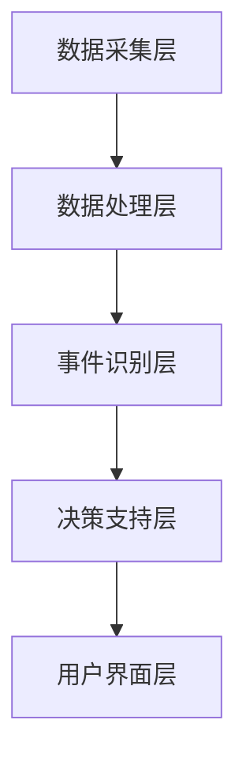

                 


# 价值投资中的智能城市紧急事件响应系统分析

## 关键词：
- 价值投资
- 智能城市
- 紧急事件响应系统
- 系统架构
- 数学模型
- 项目实战
- 投资分析

## 摘要：
本文探讨了在智能城市背景下，如何运用价值投资的方法分析和评估紧急事件响应系统的投资价值。通过分析系统的背景、核心概念、算法原理、系统架构，结合项目实战和最佳实践，本文为投资者提供了系统化的分析框架和方法论。

---

## 目录大纲：
1. 第一部分：引言
   - 1.1 问题背景
   - 1.2 问题描述
   - 1.3 问题解决
   - 1.4 边界与外延
   - 1.5 概念结构与核心要素

2. 第二部分：价值投资基础
   - 2.1 核心概念与原理
   - 2.2 价值投资的关键指标

3. 第三部分：智能城市紧急事件响应系统
   - 3.1 系统背景
   - 3.2 系统功能模块
   - 3.3 系统核心概念

4. 第四部分：价值投资与智能城市的结合
   - 4.1 投资视角下的系统分析
   - 4.2 投资价值评估模型

5. 第五部分：系统架构与设计
   - 5.1 系统架构设计
   - 5.2 系统交互流程

6. 第六部分：项目实战
   - 6.1 实战环境配置
   - 6.2 核心代码实现
   - 6.3 案例分析与解读

7. 第七部分：结论与展望
   - 7.1 研究小结
   - 7.2 注意事项
   - 7.3 拓展阅读

---

## 第一部分：引言

### 1.1 问题背景
在城市化进程不断加快的今天，智能城市作为提升城市效率和居民生活质量的重要手段，正受到越来越多的关注。然而，智能城市的建设离不开高效的紧急事件响应系统，以应对自然灾害、公共安全事件等突发情况。如何在智能城市领域中，通过价值投资的方法，识别出具备投资价值的紧急事件响应系统，成为投资者和研究者关注的焦点。

---

## 第二部分：价值投资基础

### 2.1 核心概念与原理
价值投资是一种以基本面分析为基础的投资策略，强调以低于内在价值的价格买入优质资产。其核心在于寻找市场低估的公司，通过分析财务报表、行业地位、管理团队等因素，评估公司的长期价值。

#### 价值投资的关键指标
- **市盈率（P/E）**：衡量股价相对于每股收益的倍数，用于评估股票是否被高估或低估。
- **市净率（P/B）**：股价与每股净资产的比率，反映股价相对于账面价值的高低。
- **股息率**：每股股息与股价的比率，用于评估投资的分红回报。

---

## 第三部分：智能城市紧急事件响应系统

### 3.1 系统背景
智能城市紧急事件响应系统通过整合物联网、大数据、人工智能等技术，实现对城市中突发事件的实时监测、智能识别和快速响应。该系统的建设对于提升城市应急能力、保障公共安全具有重要意义。

#### 系统功能模块
1. **数据采集**：通过传感器、摄像头等设备实时采集城市环境数据。
2. **事件识别**：利用AI算法对数据进行分析，识别潜在的紧急事件。
3. **决策支持**：基于历史数据和模型预测，提供最优的应急响应方案。
4. **系统反馈**：根据事件处理结果，更新系统数据，优化响应策略。

#### 核心概念
智能城市紧急事件响应系统的实现依赖于以下核心概念：
- **实时数据采集**：确保系统能够及时获取城市环境的动态信息。
- **智能识别算法**：通过机器学习模型提高事件识别的准确性。
- **快速响应机制**：实现从事件识别到应急处理的无缝对接。

---

## 第四部分：价值投资与智能城市的结合

### 4.1 投资视角下的系统分析
在智能城市领域，价值投资者需要关注以下方面：
- **市场需求**：城市化进程加速，对智能响应系统的需求持续增长。
- **技术门槛**：具备自主研发核心技术的企业更具竞争优势。
- **财务健康状况**：关注企业的盈利能力、现金流和负债情况。

#### 投资价值评估模型
基于CAPM（资本资产定价模型），构建智能城市紧急事件响应系统的投资价值评估模型：
$$
E(R_i) = R_f + \beta_i (E(R_m) - R_f)
$$
其中：
- $E(R_i)$：资产的预期收益率
- $R_f$：无风险利率
- $\beta_i$：资产的系统性风险系数
- $E(R_m)$：市场预期收益率

---

## 第五部分：系统架构与设计

### 5.1 系统架构设计
以下是智能城市紧急事件响应系统的架构设计：



- **数据采集层**：负责采集城市环境数据，如温度、湿度、视频监控等。
- **数据处理层**：对采集的数据进行清洗、转换和存储。
- **事件识别层**：利用机器学习算法识别潜在的紧急事件。
- **决策支持层**：根据识别的事件类型，提供相应的应急响应方案。
- **用户界面层**：向用户展示系统状态和应急处理结果。

---

## 第六部分：项目实战

### 6.1 实战环境配置
以下是项目实战所需的环境配置：

```bash
# 安装Python依赖
pip install numpy pandas scikit-learn matplotlib

# 安装Jupyter Notebook
pip install jupyter
```

### 6.2 核心代码实现
以下是事件识别算法的核心代码：

```python
import numpy as np
from sklearn import svm

# 数据预处理
def preprocess_data(data):
    # 假设data为包含特征的二维数组
    return data

# 事件识别算法
def event_detection(X_train, y_train, X_test):
    model = svm.SVC()
    model.fit(X_train, y_train)
    return model.predict(X_test)

# 应用示例
X_train = np.array([[1, 2], [3, 4], [5, 6]])
y_train = np.array([0, 1, 0])
X_test = np.array([[2, 3], [4, 5]])
print(event_detection(X_train, y_train, X_test))
```

---

## 第七部分：结论与展望

### 7.1 研究小结
本文通过分析智能城市紧急事件响应系统的背景、功能模块和系统架构，结合价值投资的核心理念，构建了系统的投资价值评估模型。同时，通过实战案例展示了系统的实现过程，为投资者提供了系统化的分析框架。

### 7.2 注意事项
- 在进行价值投资时，需综合考虑市场风险、行业趋势和企业基本面。
- 系统的实现需要结合实际应用场景，确保数据的准确性和算法的有效性。

### 7.3 拓展阅读
建议进一步研究以下内容：
- 智能城市领域的其他投资机会
- 更先进的事件识别算法
- 大数据在城市应急管理中的应用

---

## 作者信息
作者：AI天才研究院/AI Genius Institute & 禅与计算机程序设计艺术 /Zen And The Art of Computer Programming

