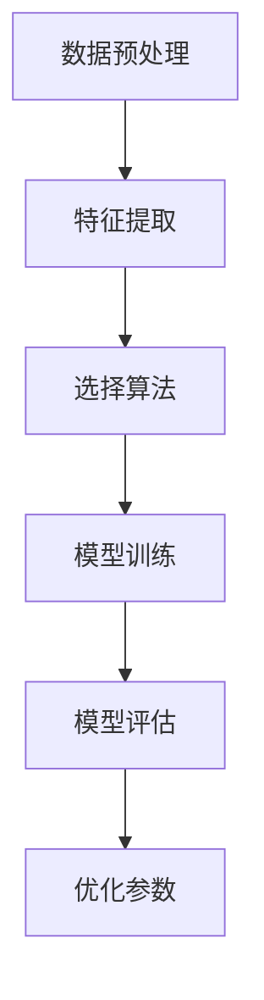

                 


# 价值投资中的智能城市能源管理系统分析

> 关键词：价值投资、智能城市、能源管理系统、人工智能、能源优化

> 摘要：本文详细分析了价值投资在智能城市能源管理系统中的应用，从系统架构、技术选型、算法实现到项目实战，全面探讨了如何通过智能化技术优化能源管理，提升投资价值。

---

# 第1章: 智慧城市能源管理系统的背景与价值

## 1.1 价值投资与智慧城市能源管理的结合

### 1.1.1 价值投资的基本概念
价值投资是一种投资策略，强调以低于内在价值的价格购买优质资产。其核心在于通过深入分析企业的基本面，寻找被市场低估的投资机会。

### 1.1.2 智慧城市能源管理的核心目标
智慧能源管理系统旨在通过智能化技术优化能源的生产、分配和使用，实现能源的高效管理和节能减排。

### 1.1.3 两者的结合与应用前景
价值投资与智慧能源管理的结合，不仅能够帮助投资者发现能源管理领域的投资机会，还能通过智能化技术提升能源管理的效率和效果。

## 1.2 智慧城市能源管理系统的背景分析

### 1.2.1 当前能源管理面临的挑战
- 能源浪费严重
- 环境污染加剧
- 能源价格波动大
- 传统能源管理方式效率低下

### 1.2.2 智能化技术在能源管理中的应用
- 数据采集与实时监控
- 能源消耗预测与优化
- 人工智能辅助决策

### 1.2.3 价值投资在能源管理中的意义
- 通过数据分析发现投资机会
- 优化能源管理降低成本
- 提升投资回报率

## 1.3 本章小结

---

# 第2章: 智慧城市能源管理系统的架构与技术选型

## 2.1 系统架构设计

### 2.1.1 系统整体架构
智慧能源管理系统通常采用分层架构，包括数据采集层、数据处理层、决策支持层和用户交互层。

### 2.1.2 系统功能模块划分
- 数据采集模块
- 数据存储模块
- 数据分析模块
- 决策支持模块
- 用户交互模块

### 2.1.3 系统组件之间的关系
- 数据采集模块与数据存储模块通过API接口连接
- 数据分析模块依赖于数据存储模块的数据支持
- 决策支持模块基于数据分析模块的结果提供优化建议
- 用户交互模块与决策支持模块双向交互

## 2.2 关键技术选型

### 2.2.1 数据采集与传输技术
- 物联网技术（IoT）
- 数据采集协议（如MQTT、HTTP）

### 2.2.2 能源数据分析与建模
- 大数据分析技术（如Hadoop、Spark）
- 数据可视化工具（如Tableau、Power BI）

### 2.2.3 人工智能算法在能源管理中的应用
- 机器学习算法（如随机森林、XGBoost）
- 自然语言处理（NLP）用于分析行业报告

## 2.3 本章小结

---

# 第3章: 价值投资分析方法在能源管理中的应用

## 3.1 价值投资的基本分析方法

### 3.1.1 基本面分析
- 财务指标分析（如市盈率、市净率）
- 行业分析与竞争分析

### 3.1.2 技术分析
- K线图、均线、成交量分析

### 3.1.3 能源行业的特殊性分析
- 行业周期性
- 政策影响

## 3.2 智能城市能源管理中的价值投资分析

### 3.2.1 数据驱动的价值评估
- 基于能源消耗数据的公司价值评估
- 基于机器学习的能源公司评级

### 3.2.2 风险评估与优化策略
- 通过历史数据分析评估投资风险
- 优化投资组合降低风险

### 3.2.3 投资组合优化
- 基于多目标优化算法的资产配置
- 动态调整投资组合

## 3.3 本章小结

---

# 第4章: 智能城市能源管理系统的算法原理与实现

## 4.1 数据预处理与特征提取

### 4.1.1 数据清洗方法
- 去重
- 填补缺失值
- 标准化

### 4.1.2 特征选择与降维
- 主成分分析（PCA）
- 特征重要性排序

### 4.1.3 时间序列数据分析
- 滑动窗口技术
- 时间序列预测模型（ARIMA）

## 4.2 机器学习算法在能源管理中的应用

### 4.2.1 线性回归模型
$$ y = \beta_0 + \beta_1x + \epsilon $$

### 4.2.2 支持向量机（SVM）
- 线性可分与非线性可分情况
- 核函数的选择与实现

### 4.2.3 随机森林与梯度提升树
- 随机森林的袋装法与特征子集选择
- XGBoost的提升策略与正则化

## 4.3 算法实现与优化

### 4.3.1 算法实现步骤


### 4.3.2 算法性能优化
- 调参技巧（如网格搜索）
- 并行计算优化

## 4.4 本章小结

---

# 第5章: 能源管理系统中的数学模型与公式

## 5.1 基础数学模型

### 5.1.1 能源消耗预测模型
$$ \hat{y}_t = \alpha + \beta t + \gamma x_t + \epsilon_t $$

### 5.1.2 投资回报率（ROI）计算公式
$$ ROI = \frac{\text{净收益}}{\text{投资成本}} \times 100\% $$

### 5.1.3 风险评估模型
$$ \text{风险值} = \sum_{i=1}^{n} w_i \times \text{风险因子}_i $$

## 5.2 优化算法与公式

### 5.2.1 线性规划模型
$$ \text{目标函数} = \sum_{i=1}^{n} c_i x_i $$
$$ \text{约束条件} = \sum_{i=1}^{n} a_i x_i \leq b $$

### 5.2.2 动态规划算法
- 状态转移方程
- 边界条件

### 5.2.3 强化学习算法
- 状态空间
- 行动空间
- 奖励函数

## 5.3 本章小结

---

# 第6章: 智能城市能源管理系统的项目实战

## 6.1 项目环境搭建

### 6.1.1 开发环境配置
- Python 3.8+
- Jupyter Notebook
- Git

### 6.1.2 数据集获取与预处理
- 数据来源：公开能源数据集
- 数据清洗：处理缺失值、异常值

### 6.1.3 工具链安装
- 安装库：pandas、numpy、scikit-learn、xgboost

## 6.2 系统核心功能实现

### 6.2.1 数据采集与处理
- 使用Flask框架搭建数据采集接口
- 实现数据存储到MySQL数据库

### 6.2.2 机器学习模型实现
```python
import xgboost as xgb

# 数据处理
X_train, X_test, y_train, y_test = train_test_split(X, y, test_size=0.2)

# 模型训练
model = xgb.XGBRegressor(n_estimators=100, learning_rate=0.1)
model.fit(X_train, y_train)

# 预测与评估
y_pred = model.predict(X_test)
print(mean_squared_error(y_test, y_pred))
```

### 6.2.3 系统优化与部署
- 使用Docker容器化部署
- 实现API接口供其他系统调用

## 6.3 项目小结

---

# 第7章: 总结与展望

## 7.1 本章总结
- 价值投资与智慧能源管理的结合
- 系统架构与关键技术选型
- 算法实现与项目实战

## 7.2 未来展望
- 更多智能化技术的应用
- 数据隐私与安全的优化
- 全球化能源管理系统的构建

## 7.3 最佳实践 tips
- 数据质量是系统优化的基础
- 算法选择要结合实际场景
- 持续监控与优化是系统运行的关键

## 7.4 小结
通过智能化技术优化能源管理，实现投资价值的最大化。

---

# 作者：AI天才研究院/AI Genius Institute & 禅与计算机程序设计艺术 /Zen And The Art of Computer Programming

