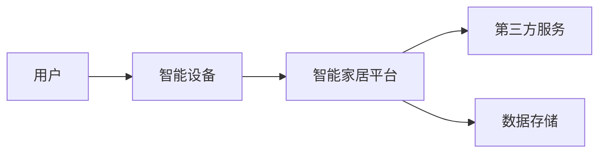

                 

# 价值投资中的智能家居生态系统分析

## 关键词：价值投资、智能家居、生态系统、技术分析、投资策略

## 摘要：  
智能家居生态系统作为现代科技的重要组成部分，正在迅速改变我们的生活方式。本文从价值投资的角度，深入分析智能家居生态系统的构成、技术原理及其投资价值，探讨如何在这一领域寻找投资机会。通过对比分析和案例研究，本文为投资者提供系统的分析框架和实用的建议。

---

## 第1章: 背景介绍

### 1.1 智能家居的概念与背景

#### 1.1.1 智能家居的定义
智能家居是指通过物联网、人工智能等技术，将家庭中的设备、系统和数据进行整合，实现智能化管理和控制的居住环境。智能家居不仅提升了生活的便利性，还为能源管理和家庭安全提供了创新解决方案。

#### 1.1.2 智能家居的发展历程
智能家居的概念起源于20世纪90年代，随着技术的进步，逐步从单一设备的自动化向整体生态系统的整合发展。近年来，随着5G、物联网和人工智能技术的成熟，智能家居进入了快速普及阶段。

#### 1.1.3 智能家居的市场现状与趋势
当前，智能家居市场呈现高速增长态势。根据市场研究机构的数据，全球智能家居市场规模预计在未来几年将以年均两位数的速度增长。主要驱动力包括技术进步、消费者需求增加以及企业之间的生态合作。

### 1.2 价值投资的基本概念

#### 1.2.1 价值投资的定义
价值投资是一种投资策略，强调通过深入分析企业的基本面，寻找市场价格低于其内在价值的投资标的。这种方法注重长期收益，而非短期市场波动。

#### 1.2.2 价值投资的核心理念
价值投资的核心理念是寻找具有强大竞争优势、良好财务状况和可持续发展能力的企业。投资者需要关注企业的盈利能力、成长潜力和行业地位。

#### 1.2.3 价值投资在科技领域的应用
在科技领域，价值投资特别关注那些能够引领行业创新、具有强大技术壁垒和市场影响力的公司。智能家居作为科技的重要应用领域，为价值投资者提供了丰富的投资机会。

### 1.3 智能家居生态系统的核心要素

#### 1.3.1 硬件设备
智能家居硬件包括智能音箱、智能灯泡、智能门锁等设备。这些设备通过传感器和执行器，实现与用户的互动和环境的感知。

#### 1.3.2 软件平台
智能家居平台负责协调和管理各类设备的运行，提供用户界面和数据处理功能。例如，Apple Home、Google Nest和Amazon Alexa等平台。

#### 1.3.3 数据与服务
智能家居生态系统依赖于数据的收集、分析和应用。通过数据，企业可以为用户提供个性化的服务，如能源管理、安全监控和生活助手。

---

## 第2章: 智能家居生态系统的核心概念与联系

### 2.1 智能家居生态系统的原理

#### 2.1.1 物联网技术在智能家居中的应用
物联网技术通过设备间的通信，实现智能家居设备的互联和协同。例如，当用户离家时，系统会自动关闭灯光并启动安全模式。

#### 2.1.2 人工智能在智能家居中的作用
人工智能通过学习用户的行为模式，优化智能家居的运行效率。例如，智能音箱可以根据用户的习惯调整播放列表。

#### 2.1.3 云计算与大数据分析
云计算为智能家居提供了强大的数据存储和处理能力。大数据分析则帮助识别用户行为模式，优化服务提供。

### 2.2 核心概念对比分析

#### 2.2.1 硬件与软件的对比
硬件设备是智能家居的基础，而软件平台则是生态系统的中枢。硬件负责数据的采集和执行，软件负责数据的处理和决策。

#### 2.2.2 数据与服务的对比
数据是智能家居的血液，服务是其灵魂。数据为用户提供个性化服务，而服务则通过数据实现智能化。

#### 2.2.3 不同技术的协同效应
物联网、人工智能和云计算的协同效应是智能家居生态系统的核心竞争力。例如，物联网设备采集数据，人工智能进行分析，云计算提供存储和计算支持。

### 2.3 实体关系图

---

## 第3章: 智能家居生态系统中的价值投资分析

### 3.1 投资策略与技术分析

#### 3.1.1 市场分析与投资机会
智能家居市场的快速发展为投资者提供了丰富的投资机会。投资者需要关注市场趋势、企业竞争和技术创新。

#### 3.1.2 技术评估与投资决策
技术评估是价值投资的重要环节。投资者需要评估企业的技术实力、研发能力和市场竞争力。

#### 3.1.3 竞争分析与投资风险
智能家居领域的竞争日益激烈，投资者需要识别潜在的风险，如技术落后、市场饱和和政策变化。

### 3.2 成功案例分析

#### 3.2.1 苹果智能家居生态系统的投资价值
苹果通过整合硬件、软件和服务，构建了一个强大的智能家居生态系统。其品牌影响力和生态系统整合能力使其具有较高的投资价值。

#### 3.2.2 Google Nest的市场表现
Google Nest通过创新的产品设计和智能的平台整合，占据了智能家居市场的领先地位。其在人工智能和物联网技术上的投入为投资者带来了丰厚的回报。

#### 3.2.3 Amazon Alexa的商业模式
Amazon Alexa通过开放的平台策略，吸引了大量的第三方开发者，构建了一个庞大的智能家居生态系统。其商业模式具有较强的可扩展性和盈利能力。

---

## 第4章: 智能家居生态系统的技术架构与投资机会

### 4.1 系统架构设计

#### 4.1.1 智能家居系统的组成
智能家居系统由硬件设备、软件平台、数据存储和第三方服务组成。各部分协同工作，实现智能化管理。

#### 4.1.2 系统功能设计
智能家居系统的功能包括设备控制、数据采集、用户交互和智能决策。这些功能通过系统的模块化设计实现。

#### 4.1.3 系统架构图

### 4.2 系统接口设计

#### 4.2.1 用户接口
用户接口是用户与智能家居系统交互的主要渠道。常见的用户接口包括手机APP、语音控制和智能面板。

#### 4.2.2 设备接口
设备接口是智能设备之间的通信通道。通过统一的设备接口标准，实现设备间的互联互通。

#### 4.2.3 平台接口
平台接口是智能家居平台与其他系统和第三方服务的连接点。通过开放的平台接口，吸引更多的开发者和合作伙伴。

### 4.3 交互流程分析

#### 4.3.1 用户与设备的交互
用户通过手机APP或语音指令与智能设备进行交互。设备根据用户的指令做出响应。

#### 4.3.2 设备与平台的交互
智能设备将数据上传到智能家居平台，平台根据数据进行处理并生成反馈指令。

#### 4.3.3 平台与服务的交互
智能家居平台与第三方服务进行数据交换，为用户提供个性化的服务。

---

## 第5章: 智能家居生态系统中的价值投资策略

### 5.1 投资策略与技术评估

#### 5.1.1 市场定位与投资方向
投资者需要根据市场趋势和企业能力，确定投资方向。例如，可以选择投资于技术领先的硬件制造商或具有强大平台整合能力的企业。

#### 5.1.2 技术评估与投资决策
技术评估是投资决策的重要依据。投资者需要评估企业的技术实力、研发能力和技术壁垒。

#### 5.1.3 竞争分析与投资风险
竞争分析是降低投资风险的重要手段。投资者需要识别潜在的竞争威胁，并制定相应的风险管理策略。

### 5.2 投资机会与风险控制

#### 5.2.1 投资机会
智能家居市场的快速发展为投资者提供了丰富的投资机会。例如，投资于具有创新技术的企业或具有强大生态整合能力的平台。

#### 5.2.2 风险控制
投资者需要关注技术风险、市场风险和政策风险。通过分散投资和风险评估，降低投资风险。

---

## 第6章: 智能家居生态系统投资分析的实际应用

### 6.1 投资案例分析

#### 6.1.1 苹果智能家居生态系统的投资价值
苹果通过整合硬件、软件和服务，构建了一个强大的智能家居生态系统。其品牌影响力和生态系统整合能力使其具有较高的投资价值。

#### 6.1.2 Google Nest的市场表现
Google Nest通过创新的产品设计和智能的平台整合，占据了智能家居市场的领先地位。其在人工智能和物联网技术上的投入为投资者带来了丰厚的回报。

### 6.2 投资建议

#### 6.2.1 确定投资目标
投资者需要根据自身的风险承受能力和投资目标，选择合适的投资标的。

#### 6.2.2 关注技术创新
技术创新是智能家居行业的重要驱动力。投资者需要关注企业的研发投入和技术壁垒。

#### 6.2.3 分散投资风险
通过分散投资和风险评估，降低投资风险。投资者可以将资金分配到不同的技术领域和企业，以降低整体风险。

---

## 第7章: 结论与展望

### 7.1 结论
智能家居生态系统作为价值投资的重要领域，具有广阔的市场前景和丰富的投资机会。投资者需要结合市场趋势、企业能力和技术优势，制定科学的投资策略。

### 7.2 未来展望
随着技术的进步和市场的成熟，智能家居生态系统将更加智能化和个性化。未来，投资者需要关注新技术的应用和商业模式的创新，以抓住更多的投资机会。

---

## 作者：AI天才研究院/AI Genius Institute & 禅与计算机程序设计艺术 /Zen And The Art of Computer Programming

---

本文从价值投资的角度，深入分析了智能家居生态系统的构成、技术原理及其投资价值。通过对比分析和案例研究，为投资者提供了系统的分析框架和实用的建议。希望本文能为价值投资者在智能家居领域寻找投资机会提供有价值的参考。

