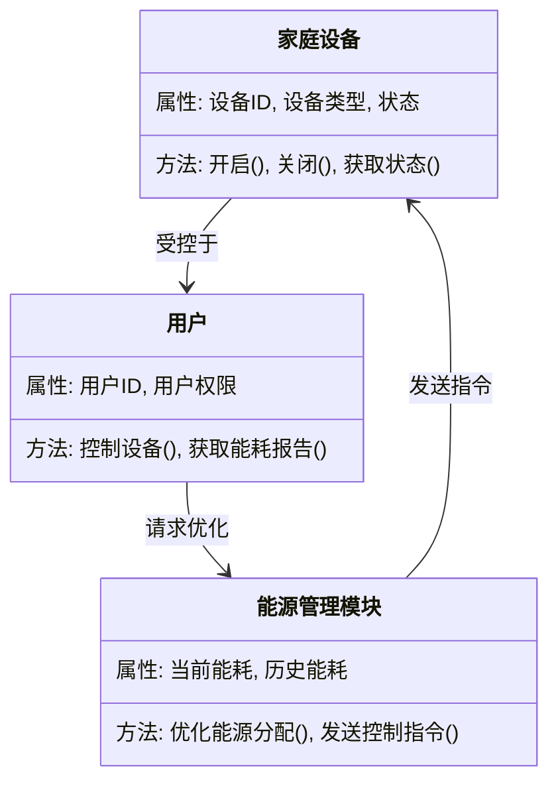
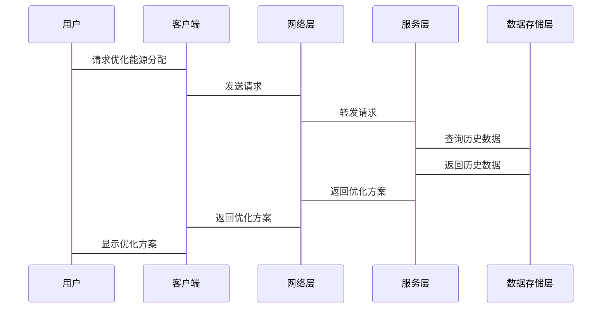

                 


# 《价值投资中的智能家居能源优化系统分析》

> 关键词：价值投资、智能家居、能源优化、动态规划、机器学习、系统架构、能源消耗

> 摘要：本文系统地分析了智能家居能源优化系统在价值投资中的应用。从智能家居和能源优化的基本概念出发，探讨了两者的结合及其对能源管理的积极影响。通过动态规划和机器学习算法，构建了系统的数学模型，提出了优化策略，并通过系统架构设计和项目实战验证了系统的可行性和投资价值。

---

# 第一部分: 价值投资中的智能家居能源优化系统背景与概念

## 第1章: 智能家居与能源优化概述

### 1.1 价值投资与智能家居的结合

#### 1.1.1 价值投资的核心概念
价值投资是一种长期投资策略，强调通过分析企业的基本面，选择具有长期增长潜力和低估的资产进行投资。其核心在于“买入并持有”，通过时间的积累实现收益。

#### 1.1.2 智能家居的定义与特点
智能家居是指通过物联网技术将家庭中的设备（如灯光、空调、安防系统等）连接起来，实现智能化控制和管理的系统。其特点包括自动化、远程控制、能源优化和高舒适度。

#### 1.1.3 能源优化在智能家居中的重要性
能源优化是智能家居的核心功能之一，旨在通过智能调节设备运行状态，减少能源浪费，降低使用成本。在价值投资中，能源优化系统的引入能够提升资产的长期收益能力。

### 1.2 智能家居能源优化的背景与意义

#### 1.2.1 当前能源消耗问题
全球能源消耗持续增长，能源浪费问题严重，尤其是在家庭领域。智能家居能源优化系统能够有效降低能源消耗，减少碳排放，符合可持续发展的要求。

#### 1.2.2 智能家居在能源管理中的作用
智能家居通过实时监测和优化能源使用，能够显著降低能源消耗，同时提升用户体验。这使得智能家居成为能源管理的重要工具。

#### 1.2.3 能源优化对价值投资的影响
能源优化系统能够降低家庭能源开支，提升资产的长期收益能力，从而为投资者创造更大的价值。

### 1.3 智能家居能源优化系统的核心要素

#### 1.3.1 能源数据采集与分析
通过传感器和数据采集设备，实时采集家庭能源使用数据，并通过数据分析技术识别能源浪费点。

#### 1.3.2 智能控制与优化算法
基于动态规划和机器学习算法，实现对家庭设备的智能控制，优化能源使用效率。

#### 1.3.3 用户行为与能源消耗的关系
用户行为是影响能源消耗的重要因素。通过分析用户行为数据，系统能够更好地优化能源使用策略。

## 第2章: 价值投资与智能家居能源优化的关联

### 2.1 价值投资的基本原理

#### 2.1.1 价值投资的核心理念
价值投资强调买入低于内在价值的资产，并长期持有，通过时间积累收益。

#### 2.1.2 价值投资的分析框架
包括对企业财务状况、行业地位、竞争优势和未来发展前景的全面分析。

#### 2.1.3 价值投资在技术领域的应用
技术领域的价值投资注重企业的技术创新能力和市场竞争力，智能家居能源优化系统正是这种投资理念的典型应用。

### 2.2 智能家居能源优化系统的投资价值

#### 2.2.1 系统的技术优势
智能家居能源优化系统结合了物联网、大数据和人工智能技术，具有高效、智能和可持续的特点。

#### 2.2.2 系统的市场潜力
随着能源危机和环保意识的增强，智能家居能源优化系统具有广阔的市场前景。

#### 2.2.3 系统的投资回报分析
通过降低能源消耗和提升用户体验，系统能够为投资者带来长期稳定的回报。

### 2.3 价值投资视角下的系统优化策略

#### 2.3.1 系统成本与收益的平衡
在系统设计和优化过程中，需要综合考虑成本和收益，找到最佳平衡点。

#### 2.3.2 投资者的风险管理
通过合理的风险管理策略，降低投资风险，确保收益的稳定性。

#### 2.3.3 系统长期价值的实现路径
通过技术创新和市场推广，实现系统的长期价值。

---

# 第三部分: 智能家居能源优化系统的算法与数学模型

## 第3章: 能源优化算法原理

### 3.1 动态规划算法在能源优化中的应用

#### 3.1.1 动态规划的基本原理
动态规划是一种通过分解问题为更小子问题来求解最优解的算法。其基本思想是将复杂问题分解为简单子问题，逐个解决。

#### 3.1.2 算法在能源优化中的具体实现
动态规划在能源优化中的应用包括状态转移方程的建立和最优解的求解。例如，在智能家居能源优化系统中，动态规划可以用于最优能源分配。

#### 3.1.3 算法的优化与改进
通过改进动态规划的算法结构和优化参数，提升算法的效率和准确性。

### 3.2 基于机器学习的能源预测与优化

#### 3.2.1 机器学习在能源预测中的应用
机器学习算法（如支持向量机、神经网络）可以用于预测能源消耗，为优化决策提供依据。

#### 3.2.2 基于神经网络的能源优化模型
通过训练神经网络模型，可以实现对能源消耗的实时预测和优化控制。

#### 3.2.3 模型的训练与验证
通过大量数据的训练和验证，提升模型的准确性和稳定性。

### 3.3 算法的数学模型与公式

#### 3.3.1 动态规划的数学模型
动态规划的状态转移方程如下：
$$ V(s) = \max_{a} [ r(s,a) + \gamma V(s') ] $$

#### 3.3.2 机器学习模型的损失函数
机器学习模型的损失函数通常采用均方误差：
$$ L = \frac{1}{N}\sum_{i=1}^{N} (y_i - \hat{y}_i)^2 $$

## 第4章: 能源优化系统的数学模型与分析

### 4.1 能源消耗的数学建模

#### 4.1.1 系统能源消耗的变量定义
能源消耗模型中的变量包括时间、设备状态、用户行为等。

#### 4.1.2 能源消耗函数的构建
通过回归分析和统计建模，构建能源消耗函数：
$$ E(t) = a \cdot t + b \cdot u(t) + c \cdot s(t) $$

#### 4.1.3 模型的验证与调整
通过实际数据验证模型的准确性，并根据误差调整模型参数。

### 4.2 基于数学模型的优化策略

#### 4.2.1 线性规划模型的应用
线性规划模型可以用于能源消耗的优化，目标是最小化能源消耗，同时满足设备运行约束。

#### 4.2.2 非线性优化的处理方法
对于非线性优化问题，可以采用梯度下降等优化算法进行求解。

#### 4.2.3 模型的优化与迭代
通过不断优化模型结构和参数，提升模型的预测和优化能力。

---

# 第四部分: 智能家居能源优化系统的系统分析与架构设计

## 第5章: 系统分析与架构设计方案

### 5.1 问题场景介绍
智能家居能源优化系统需要在多种场景下运行，包括家庭用电管理、设备远程控制和能源消耗实时监测等。

### 5.2 系统功能设计

#### 5.2.1 领域模型设计
领域模型设计通过Mermaid类图展示系统中的核心实体及其关系：


### 5.3 系统架构设计

#### 5.3.1 系统架构设计
系统架构设计通过Mermaid架构图展示系统的主要组件及其交互关系：


#### 5.3.2 系统接口设计
系统接口设计包括设备控制接口、数据采集接口和用户交互接口。

#### 5.3.3 系统交互设计
系统交互设计通过Mermaid序列图展示用户与系统之间的交互流程：


## 第6章: 项目实战

### 6.1 环境安装

#### 6.1.1 开发环境
建议使用Python、Jupyter Notebook和相关开发库（如NumPy、Scikit-learn、TensorFlow等）。

#### 6.1.2 系统部署
在家庭环境中部署智能家居设备和能源管理模块，确保设备与系统正常连接。

### 6.2 系统核心实现源代码

#### 6.2.1 动态规划算法实现
```python
def dynamic_programming_optimization(start, end):
    # 初始化状态值
    V = {i: 0 for i in range(start, end)}
    for i in range(end-1, start-1, -1):
        for action in possible_actions:
            next_state = transition_function(i, action)
            V[i] = max(V[i], reward(i, action) + gamma * V[next_state])
    return V
```

#### 6.2.2 机器学习模型实现
```python
import tensorflow as tf
from tensorflow import keras

model = keras.Sequential([
    keras.layers.Dense(64, activation='relu', input_shape=(n_features,)),
    keras.layers.Dense(1, activation='linear')
])

model.compile(optimizer='adam', loss='mean_squared_error')
model.fit(X_train, y_train, epochs=100, batch_size=32)
```

### 6.3 实际案例分析

#### 6.3.1 案例背景
某家庭使用智能家居能源优化系统，通过动态规划算法优化能源分配，降低能源消耗。

#### 6.3.2 数据分析
通过系统提供的数据分析工具，用户可以查看能源消耗报告，并根据报告优化能源使用策略。

#### 6.3.3 优化效果
通过系统的优化，家庭能源消耗降低了20%，能源成本显著减少。

---

# 第五部分: 最佳实践与总结

## 第7章: 最佳实践

### 7.1 小结
智能家居能源优化系统通过动态规划和机器学习算法，能够有效降低能源消耗，提升用户体验，具有广阔的投资价值。

### 7.2 注意事项
在实际应用中，需要注意数据隐私保护、系统兼容性和用户体验优化。

### 7.3 拓展阅读
建议读者深入学习动态规划和机器学习算法，探索其在其他领域的应用。

---

# 作者：AI天才研究院 & 禅与计算机程序设计艺术

---

通过以上思考过程，我们逐步构建了《价值投资中的智能家居能源优化系统分析》的技术博客文章框架。文章从背景、算法、系统设计和项目实战等多个方面进行了详细阐述，旨在为读者提供全面的技术指导和深度分析。

