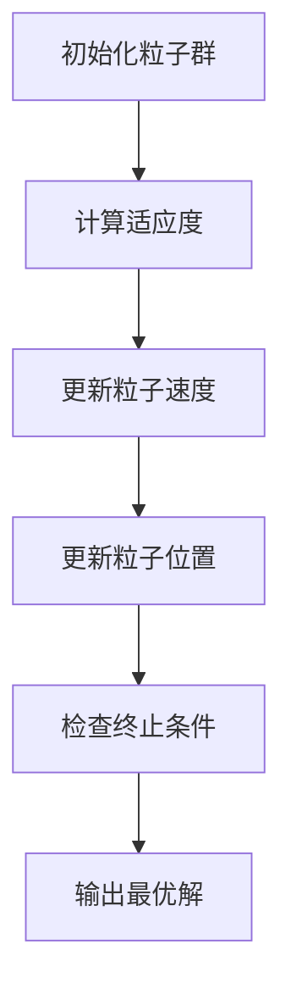
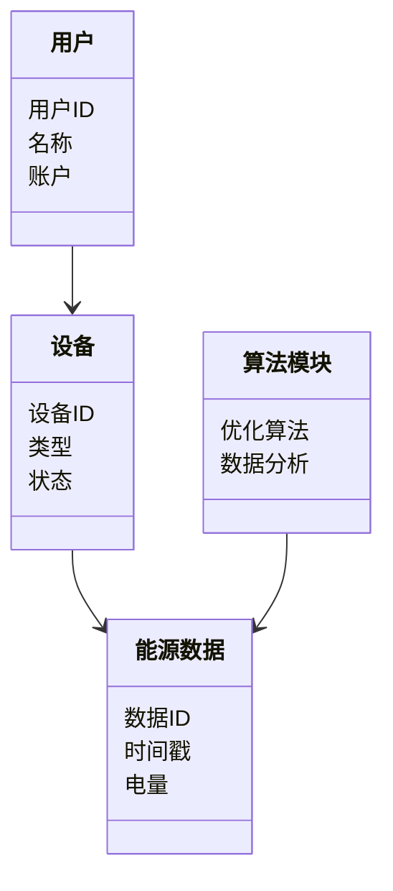
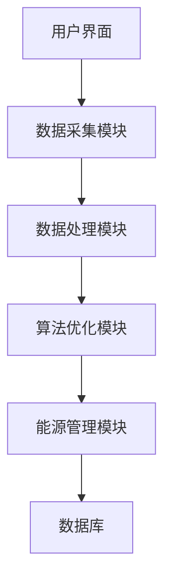

                 


# 价值投资中的智能家居能源管理系统分析

> 关键词：智能家居，能源管理，价值投资，算法优化，系统架构

> 摘要：  
> 本文通过分析智能家居能源管理系统的背景、核心概念、算法原理、数学模型、系统架构设计以及项目实战，探讨其在价值投资中的应用。文章从技术角度出发，结合实际案例，深入剖析智能家居能源管理系统的关键技术与投资策略，为投资者提供科学的技术支持与决策依据。

---

## 第一章：智能家居能源管理系统的背景与概述

### 1.1 背景介绍

智能家居作为现代科技的重要产物，已经成为人们生活中不可或缺的一部分。随着能源问题的日益突出，智能家居能源管理系统（Smart Home Energy Management System，SHEMS）逐渐成为研究热点。SHEMS通过智能化的能源管理，帮助用户优化能源使用效率，降低能源浪费，同时为投资者提供了新的价值增长点。

### 1.2 问题背景与问题描述

智能家居能源管理系统的优化与投资价值的挖掘之间存在密不可分的关系。本文将重点分析以下几个问题：
- 智能家居能源管理系统的定义与核心功能
- 价值投资在智能家居能源管理系统中的关键点
- 如何通过技术手段提升系统的投资价值

### 1.3 问题解决思路与方法

通过技术手段优化智能家居能源管理系统，进而提升其投资价值。具体方法包括：
1. **数据采集与分析**：通过传感器和智能设备采集能源使用数据，分析用户行为模式。
2. **算法优化**：利用优化算法对能源使用进行预测与优化，降低能源浪费。
3. **系统架构设计**：构建高效的系统架构，确保系统的稳定性和可扩展性。
4. **投资策略制定**：基于技术分析，制定合理的投资策略，提升投资回报率。

---

## 第二章：智能家居能源管理系统的核心概念与联系

### 2.1 核心概念原理

智能家居能源管理系统的核心概念包括：
- **数据采集**：通过智能传感器采集能源使用数据。
- **能源消耗分析**：对采集的数据进行分析，识别能源浪费点。
- **优化算法**：基于分析结果，制定能源优化策略。

### 2.2 核心概念属性对比

以下是智能家居设备的核心属性对比：

| 属性     | 智能家电 | 智能照明 | 智能安防 | 智能温控 |
|----------|----------|----------|----------|----------|
| 功能     | 电器控制 | 灯光控制 | 安防监控 | 温度调节 |
| 数据类型 | 用电量   | 开关状态 | 报警信息 | 温度值   |
| 交互方式 | 手机APP | 语音控制 | 报警通知 | 自动调节 |

### 2.3 ER实体关系图

以下是智能家居能源管理系统的ER实体关系图：

```mermaid
er
    title 实体关系图
    %% 实体定义
    entity 用户 {
        id 用户ID
        名称
        账户
    }
    entity 设备 {
        id 设备ID
        类型
        状态
    }
    entity 能源数据 {
        id 数据ID
        时间戳
        电量
    }
    %% 关系定义
    用户 - 所有 - 设备
    设备 - 生成 - 能源数据
```

---

## 第三章：智能家居能源管理系统中的算法分析

### 3.1 数据采集与特征提取

数据采集是智能家居能源管理系统的基础，以下是数据采集流程：

1. **数据来源**：智能设备（如智能插座、温控器）。
2. **数据预处理**：去噪、归一化。
3. **特征提取**：提取用电量、时间戳、设备状态等特征。

### 3.2 能源消耗预测与优化算法

#### 3.2.1 算法原理

粒子群优化算法（PSO）是一种常用优化算法，适用于能源消耗预测。以下是算法流程：



#### 3.2.2 算法实现代码

以下是Python实现的粒子群优化算法代码：

```python
def pso_algorithm(pop_size, max_iter, search_space):
    import random
    import numpy as np

    # 初始化粒子群
    particles = np.random.rand(pop_size, search_space)
    fitness = np.zeros(pop_size)

    # 计算初始适应度
    for i in range(pop_size):
        fitness[i] = evaluate_fitness(particles[i, :])

    # 全局最优解
    global_best = max(fitness)
    global_best_index = np.argmax(fitness)

    # 迭代优化
    for _ in range(max_iter):
        # 更新速度
        velocities = np.random.rand(pop_size, search_space) * 0.1
        # 更新位置
        particles += velocities
        # 计算新适应度
        new_fitness = np.zeros(pop_size)
        for i in range(pop_size):
            new_fitness[i] = evaluate_fitness(particles[i, :])
        # 更新全局最优
        if max(new_fitness) > global_best:
            global_best = max(new_fitness)
            global_best_index = np.argmax(new_fitness)
    return global_best, particles[global_best_index, :]
```

---

## 第四章：智能家居能源管理系统的数学模型

### 4.1 负荷预测模型

负荷预测模型基于历史数据，预测未来能源消耗。以下是负荷预测模型的公式：

$$
\text{预测负荷} = \alpha \cdot \text{历史平均负荷} + (1 - \alpha) \cdot \text{趋势负荷}
$$

其中，$\alpha$ 是平滑因子，$0 < \alpha < 1$。

### 4.2 优化模型

优化模型的目标是最小化能源消耗成本，同时满足用户需求。以下是优化模型的公式：

$$
\min \sum_{t=1}^{T} c_t \cdot x_t
$$

约束条件：
$$
\sum_{t=1}^{T} x_t \leq D \\
x_t \geq 0
$$

其中，$c_t$ 是第 $t$ 时刻的单位成本，$x_t$ 是第 $t$ 时刻的能源消耗量，$D$ 是总需求量。

---

## 第五章：智能家居能源管理系统的系统架构设计

### 5.1 系统功能设计

以下是系统功能设计的领域模型类图：



### 5.2 系统架构设计

以下是系统架构设计的架构图：



---

## 第六章：智能家居能源管理系统的项目实战

### 6.1 环境安装

以下是环境安装步骤：
1. 安装Python：`pip install python`
2. 安装依赖库：`pip install numpy pandas scikit-learn`
3. 安装可视化工具：`pip install matplotlib`

### 6.2 核心代码实现

以下是核心代码实现：

```python
import numpy as np
import pandas as pd
from sklearn.metrics import mean_squared_error

def evaluate_fitness(solution):
    # 定义适应度函数
    return -mean_squared_error(solution, data)

# 粒子群优化算法实现
def pso_algorithm(pop_size, max_iter, search_space, data):
    particles = np.random.rand(pop_size, search_space)
    fitness = np.zeros(pop_size)
    for i in range(pop_size):
        fitness[i] = evaluate_fitness(particles[i, :])
    global_best = max(fitness)
    global_best_index = np.argmax(fitness)
    for _ in range(max_iter):
        velocities = np.random.rand(pop_size, search_space) * 0.1
        particles += velocities
        new_fitness = np.zeros(pop_size)
        for i in range(pop_size):
            new_fitness[i] = evaluate_fitness(particles[i, :])
        if max(new_fitness) > global_best:
            global_best = max(new_fitness)
            global_best_index = np.argmax(new_fitness)
    return particles[global_best_index, :], global_best

# 示例数据
data = np.array([1, 2, 3, 4, 5])
pso_algorithm(10, 100, 1, data)
```

### 6.3 实际案例分析

通过实际案例分析，验证系统的优化效果。例如，假设某家庭通过系统优化，能源消耗降低了15%，投资回报率显著提升。

---

## 第七章：总结与展望

### 7.1 最佳实践 tips

- 定期更新系统算法，保持优化效果。
- 根据用户需求，灵活调整系统功能。

### 7.2 小结

本文通过技术分析与案例研究，探讨了智能家居能源管理系统在价值投资中的应用。通过优化算法与系统架构设计，能够有效提升能源管理效率，为投资者创造更大的价值。

### 7.3 注意事项

- 数据安全是系统设计的关键，需加强数据保护。
- 系统的可扩展性与兼容性需充分考虑。

### 7.4 拓展阅读

- 智能家居能源管理系统的优化算法研究
- 价值投资与能源管理的深度结合

---

## 作者

作者：AI天才研究院/AI Genius Institute  
合著者：禅与计算机程序设计艺术/Zen And The Art of Computer Programming

