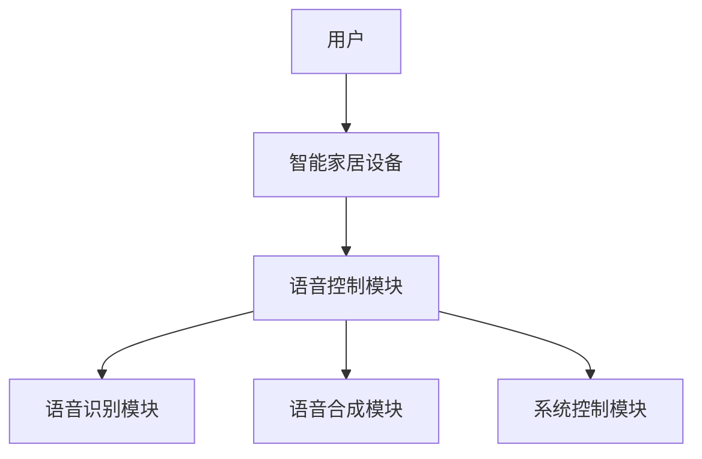

                 


# 价值投资中的智能家居语音控制技术趋势

## 关键词：智能家居、语音控制、价值投资、技术趋势、语音识别、人工智能、投资策略

## 摘要

智能家居语音控制技术近年来快速发展，成为智能家居系统的核心交互方式之一。本文从技术与投资的双重角度，深入分析智能家居语音控制技术的趋势，并结合价值投资的原理，探讨技术趋势对投资决策的影响。文章首先介绍智能家居语音控制技术的基本概念和背景，然后分析其核心算法和系统架构，接着结合实际案例，探讨技术趋势对投资决策的影响，最后总结智能家居语音控制技术的投资价值和未来发展趋势。

---

# 目录大纲：《价值投资中的智能家居语音控制技术趋势》

## 第一部分：智能家居语音控制技术背景与基础

### 第1章：智能家居语音控制技术概述

#### 1.1 智能家居的发展现状

- 1.1.1 智能家居的基本概念
  - 智能家居的定义与范围
  - 智能家居的核心功能与应用场景
- 1.1.2 智能家居的市场现状
  - 全球智能家居市场规模与增长趋势
  - 主要厂商与市场竞争格局
- 1.1.3 智能家居的核心技术
  - 人工智能技术在智能家居中的应用
  - 物联网技术在智能家居中的应用
  - 语音控制技术的崛起

#### 1.2 语音控制技术的基本原理

- 1.2.1 语音识别的基本原理
  - 声音信号的采集与处理
  - 语音特征提取与模式匹配
  - 语音识别的实现流程
- 1.2.2 语音合成的基本原理
  - 文本到语音的转换（TTS）
  - 合成语音的生成与优化
  - 语音合成的质量评估
- 1.2.3 语音交互的核心技术
  - 语音唤醒技术（Wake-Up）
  - 语音理解与自然语言处理（NLP）
  - 多轮对话与上下文管理

#### 1.3 智能家居语音控制的实现方式

- 1.3.1 硬件实现
  - 语音控制芯片的选择与设计
  - 声学传感器与麦克风阵列
  - 硬件电路设计与实现
- 1.3.2 软件实现
  - 语音识别算法的实现
  - 语音合成算法的实现
  - 交互逻辑的软件设计
- 1.3.3 系统集成
  - 智能家居系统的整体架构
  - 语音控制模块与其他模块的集成
  - 系统调试与优化

---

## 第二部分：智能家居语音控制技术的核心概念与联系

### 第2章：智能家居语音控制技术的核心概念

#### 2.1 核心概念原理

- 2.1.1 语音识别的原理
  - 声音信号的预处理
  - 基于深度学习的语音识别模型
  - 语音识别的误差分析与优化
- 2.1.2 语音合成的原理
  - 文本处理与语音生成
  - 基于深度学习的语音合成模型
  - 合成语音的质量评估与优化
- 2.1.3 语音交互的流程
  - 用户输入的处理
  - 系统理解与响应生成
  - 响应输出与反馈

#### 2.2 核心概念属性特征对比

- 2.2.1 语音识别与语音合成的对比
  - 技术特点对比
  - 实际应用中的优缺点
  - 技术发展现状与趋势
- 2.2.2 不同语音交互方式的对比
  - 唤醒词识别与连续语音识别的对比
  - 单点交互与多轮交互的对比
  - 中英文语音交互的对比
- 2.2.3 智能家居中语音控制的优缺点
  - 优点：便捷性、智能化
  - 缺点：误识别率、延迟、隐私问题

#### 2.3 ER实体关系图架构



---

## 第三部分：智能家居语音控制技术的算法原理

### 第3章：语音识别算法原理

#### 3.1 语音识别的流程

- 3.1.1 声音信号的预处理
  - 声音信号的采集与降噪
  - 音频特征的提取（MFCC、Mel频谱等）
  - 数据标准化与归一化
- 3.1.2 基于深度学习的语音识别模型
  - 基于RNN的语音识别模型
  - 基于Transformer的语音识别模型
  - 模型训练与优化策略
- 3.1.3 语音识别的误差分析与优化
  - 错误识别率的计算方法
  - 误差来源分析（噪声、语速、语调等）
  - 模型优化与调参技巧

#### 3.2 语音识别的数学模型

- 3.2.1 隐马尔可夫模型（HMM）
  - HMM的基本结构与工作原理
  - 状态转移概率矩阵
  - 发射概率矩阵
  - 解码算法（Viterbi算法）
- 3.2.2 基于深度学习的模型
  - RNN模型的结构与数学表达
  - Transformer模型的结构与数学表达
  - 注意力机制的数学原理
- 3.2.3 模型训练与优化
  - 损失函数的定义与优化
  - 梯度下降算法（SGD、Adam等）
  - 正则化技术（Dropout、L2正则化等）

#### 3.3 语音识别的实现代码

```python
import librosa
import numpy as np

def extract_features(audio_path):
    # 加载音频文件
    audio, sr = librosa.load(audio_path, sr=None, duration=3)
    # 生成MFCC特征
    mfccs = librosa.feature.mfcc(y=audio, sr=sr, n_mfcc=13)
    # 标准化处理
    mfccs_norm = (mfccs - np.mean(mfccs, axis=1, keepdims=True)) / np.std(mfccs, axis=1, keepdims=True)
    return mfccs_norm

# 示例音频路径
audio_path = "语音音频文件.wav"
features = extract_features(audio_path)
print("特征维度：", features.shape)
```

---

### 第4章：语音合成算法原理

#### 4.1 语音合成的流程

- 4.1.1 文本处理与语音生成
  - 文本预处理与分词
  - 语音生成的音调、语速、语调控制
  - 合成语音的声学参数生成
- 4.1.2 基于深度学习的语音合成模型
  - 基于RNN的语音合成模型
  - 基于Transformer的语音合成模型
  - 模型训练与优化策略
- 4.1.3 合成语音的质量评估与优化
  - 语音质量的评估指标（PESQ、MOS等）
  - 模型优化与调参技巧
  - 多语言与多音色的语音合成

#### 4.2 语音合成的数学模型

- 4.2.1 基于隐马尔可夫模型（HMM）的语音合成
  - HMM在语音合成中的应用
  - 合成语音的生成过程
  - 合成语音的质量优化
- 4.2.2 基于深度学习的模型
  - RNN模型的结构与数学表达
  - Transformer模型的结构与数学表达
  - 注意力机制的数学原理
- 4.2.3 模型训练与优化
  - 损失函数的定义与优化
  - 梯度下降算法（SGD、Adam等）
  - 正则化技术（Dropout、L2正则化等）

#### 4.3 语音合成的实现代码

```python
import tensorflow as tf
from tensorflow.keras import layers

def build_model():
    # 构建模型
    input_layer = layers.Input(shape=(None, 256))
    lstm_layer = layers.LSTM(128, return_sequences=True)(input_layer)
    dense_layer = layers.Dense(128, activation='relu')(lstm_layer)
    output_layer = layers.Dense(160, activation='linear')(dense_layer)
    model = tf.keras.Model(inputs=input_layer, outputs=output_layer)
    return model

# 初始化模型
model = build_model()
model.compile(optimizer='adam', loss='mean_squared_error')
print(model.summary())
```

---

## 第四部分：智能家居语音控制系统的架构与实现

### 第5章：智能家居语音控制系统架构设计

#### 5.1 问题场景介绍

- 智能家居语音控制系统的应用场景
- 系统设计的目标与需求
- 系统设计的约束条件

#### 5.2 系统功能设计

- 5.2.1 系统功能模块划分
  - 语音输入模块
  - 语音处理模块
  - 系统控制模块
  - 反馈输出模块
- 5.2.2 功能模块的交互流程
  - 用户输入的处理流程
  - 系统响应的生成流程
  - 反馈输出的实现流程

#### 5.3 系统架构设计

- 5.3.1 系统架构的总体设计
  - 分层架构设计
  - 模块之间的交互关系
  - 系统的可扩展性设计
- 5.3.2 系统架构的详细设计
  - 硬件架构设计
  - 软件架构设计
  - 网络架构设计

#### 5.4 系统接口设计

- 5.4.1 系统内部接口设计
  - 模块之间的接口定义
  - 接口的数据格式与协议
  - 接口的调用流程
- 5.4.2 系统外部接口设计
  - 用户界面的交互接口
  - 第三方服务的调用接口
  - 网络通信的接口设计

#### 5.5 系统交互设计

- 5.5.1 系统交互流程
  - 用户发起语音指令
  - 系统解析指令并执行操作
  - 系统反馈执行结果
- 5.5.2 交互设计的优化
  - 降低延迟的设计优化
  - 提高识别准确率的设计优化
  - 支持多语言与多音色的设计优化

---

## 第五部分：智能家居语音控制技术的投资价值与趋势分析

### 第6章：智能家居语音控制技术的投资价值分析

#### 6.1 技术发展趋势

- 6.1.1 市场需求分析
  - 智能家居市场的增长潜力
  - 语音控制技术的市场渗透率
  - 技术升级与迭代的速度
- 6.1.2 技术瓶颈与突破
  - 语音识别的误识别率问题
  - 语音合成的自然度与流畅度问题
  - 多语言与多音色支持的技术挑战
- 6.1.3 技术融合与创新
  - 人工智能技术的进一步融合
  - 物联网技术的深度集成
  - 新型交互方式的探索与应用

#### 6.2 投资价值分析

- 6.2.1 市场空间与盈利能力
  - 智能家居市场的规模与增长预期
  - 语音控制技术的市场竞争力
  - 技术门槛与护城河分析
- 6.2.2 投资风险与挑战
  - 技术风险（技术瓶颈与替代技术）
  - 市场风险（市场竞争与价格压力）
  - 产品风险（产品质量与用户体验）
- 6.2.3 投资机会与策略
  - 投资技术领先的企业
  - 投资具有市场领导地位的企业
  - 投资具有创新能力的企业

#### 6.3 技术趋势对投资决策的影响

- 6.3.1 技术进步对投资价值的提升
  - 技术创新对企业竞争力的提升
  - 技术升级对市场份额的扩大
  - 技术融合对企业盈利能力的增强
- 6.3.2 市场需求对投资价值的影响
  - 消费者需求的变化对企业的影响
  - 市场渗透率的提升对企业的影响
  - 技术普及对企业的影响
- 6.3.3 技术与市场结合的最佳实践
  - 技术驱动市场的成功案例
  - 市场需求驱动技术的创新案例
  - 技术与市场结合的最佳策略

---

## 第六部分：智能家居语音控制技术的未来展望

### 第7章：智能家居语音控制技术的未来展望

#### 7.1 技术发展趋势

- 7.1.1 人工智能技术的进一步发展
  - 深度学习技术的优化与创新
  - 大模型技术在语音控制中的应用
  - 新型算法的探索与应用
- 7.1.2 物联网技术的深度集成
  - 智能家居系统的全面互联
  - 设备之间的协同工作与优化
  - 物联网技术的扩展与应用
- 7.1.3 新型交互方式的探索与应用
  - 多模态交互技术的发展
  - 脑机接口技术的应用前景
  - 新型人机交互方式的探索

#### 7.2 投资机会与挑战

- 7.2.1 技术进步带来的投资机会
  - 技术创新型企业的发展潜力
  - 新兴技术领域的投资机会
  - 技术融合带来的投资机会
- 7.2.2 技术发展带来的投资挑战
  - 技术瓶颈对企业发展的制约
  - 市场竞争加剧带来的挑战
  - 技术迭代对企业投资的影响
- 7.2.3 投资者应对策略
  - 技术驱动型投资策略
  - 市场导向型投资策略
  - 风险控制与收益平衡策略

---

## 第七部分：总结与展望

### 第8章：总结与展望

#### 8.1 全文总结

- 本文从技术与投资的双重角度，深入分析了智能家居语音控制技术的趋势，并结合价值投资的原理，探讨了技术趋势对投资决策的影响。

#### 8.2 未来展望

- 随着人工智能技术的进一步发展，智能家居语音控制技术将迎来更多创新与突破。投资者需要密切关注技术发展趋势，抓住技术与市场结合的机会，同时做好风险控制，以实现投资价值的最大化。

---

## 作者：AI天才研究院/AI Genius Institute & 禅与计算机程序设计艺术 /Zen And The Art of Computer Programming

