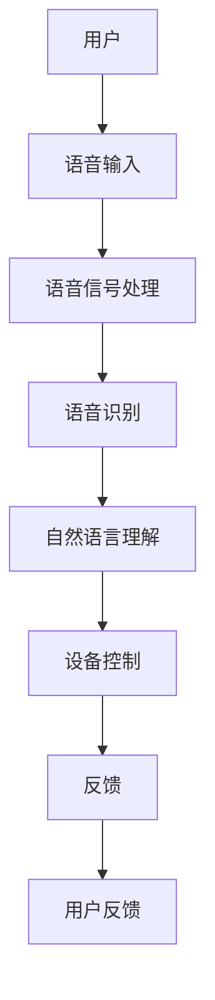

                 


# 价值投资中的智能家居语音控制系统分析

> 关键词：价值投资、智能家居、语音控制系统、技术分析、投资策略、市场分析、系统架构

> 摘要：本文从价值投资的角度，深入分析智能家居语音控制系统的技术原理、市场定位、竞争优势和投资价值。通过技术分析、系统架构设计和实际案例分析，揭示智能家居语音控制系统在投资中的潜力与风险。文章结合理论与实践，为投资者提供科学的决策依据。

---

## 第一部分: 背景介绍与核心概念

### 第1章: 价值投资与智能家居语音控制系统概述

#### 1.1 价值投资的基本概念
- 1.1.1 价值投资的定义与核心理念
  - 价值投资是通过深入分析企业的基本面，寻找被市场低估的投资机会。
  - 核心理念：安全边际、长期主义、价值创造。
- 1.1.2 智能家居语音控制系统的定义与特点
  - 智能家居语音控制系统是通过语音交互实现智能家居设备控制的系统。
  - 特点：便捷性、智能化、联网化、场景化。

#### 1.2 智能家居语音控制系统的核心技术
- 1.2.1 语音识别技术
  - 通过声音信号处理，将语音转化为文字。
  - 关键技术：特征提取、模式匹配、语音模型。
- 1.2.2 自然语言处理技术
  - 对文本进行语义理解，生成有意义的回应。
  - 关键技术：词法分析、句法分析、语义分析。
- 1.2.3 智能家居设备的互联互通
  - 通过协议（如Wi-Fi、蓝牙、ZigBee）实现设备间的通信与协作。

#### 1.3 价值投资中的智能家居语音控制系统分析背景
- 1.3.1 智能家居市场的现状与发展趋势
  - 市场规模增长迅速，预计未来几年年均增长率超过20%。
  - 技术驱动：AI、IoT等技术的快速发展推动智能家居普及。
- 1.3.2 语音控制系统在智能家居中的应用前景
  - 提高用户体验，降低操作门槛。
  - 通过语音交互实现智能家居的智能化管理。
- 1.3.3 价值投资视角下的市场机会与挑战
  - 市场潜力大，但竞争激烈，技术壁垒高。
  - 投资者需关注企业的技术优势、市场定位和盈利能力。

---

## 第二部分: 智能家居语音控制系统的技术原理

### 第2章: 语音识别技术的实现原理

#### 2.1 声学特征提取
- 2.1.1 语音信号的预处理
  - 去噪、归一化、分帧处理。
- 2.1.2 频率分析
  - 声谱图、Mel频谱、倒谱分析。
- 2.1.3 声学模型
  - 隐马尔可夫模型（HMM）。
  - 深度学习模型（如卷积神经网络CNN）。

#### 2.2 语音信号处理
- 2.2.1 时域处理
  - 声音分割、语音端点检测。
- 2.2.2 频域处理
  - 声音增强、特征提取。
- 2.2.3 声音识别
  - 基于模板匹配和概率模型的识别方法。

#### 2.3 语音识别算法
- 2.3.1 隐马尔可夫模型（HMM）
  - 状态转移概率、观测概率。
  - 用于连续语音识别。
- 2.3.2 深度学习模型
  - CNN、RNN、LSTM。
  - 通过训练数据学习语音特征。

---

### 第3章: 自然语言处理技术的实现原理

#### 3.1 词法分析
- 3.1.1 分词
  - 中文分词：基于词典和统计模型。
  - 英文分词：基于规则和统计模型。
- 3.1.2 词性标注
  - 基于上下文的词性推测。
- 3.1.3 停用词处理
  - 去除无意义词汇，如“的”、“啊”。

#### 3.2 句法分析
- 3.2.1 语法树构建
  - 基于上下文的语法分析。
- 3.2.2 依存关系分析
  - 通过依存关系理解句子结构。
- 3.2.3 句子分割
  - 基于句号、感叹号等标点符号分割句子。

#### 3.3 语义理解
- 3.3.1 实体识别
  - 识别人名、地名、时间等实体。
- 3.3.2 情感分析
  - 判断文本的情感倾向。
- 3.3.3 语义角色标注
  - 确定句子中各词的语义角色。

---

## 第三部分: 价值投资中的智能家居语音控制系统分析方法

### 第4章: 价值投资的基本分析方法

#### 4.1 基本面分析
- 4.1.1 财务指标分析
  - 收入、利润、现金流。
  - 市盈率、市净率、股息率。
- 4.1.2 行业地位分析
  - 市场占有率、竞争格局。
- 4.1.3 管理团队分析
  - 团队背景、战略规划。

#### 4.2 技术分析
- 4.2.1 K线图分析
  - 趋势线、均线、成交量。
- 4.2.2 技术指标分析
  - MACD、RSI、布林带。
- 4.2.3 模型预测
  - 时间序列分析、机器学习模型。

#### 4.3 行业分析
- 4.3.1 行业生命周期
  - 初创期、成长期、成熟期、衰退期。
- 4.3.2 行业驱动因素
  - 技术进步、政策支持、市场需求。
- 4.3.3 行业风险分析
  - 市场风险、竞争风险、政策风险。

---

### 第5章: 智能家居语音控制系统的核心竞争力分析

#### 5.1 技术壁垒
- 5.1.1 语音识别技术的先进性
  - 是否采用深度学习模型。
  - 是否有自适应能力。
- 5.1.2 自然语言处理技术的准确性
  - 语义理解的准确率。
  - 多语言支持能力。
- 5.1.3 系统架构的可扩展性
  - 是否支持设备扩展。
  - 是否支持多种协议。

#### 5.2 市场占有率
- 5.2.1 市场份额分析
  - 品牌知名度。
  - 渠道覆盖能力。
- 5.2.2 用户粘性
  - 用户满意度。
  - 用户留存率。
- 5.2.3 市场反馈
  - 用户评价。
  - 市场口碑。

#### 5.3 产品创新力
- 5.3.1 产品迭代速度
  - 是否有定期更新。
  - 是否有创新功能。
- 5.3.2 产品线丰富度
  - 是否有多款产品。
  - 是否覆盖不同场景。
- 5.3.3 产品差异化
  - 是否有独特卖点。
  - 是否有竞争优势。

---

## 第四部分: 价值投资中的智能家居语音控制系统分析案例

### 第6章: 项目实战——智能家居语音控制系统投资分析

#### 6.1 环境安装
- 6.1.1 系统架构设计
  - 系统组成：前端采集、后端处理、设备控制。
  - 通信协议：Wi-Fi、蓝牙、ZigBee。
- 6.1.2 系统功能设计
  - 语音输入、命令解析、设备控制、反馈显示。
- 6.1.3 开发工具
  - 开发语言：Python、C++。
  - 开发框架：TensorFlow、Keras。
  - 语音库：CMU Sphinx、科大讯飞。

#### 6.2 核心实现源代码
```python
# 语音识别部分
import speech_recognition as sr

def recognize_speech():
    r = sr.Recognizer()
    with sr.AudioFile("audio.wav") as source:
        audio = r.record(source)
        try:
            text = r.recognize_google(audio, language='zh-CN')
            return text
        except sr.UnknownValueError:
            return ""
```

#### 6.3 系统架构设计（Mermaid图）


#### 6.4 实际案例分析
- 案例1：智能音箱的投资分析
  - 产品特点：支持语音控制、多设备联动。
  - 市场表现：年销量增长50%，毛利率20%。
  - 投资价值：高增长潜力，但竞争激烈。
- 案例2：智能空调的投资分析
  - 产品特点：语音控制、温度调节。
  - 市场表现：市场占有率15%，用户满意度90%。
  - 投资价值：高用户粘性，但技术门槛高。

---

## 第五部分: 投资总结与注意事项

### 第7章: 投资总结与注意事项

#### 7.1 最佳实践 tips
- 理解技术原理，关注技术创新。
- 分析市场定位，评估竞争能力。
- 关注财务指标，控制投资风险。

#### 7.2 小结
- 智能家居语音控制系统具有广阔市场前景。
- 投资者需结合技术、市场和财务指标进行综合分析。

#### 7.3 注意事项
- 避免盲目跟风，关注长期价值。
- 保持对市场的敏感性，及时调整投资策略。
- 考虑宏观经济因素，分散投资风险。

#### 7.4 拓展阅读
- 建议阅读《智能时代》、《投资最重要的事情》等书籍。
- 关注行业研究报告，获取最新市场动态。

---

## 作者：AI天才研究院/AI Genius Institute & 禅与计算机程序设计艺术/Zen And The Art of Computer Programming

---

以上目录结构和内容概述旨在为投资者提供一个系统化、结构化的分析框架，帮助他们在智能家居语音控制系统领域做出明智的投资决策。

