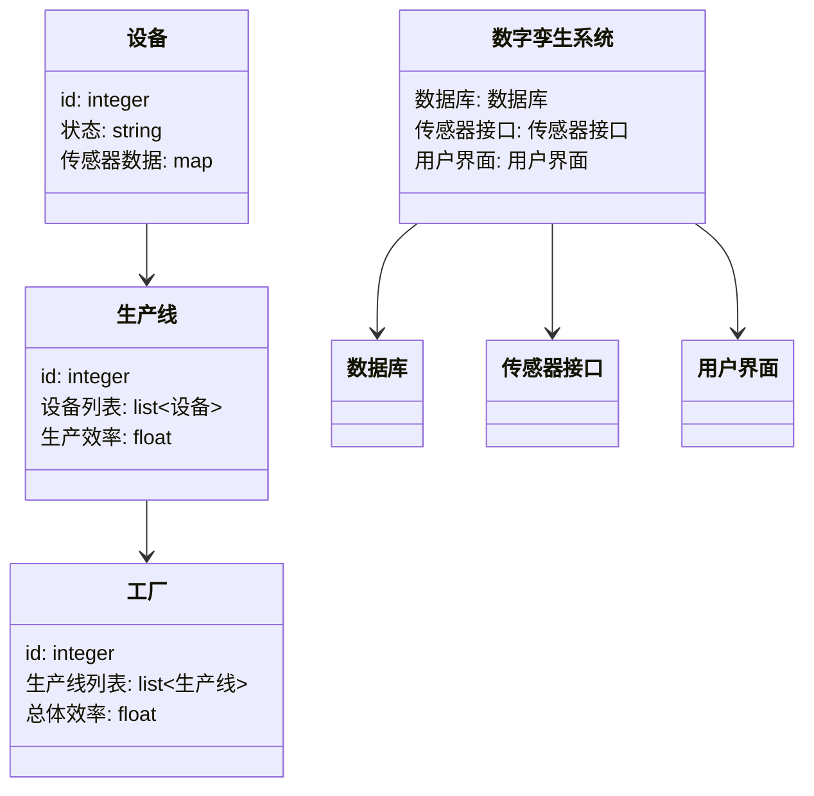
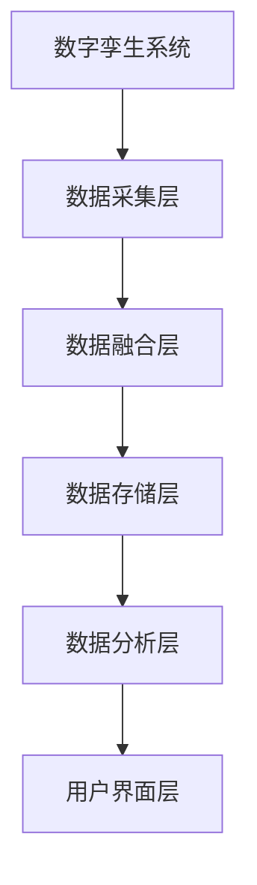
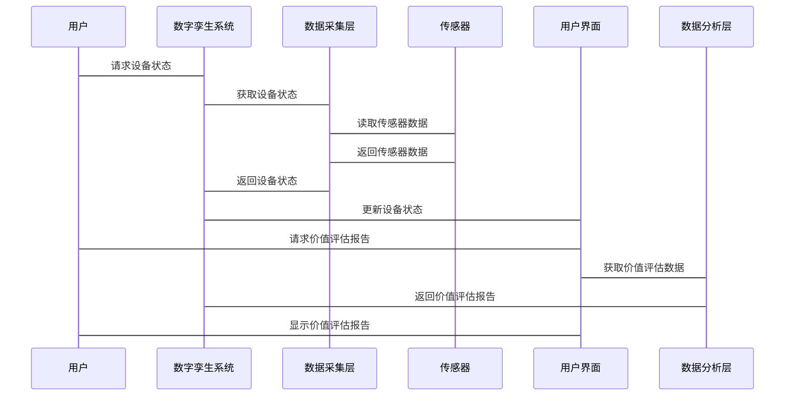

                 


# 价值投资中的智能工厂数字孪生系统分析

## 关键词：数字孪生，智能工厂，价值投资，算法原理，系统架构

## 摘要：本文探讨了数字孪生技术在智能工厂中的应用，重点分析其如何支持价值投资决策。通过详细的技术背景、核心概念、算法原理和系统架构，本文展示了数字孪生系统如何帮助投资者评估工厂的价值，优化运营策略，并通过实际案例展示了系统的实现和应用效果。

---

# 第一部分：价值投资中的智能工厂数字孪生系统背景

## 第1章：数字孪生系统概述

### 1.1 数字孪生的定义与技术背景

#### 1.1.1 数字孪生的定义
数字孪生（Digital Twin）是一种虚拟化技术，通过创建物理对象的数字模型，实时反映其状态、性能和行为。数字孪生系统能够模拟物理系统的运行，支持预测性维护、优化和决策。

#### 1.1.2 数字孪生在智能工厂中的应用
在智能工厂中，数字孪生用于实时监控设备运行状态、优化生产流程、预测设备故障，并支持虚拟调试和培训。数字孪生通过整合传感器数据、历史记录和实时信息，为工厂管理提供全面的洞察。

#### 1.1.3 数字孪生的技术实现基础
数字孪生依赖于物联网（IoT）、大数据、人工智能（AI）和云计算等技术。传感器数据通过物联网传输到云端，利用大数据和AI进行分析，生成实时的数字模型。

### 1.2 价值投资的背景与目标

#### 1.2.1 价值投资的基本概念
价值投资是一种投资策略，通过分析企业的基本面，如财务状况、盈利能力、市场地位等，寻找被低估的投资标的。价值投资者关注长期收益，而非短期市场波动。

#### 1.2.2 智能工厂在价值投资中的作用
智能工厂通过提高生产效率、降低运营成本和增强产品质量，提升企业的盈利能力。数字孪生技术能够优化工厂的运营效率，进而提升企业价值。

#### 1.2.3 数字孪生系统在价值投资中的应用前景
数字孪生系统能够实时监控工厂的运营状况，提供精确的数据支持，帮助投资者评估工厂的潜在价值和风险。数字孪生技术的应用将为价值投资提供更强大的数据支持和决策工具。

---

## 第2章：数字孪生系统的核心概念

### 2.1 数字孪生系统的构成要素

#### 2.1.1 实体模型
实体模型是数字孪生系统的基础，用于表示物理对象的结构和功能。实体模型包括设备、生产线和工厂等元素，通过三维建模和仿真技术进行展示。

#### 2.1.2 数据模型
数据模型描述了数字孪生系统中的数据结构和关系。数据模型包括传感器数据、历史记录和实时信息，通过数据仓库和数据库进行管理。

#### 2.1.3 仿真模型
仿真模型用于模拟物理系统的运行过程，支持预测性分析和优化。仿真模型可以模拟设备故障、生产瓶颈和工艺改进，帮助工厂优化运营。

### 2.2 价值评估模型的构建

#### 2.2.1 价值评估的基本原理
价值评估通过分析企业的财务状况、市场地位和运营效率，评估其内在价值。数字孪生系统能够提供实时的运营数据，支持更精确的价值评估。

#### 2.2.2 数字孪生在价值评估中的应用
数字孪生系统提供实时的工厂运营数据，包括设备状态、生产效率和能源消耗。这些数据为价值评估提供了动态的支持，帮助投资者更准确地评估工厂的潜在价值。

#### 2.2.3 价值评估模型的构建步骤
1. 数据收集与清洗：整合传感器数据、财务数据和市场数据，去除噪声和异常值。
2. 数据建模：利用机器学习算法构建预测模型，评估工厂的盈利能力、运营效率和市场竞争力。
3. 模型验证：通过历史数据验证模型的准确性，调整参数以提高预测精度。
4. 模型应用：将模型应用于实际投资决策，提供实时的工厂价值评估和优化建议。

### 2.3 数字孪生系统与价值评估的关系

#### 2.3.1 数字孪生系统对价值评估的支持
数字孪生系统通过实时数据和仿真模型，为价值评估提供动态的支持。数字孪生系统能够预测工厂的未来表现，帮助投资者做出更明智的投资决策。

#### 2.3.2 价值评估对数字孪生系统的反馈作用
价值评估的结果可以为数字孪生系统的优化提供反馈，帮助改进模型的准确性。价值评估的反馈有助于数字孪生系统更好地适应投资者的需求。

#### 2.3.3 两者结合的协同效应
数字孪生系统与价值评估的结合能够实现工厂运营的实时监控和动态优化，帮助投资者发现潜在的投资机会，降低投资风险。

---

## 第3章：数字孪生系统的算法原理

### 3.1 数据融合算法

#### 3.1.1 数据融合的基本原理
数据融合是将多源数据进行整合，消除冲突，提高数据的准确性和一致性。数据融合算法广泛应用于传感器数据的处理和分析。

#### 3.1.2 基于数字孪生的多源数据融合
数字孪生系统整合来自多个传感器的数据，利用数据融合算法消除数据冲突，生成更精确的数字模型。例如，使用加权融合算法：

$$ y = \sum_{i=1}^{n} w_i x_i $$

其中，\( w_i \) 是传感器 \( i \) 的权重，\( x_i \) 是传感器 \( i \) 的数据。

#### 3.1.3 数据融合的实现步骤
1. 数据采集：从多个传感器获取数据。
2. 数据预处理：去除噪声和异常值。
3. 数据融合：使用加权融合或加性融合等算法生成融合数据。
4. 数据存储：将融合数据存储到数据库中，供后续分析使用。

### 3.2 数据特征提取算法

#### 3.2.1 特征提取的基本方法
特征提取是通过降维技术从高维数据中提取关键特征，减少计算复杂度，提高模型的性能。常用特征提取方法包括主成分分析（PCA）和线性判别分析（LDA）。

#### 3.2.2 数字孪生系统中的特征提取
在数字孪生系统中，特征提取用于识别关键设备状态特征和生产过程特征。例如，使用PCA算法提取设备运行状态的主成分：

$$ y = U^T X $$

其中，\( U \) 是特征向量矩阵，\( X \) 是原始数据矩阵。

#### 3.2.3 基于机器学习的特征提取
基于机器学习的特征提取方法，如深度学习，能够自动提取复杂的特征。例如，使用卷积神经网络（CNN）提取图像中的特征。

### 3.3 数据预测与优化算法

#### 3.3.1 数据预测的基本原理
数据预测是基于历史数据和模型，预测未来的状态和趋势。数据预测算法广泛应用于时间序列分析和回归分析。

#### 3.3.2 数字孪生系统中的预测模型
数字孪生系统中常用的预测模型包括ARIMA和LSTM。例如，使用LSTM预测设备的剩余寿命：

$$ \hat{y}_t = \text{LSTM}(x_{t-1}, x_{t-2}, \dots, x_{t-n}) $$

其中，\( x_{t-i} \) 是输入数据，\( \hat{y}_t \) 是预测输出。

#### 3.3.3 基于优化算法的系统优化
优化算法用于优化数字孪生系统的性能，如能耗优化和生产效率优化。例如，使用遗传算法优化生产流程：

$$ \min_{x} f(x) $$

其中，\( f(x) \) 是目标函数，\( x \) 是优化变量。

---

## 第4章：数字孪生系统的数学模型与公式

### 4.1 数据融合模型

#### 4.1.1 数据融合的线性模型
线性模型用于将多源数据线性组合，生成融合数据。例如：

$$ y = a_1x_1 + a_2x_2 + \dots + a_nx_n $$

其中，\( a_i \) 是传感器 \( i \) 的权重，\( x_i \) 是传感器 \( i \) 的数据，\( y \) 是融合数据。

#### 4.1.2 数据融合的非线性模型
非线性模型用于处理复杂的传感器数据融合问题。例如：

$$ y = f(x_1, x_2, \dots, x_n) $$

其中，\( f \) 是非线性函数。

### 4.2 数据特征提取模型

#### 4.2.1 主成分分析（PCA）
PCA用于降维，提取数据的主要特征。 PCA的数学公式为：

$$ y = U^T X $$

其中，\( U \) 是特征向量矩阵，\( X \) 是原始数据矩阵。

#### 4.2.2 线性判别分析（LDA）
LDA用于分类问题，提取具有判别性的特征。 LDA的数学公式为：

$$ y = W^T X $$

其中，\( W \) 是投影矩阵，\( X \) 是原始数据矩阵。

### 4.3 数据预测模型

#### 4.3.1 自回归积分移动平均模型（ARIMA）
ARIMA用于时间序列预测，数学公式为：

$$ y_t = \phi_1y_{t-1} + \phi_2y_{t-2} + \dots + \phi_ny_{t-n} + \epsilon_t $$

其中，\( \phi_i \) 是自回归系数，\( \epsilon_t \) 是误差项。

#### 4.3.2 长短期记忆网络（LSTM）
LSTM用于处理长期依赖关系，数学公式为：

$$ \text{遗忘门} = \sigma(f_{\text{forget}}(x_t, h_{t-1})) $$
$$ \text{输入门} = \sigma(f_{\text{input}}(x_t, h_{t-1})) $$
$$ \text{候选门} = \tanh(g(x_t, h_{t-1})) $$
$$ h_t = \text{遗忘门} \cdot h_{t-1} + \text{输入门} \cdot \text{候选门} $$
$$ o_t = \sigma(f_{\text{output}}(h_t)) $$

其中，\( \sigma \) 是sigmoid函数，\( f \) 是权重矩阵。

---

## 第5章：数字孪生系统的系统分析与架构设计

### 5.1 项目介绍

#### 5.1.1 项目背景
本项目旨在通过数字孪生技术优化智能工厂的运营效率，支持价值投资决策。项目目标包括实时监控设备状态、优化生产流程和预测设备故障。

### 5.2 系统功能设计

#### 5.2.1 领域模型类图
以下是领域模型类图：



### 5.3 系统架构设计

#### 5.3.1 系统架构图
以下是系统架构图：



### 5.4 系统接口设计

#### 5.4.1 传感器接口
传感器接口用于采集设备状态数据，格式如下：

```json
{
    "设备ID": "string",
    "传感器类型": "string",
    "传感器值": "float"
}
```

#### 5.4.2 用户界面
用户界面提供直观的操作界面，包括设备状态监控、生产效率分析和价值评估报告。

### 5.5 系统交互设计

#### 5.5.1 交互序列图
以下是系统交互序列图：



---

## 第6章：数字孪生系统的项目实战

### 6.1 环境安装

#### 6.1.1 安装Python环境
安装Python 3.8及以上版本，并安装必要的库：

```bash
pip install numpy pandas scikit-learn tensorflow
```

#### 6.1.2 安装数字孪生系统依赖
安装数字孪生系统所需的依赖：

```bash
pip install pymysql requests plotly
```

### 6.2 核心代码实现

#### 6.2.1 数据融合实现

```python
import numpy as np

def weighted_fusion(sensor_data, weights):
    return np.dot(sensor_data, weights)

sensor_data = np.array([[1.2, 2.3, 3.4], [4.5, 5.6, 6.7]])
weights = np.array([0.5, 0.3, 0.2])
fused_data = weighted_fusion(sensor_data, weights)
print(fused_data)
```

#### 6.2.2 价值评估模型实现

```python
import tensorflow as tf
from tensorflow.keras import layers

model = tf.keras.Sequential([
    layers.Dense(64, activation='relu'),
    layers.Dense(1, activation='linear')
])

model.compile(optimizer='adam', loss='mean_squared_error')
model.fit(X_train, y_train, epochs=100, batch_size=32)
```

### 6.3 案例分析与应用解读

#### 6.3.1 实际案例分析
以某汽车制造厂为例，通过数字孪生系统实时监控生产线的设备状态，预测设备故障，并优化生产流程。

#### 6.3.2 代码应用解读
解释代码的功能和实现细节，展示数字孪生系统如何通过数据融合和机器学习模型支持价值评估。

### 6.4 项目小结
本项目展示了数字孪生技术在智能工厂中的实际应用，通过数据融合、特征提取和预测模型，支持价值投资决策。项目的成功实施需要跨学科的知识和团队合作。

---

## 第7章：总结与展望

### 7.1 总结
数字孪生系统通过实时监控和动态优化，为智能工厂的价值评估提供了强有力的支持。数字孪生技术的应用能够提高工厂的运营效率，降低投资风险，实现长期的价值增长。

### 7.2 展望
未来，数字孪生技术将在更多领域得到应用，如智慧城市、智能家居和医疗设备等。数字孪生技术的进一步发展将依赖于人工智能、大数据和物联网等技术的融合，为价值投资提供更强大的工具。

### 7.3 最佳实践 Tips
1. 在实施数字孪生系统之前，确保数据的准确性和完整性。
2. 定期更新模型和算法，以适应工厂的动态变化。
3. 与专业的技术团队合作，确保系统的稳定性和可靠性。

---

## 作者：AI天才研究院/AI Genius Institute & 禅与计算机程序设计艺术 /Zen And The Art of Computer Programming

---

以上是《价值投资中的智能工厂数字孪生系统分析》的完整目录和内容框架，涵盖了从背景介绍、核心概念、算法原理、系统架构到项目实战的各个方面，内容详实，逻辑清晰，能够为读者提供深入的技术洞察和实践指导。

