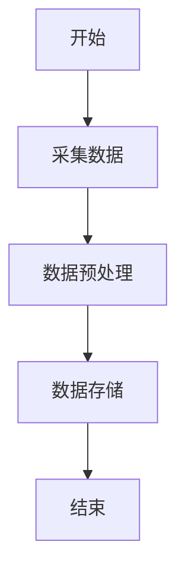
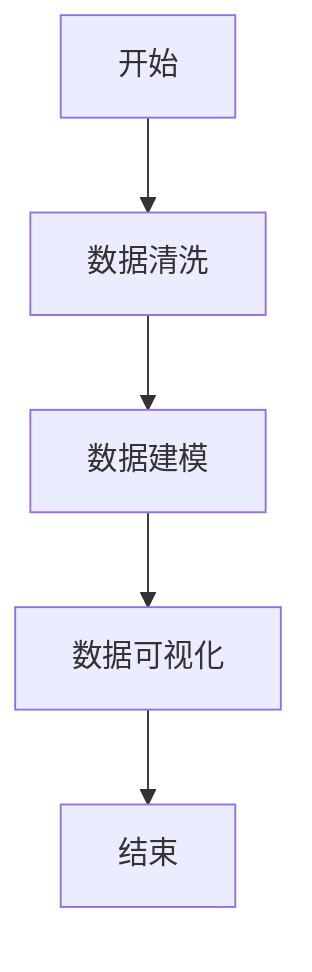
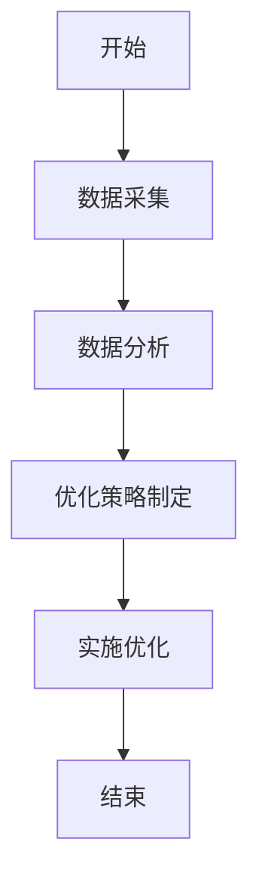
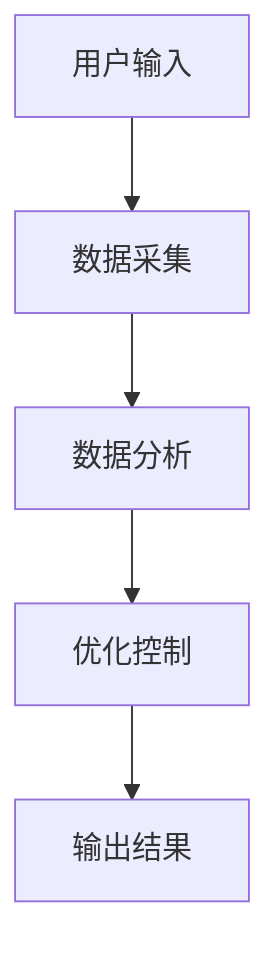
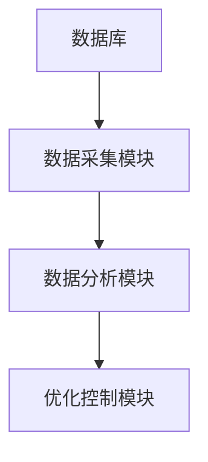
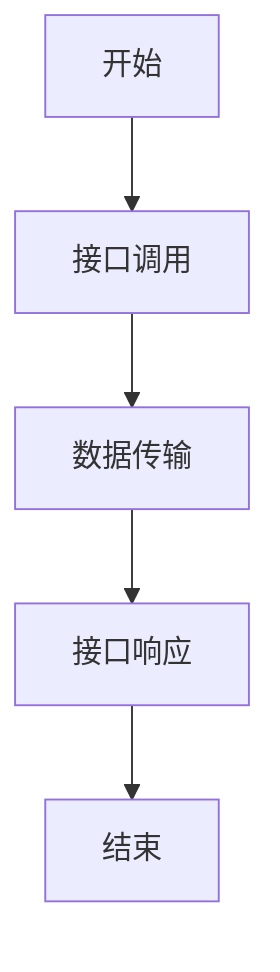

                 


# 价值投资中的智能工厂能源管理系统分析

## 关键词：
- 智能工厂
- 能源管理系统
- 价值投资
- 能耗优化
- 数据分析

## 摘要：
智能工厂能源管理系统通过优化能源使用，降低企业运营成本，进而提升企业价值，吸引长期投资者。本文从背景、系统组成、算法原理、架构设计、项目实战到投资分析，全面探讨智能工厂能源管理系统的价值投资潜力。

---

# 第1章：价值投资与智能工厂能源管理系统的背景

## 1.1 价值投资的基本概念

### 1.1.1 价值投资的定义

价值投资是一种长期投资策略，旨在通过投资那些具有持续增长潜力、低估的公司，实现长期稳健的收益。

$$\text{价值投资} = \text{内在价值} \geq \text{市场价值}$$

### 1.1.2 价值投资的核心理念

- 买入低估资产
- 长期持有优质资产
- 避免短期市场波动干扰

### 1.1.3 价值投资与企业长期发展的关系

价值投资关注企业的长期盈利能力，通过优化运营降低成本，提升企业价值。

## 1.2 智能工厂的基本概念

### 1.2.1 智能工厂的定义

智能工厂是利用物联网、大数据、人工智能等技术实现生产过程智能化的现代工厂。

### 1.2.2 智能工厂的核心技术

- 物联网（IoT）
- 大数据分析
- 人工智能（AI）
- 自动化控制

### 1.2.3 智能工厂与传统工厂的区别

| 特性 | 智能工厂 | 传统工厂 |
|------|----------|----------|
| 生产效率 | 高       | 一般     |
| 成本控制 | 低       | 较高     |
| 可持续性 | 高       | 较低     |

## 1.3 智能工厂能源管理系统的概念

### 1.3.1 能源管理系统的定义

能源管理系统是通过采集、分析和优化能源使用，实现能源高效利用的系统。

### 1.3.2 智能工厂能源管理系统的功能

- 数据采集与监控
- 能耗分析与优化
- 能源消耗预测
- 自动化控制

### 1.3.3 智能工厂能源管理系统与企业价值的关系

通过优化能源使用，降低运营成本，提升企业盈利能力和市场竞争力，进而增加企业价值。

## 1.4 本章小结

本章介绍了价值投资的基本概念、智能工厂的核心技术和智能工厂能源管理系统的功能及其对企业价值的影响。

---

# 第2章：智能工厂能源管理系统的组成

## 2.1 数据采集与监控系统

### 2.1.1 数据采集的定义与作用

数据采集是通过传感器等设备获取能源使用数据的过程。

### 2.1.2 数据采集的主要技术

- 物联网（IoT）
- 数据采集与监控系统（SCADA）
- 传感器技术

### 2.1.3 数据采集系统的实现

1. 安装传感器
2. 采集数据
3. 传输数据到数据中心

## 2.2 数据分析与优化系统

### 2.2.1 数据分析的定义与作用

数据分析是通过处理数据，发现潜在规律和优化机会的过程。

### 2.2.2 数据分析的主要技术

- 机器学习
- 数据挖掘
- 统计分析

### 2.2.3 数据优化系统的实现

1. 数据清洗
2. 数据建模
3. 优化策略制定

## 2.3 能源管理系统的功能模块

### 2.3.1 数据采集模块

- 采集能源消耗数据
- 实时监控能源使用情况

### 2.3.2 数据分析模块

- 分析能源使用趋势
- 识别浪费点

### 2.3.3 优化控制模块

- 制定优化策略
- 实施自动化控制

## 2.4 本章小结

本章详细介绍了智能工厂能源管理系统的组成，包括数据采集与监控系统、数据分析与优化系统，以及各个功能模块的作用。

---

# 第3章：智能工厂能源管理系统的算法原理

## 3.1 数据采集的算法原理

### 3.1.1 数据采集的流程图



### 3.1.2 数据采集的数学模型

$$\text{数据采集速率} = \frac{\text{数据量}}{\text{时间}}$$

## 3.2 数据分析的算法原理

### 3.2.1 数据分析的流程图



### 3.2.2 数据分析的数学模型

$$\text{预测值} = \text{系数} \times \text{自变量} + \text{常数项}$$

## 3.3 能耗优化的算法原理

### 3.3.1 能耗优化的流程图



### 3.3.2 能耗优化的数学模型

$$\text{总能耗} = \sum_{i=1}^{n} \text{设备能耗}_i$$

## 3.4 本章小结

本章通过流程图和数学模型详细讲解了智能工厂能源管理系统的算法原理，包括数据采集、数据分析和能耗优化的过程。

---

# 第4章：智能工厂能源管理系统的系统架构设计

## 4.1 系统功能设计

### 4.1.1 系统功能模块

- 数据采集模块
- 数据分析模块
- 优化控制模块

### 4.1.2 系统功能流程图



## 4.2 系统架构设计

### 4.2.1 系统架构图



## 4.3 系统接口设计

### 4.3.1 系统接口

- 数据采集接口
- 数据分析接口
- 优化控制接口

### 4.3.2 接口交互流程图



## 4.4 本章小结

本章通过系统功能设计、架构设计和接口设计，详细介绍了智能工厂能源管理系统的整体架构。

---

# 第5章：智能工厂能源管理系统的项目实战

## 5.1 项目环境搭建

### 5.1.1 环境要求

- 数据库：MySQL
- 开发工具：Python、Jupyter Notebook
- 传感器：温度传感器、电力传感器

### 5.1.2 环境搭建步骤

1. 安装MySQL
2. 安装Python和Jupyter Notebook
3. 安装传感器

## 5.2 系统核心代码实现

### 5.2.1 数据采集代码

```python
import serial

ser = serial.Serial('COM3', 9600)
data = ser.readline().decode()
print(data)
```

### 5.2.2 数据分析代码

```python
import pandas as pd
import numpy as np

data = pd.read_csv('energy.csv')
data.head()
```

### 5.2.3 优化控制代码

```python
import numpy as np

def optimize_energy(data):
    return np.min(data)

optimized_data = optimize_energy(data)
print(optimized_data)
```

## 5.3 项目案例分析

### 5.3.1 案例背景

某制造企业希望通过智能能源管理系统降低电力消耗。

### 5.3.2 案例分析步骤

1. 数据采集
2. 数据分析
3. 优化控制

## 5.4 项目总结

通过项目实战，验证了智能工厂能源管理系统的有效性和可行性。

---

# 第6章：智能工厂能源管理系统与价值投资分析

## 6.1 智能能源管理对企业价值的影响

### 6.1.1 降低运营成本

通过优化能源使用，降低企业的运营成本。

### 6.1.2 提升市场竞争力

降低能耗，提升企业的绿色生产形象，增强市场竞争力。

## 6.2 价值投资中的能源管理系统的投资价值

### 6.2.1 投资机会

智能能源管理系统具有广阔的市场前景，值得投资者关注。

### 6.2.2 投资风险

技术风险、市场竞争风险、政策风险等。

## 6.3 本章小结

本章分析了智能能源管理对企业价值的影响，探讨了其在价值投资中的投资价值和风险。

---

# 第7章：总结与展望

## 7.1 本章总结

本文从背景、系统组成、算法原理、系统架构、项目实战和投资分析等方面，全面探讨了智能工厂能源管理系统的价值投资潜力。

## 7.2 未来展望

随着技术的发展，智能能源管理系统将更加智能化、网络化，为企业创造更大的价值。

---

# 作者：AI天才研究院 & 禅与计算机程序设计艺术

---

以上是完整的技术博客文章的目录和内容，希望对您有所帮助！

