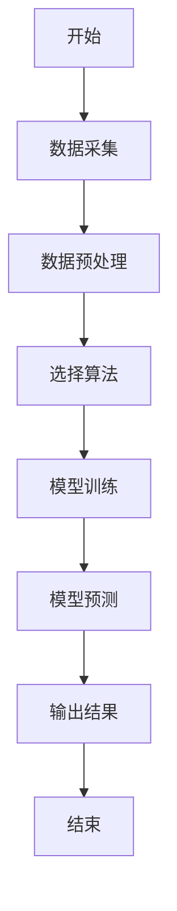
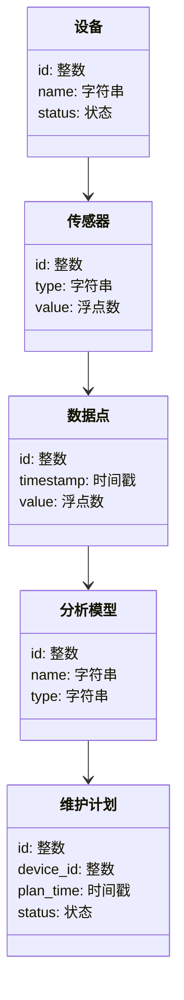
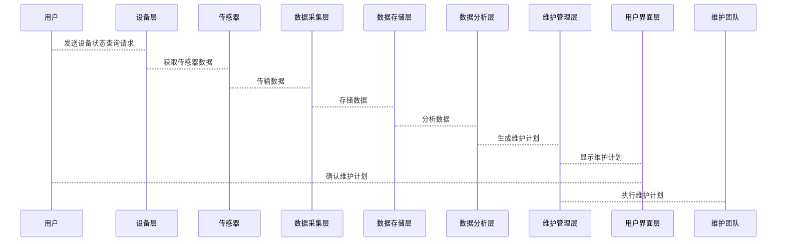

                 


# 价值投资中的智能工厂预测性维护系统分析

## 关键词：
- 智能工厂
- 预测性维护
- 价值投资
- 机器学习
- 系统架构

## 摘要：
本文探讨了智能工厂中预测性维护系统在价值投资中的应用。通过分析预测性维护的技术原理、系统架构和实际案例，展示了该系统如何优化生产效率和降低成本，从而提升企业的长期投资价值。文章结合了价值投资的基本理论与智能工厂的实际操作，为投资者和企业提供了新的视角和决策依据。

---

# 第1章: 智能工厂预测性维护系统概述

## 1.1 问题背景与描述

### 1.1.1 智能工厂的概念与特点
智能工厂是工业4.0的核心组成部分，通过物联网（IoT）、大数据和人工智能（AI）技术实现生产过程的智能化和自动化。其特点包括：
- **自动化生产**：通过机器人和自动化设备减少人工干预。
- **数据驱动**：利用传感器和数据采集系统实时监控生产过程。
- **智能化决策**：借助机器学习和数据分析优化生产计划和维护策略。

### 1.1.2 预测性维护的定义与目标
预测性维护是一种基于设备状态数据的维护策略，旨在通过预测设备故障时间来安排维护计划，避免设备突发故障。其目标包括：
- **减少停机时间**：通过提前预测故障，最大限度地减少设备停机时间。
- **降低维护成本**：通过优化维护频率和资源分配，降低维护成本。
- **延长设备寿命**：通过及时维护延长设备使用寿命。

### 1.1.3 价值投资在智能工厂中的应用场景
价值投资是一种长期投资策略，通过分析企业的基本面（如财务状况、竞争优势、管理团队等）来评估其内在价值。在智能工厂中，价值投资可以应用于：
- **企业估值**：通过分析智能工厂的生产效率和成本优化能力，评估企业的长期价值。
- **风险管理**：通过预测性维护降低设备故障风险，减少因设备故障导致的生产中断和成本增加。
- **投资决策**：基于智能工厂的数据分析，为投资者提供更准确的投资决策依据。

---

## 1.2 问题解决与边界

### 1.2.1 预测性维护解决的核心问题
传统维护策略（如定期维护和故障维护）存在以下问题：
- **成本高**：定期维护可能导致资源浪费，而故障维护则可能导致设备损坏和生产中断。
- **效率低**：无法根据设备实际状态调整维护计划，导致维护效果不佳。
预测性维护通过实时监控设备状态，利用数据分析和机器学习模型预测设备故障时间，从而解决上述问题。

### 1.2.2 系统的边界与外延
智能工厂预测性维护系统的边界包括：
- **设备数据采集**：通过传感器和IoT设备采集设备运行数据。
- **数据存储与分析**：将数据存储在数据库中，并利用大数据和机器学习技术进行分析。
- **维护决策**：基于分析结果生成维护计划，并通知维护团队执行。
系统的外延包括：
- **生产计划优化**：通过预测设备状态调整生产计划，避免因设备故障导致的生产中断。
- **供应链管理**：通过预测性维护优化供应链，减少因设备故障导致的库存积压和物流延误。

### 1.2.3 核心要素与组成结构
智能工厂预测性维护系统的组成结构包括：
- **传感器和IoT设备**：用于采集设备运行数据。
- **数据采集与传输系统（SCADA）**：用于将数据传输到中央控制系统。
- **数据分析平台**：利用机器学习和大数据技术分析数据，预测设备故障。
- **维护管理系统**：基于分析结果生成维护计划，并通知维护团队执行。

---

## 1.3 核心概念对比与ER实体关系

### 1.3.1 智能工厂与传统工厂对比分析
| 特性              | 智能工厂                | 传统工厂                |
|-------------------|-------------------------|-------------------------|
| 生产自动化        | 高                     | 低                     |
| 数据驱动          | 高                     | 低                     |
| 维护策略          | 预测性维护              | 定期维护或故障维护      |
| 生产效率          | 高                     | 低                     |

### 1.3.2 ER实体关系图（Mermaid）
```mermaid
erd
    工厂-设备(1:1)
    设备-传感器(1:N)
    传感器-数据点(N:1)
    数据点-分析模型(1:1)
    分析模型-维护计划(1:N)
```

---

# 第2章: 价值投资与智能工厂的结合

## 2.1 价值投资的基本原理

### 2.1.1 价值投资的核心理念
价值投资的核心理念是寻找被市场低估的企业，通过长期持有这些企业股票，获得超额收益。其关键在于分析企业的基本面，包括：
- **财务状况**：如收入、利润、资产负债表等。
- **竞争优势**：如市场占有率、品牌影响力等。
- **管理团队**：如管理能力、战略规划等。

### 2.1.2 股票估值的基本方法
常见的股票估值方法包括：
- **市盈率（P/E）**：市盈率=股价/每股收益。
- **市净率（P/B）**：市净率=股价/每股净资产。
- **股息率**：股息率=股息/股价。

### 2.1.3 财务指标分析与企业价值评估
通过分析企业的财务指标（如ROE、ROA等）来评估企业的盈利能力和发展潜力，从而判断其内在价值。

---

## 2.2 智能工厂在价值投资中的应用

### 2.2.1 智能工厂对企业竞争力的影响
智能工厂通过提高生产效率、降低生产成本和优化资源配置，增强企业的竞争力，从而提升企业的内在价值。

### 2.2.2 预测性维护对生产成本的优化
通过预测性维护减少设备故障和停机时间，降低维修成本和生产中断的损失，从而优化企业的生产成本。

### 2.2.3 数据驱动的决策对投资价值的影响
智能工厂通过数据驱动的决策优化生产计划和供应链管理，提高企业的运营效率和盈利能力，从而提升企业的投资价值。

---

## 2.3 价值投资与智能工厂的系统性分析

### 2.3.1 系统性投资分析框架
系统性投资分析框架包括：
- **行业分析**：分析智能工厂所处行业的市场前景和竞争格局。
- **企业分析**：分析企业的财务状况、竞争优势和管理团队。
- **技术分析**：分析智能工厂的技术创新和应用前景。

### 2.3.2 智能工厂对企业长期价值的提升
通过智能工厂的建设和应用，企业可以实现生产效率的提升和成本的优化，从而提高企业的盈利能力和市场竞争力，进而提升企业的长期价值。

### 2.3.3 预测性维护对股东价值的贡献
通过预测性维护优化设备维护计划，降低设备故障率和维护成本，从而提高企业的净利润和股东价值。

---

# 第3章: 预测性维护的核心算法

## 3.1 预测性维护的算法原理

### 3.1.1 基于时间序列的预测模型
时间序列预测模型包括ARIMA、LSTM等，用于预测设备的运行状态和故障时间。

### 3.1.2 基于回归分析的预测方法
回归分析用于分析设备运行参数与故障时间之间的关系，从而预测设备故障时间。

### 3.1.3 基于机器学习的故障预测
机器学习算法（如随机森林、支持向量机）用于分类和回归分析，预测设备的故障概率和故障时间。

---

## 3.2 算法流程图（Mermaid）


---

## 3.3 算法实现代码示例

### 3.3.1 时间序列预测代码
```python
from statsmodels.tsa.arima_model import ARIMA
import pandas as pd

# 数据加载
data = pd.read_csv('equipment_data.csv')

# 模型训练
model = ARIMA(data['value'], order=(1, 1, 1))
model_fit = model.fit()

# 预测
 forecast = model_fit.forecast(steps=5)
print(forecast)
```

### 3.3.2 回归分析代码
```python
import statsmodels.api as sm

# 数据加载
data = pd.read_csv('equipment_data.csv')

# 模型训练
X = data[['feature1', 'feature2']]
y = data['target']
X = sm.add_constant(X)
model = sm.OLS(y, X).fit()

# 预测
new_data = pd.DataFrame({'feature1': [1], 'feature2': [2]})
new_data = sm.add_constant(new_data)
forecast = model.predict(new_data)
print(forecast)
```

### 3.3.3 机器学习模型代码
```python
from sklearn.ensemble import RandomForestClassifier
import pandas as pd

# 数据加载
data = pd.read_csv('equipment_data.csv')

# 特征选择
X = data[['feature1', 'feature2']]
y = data['target']

# 模型训练
model = RandomForestClassifier(n_estimators=100)
model.fit(X, y)

# 预测
new_data = pd.DataFrame({'feature1': [1], 'feature2': [2]})
forecast = model.predict(new_data)
print(forecast)
```

---

## 3.4 数学模型与公式

### 3.4.1 时间序列模型公式
$$ ARIMA(p, d, q) $$
其中，p为自回归阶数，d为差分阶数，q为移动平均阶数。

### 3.4.2 回归分析公式
$$ y = \beta_0 + \beta_1 x_1 + \beta_2 x_2 + \epsilon $$
其中，y为因变量，x1和x2为自变量，β为回归系数，ε为误差项。

### 3.4.3 机器学习模型公式
$$ f(x) = \sum_{i=1}^{n} \alpha_i h_i(x) $$
其中，h_i(x)为基函数，α_i为系数。

---

# 第4章: 数学模型的详细讲解与举例

## 4.1 时间序列模型

### 4.1.1 ARIMA模型的数学推导
ARIMA模型通过自回归（AR）和移动平均（MA）的结合，实现对时间序列的建模和预测。

### 4.1.2 LSTM模型的应用案例
LSTM（长短期记忆网络）通过记忆单元和控制门，实现对时间序列数据的长期依赖关系的建模，适用于设备状态预测。

### 4.1.3 模型优缺点对比分析
| 模型   | 优点                     | 缺点                     |
|--------|--------------------------|--------------------------|
| ARIMA  | 简单，适合线性数据         | 不适合非线性数据           |
| LSTM   | 能够捕捉长期依赖关系       | 训练复杂，计算资源消耗大   |

---

## 4.2 回归分析模型

### 4.2.1 线性回归的数学基础
线性回归模型假设因变量与自变量之间存在线性关系，模型公式为：
$$ y = \beta_0 + \beta_1 x + \epsilon $$

### 4.2.2 逻辑回归的应用场景
逻辑回归适用于二分类问题，模型公式为：
$$ P(y=1|x) = \frac{1}{1 + e^{- (\beta_0 + \beta_1 x)}} $$

### 4.2.3 回归模型的评估指标
| 指标   | 定义                     |
|--------|--------------------------|
| R²     | 决定系数，衡量模型拟合优度 |
| RMSE   | 根均方误差，衡量预测误差 |

---

## 4.3 机器学习模型

### 4.3.1 支持向量机的核心原理
支持向量机通过构建超平面，将数据点分到不同的类别中，适用于分类和回归问题。

### 4.3.2 随机森林算法的实现细节
随机森林通过随机选择特征和样本，构建多个决策树，并通过投票或平均的方式进行预测。

### 4.3.3 神经网络模型的训练过程
神经网络模型通过多层感知机和反向传播算法，实现对复杂数据的建模和预测。

---

# 第5章: 系统分析与架构设计

## 5.1 项目背景与目标

### 5.1.1 项目背景
随着工业4.0的推进，智能工厂逐渐成为企业提升竞争力的重要手段。通过预测性维护优化设备维护计划，降低生产成本和设备故障率。

### 5.1.2 项目目标
通过构建智能工厂预测性维护系统，实现设备状态实时监控、故障预测和维护计划优化，提升企业的生产效率和投资价值。

---

## 5.2 系统功能设计

### 5.2.1 领域模型类图（Mermaid）


---

## 5.3 系统架构设计

### 5.3.1 系统架构图（Mermaid）


### 5.3.2 系统接口设计
系统接口包括：
- **设备数据接口**：用于设备与传感器之间的数据交互。
- **数据分析接口**：用于数据分析平台与数据库之间的数据交互。
- **维护管理接口**：用于维护团队与系统之间的数据交互。

### 5.3.3 系统交互流程图（Mermaid）


---

## 5.4 系统实现与案例分析

### 5.4.1 系统实现
系统实现包括设备数据采集、数据分析、维护计划生成和用户界面展示等模块。

### 5.4.2 案例分析
以某智能工厂为例，通过预测性维护系统减少设备故障率，降低维护成本，提升生产效率。

---

## 5.5 项目小结

### 5.5.1 系统优势
- **提高生产效率**：通过预测性维护减少设备故障和停机时间。
- **降低维护成本**：通过优化维护计划降低维护成本。
- **提升投资价值**：通过智能工厂的高效运营提升企业的长期价值。

### 5.5.2 注意事项
- **数据质量**：确保数据的准确性和完整性。
- **模型优化**：根据实际需求不断优化预测模型。
- **系统维护**：定期更新系统和模型，确保系统的稳定性和准确性。

---

## 5.6 拓展阅读
- **相关书籍**：《工业4.0：即将带来的生产方式变革》
- **技术博客**：[智能工厂预测性维护系统的实现与应用](https://example.com)
- **工具与资源**：Python、TensorFlow、Kafka、Elasticsearch等。

---

# 作者：AI天才研究院/AI Genius Institute & 禅与计算机程序设计艺术 /Zen And The Art of Computer Programming

