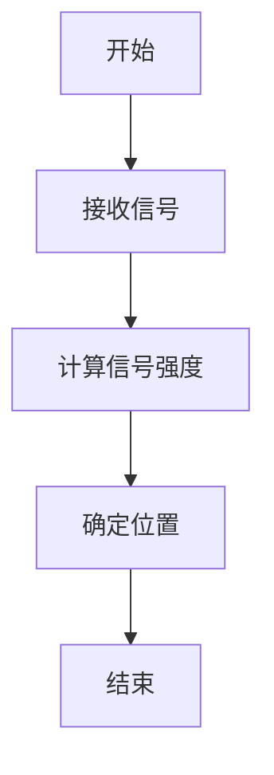
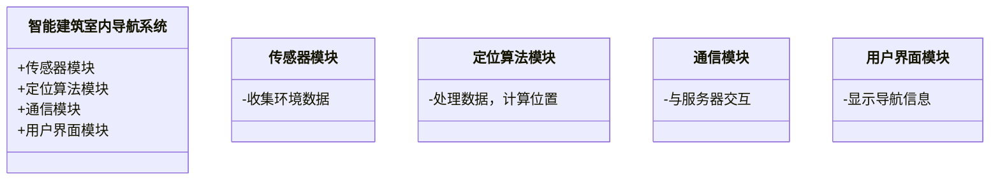
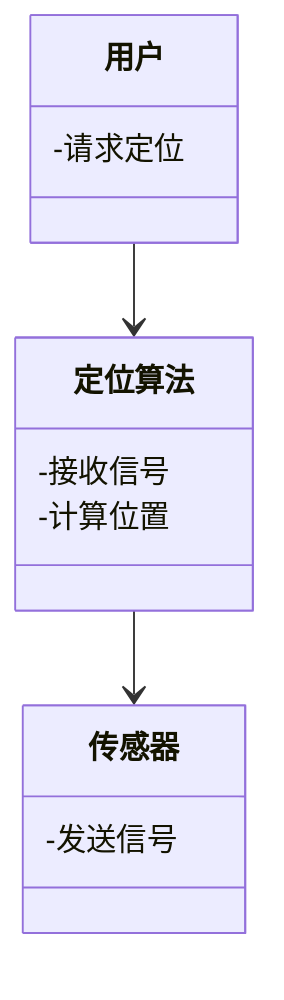
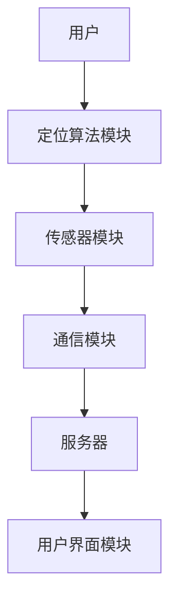
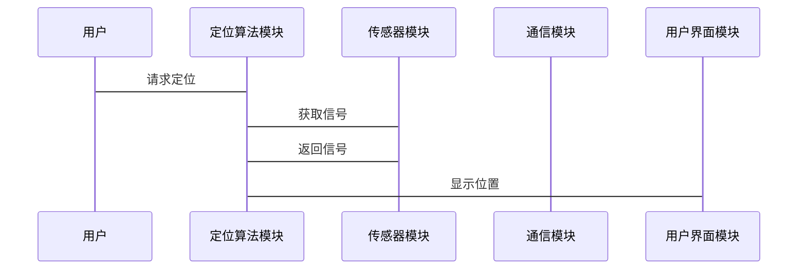

                 


# 价值投资中的智能建筑室内导航系统分析

> 关键词：智能建筑，室内导航系统，价值投资，算法优化，系统架构

> 摘要：本文深入分析智能建筑室内导航系统的技术原理、系统架构及投资价值，探讨如何通过技术创新与优化实现系统的高效运行与投资回报。通过案例分析与算法优化，揭示系统在智能建筑中的重要性及投资潜力。

---

## 第一章：背景介绍

### 1.1 智能建筑室内导航系统的概念与背景

#### 1.1.1 智能建筑的定义与特点
智能建筑是指通过智能化技术实现建筑内部设施自动化、信息共享和高效管理的建筑。其核心在于利用物联网、大数据和人工智能等技术，提升建筑的智能化水平，为用户提供更舒适、安全、高效的环境。

#### 1.1.2 室内导航系统的应用背景
随着智能建筑的普及，室内导航系统在商场、医院、机场等场所的应用日益广泛。室内导航系统通过实时定位技术，帮助用户快速找到目标位置，提升用户体验。

#### 1.1.3 价值投资在智能建筑中的意义
智能建筑室内导航系统的开发和应用不仅提升了建筑的功能性，也为其带来了巨大的投资价值。通过优化系统性能、降低成本，投资者可以在智能建筑领域获得更高的回报。

### 1.2 问题背景与问题描述

#### 1.2.1 室内导航系统的核心问题
室内导航系统的核心问题是如何在复杂的室内环境中实现高精度定位。传统GPS技术在室内环境下效果有限，因此需要依赖其他技术手段，如Wi-Fi信号、蓝牙信号等。

#### 1.2.2 价值投资中的关键挑战
在价值投资中，投资者需要考虑系统的初始投入、维护成本、用户需求以及市场竞争等因素。如何在技术与商业之间找到平衡点，是价值投资中的关键挑战。

#### 1.2.3 系统边界与外延
系统边界包括室内环境、定位技术、用户需求等；外延则涉及系统扩展性、兼容性以及与其他智能系统的集成。

### 1.3 核心概念与系统组成

#### 1.3.1 核心概念的结构与组成
智能建筑室内导航系统由定位技术、算法处理、用户界面等部分组成。各部分协同工作，实现精准定位和高效导航。

#### 1.3.2 系统组成要素的对比分析
对比分析定位技术（如Wi-Fi、蓝牙）、算法处理（如信号强度定位、三边测量）等要素，找出最优解决方案。

---

## 第二章：智能建筑室内导航系统的核心技术

### 2.1 室内定位技术原理

#### 2.1.1 常见室内定位技术对比
- **Wi-Fi定位**：基于信号强度和到达时间差。
- **蓝牙定位**：短距离、低功耗。
- **RFID定位**：适用于特定场景。
- **UWB定位**：高精度定位。

#### 2.1.2 基于信号强度的定位算法
通过接收多个信号源的强度，利用三角测量或加权平均计算位置。

#### 2.1.3 基于距离的定位方法
通过计算信号传播时间，确定设备与参考点的距离。

### 2.2 算法优化与系统性能

#### 2.2.1 算法优化策略
- **信号干扰消除**：滤除噪声，提升定位精度。
- **多路径效应处理**：优化算法，减少误差。

#### 2.2.2 系统性能提升方法
- **硬件优化**：使用高精度传感器。
- **软件优化**：改进算法，提升计算效率。

#### 2.2.3 算法流程图（使用 mermaid）



### 2.3 系统集成与实现

#### 2.3.1 系统集成方案
- **硬件集成**：安装传感器和通信设备。
- **软件集成**：开发定位算法和用户界面。

#### 2.3.2 系统实现步骤
1. 硬件部署：安装Wi-Fi、蓝牙等传感器。
2. 系统配置：设置定位参数。
3. 算法开发：实现定位算法。
4. 测试优化：验证系统性能。

#### 2.3.3 系统功能模块划分
- **定位模块**：接收信号，计算位置。
- **用户界面模块**：显示导航信息。
- **通信模块**：与服务器交互。

---

## 第三章：价值评估与投资分析

### 3.1 价值评估方法

#### 3.1.1 系统投资回报分析
- **经济效益**：提升用户体验，增加建筑价值。
- **社会效益**：提高效率，降低能耗。

#### 3.1.2 价值评估模型构建
基于定位技术的精度、系统成本、用户需求等因素，构建价值评估模型。

#### 3.1.3 评估指标对比分析
对比不同技术方案的定位精度、成本、用户满意度等指标，选择最优方案。

### 3.2 投资策略与风险管理

#### 3.2.1 投资策略的制定
- **技术驱动**：优先投资技术创新。
- **市场需求**：关注用户需求。

#### 3.2.2 风险管理方法
- **技术风险**：加强研发团队，提升技术水平。
- **市场风险**：进行市场调研，了解用户需求。

#### 3.2.3 投资案例分析
通过具体案例分析，总结投资经验，优化投资策略。

---

## 第四章：系统架构与设计方案

### 4.1 系统架构设计

#### 4.1.1 系统架构图（使用 mermaid）



### 4.2 系统功能设计

#### 4.2.1 领域模型（使用 mermaid）



### 4.3 系统架构设计

#### 4.3.1 系统架构图（使用 mermaid）



### 4.4 系统接口设计

#### 4.4.1 接口设计
- **定位算法接口**：接收传感器数据，返回位置信息。
- **用户界面接口**：接收用户输入，显示导航结果。

### 4.5 系统交互设计

#### 4.5.1 交互流程图（使用 mermaid）



---

## 第五章：项目实战与案例分析

### 5.1 项目环境安装

#### 5.1.1 硬件部署
- 在建筑内安装Wi-Fi、蓝牙等传感器。
- 配置通信模块，确保设备间通信顺畅。

#### 5.1.2 软件开发
- 开发定位算法模块，优化系统性能。
- 实现用户界面模块，提升用户体验。

### 5.2 系统核心实现

#### 5.2.1 定位算法实现
- 使用Python编写定位算法，实现信号强度定位。
- 代码示例：

```python
def calculate_position(signal_strength):
    # 简单的信号强度加权平均算法
    return (sum(signal_strength) / len(signal_strength))
```

#### 5.2.2 系统功能实现
- 实现用户请求定位功能。
- 展示定位结果在用户界面上。

### 5.3 案例分析

#### 5.3.1 案例背景
- 某商场引入智能导航系统，提升用户体验。

#### 5.3.2 实施过程
- 部署硬件和软件，测试系统性能。
- 根据用户反馈优化系统。

#### 5.3.3 优化建议
- 根据测试结果，进一步优化定位算法。
- 提升系统响应速度。

### 5.4 项目小结

---

## 第六章：总结与展望

### 6.1 总结
智能建筑室内导航系统在技术与商业上具有巨大潜力。通过技术创新和优化，可以实现系统的高效运行与投资回报。

### 6.2 展望
未来，随着技术的进步，智能建筑室内导航系统将更加智能化、便捷化。投资者应抓住机遇，提前布局，抢占市场。

### 6.3 最佳实践 Tips
- **技术选型**：选择适合的定位技术，确保系统性能。
- **成本控制**：优化系统设计，降低成本。
- **用户体验**：注重用户反馈，提升系统易用性。

---

## 作者信息

作者：AI天才研究院/AI Genius Institute & 禅与计算机程序设计艺术 /Zen And The Art of Computer Programming

