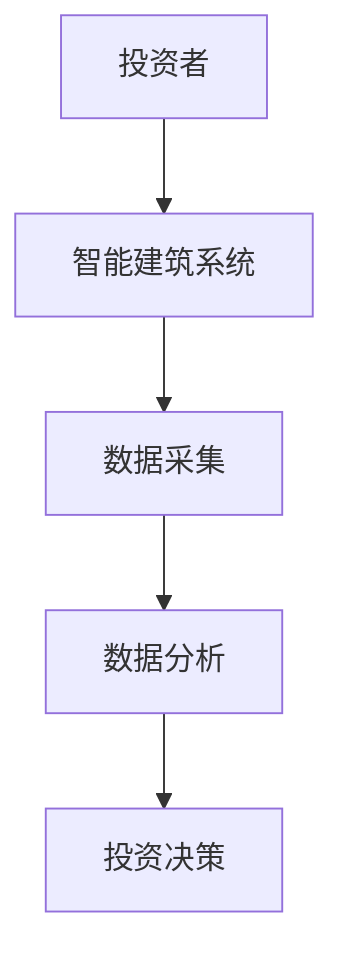
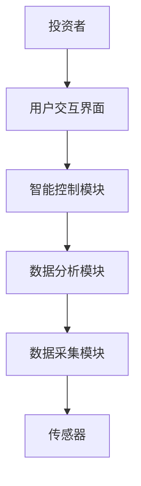

                 


# 价值投资中的智能建筑技术发展趋势

**关键词**：价值投资、智能建筑、技术趋势、物联网、大数据、人工智能

**摘要**：  
本文探讨了智能建筑技术在价值投资中的发展趋势，分析了智能建筑技术的核心要素及其对投资决策的影响。通过结合物联网、大数据和人工智能等技术，文章揭示了智能建筑技术如何改变投资策略，并为投资者提供了未来的技术趋势和投资机会。文章结构清晰，内容详实，旨在为价值投资者和技术爱好者提供深度的技术见解。

---

# 第1章: 价值投资与智能建筑技术概述

## 1.1 价值投资的基本概念

### 1.1.1 价值投资的定义与核心理念
价值投资是一种以基本面分析为基础的投资策略，强调通过深入研究企业的财务状况、行业地位和未来发展潜力，寻找被市场低估的投资标的。其核心理念是“买入并持有”，注重长期收益而非短期波动。

### 1.1.2 智能建筑技术的定义与特点
智能建筑技术是指通过物联网（IoT）、大数据、人工智能（AI）等技术，将建筑的各个系统（如 HVAC、照明、安全等）集成在一起，实现智能化管理。其特点包括实时数据采集、自动化控制、节能减排和提升用户体验。

### 1.1.3 价值投资与智能建筑技术的结合
随着智能建筑技术的普及，投资者可以通过分析智能建筑的数据，挖掘潜在的投资机会。例如，智能建筑的能耗数据可以帮助投资者评估建筑物的运营效率，进而影响其市场价值。

---

## 1.2 智能建筑技术的核心要素

### 1.2.1 物联网技术在智能建筑中的应用
物联网技术通过传感器和通信设备，实时采集建筑物的环境数据（如温度、湿度、光照等），并将其传输到中央控制系统，实现自动化管理。

### 1.2.2 大数据与人工智能在建筑管理中的作用
大数据技术用于分析智能建筑的海量数据，帮助投资者发现潜在的市场趋势和投资机会。人工智能技术则通过机器学习算法，预测建筑物的能耗、维护成本和市场价值。

### 1.2.3 智能建筑技术的未来发展
未来，智能建筑将更加注重节能减排和用户体验。通过AI和大数据技术的结合，智能建筑将实现更加智能化和个性化的管理。

---

## 1.3 价值投资中的智能建筑技术趋势

### 1.3.1 智能建筑技术对投资价值的影响
智能建筑技术可以降低建筑物的运营成本，提高其市场竞争力，从而提升其投资价值。例如，智能建筑可以通过优化能源使用，降低物业的运营成本，吸引更多租户，进而提高租金收入。

### 1.3.2 行业趋势与投资机会分析
随着全球对绿色建筑的需求增加，智能建筑技术的应用将越来越广泛。投资者可以关注智能建筑技术在节能减排、物业管理和服务创新方面的应用，寻找投资机会。

### 1.3.3 技术进步对投资策略的改变
智能建筑技术的进步使得投资者能够更精准地评估建筑物的价值。例如，通过分析智能建筑的数据，投资者可以更准确地预测建筑物的未来收益，从而制定更科学的投资策略。

---

## 1.4 本章小结
本章介绍了价值投资的基本概念和智能建筑技术的核心要素，分析了智能建筑技术对投资价值的影响，并探讨了行业趋势和投资机会。通过智能建筑技术的应用，投资者可以更高效地进行投资决策，抓住市场机遇。

---

# 第2章: 智能建筑技术的核心概念与联系

## 2.1 智能建筑技术的核心原理

### 2.1.1 物联网在智能建筑中的应用
物联网技术通过传感器和通信设备，实时采集建筑物的环境数据，并将其传输到中央控制系统，实现自动化管理。例如，智能 HVAC 系统可以根据室内温度和室外天气自动调节空调运行状态。

### 2.1.2 大数据与人工智能的结合
大数据技术用于分析智能建筑的海量数据，帮助投资者发现潜在的市场趋势和投资机会。人工智能技术则通过机器学习算法，预测建筑物的能耗、维护成本和市场价值。例如，通过分析历史能耗数据，AI 算法可以预测未来某段时间内的能源消耗情况，从而优化能源管理。

### 2.1.3 智能建筑技术的系统架构
智能建筑技术的系统架构包括数据采集层、数据处理层和应用层。数据采集层通过传感器和物联网设备收集数据；数据处理层通过大数据和 AI 技术对数据进行分析；应用层则根据分析结果提供智能化的管理和服务。

---

## 2.2 核心概念对比分析

### 2.2.1 物联网与传统建筑管理的对比
| 特性         | 物联网技术                | 传统建筑管理              |
|--------------|--------------------------|---------------------------|
| 数据采集     | 实时、自动化              | 手动、周期性              |
| 管理效率     | 高效、精准                | 低效、依赖人工            |
| 成本         | 较低                      | 较高                      |

### 2.2.2 大数据与传统数据分析的对比
| 特性         | 大数据                    | 传统数据分析              |
|--------------|--------------------------|---------------------------|
| 数据量       | 大量                      | 较小                      |
| 数据类型     | 结构化与非结构化          | 主要为结构化数据          |
| 分析方法     | 机器学习、深度学习        | 统计分析、简单模型        |

### 2.2.3 人工智能在智能建筑中的应用
人工智能在智能建筑中的应用包括预测建筑物的能耗、优化能源管理、预测设备故障等。例如，通过分析历史能耗数据，AI 算法可以预测未来某段时间内的能源消耗情况，从而优化能源管理。

---

## 2.3 实体关系图与流程图

### 2.3.1 智能建筑技术的实体关系图


---

## 2.4 本章小结
本章详细分析了智能建筑技术的核心原理，对比了物联网、大数据和人工智能与传统技术的差异，并通过实体关系图和流程图，展示了智能建筑技术的系统架构和工作流程。

---

# 第3章: 价值投资中的智能建筑技术趋势分析

## 3.1 技术趋势分析

### 3.1.1 物联网技术的未来发展
物联网技术将在智能建筑中更加普及，应用场景将更加多样化。例如，未来的智能建筑将实现更加精细化的能源管理，通过物联网技术实时监控和优化能源使用。

### 3.1.2 大数据与人工智能的融合趋势
随着技术的进步，大数据和人工智能将在智能建筑中实现更深层次的融合。例如，通过深度学习算法，智能建筑系统可以更准确地预测建筑物的能耗和维护成本，从而优化投资决策。

### 3.1.3 智能建筑技术的创新方向
未来的智能建筑技术将更加注重节能减排和用户体验。例如，智能建筑将实现更加智能化的物业管理，通过 AI 技术提供个性化的服务。

---

## 3.2 市场分析与投资机会

### 3.2.1 智能建筑市场的现状与未来预测
当前，智能建筑市场增长迅速，主要驱动力来自于对绿色建筑和节能减排的需求。未来，随着技术的进步和市场的成熟，智能建筑市场将进一步扩大。

### 3.2.2 投资者如何抓住技术趋势
投资者可以通过关注智能建筑技术的创新和应用，寻找投资机会。例如，投资于智能建筑技术的开发商或服务提供商，可以分享技术进步带来的收益。

### 3.2.3 行业竞争格局分析
目前，智能建筑市场竞争较为激烈，主要参与者包括科技公司、建筑企业和服务提供商。未来，竞争将更加激烈，技术将成为核心竞争力。

---

## 3.3 技术进步对投资策略的影响

### 3.3.1 数据驱动的投资决策
通过分析智能建筑的数据，投资者可以更准确地评估建筑物的价值。例如，通过分析能耗数据，投资者可以评估建筑物的运营效率，从而判断其市场价值。

### 3.3.2 技术创新对投资回报的影响
技术创新可以降低建筑物的运营成本，提高其市场价值，从而增加投资回报。例如，智能建筑技术可以降低能源消耗，从而减少运营成本。

### 3.3.3 风险评估与技术应用的关系
通过技术应用，投资者可以更准确地评估投资风险。例如，通过分析历史数据，投资者可以预测建筑物的未来能耗和维护成本，从而评估投资风险。

---

## 3.4 本章小结
本章分析了智能建筑技术的未来发展趋势，探讨了市场分析与投资机会，并讨论了技术进步对投资策略的影响。通过抓住技术趋势，投资者可以在智能建筑领域获得更好的回报。

---

# 第4章: 智能建筑技术的算法原理与数学模型

## 4.1 数据采集与处理算法

### 4.1.1 物联网数据采集算法
物联网数据采集算法包括传感器数据的采集、传输和存储。例如，智能建筑中的温度传感器会定期采集室内温度数据，并通过无线通信设备传输到中央控制系统。

### 4.1.2 数据清洗与预处理方法
数据清洗和预处理是数据处理的重要步骤。例如，通过去除异常值和填补缺失值，可以提高数据分析的准确性。

### 4.1.3 数据存储与管理技术
智能建筑数据的存储与管理需要考虑数据的海量性和实时性。例如，可以使用分布式数据库和云存储技术，实现数据的高效存储和管理。

---

## 4.2 数据分析与建模

### 4.2.1 机器学习算法在智能建筑中的应用
机器学习算法可以用于智能建筑的数据分析。例如，通过训练回归模型，可以预测建筑物的未来能耗。

### 4.2.2 时间序列分析模型
时间序列分析模型可以用于分析建筑物的历史数据，预测未来的能耗和设备故障。例如，ARIMA 模型是一种常用的时间序列分析方法。

### 4.2.3 神经网络在智能建筑预测中的应用
神经网络可以通过深度学习算法，分析智能建筑的复杂数据，实现更精准的预测。例如，卷积神经网络（CNN）可以用于图像识别，帮助智能建筑系统检测设备故障。

---

## 4.3 数学模型与公式

### 4.3.1 线性回归模型
线性回归模型是一种常用的机器学习算法，可以用于预测建筑物的能耗。其数学公式为：
$$ y = \beta_0 + \beta_1x + \eps $$

其中，$y$ 是目标变量（如能耗），$x$ 是自变量（如温度），$\beta_0$ 和 $\beta_1$ 是回归系数，$\eps$ 是误差项。

### 4.3.2 时间序列分析模型
时间序列分析模型可以通过 ARIMA 模型实现，其数学公式为：
$$ y_t = \phi_1 y_{t-1} + \phi_2 y_{t-2} + \theta_1 \epsilon_{t-1} + \epsilon_t $$

其中，$y_t$ 是目标变量（如能耗），$\phi_1$ 和 $\phi_2$ 是自回归系数，$\theta_1$ 是移动平均系数，$\epsilon_t$ 是误差项。

---

## 4.4 本章小结
本章详细讲解了智能建筑技术的算法原理和数学模型，包括数据采集与处理算法、机器学习算法和时间序列分析模型。通过这些算法，投资者可以更准确地分析智能建筑数据，制定更科学的投资策略。

---

# 第5章: 智能建筑系统的架构设计与实现

## 5.1 系统架构设计

### 5.1.1 系统功能设计
智能建筑系统的功能设计包括数据采集、数据分析、智能控制和用户交互。例如，系统可以通过传感器采集数据，通过数据分析模块预测能耗，通过智能控制模块优化能源使用，最后通过用户交互界面向投资者提供决策支持。

### 5.1.2 系统架构图


---

## 5.2 系统实现与代码

### 5.2.1 环境安装
为了实现智能建筑系统，需要安装以下环境：
- 操作系统：Linux 或 Windows
- 开发工具：Python、Jupyter Notebook
- 数据库：MySQL 或 MongoDB
- 传感器：支持 IoT 的传感器设备

### 5.2.2 系统核心代码实现
以下是智能建筑系统的核心代码示例：
```python
import pandas as pd
import numpy as np
from sklearn.linear_model import LinearRegression

# 数据采集与预处理
data = pd.read_csv('building_data.csv')
data.dropna(inplace=True)

# 训练线性回归模型
model = LinearRegression()
model.fit(data[['temperature', 'humidity']], data['energy'])

# 预测未来能耗
future_data = pd.DataFrame({'temperature': [25], 'humidity': [50]})
predicted_energy = model.predict(future_data)
print(predicted_energy)
```

### 5.2.3 代码应用解读
上述代码实现了基于线性回归模型的能耗预测。通过分析温度和湿度数据，模型可以预测未来的能源消耗情况，帮助投资者制定更科学的投资策略。

---

## 5.3 本章小结
本章详细讲解了智能建筑系统的架构设计与实现，包括系统功能设计、架构图和核心代码实现。通过实际案例分析，展示了如何通过技术手段实现智能建筑管理，为投资者提供决策支持。

---

# 第6章: 价值投资中的智能建筑技术总结与展望

## 6.1 总结
智能建筑技术的应用为价值投资者提供了新的机会。通过分析智能建筑的数据，投资者可以更准确地评估建筑物的价值，制定更科学的投资策略。

## 6.2 展望
未来，智能建筑技术将进一步融合物联网、大数据和人工智能技术，实现更加智能化和个性化的管理。投资者可以关注智能建筑技术的创新和应用，抓住市场机遇。

## 6.3 本章小结
本章总结了智能建筑技术的应用价值，并展望了其未来发展趋势。通过抓住技术趋势，投资者可以在智能建筑领域获得更好的回报。

---

# 作者：AI天才研究院/AI Genius Institute & 禅与计算机程序设计艺术 /Zen And The Art of Computer Programming

---

以上是《价值投资中的智能建筑技术发展趋势》的完整目录和部分正文内容。如果需要进一步扩展或补充，请随时告知。

