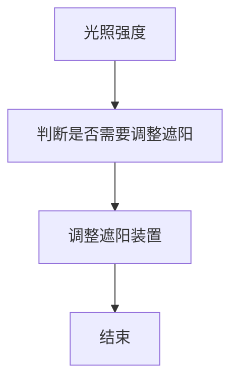
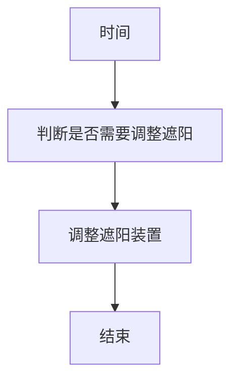

                 


# 价值投资中的智能建筑自适应遮阳系统分析

> 关键词：智能建筑，自适应遮阳系统，价值投资，建筑自动化，智能控制技术

> 摘要：本文系统地分析了智能建筑自适应遮阳系统在价值投资中的应用。通过介绍智能建筑的基本概念、自适应遮阳系统的原理及其在价值投资中的重要性，详细探讨了智能遮阳系统的经济效益、环境效益和社会效益。结合实际案例，分析了自适应遮阳系统的系统架构设计、智能算法实现、项目实战以及最佳实践，为读者提供全面的技术和投资视角。

---

## 第一部分：价值投资中的智能建筑自适应遮阳系统背景介绍

### 第1章：智能建筑与自适应遮阳系统概述

#### 1.1 智能建筑的基本概念
智能建筑是指通过智能化技术实现建筑设备自动化、通信网络化、信息管理化和控制智能化的建筑。其核心特征包括能源效率高、环境友好、智能化管理以及用户体验优化。

#### 1.2 自适应遮阳系统的核心概念
自适应遮阳系统是一种可以根据环境条件（如光照强度、温度、时间等）自动调整遮阳装置（如窗帘、遮阳板）的智能系统。其关键在于实时感知环境变化并做出相应调整，以优化建筑的能源使用和舒适性。

#### 1.3 价值投资的基本概念
价值投资是一种投资策略，强调以低于内在价值的价格买入优质资产。在建筑领域，价值投资关注于通过长期优化资产性能和降低运营成本来实现投资回报的最大化。

---

## 第2章：智能建筑自适应遮阳系统的价值分析

### 2.1 自适应遮阳系统的经济效益
通过减少能源消耗、提高建筑使用效率和延长建筑寿命，自适应遮阳系统可以显著降低运营成本，从而提升建筑的经济价值。

### 2.2 自适应遮阳系统的环境效益
自适应遮阳系统通过优化能源使用，减少碳排放，提升建筑的生态可持续性，为环境保护做出贡献。

### 2.3 自适应遮阳系统的社会效益
提升居住舒适度、促进绿色建筑发展和增强建筑安全性是自适应遮阳系统带来的社会效益。

---

## 第二部分：智能建筑自适应遮阳系统的技术原理

### 第3章：自适应遮阳系统的智能控制技术

#### 3.1 传感器技术
- 光线传感器：用于检测光照强度。
- 温度传感器：用于测量环境温度。
- 环境传感器：包括湿度和空气质量传感器。

#### 3.2 执行机构
- 电机驱动机构：通过电机驱动遮阳装置的开合。
- 齿轮传动机构：用于将电机的旋转运动转换为遮阳装置的线性运动。

#### 3.3 智能算法
- 光照强度算法：根据光照强度调整遮阳装置的开合程度。
- 时间控制算法：根据时间自动调整遮阳装置的状态。

---

## 第4章：自适应遮阳系统的核心算法实现

### 4.1 光照强度算法


### 4.2 时间控制算法


### 4.3 Python实现
```python
import time

def adjust_shade(intensity, time):
    if intensity > 50 or time in [8, 17]:
        return True
    else:
        return False

# 模拟遮阳系统运行
while True:
    current_time = time.strftime("%H")
    current_light = get_light_intensity()
    if adjust_shade(current_light, current_time):
        move_shade()
    time.sleep(60)
```

---

## 第三部分：智能建筑自适应遮阳系统的系统架构与设计

### 第5章：系统架构设计

#### 5.1 功能模块
- 传感器模块：负责采集环境数据。
- 控制模块：根据传感器数据调整遮阳装置。
- 用户界面模块：供用户查看和控制遮阳系统。

#### 5.2 数据流设计
```mermaid
graph LR
    Sensor -> Control: 光照强度
    Control -> Shade: 调整指令
    Control -> UI: 状态反馈
```

#### 5.3 系统架构图
```mermaid
graph LR
    Control((控制模块)) -> Sensor((传感器模块))
    Control -> Shade((遮阳装置))
    Control -> UI((用户界面))
```

---

## 第6章：项目实战与优化

### 6.1 环境搭建
- 安装必要的硬件：光线传感器、电机驱动模块。
- 安装软件：Python开发环境、相关库。

### 6.2 系统实现
```python
import RPi.GPIO as GPIO
import time

# 设置GPIO模式
GPIO.setmode(GPIO.BCM)

# 定义电机控制引脚
motor_pin = 18

# 初始化电机
GPIO.setup(motor_pin, GPIO.OUT)
GPIO.output(motor_pin, False)

def move_shade():
    # 模拟电机控制
    print("调整遮阳装置...")
    time.sleep(2)
    print("调整完成。")
```

---

## 第四部分：最佳实践与小结

### 第7章：最佳实践与总结

#### 7.1 小结
本文详细分析了智能建筑自适应遮阳系统的原理、价值分析、系统架构设计和项目实战，为读者提供了全面的技术和投资视角。

#### 7.2 注意事项
- 确保硬件和软件的兼容性。
- 定期维护和更新系统。
- 考虑数据安全和隐私保护。

#### 7.3 拓展阅读
建议读者深入研究智能建筑的其他领域，如能源管理系统和智能家居技术。

---

作者：AI天才研究院 & 禅与计算机程序设计艺术

