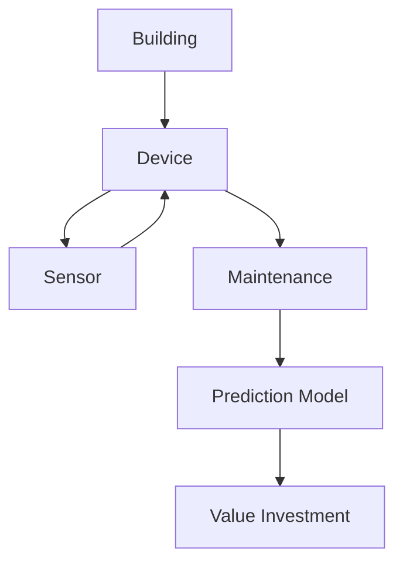
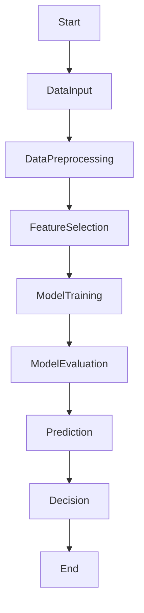
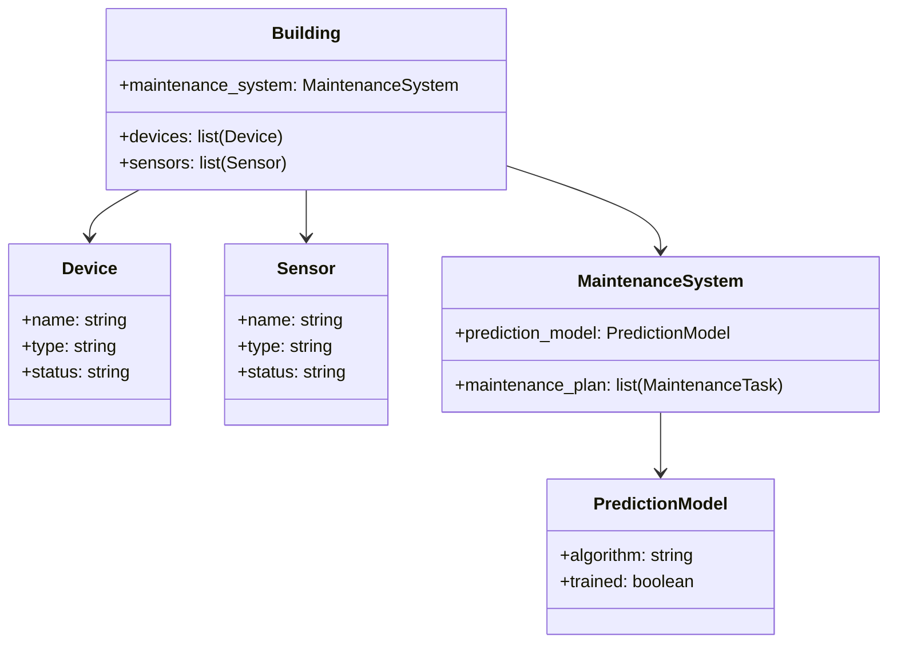
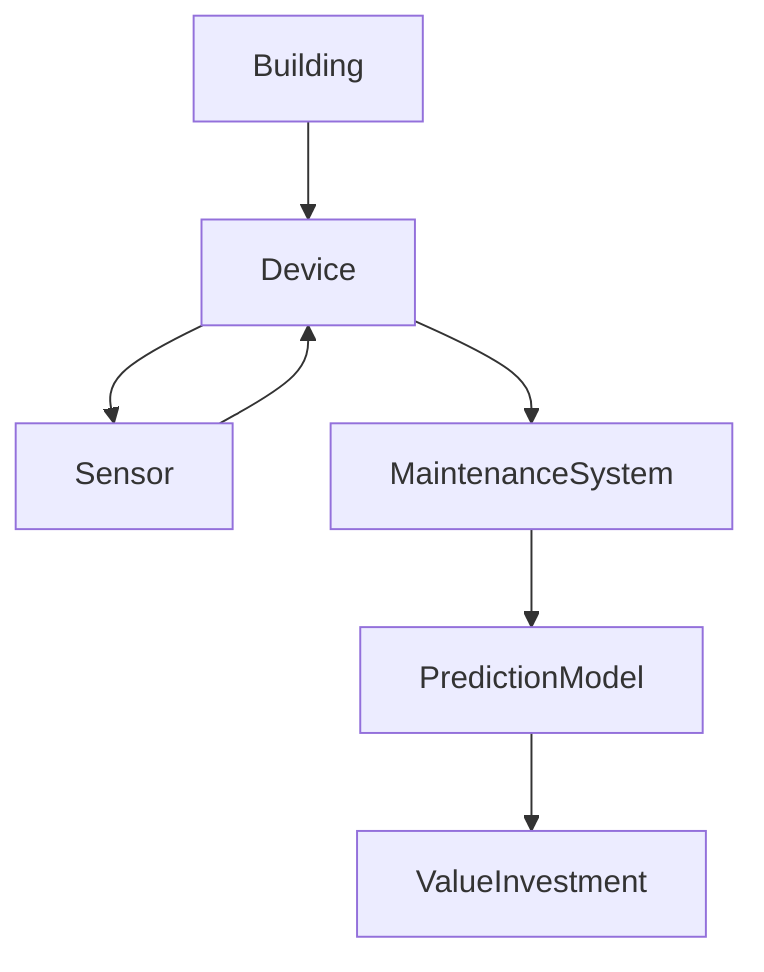
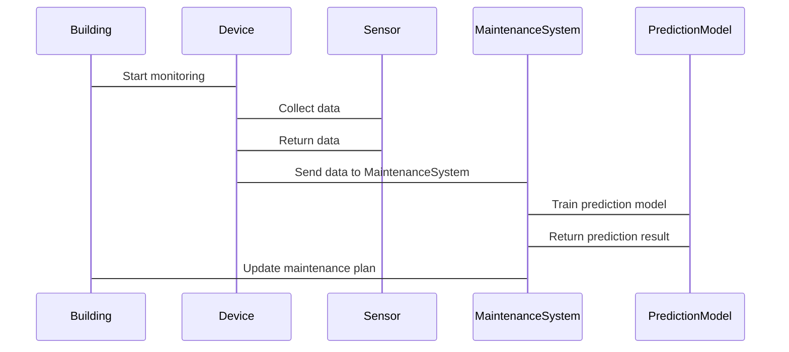

                 


# 价值投资中的智能建筑预测性维护系统分析

> 关键词：智能建筑，预测性维护，价值投资，机器学习，系统架构

> 摘要：本文分析了智能建筑预测性维护系统在价值投资中的应用，通过系统的架构设计、算法原理和项目实战，展示了如何利用智能技术优化建筑维护策略，提升资产价值。文章详细探讨了预测性维护的核心算法、系统架构设计以及实际案例，为投资者提供了技术与投资结合的深度分析。

---

# 第一部分: 价值投资中的智能建筑预测性维护系统概述

# 第1章: 背景介绍

## 1.1 智能建筑预测性维护系统背景

### 1.1.1 智能建筑的定义与特点
智能建筑是指通过智能化技术实现建筑设备自动化、通信网络化、信息管理化和控制智能化的建筑。其特点包括：
- **自动化**: 系统能够自动监测和控制建筑设备。
- **数据驱动**: 利用传感器和数据采集技术实时获取建筑状态数据。
- **智能化**: 通过人工智能和大数据分析优化建筑运行和维护。

### 1.1.2 预测性维护的概念与意义
预测性维护是一种基于实时数据和历史数据分析，预测设备可能出现故障并提前进行维护的策略。其意义在于：
- **降低维护成本**: 通过预测故障，减少突发故障导致的高额维修费用。
- **延长设备寿命**: 及时维护可以延长设备使用寿命。
- **提升资产价值**: 通过优化维护策略，提升建筑资产的市场价值。

### 1.1.3 价值投资与智能建筑的结合
价值投资关注的是资产的长期价值和潜在收益。智能建筑通过预测性维护优化资产运营效率，降低维护成本，从而提升资产价值。这种结合为投资者提供了新的价值增长点。

## 1.2 问题背景与问题描述

### 1.2.1 建筑维护中的传统问题
传统建筑维护存在以下问题：
- **被动维护**: 等设备出现故障后才进行维护，可能导致更大的损失。
- **维护成本高**: 由于缺乏数据支持，维护策略不够优化，成本居高不下。
- **维护周期长**: 传统维护方式效率低，周期较长。

### 1.2.2 预测性维护的必要性
预测性维护能够解决传统维护的痛点：
- **提前预防**: 通过数据分析预测设备故障，提前安排维护。
- **降低维护成本**: 优化维护策略，减少不必要的维护操作。
- **提升设备利用率**: 通过精准维护延长设备寿命，提升设备利用率。

### 1.2.3 价值投资视角下的优化目标
从价值投资的角度，智能建筑预测性维护系统的优化目标是：
- **提高资产回报率**: 通过优化维护策略，降低维护成本，提升资产收益。
- **提升资产流动性**: 优化的维护策略能够提升建筑资产的市场价值，使其更易于交易。
- **延长资产生命周期**: 预测性维护能够延长建筑设备的使用寿命，从而提升资产的整体价值。

## 1.3 问题解决与边界分析

### 1.3.1 预测性维护的核心问题解决
预测性维护的核心问题在于如何利用数据科学的方法，从海量建筑设备数据中提取有用的特征，建立有效的预测模型，从而实现设备故障的早期预警。

### 1.3.2 系统边界与外延
智能建筑预测性维护系统的边界包括：
- **数据采集层**: 传感器、设备数据采集模块。
- **数据处理层**: 数据清洗、特征提取、数据存储。
- **预测模型层**: 机器学习算法、预测模型训练。
- **决策层**: 维护策略制定、维护计划安排。

系统外延包括与建筑管理系统（BMS）的集成，以及与投资决策系统的数据对接。

### 1.3.3 核心要素与组成结构
系统的核心要素包括：
- **传感器网络**: 实时采集建筑设备数据。
- **数据处理平台**: 数据清洗、特征提取、数据建模。
- **预测模型**: 机器学习算法，如XGBoost、LSTM等。
- **维护决策系统**: 根据预测结果制定维护计划。

---

# 第2章: 核心概念与联系

## 2.1 核心概念原理

### 2.1.1 智能建筑的核心技术
智能建筑的核心技术包括：
- **物联网技术**: 实现建筑设备的互联和数据采集。
- **大数据分析**: 对建筑数据进行深度挖掘，提供决策支持。
- **人工智能**: 利用机器学习算法优化维护策略。

### 2.1.2 预测性维护的算法原理
预测性维护的核心算法包括：
- **回归分析**: 预测设备剩余寿命。
- **分类算法**: 判断设备是否处于故障状态。
- **时间序列分析**: 预测设备未来的运行状态。

### 2.1.3 价值投资的评估模型
价值投资的评估模型包括：
- **净现值法**: 评估投资项目的未来现金流。
- **内部收益率法**: 评估项目的收益能力。
- **资产价值评估模型**: 综合考虑维护成本和设备寿命，评估资产的市场价值。

## 2.2 概念属性特征对比

| 概念       | 特性               | 描述                                         |
|------------|--------------------|----------------------------------------------|
| 智能建筑    | 自动化             | 设备自动化控制                               |
|            | 数据驱动           | 依赖传感器和数据采集技术                     |
|            | 智能化             | 利用AI优化建筑运行                           |
| 预测性维护  | 数据依赖           | 依赖历史数据和实时数据                     |
|            | 预测准确性         | 预测模型的准确性是关键                       |
|            | 维护成本降低       | 通过预测减少维护成本                       |
| 价值投资    | 资产回报率         | 优化维护策略，提高资产回报率               |
|            | 资产流动性         | 提升资产价值，增强流动性                   |
|            | 投资风险降低       | 通过数据支持降低投资风险                   |

### 2.2.1 智能建筑与传统建筑的对比
智能建筑与传统建筑的对比：
- **数据采集**: 智能建筑通过传感器实时采集数据，传统建筑依赖人工检查。
- **维护方式**: 智能建筑采用预测性维护，传统建筑采用被动维护。
- **效率**: 智能建筑维护效率高，传统建筑维护效率低。

### 2.2.2 预测性维护与被动维护的对比
预测性维护与被动维护的对比：
- **维护时机**: 预测性维护是预防性维护，被动维护是事后维护。
- **成本**: 预测性维护成本低，被动维护成本高。
- **效果**: 预测性维护能够延长设备寿命，被动维护无法做到。

### 2.2.3 价值投资与传统投资的对比
价值投资与传统投资的对比：
- **决策依据**: 价值投资基于数据和基本面分析，传统投资基于市场情绪。
- **风险控制**: 价值投资注重风险控制，传统投资风险较高。
- **收益**: 价值投资长期收益稳定，传统投资收益波动较大。

## 2.3 ER实体关系图架构



---

# 第3章: 算法原理讲解

## 3.1 预测性维护算法流程



## 3.2 算法实现代

---

**3.2.1 数据预处理**
数据预处理是预测性维护的重要步骤，包括数据清洗和特征提取。

```python
import pandas as pd
import numpy as np

# 数据加载
data = pd.read_csv('building_data.csv')

# 数据清洗
data = data.dropna()
data = data.drop_duplicates()

# 特征提取
features = data[['temperature', 'vibration', 'pressure']]
label = data['fault_status']
```

**3.2.2 特征选择**
特征选择是为了提高模型的准确性，减少冗余特征。

```python
from sklearn.feature_selection import SelectKBest
from sklearn.feature_selection import chi2

selector = SelectKBest(score_func=chi2, k=3)
selector.fit(features, label)
selected_features = selector.transform(features)
```

**3.2.3 模型训练**
使用机器学习算法训练预测模型，这里选择随机森林模型。

```python
from sklearn.ensemble import RandomForestClassifier

model = RandomForestClassifier(n_estimators=100, max_depth=2, random_state=0)
model.fit(selected_features, label)
```

**3.2.4 模型评估**
评估模型的准确性和召回率。

```python
from sklearn.metrics import accuracy_score, recall_score

y_pred = model.predict(selected_features)
accuracy = accuracy_score(label, y_pred)
recall = recall_score(label, y_pred)

print(f'Accuracy: {accuracy}')
print(f'Recall: {recall}')
```

**3.2.5 预测与决策**
根据模型预测结果制定维护决策。

```python
threshold = 0.8
proba = model.predict_proba(selected_features)[:, 1]
maintenance_decision = proba > threshold
```

---

## 3.3 数学模型与公式

### 3.3.1 回归分析模型
回归分析模型用于预测设备的剩余寿命：

$$
y = \beta_0 + \beta_1 x_1 + \beta_2 x_2 + \ldots + \beta_n x_n + \epsilon
$$

其中，$y$ 是预测目标，$x_i$ 是特征变量，$\beta_i$ 是系数，$\epsilon$ 是误差项。

### 3.3.2 时间序列分析模型
时间序列分析模型用于预测设备的运行状态：

$$
R_t = \alpha R_{t-1} + \beta R_{t-2} + \ldots + \gamma R_{t-n}
$$

其中，$R_t$ 是当前状态，$R_{t-i}$ 是过去的状态，$\alpha, \beta, \gamma$ 是系数。

### 3.3.3 分类模型
分类模型用于判断设备是否处于故障状态：

$$
P(y=1|x) = \frac{e^{\beta x}}{1 + e^{\beta x}}
$$

其中，$P(y=1|x)$ 是设备处于故障状态的概率，$\beta$ 是系数，$x$ 是特征变量。

---

# 第4章: 系统分析与架构设计方案

## 4.1 问题场景介绍

### 4.1.1 项目介绍
本项目旨在设计一个智能建筑预测性维护系统，通过实时数据采集和机器学习算法，实现设备故障的早期预警和维护决策的优化。

### 4.1.2 系统功能设计
系统功能包括：
- **数据采集**: 采集建筑设备的实时数据。
- **数据处理**: 对数据进行清洗和特征提取。
- **模型训练**: 训练预测模型并进行评估。
- **维护决策**: 根据模型预测结果制定维护计划。

## 4.2 系统架构设计

### 4.2.1 领域模型类图



### 4.2.2 系统架构图



### 4.2.3 系统接口设计
系统接口包括：
- **数据接口**: 传感器数据采集接口。
- **模型接口**: 预测模型调用接口。
- **决策接口**: 维护决策系统接口。

### 4.2.4 系统交互序列图



---

# 第5章: 项目实战

## 5.1 环境安装

### 5.1.1 系统环境
- 操作系统：Linux/Windows/MacOS
- 开发工具：Python 3.8+
- 数据库：MySQL/PostgreSQL
- 机器学习库：Scikit-learn/XGBoost
- 可视化工具：Matplotlib/Seaborn

### 5.1.2 安装依赖
```bash
pip install pandas numpy scikit-learn mermaid4jupyter jupyterlab
```

## 5.2 系统核心实现

### 5.2.1 数据采集模块

```python
import pandas as pd
import numpy as np
import requests

def collect_data(api_url):
    try:
        response = requests.get(api_url)
        data = response.json()
        return pd.DataFrame(data)
    except Exception as e:
        print(f'Error collecting data: {e}')
        return None
```

### 5.2.2 数据处理模块

```python
from sklearn.impute import SimpleImputer
from sklearn.preprocessing import StandardScaler

def preprocess_data(data):
    # 填补缺失值
    imputer = SimpleImputer(strategy='mean')
    data_imputed = imputer.fit_transform(data)
    
    # 标准化数据
    scaler = StandardScaler()
    data_scaled = scaler.fit_transform(data_imputed)
    
    return data_scaled
```

### 5.2.3 模型训练模块

```python
from sklearn.ensemble import RandomForestClassifier
from sklearn.metrics import accuracy_score

def train_model(X_train, y_train):
    model = RandomForestClassifier(n_estimators=100, max_depth=2, random_state=0)
    model.fit(X_train, y_train)
    return model

def evaluate_model(model, X_test, y_test):
    y_pred = model.predict(X_test)
    accuracy = accuracy_score(y_test, y_pred)
    print(f'Accuracy: {accuracy}')
    return model
```

### 5.2.4 维护决策模块

```python
def maintenance_decision(model, threshold=0.8):
    proba = model.predict_proba(X_test)[:, 1]
    decision = proba > threshold
    return decision
```

## 5.3 代码应用解读与分析

### 5.3.1 数据采集模块解读
数据采集模块通过API接口获取建筑设备的实时数据，包括温度、振动、压力等参数。

### 5.3.2 数据处理模块解读
数据处理模块包括数据清洗和特征提取，使用SimpleImputer填补缺失值，使用StandardScaler标准化数据。

### 5.3.3 模型训练模块解读
模型训练模块使用随机森林分类器训练预测模型，并评估模型的准确率。

### 5.3.4 维护决策模块解读
维护决策模块根据模型预测结果制定维护计划，当预测概率超过阈值时，触发维护操作。

## 5.4 实际案例分析

### 5.4.1 案例背景
某商业大厦的电梯设备，通过预测性维护系统实现故障预警，降低维护成本。

### 5.4.2 数据分析
通过数据分析发现，电梯故障的主要原因是振动异常和温度过高。

### 5.4.3 维护决策
根据模型预测结果，提前安排电梯维护，避免设备故障。

## 5.5 项目小结
本项目通过智能建筑预测性维护系统，实现了设备故障的早期预警，降低了维护成本，提升了资产价值。

---

# 第6章: 总结与最佳实践

## 6.1 小结
智能建筑预测性维护系统通过数据科学和人工智能技术，优化建筑设备的维护策略，降低维护成本，提升资产价值。价值投资视角下的智能建筑预测性维护系统，为投资者提供了新的价值增长点。

## 6.2 注意事项
- **数据质量**: 数据的准确性和完整性是预测模型的关键。
- **模型优化**: 需要不断优化模型，提升预测准确性。
- **系统集成**: 需要与建筑管理系统（BMS）和其他投资决策系统进行集成。

## 6.3 拓展阅读
- **《机器学习实战》**: 学习机器学习算法的实现和应用。
- **《智能建筑技术与应用》**: 了解智能建筑的核心技术和应用案例。
- **《价值投资的制胜法则》**: 学习价值投资的理论和实践。

---

# 作者信息

作者：AI天才研究院/AI Genius Institute & 禅与计算机程序设计艺术/Zen And The Art of Computer Programming

