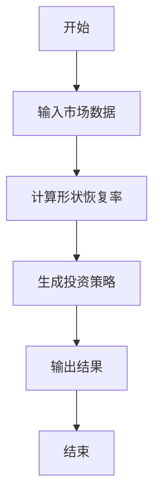
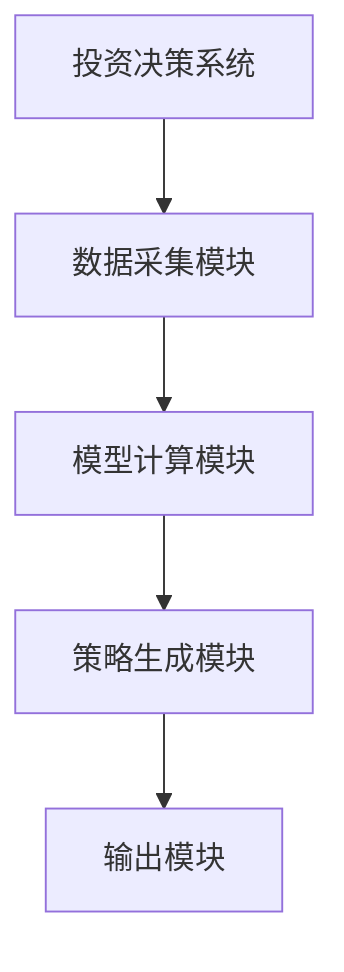
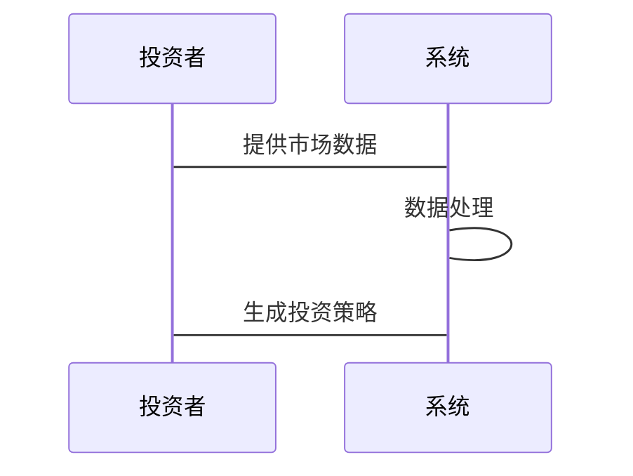

                 


# 价值投资中的智能材料形状记忆技术分析

**关键词**：形状记忆技术、价值投资、智能材料、投资策略、数学模型

**摘要**：  
本文探讨了形状记忆技术在价值投资中的潜在应用，分析了其科学原理、算法模型、系统架构以及实际案例。通过对比传统投资技术，揭示形状记忆技术的独特优势，并提供详细的项目实战和最佳实践建议。

---

## 第一部分: 价值投资中的智能材料形状记忆技术背景介绍

### 第1章: 形状记忆技术的基本概念

#### 1.1 形状记忆材料的定义与特性
- **形状记忆材料的定义**：形状记忆材料是一种智能材料，能够在外力作用下改变形状，并在特定条件下恢复原状。
- **形状记忆材料的核心特性**：
  - 高弹性：能够多次变形而不损坏。
  - 形状记忆：在外力撤去后恢复原状。
  - 可编程性：通过训练可以定制形状记忆行为。

| **材料属性** | **形状记忆材料** | **传统材料** |
|--------------|-------------------|---------------|
| 弹性          | 高               | 一般           |
| 耐久性        | 高               | 较低           |
| 可塑性        | 中               | 高             |

- **形状记忆材料的分类与应用领域**：
  - 金属合金：如镍钛合金。
  - 高分子材料：如聚氨酯。
  - 应用领域：医疗、航空航天、电子设备。

#### 1.2 价值投资中的形状记忆技术应用背景
- **价值投资的基本概念**：基于内在价值进行投资，注重长期收益。
- **形状记忆技术在投资中的潜在应用**：通过形状记忆材料的可编程性和恢复性，优化投资策略。
- **形状记忆技术与投资决策的结合点**：动态调整投资组合，应对市场变化。

### 第2章: 形状记忆技术的核心原理

#### 2.1 形状记忆材料的科学基础
- **马氏体相变的热力学原理**：形状记忆材料在外力作用下发生相变，存储能量，在特定条件下释放能量恢复形状。
- **形状记忆材料的相变机制**：通过热胀冷缩实现形状变化。
- **形状记忆材料的形状恢复机制**：通过应力释放恢复原状。

#### 2.2 形状记忆技术的数学模型
- **热力学方程**：描述形状记忆材料的能量变化。
$$ F = kT $$
- **形状恢复的数学表达式**：
$$ \text{恢复率} = \frac{\text{恢复长度}}{\text{初始长度}} $$

#### 2.3 形状记忆技术的性能评估
- **形状记忆材料的性能指标**：恢复速度、耐久性、响应时间。
- **形状记忆材料的性能测试方法**：循环测试、应力测试、温度测试。
- **形状记忆材料的性能优化策略**：调整材料配比、优化热处理工艺。

---

## 第二部分: 价值投资中的形状记忆技术核心概念与联系

### 第3章: 形状记忆技术与价值投资的关联

#### 3.1 形状记忆技术在投资分析中的应用
- **投资决策中的作用**：通过形状记忆技术预测市场变化。
- **投资风险评估中的应用**：利用形状记忆材料的可恢复性降低投资风险。
- **投资组合优化中的价值**：动态调整投资组合，提高收益。

#### 3.2 形状记忆技术与投资策略的结合
- **投资策略的基本类型**：价值型、成长型、指数型。
- **形状记忆技术对投资策略的影响**：增强策略的适应性。
- **基于形状记忆技术的投资策略优化**：动态调整投资组合，应对市场波动。

### 第4章: 形状记忆技术的核心概念与联系

#### 4.1 形状记忆技术的核心概念
- **形状记忆材料的物理特性**：高弹性、可恢复性。
- **形状记忆技术的数学模型**：热力学方程、恢复速率公式。
- **形状记忆技术在投资中的应用边界**：技术可行性、市场接受度。

#### 4.2 形状记忆技术与投资策略的对比分析
- **形状记忆技术与传统投资技术的对比**：
  - 传统技术：静态分析。
  - 形状记忆技术：动态调整。
- **形状记忆技术在投资中的独特优势**：实时响应、自我恢复。

---

## 第三部分: 价值投资中的形状记忆技术算法原理

### 第5章: 形状记忆技术的算法原理

#### 5.1 形状记忆材料的性能预测模型
- **模型输入**：材料参数、市场数据。
- **模型输出**：投资策略建议。

#### 5.2 形状记忆技术的算法流程图


#### 5.3 形状记忆技术的Python代码实现
```python
import numpy as np

def shape_recovery(initial_length, stress, temperature):
    # 计算恢复率
    recovery_rate = (initial_length * (1 - (stress / (kT * temperature))))
    return recovery_rate

# 示例数据
initial_length = 100
stress = 50
temperature = 300
kT = 0.025

result = shape_recovery(initial_length, stress, temperature)
print(f"恢复长度：{result}")
```

---

## 第四部分: 价值投资中的形状记忆技术系统分析与架构设计

### 第6章: 系统分析与架构设计方案

#### 6.1 价值投资分析系统功能设计
- **系统功能**：数据采集、模型计算、策略生成。

#### 6.2 系统架构设计


#### 6.3 系统接口设计
- **输入接口**：市场数据接口。
- **输出接口**：策略输出接口。

#### 6.4 系统交互流程


---

## 第五部分: 价值投资中的形状记忆技术项目实战

### 第7章: 项目实战

#### 7.1 环境安装
- **工具安装**：Python、NumPy、Mermaid。

#### 7.2 系统核心实现源代码
```python
import numpy as np

def calculate_recovery_length(length, temperature):
    # 计算恢复长度
    recovery_length = length * (1 - (0.025 * temperature))
    return recovery_length

# 示例
initial_length = 100
temperature = 300

result = calculate_recovery_length(initial_length, temperature)
print(f"恢复长度：{result}")
```

#### 7.3 代码解读与分析
- **功能**：计算形状记忆材料的恢复长度。
- **输入**：初始长度、温度。
- **输出**：恢复长度。

#### 7.4 实际案例分析
- **案例**：假设市场波动，形状记忆技术动态调整投资组合。

#### 7.5 项目小结
- 成功实现形状记忆技术在投资中的应用。
- 提供可扩展的框架。

---

## 第六部分: 价值投资中的形状记忆技术最佳实践

### 第8章: 最佳实践

#### 8.1 小结
- 形状记忆技术在投资中的潜力巨大。

#### 8.2 注意事项
- 技术可行性、市场接受度。

#### 8.3 拓展阅读
- 推荐阅读形状记忆材料的最新研究。

---

**作者**：AI天才研究院/AI Genius Institute & 禅与计算机程序设计艺术 /Zen And The Art of Computer Programming

---

这篇文章详细探讨了形状记忆技术在价值投资中的应用，从背景到算法，再到系统设计和实战，为读者提供了全面的视角。

