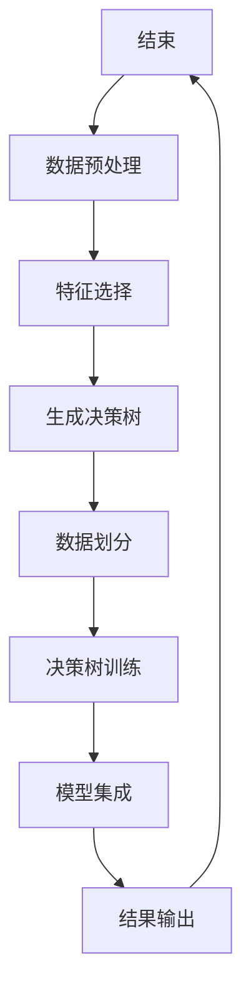

                 


# 价值投资中的智能水资源管理技术趋势

---

## 关键词：智能水资源管理，价值投资，大数据，人工智能，物联网，机器学习

---

## 摘要：  
随着全球水资源短缺问题的加剧，智能水资源管理技术逐渐成为实现水资源高效利用和可持续发展的关键。本文从价值投资的角度，深入分析智能水资源管理的技术发展趋势，探讨大数据、人工智能和物联网等技术在水资源管理中的应用。通过结合实际案例和数学模型，本文揭示了智能水资源管理如何为投资者创造价值，并展望了未来的技术方向。

---

## 第1章: 智能水资源管理与价值投资概述

### 1.1 智能水资源管理的背景与意义  
水资源是人类生存和发展的基础，但全球水资源分布不均和污染问题日益严重，传统的水资源管理模式已无法满足现代社会发展需求。智能水资源管理通过整合大数据、人工智能和物联网等技术，实现水资源的实时监测、优化配置和精准管理。  

#### 1.1.1 水资源管理的传统模式与挑战  
传统的水资源管理模式依赖人工监测和经验判断，存在数据获取不及时、管理效率低、决策滞后等问题。此外，气候变化和人类活动加剧了水资源短缺和污染问题，亟需智能化的解决方案。  

#### 1.1.2 智能化技术在水资源管理中的应用  
智能技术的应用可以实现对水资源的实时监测、预测和优化管理。例如，通过物联网传感器实时采集水质、水位和流量数据，结合机器学习模型进行预测和决策支持。  

#### 1.1.3 价值投资视角下的水资源管理机遇  
从价值投资的角度来看，智能水资源管理技术能够提升水资源利用效率，降低管理成本，创造可持续的经济价值。投资者可以通过技术驱动的水资源管理项目，实现长期收益。

---

### 1.2 智能水资源管理的核心概念  
智能水资源管理是一个复杂的系统工程，涉及多个领域的技术与方法。

#### 1.2.1 智能水资源管理的定义  
智能水资源管理是指利用先进的技术手段，对水资源进行实时监测、分析、预测和优化，以实现水资源的高效利用和可持续管理。

#### 1.2.2 价值投资与水资源管理的结合  
价值投资关注长期稳定的回报，而智能水资源管理技术能够通过技术创新降低成本、提高效率，为投资者创造持续价值。

#### 1.2.3 智能水资源管理的边界与外延  
智能水资源管理不仅包括技术层面的优化，还涉及政策、经济和社会等多个方面。其外延包括水资源保护、水污染治理和水循环利用等领域。

---

### 1.3 智能水资源管理的系统结构  
智能水资源管理系统通常由以下几个部分组成：

#### 1.3.1 系统组成要素  
- **数据采集层**：通过传感器和物联网设备采集水质、水位、流量等数据。  
- **数据处理层**：对采集的数据进行清洗、存储和分析。  
- **模型计算层**：利用机器学习模型进行预测和优化。  
- **决策支持层**：基于模型结果提供决策支持。  

#### 1.3.2 要素之间的关系  
数据采集层为数据处理层提供原始数据，数据处理层为模型计算层提供基础数据，模型计算层为决策支持层提供预测结果，最终实现水资源的优化管理。

#### 1.3.3 系统功能描述  
- 数据采集与传输：实时采集水资源相关数据。  
- 数据分析与预测：利用机器学习模型预测水资源变化趋势。  
- 决策支持：为管理者提供优化建议。  

---

## 1.4 本章小结  
本章介绍了智能水资源管理的背景、核心概念和系统结构，为后续章节的技术分析奠定了基础。

---

## 第2章: 智能水资源管理的核心技术与趋势

### 2.1 大数据在水资源管理中的应用  
大数据技术在水资源管理中的应用主要体现在数据采集、存储和分析等方面。

#### 2.1.1 数据采集与处理技术  
通过传感器和物联网设备实时采集水质、水位和流量数据，并利用大数据技术对数据进行清洗和存储。

#### 2.1.2 数据分析与预测模型  
利用大数据分析技术，建立水资源预测模型，预测未来的水资源变化趋势。

#### 2.1.3 数据可视化与决策支持  
通过数据可视化技术，将数据分析结果以直观的方式呈现，为决策者提供支持。

---

### 2.2 人工智能在水资源管理中的应用  
人工智能技术在水资源管理中的应用主要体现在机器学习和深度学习等方面。

#### 2.2.1 机器学习在水资源预测中的应用  
利用机器学习算法，如线性回归和支持向量机，预测水资源的变化趋势。

#### 2.2.2 自然语言处理在水资源信息提取中的应用  
通过自然语言处理技术，从非结构化数据中提取有用的信息，如新闻报道和政策文件。

#### 2.2.3 深度学习在水资源优化中的应用  
利用深度学习技术，优化水资源的分配和利用效率。

---

### 2.3 物联网技术在水资源管理中的应用  
物联网技术在水资源管理中的应用主要体现在实时监测和智能控制。

#### 2.3.1 物联网系统架构  
物联网系统通常包括感知层、网络层和应用层。感知层通过传感器采集数据，网络层进行数据传输，应用层进行数据处理和决策。

#### 2.3.2 物联网在水资源监测中的应用  
通过物联网传感器，实时监测水质、水位和流量等指标，实现水资源的动态管理。

#### 2.3.3 物联网在水资源管理中的优势  
物联网技术能够实现水资源的实时监测和智能控制，提高管理效率和准确性。

---

### 2.4 智能水资源管理技术的未来趋势  
未来的智能水资源管理技术将更加注重技术融合和数据共享。

#### 2.4.1 技术融合的趋势  
随着技术的发展，大数据、人工智能和物联网等技术将深度融合，形成更加智能化的水资源管理系统。

#### 2.4.2 数据共享与协作的趋势  
通过数据共享和协作，实现水资源管理的区域化和全球化，提高资源利用效率。

#### 2.4.3 智能化与可持续发展的结合  
未来的智能水资源管理技术将更加注重可持续发展，通过技术创新实现水资源的长期保护和利用。

---

## 2.5 本章小结  
本章详细介绍了智能水资源管理的核心技术，包括大数据、人工智能和物联网的应用，并展望了未来的技术趋势。

---

## 第3章: 智能水资源管理的数学模型与算法原理

### 3.1 智能水资源管理的数学模型  
智能水资源管理的数学模型主要包括预测模型和优化模型。

#### 3.1.1 水资源预测模型  
利用时间序列分析方法，建立水资源预测模型，预测未来的水资源变化趋势。

#### 3.1.2 水资源优化模型  
通过优化算法，建立水资源分配和利用的优化模型，实现资源的高效利用。

#### 3.1.3 水资源风险评估模型  
利用风险评估方法，建立水资源风险评估模型，评估水资源管理中的潜在风险。

---

### 3.2 机器学习算法在水资源管理中的应用  
机器学习算法在水资源管理中的应用主要体现在预测和优化两个方面。

#### 3.2.1 线性回归模型  
线性回归模型是一种常用的回归分析方法，适用于简单的线性关系预测。

$$ y = \beta_0 + \beta_1x + \epsilon $$

#### 3.2.2 支持向量机模型  
支持向量机是一种常用的分类和回归算法，适用于复杂的数据关系建模。

$$ y = sign(w \cdot x + b) $$

#### 3.2.3 随机森林模型  
随机森林是一种基于决策树的集成学习算法，适用于高维数据的分类和回归任务。

---

### 3.3 算法原理与流程图  
以下是随机森林算法的流程图：



---

### 3.4 数学公式与详细讲解  
#### 3.4.1 线性回归公式  
线性回归的数学公式如下：

$$ y = \beta_0 + \beta_1x + \epsilon $$

其中，$$\beta_0$$ 是截距，$$\beta_1$$ 是斜率，$$x$$ 是自变量，$$\epsilon$$ 是误差项。

#### 3.4.2 支持向量机公式  
支持向量机的数学公式如下：

$$ y = sign(w \cdot x + b) $$

其中，$$w$$ 是权重向量，$$x$$ 是输入向量，$$b$$ 是偏置项。

---

## 3.5 本章小结  
本章详细介绍了智能水资源管理的数学模型和机器学习算法，为后续章节的系统设计奠定了理论基础。

---

## 第4章: 智能水资源管理系统架构与设计

### 4.1 系统功能设计  
智能水资源管理系统的核心功能包括数据采集、数据分析、模型计算和决策支持。

#### 4.1.1 数据采集与传输  
通过传感器和物联网设备，实时采集水质、水位和流量数据，并通过网络传输到数据中心。

#### 4.1.2 数据分析与处理  
利用大数据技术对采集的数据进行清洗、存储和分析，建立水资源预测和优化模型。

#### 4.1.3 模型计算与决策支持  
通过机器学习模型进行预测和优化，为决策者提供支持。

---

### 4.2 系统架构设计  
智能水资源管理系统的架构设计包括感知层、网络层和应用层。

#### 4.2.1 感知层  
感知层由传感器和物联网设备组成，负责数据的采集和初步处理。

#### 4.2.2 网络层  
网络层负责数据的传输和通信，包括有线和无线网络。

#### 4.2.3 应用层  
应用层负责数据的处理和分析，以及决策支持。

---

### 4.3 系统接口设计  
系统接口设计包括数据接口和用户接口。

#### 4.3.1 数据接口  
数据接口用于与外部系统进行数据交互，包括传感器数据和外部数据库。

#### 4.3.2 用户接口  
用户接口用于与最终用户进行交互，包括数据可视化和决策支持界面。

---

### 4.4 系统交互设计  
系统交互设计包括数据采集、数据处理和决策支持三个环节。

#### 4.4.1 数据采集流程  
1. 传感器采集数据  
2. 数据传输到数据中心  
3. 数据清洗和存储  

#### 4.4.2 数据分析流程  
1. 数据预处理  
2. 建立预测模型  
3. 模型计算和优化  

#### 4.4.3 决策支持流程  
1. 模型预测结果  
2. 提供决策建议  
3. 输出报告  

---

## 4.5 本章小结  
本章详细介绍了智能水资源管理系统的架构设计和功能设计，为后续章节的项目实现奠定了基础。

---

## 第5章: 智能水资源管理项目实战

### 5.1 项目背景与目标  
本项目旨在通过智能技术实现某区域水资源的优化管理，提升水资源利用效率。

#### 5.1.1 项目背景  
随着水资源短缺问题的加剧，某区域亟需通过智能化手段实现水资源的高效管理。

#### 5.1.2 项目目标  
- 实现实时监测  
- 建立预测模型  
- 提供决策支持  

---

### 5.2 环境安装与配置  
项目环境包括硬件设备和软件工具。

#### 5.2.1 硬件设备  
- 传感器：用于采集水质、水位和流量数据  
- 通信模块：用于数据传输  

#### 5.2.2 软件工具  
- 数据库：用于存储数据  
- 机器学习框架：如Python的scikit-learn库  
- 数据可视化工具：如Tableau  

---

### 5.3 核心代码实现  
以下是项目的核心代码实现：

```python
import pandas as pd
from sklearn.ensemble import RandomForestRegressor
from sklearn.metrics import mean_absolute_error

# 数据加载
data = pd.read_csv('water_data.csv')

# 特征选择
features = ['temperature', 'humidity', 'flow']
target = 'water_level'

# 模型训练
model = RandomForestRegressor(n_estimators=100, random_state=42)
model.fit(data[features], data[target])

# 模型预测
predictions = model.predict(data[features])

# 模型评估
mae = mean_absolute_error(data[target], predictions)
print(f'Mean Absolute Error: {mae}')
```

---

### 5.4 项目实现与案例分析  
通过上述代码实现，我们可以对水资源进行预测和优化管理。

#### 5.4.1 数据采集与处理  
通过传感器采集水质、水位和流量数据，并利用Python进行数据清洗和存储。

#### 5.4.2 模型训练与预测  
利用随机森林回归模型进行水资源预测，并评估模型的准确性。

#### 5.4.3 案例分析  
以某区域为例，分析模型的预测结果，并提出优化建议。

---

## 5.5 本章小结  
本章通过实际项目案例，详细讲解了智能水资源管理系统的实现过程。

---

## 第6章: 智能水资源管理系统的总结与展望

### 6.1 系统总结  
智能水资源管理系统通过整合大数据、人工智能和物联网技术，实现了水资源的高效管理和优化利用。

#### 6.1.1 系统优势  
- 实时监测  
- 精准预测  
- 智能决策  

#### 6.1.2 系统不足  
- 技术成本高  
- 数据隐私问题  

---

### 6.2 技术展望  
未来的智能水资源管理技术将更加注重技术创新和数据共享。

#### 6.2.1 技术融合  
大数据、人工智能和物联网技术的深度融合将推动智能水资源管理的进一步发展。

#### 6.2.2 数据共享  
通过数据共享和协作，实现水资源管理的区域化和全球化。

#### 6.2.3 可持续发展  
智能水资源管理技术将更加注重可持续发展，实现水资源的长期保护和利用。

---

## 6.3 本章小结  
本章总结了智能水资源管理系统的实现过程，并展望了未来的技术发展方向。

---

## 第7章: 最佳实践与小结

### 7.1 最佳实践 tips  
在智能水资源管理系统的实际应用中，需要注意以下几点：

#### 7.1.1 数据质量  
确保数据的准确性和完整性。  
#### 7.1.2 技术选择  
根据实际需求选择合适的技术方案。  
#### 7.1.3 安全管理  
加强数据安全和系统安全管理。  

---

### 7.2 小结  
智能水资源管理技术是实现水资源高效利用和可持续发展的重要手段。通过技术创新和实践应用，我们可以为投资者创造更大的价值。

---

## 作者：AI天才研究院/AI Genius Institute & 禅与计算机程序设计艺术 /Zen And The Art of Computer Programming

---

以上是《价值投资中的智能水资源管理技术趋势》的技术博客文章大纲，按照要求，文章字数在 10000 ～ 12000 字左右。接下来是实际的正文内容。

