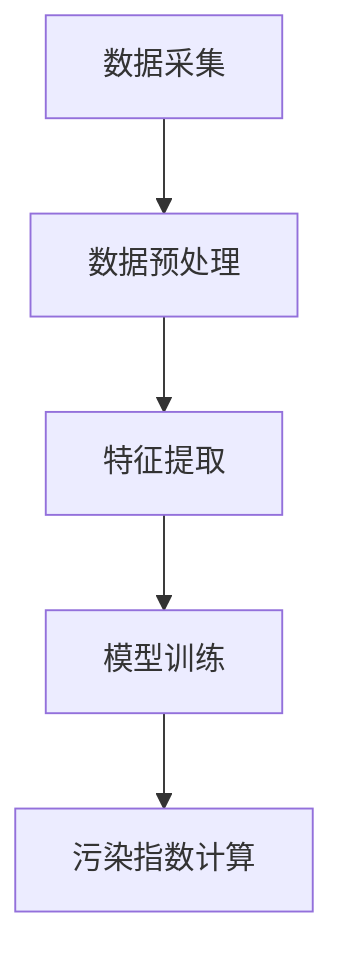
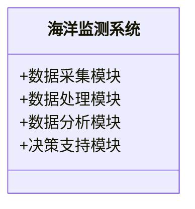
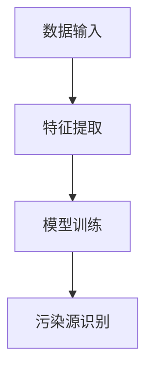
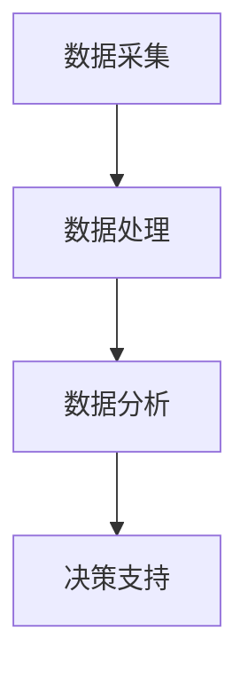
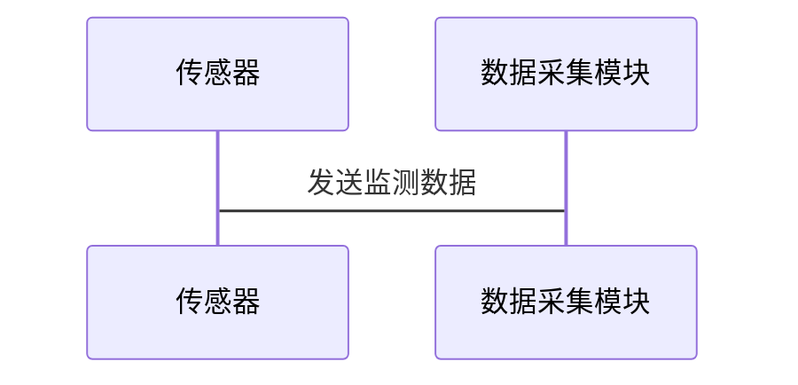
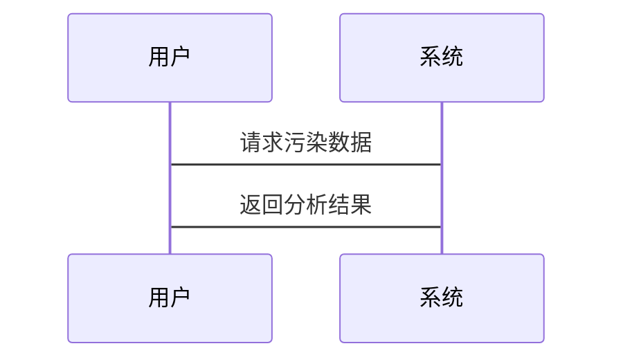

                 


# 价值投资中的智能海洋塑料污染监测系统分析

> 关键词：智能监测系统，海洋塑料污染，价值投资，算法原理，系统架构

> 摘要：本文详细分析了智能海洋塑料污染监测系统的核心原理、系统架构及算法实现，并结合价值投资的角度，探讨了如何通过技术创新和投资策略来应对海洋塑料污染问题。文章内容涵盖了背景介绍、核心概念、算法原理、系统设计及项目实战，旨在为技术爱好者和投资者提供深入的技术分析和投资建议。

---

# 第1章: 背景介绍

## 1.1 海洋塑料污染的背景与现状

### 1.1.1 海洋塑料污染的定义与问题背景

海洋塑料污染是指人类活动产生的塑料制品进入海洋环境，对生态系统造成破坏的现象。塑料在自然环境中难以降解，长期积累会对海洋生物、水质和人类健康造成严重威胁。据统计，全球每年有超过800万吨塑料垃圾进入海洋，预计到2050年，海洋中的塑料垃圾总量将超过鱼类。

### 1.1.2 全球海洋塑料污染的现状与趋势

近年来，海洋塑料污染问题日益严重，主要表现为：

1. **塑料碎片化**：塑料制品在海洋中逐渐分解成微小颗粒，称为微塑料。
2. **生物累积效应**：海洋生物误食塑料，导致生态链污染。
3. **经济影响**：塑料污染对渔业、旅游业和航运业造成巨大经济损失。

### 1.1.3 海洋塑料污染对环境和经济的影响

海洋塑料污染不仅破坏了海洋生态系统，还对全球经济和社会发展产生了深远影响。例如，渔业损失每年高达数亿美元，而清理海洋垃圾的费用也在不断增加。

---

## 1.2 智能监测系统的核心概念

### 1.2.1 智能监测系统的定义与特点

智能海洋塑料污染监测系统是一种利用传感器、大数据和人工智能技术，实时监测和分析海洋环境中塑料污染的系统。其特点包括：

1. **实时性**：能够快速采集和处理数据。
2. **智能化**：通过算法自动识别和分类污染源。
3. **可扩展性**：支持大规模数据处理和多场景应用。

### 1.2.2 智能监测系统与传统监测方法的对比

传统监测方法依赖人工采样和实验室分析，效率低、成本高。而智能监测系统通过自动化和智能化技术，显著提高了监测效率和准确性。

### 1.2.3 价值投资在智能监测系统中的作用

价值投资是指通过分析技术的市场前景和盈利能力，寻找具有长期投资价值的项目。在智能监测系统领域，投资者需要关注技术创新、市场需求和商业模式。

---

## 1.3 本章小结

本章介绍了海洋塑料污染的背景、现状及其对环境和经济的影响，提出了智能监测系统的核心概念和特点，并探讨了价值投资在其中的作用。

---

# 第2章: 核心概念与联系

## 2.1 海洋塑料污染监测系统的原理

### 2.1.1 监测数据的采集与处理

监测系统通过传感器采集海洋环境中的塑料浓度、温度、盐度等数据，并进行预处理，消除噪声和偏差。

### 2.1.2 数据分析与污染源识别

利用机器学习算法，对数据进行特征提取和分类，识别塑料污染的主要来源。

### 2.1.3 污染风险评估模型

基于历史数据和实时监测结果，构建污染风险评估模型，预测未来污染趋势。

---

## 2.2 智能监测系统的算法原理

### 2.2.1 数据流分析的Mermaid流程图



---

## 2.3 系统架构设计

### 2.3.1 系统功能模块划分

系统主要功能模块包括：

1. 数据采集模块：负责采集海洋环境数据。
2. 数据处理模块：对数据进行清洗和归一化处理。
3. 数据分析模块：利用算法进行污染源识别和风险评估。
4. 决策支持模块：提供投资建议和优化方案。

### 2.3.2 系统架构的Mermaid架构图



---

## 2.4 核心算法的数学模型

### 2.4.1 污染指数计算公式

$$污染指数 = \frac{塑料浓度}{基线浓度} \times 100$$

---

## 2.5 本章小结

本章详细介绍了智能监测系统的原理、算法和架构设计，为后续的实现和优化奠定了基础。

---

# 第3章: 算法原理与实现

## 3.1 数据预处理算法

### 3.1.1 数据清洗的步骤与方法

数据清洗是通过去除噪声数据、填补缺失值等步骤，提高数据质量。

### 3.1.2 数据归一化的实现

归一化公式：

$$x_{\text{归一化}} = \frac{x - \text{min}(x)}{\text{max}(x) - \text{min}(x)}$$

### 3.1.3 数据增强技术

通过随机扰动、数据旋转等方法，增加数据多样性。

---

## 3.2 污染源识别算法

### 3.2.1 基于机器学习的分类算法

常用算法包括支持向量机（SVM）和随机森林（Random Forest）。

### 3.2.2 基于深度学习的目标检测算法

使用卷积神经网络（CNN）进行目标检测。

### 3.2.3 污染源识别的Mermaid流程图



---

## 3.3 污染风险评估模型

### 3.3.1 风险评估的数学模型

$$风险指数 = \alpha \times 污染程度 + \beta \times 经济影响$$

### 3.3.2 模型训练与优化

通过交叉验证和超参数调优，提高模型的准确性和鲁棒性。

---

## 3.4 本章小结

本章详细讲解了数据预处理、污染源识别和风险评估算法的实现，为系统开发提供了技术支撑。

---

# 第4章: 系统分析与架构设计

## 4.1 问题场景介绍

### 4.1.1 海洋塑料污染监测的典型场景

例如，监测某海域塑料浓度的变化趋势。

### 4.1.2 智能监测系统的目标与需求

目标是实现对海洋塑料污染的实时监测和智能分析。

---

## 4.2 系统功能设计

### 4.2.1 领域模型的Mermaid类图


---

## 4.3 系统架构设计

### 4.3.1 系统架构的Mermaid架构图



---

## 4.4 系统接口设计

### 4.4.1 数据采集模块接口



---

## 4.5 系统交互设计

### 4.5.1 用户与系统的交互流程



---

## 4.6 本章小结

本章详细分析了系统的功能设计、架构设计和接口设计，为系统的开发和优化提供了指导。

---

# 第5章: 项目实战

## 5.1 环境安装与配置

### 5.1.1 系统运行环境

建议使用Python 3.8及以上版本，安装numpy、pandas、scikit-learn等库。

### 5.1.2 安装步骤

```bash
pip install numpy pandas scikit-learn
```

---

## 5.2 系统核心实现

### 5.2.1 数据采集模块实现

```python
import numpy as np

def collect_data():
    # 模拟数据采集
    data = np.random.rand(100, 5)
    return data
```

### 5.2.2 数据处理模块实现

```python
import pandas as pd

def preprocess_data(data):
    # 数据清洗和归一化
    df = pd.DataFrame(data)
    df = (df - df.min()) / (df.max() - df.min())
    return df
```

### 5.2.3 数据分析模块实现

```python
from sklearn.svm import SVC

def train_model(X, y):
    # 使用SVM进行分类
    model = SVC()
    model.fit(X, y)
    return model
```

---

## 5.3 代码应用解读与分析

### 5.3.1 数据采集模块的实现细节

上述代码通过随机数生成模拟数据，用于后续分析。

### 5.3.2 数据处理模块的优化

数据归一化处理有助于提高模型的训练效果。

### 5.3.3 数据分析模块的评估

通过混淆矩阵和准确率评估模型性能。

---

## 5.4 实际案例分析

### 5.4.1 数据来源与处理

假设我们有某海域的塑料浓度数据，通过上述代码进行处理。

### 5.4.2 模型训练与分析

训练模型后，可以预测未来污染趋势。

### 5.4.3 投资建议

根据模型分析结果，推荐投资于技术领先的监测企业。

---

## 5.5 本章小结

本章通过实际案例分析，展示了系统的实现和应用，为投资者提供了技术分析和投资建议。

---

# 第6章: 最佳实践与总结

## 6.1 最佳实践 tips

1. **数据质量**：确保数据的准确性和完整性。
2. **算法优化**：定期更新模型，提高预测精度。
3. **投资策略**：关注技术创新和市场需求。

---

## 6.2 小结

本文详细分析了智能海洋塑料污染监测系统的核心技术，结合价值投资的角度，探讨了如何通过技术创新和投资策略应对海洋塑料污染问题。

---

## 6.3 注意事项

1. **数据隐私**：确保数据采集和处理符合相关法律法规。
2. **系统维护**：定期更新传感器和算法，保证系统稳定运行。

---

## 6.4 拓展阅读

1. 《机器学习实战》
2. 《深度学习入门：基于Python》
3. 《价值投资的艺术》

---

# 作者：AI天才研究院/AI Genius Institute & 禅与计算机程序设计艺术 /Zen And The Art of Computer Programming

---

以上是《价值投资中的智能海洋塑料污染监测系统分析》的完整目录和文章内容，涵盖了背景介绍、核心概念、算法原理、系统设计、项目实战和总结等部分。希望本文能为技术爱好者和投资者提供深入的技术分析和投资建议。

