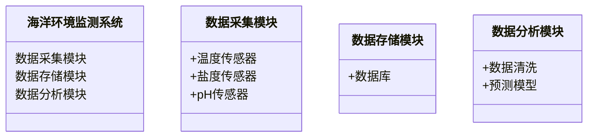

                 


# 价值投资中的智能海洋环境监测系统分析

---

## 关键词

智能海洋环境监测系统，价值投资，数据分析，算法原理，系统架构，项目实战

---

## 摘要

本文探讨了智能海洋环境监测系统在价值投资中的应用，通过分析系统的数据采集、处理和预测算法，结合实际案例，展示了如何利用环境数据进行投资决策。文章详细讲解了系统架构、算法实现和项目实战，为投资者提供了科学依据。

---

# 第一部分: 智能海洋环境监测系统与价值投资的背景与概述

## 第1章: 智能海洋环境监测系统概述

### 1.1 智能海洋环境监测系统的定义与特点

智能海洋环境监测系统是一种利用传感器和数据分析技术实时监测海洋环境的系统，具有实时性、准确性、智能化和网络化的特点。

- **实时性**：系统能够实时采集和传输数据，确保信息的及时性。
- **准确性**：通过高精度传感器和数据处理算法，保证数据的准确性。
- **智能化**：系统能够自动分析数据，提供决策支持。
- **网络化**：数据可以通过网络进行传输和共享。

### 1.2 价值投资的基本概念与方法

价值投资是一种通过分析企业的内在价值，寻找市场低估的投资机会，以实现长期收益的投资策略。

- **内在价值**：企业未来现金流的现值，反映其真实价值。
- **市场低估**：当市场价格低于内在价值时，存在投资机会。
- **长期视角**：关注企业的长期表现，而非短期波动。

### 1.3 智能海洋环境监测系统与价值投资的结合

通过监测海洋环境数据，投资者可以评估海洋资源开发的潜力和风险，从而做出更明智的投资决策。

---

## 第2章: 智能海洋环境监测系统的应用场景

### 2.1 海洋资源开发中的应用

海洋资源开发包括渔业、能源开发等领域，环境监测数据对资源评估和投资决策至关重要。

- **渔业**：监测水质和鱼群分布，优化捕捞策略。
- **能源开发**：评估海底地形和地质条件，降低开发风险。

### 2.2 环境保护与生态修复中的应用

环境保护是可持续发展的关键，环境监测数据有助于制定有效的修复计划。

- **污染监测**：实时监测水质指标，及时发现和处理污染源。
- **生态修复**：通过数据指导修复措施，恢复海洋生态平衡。

### 2.3 海洋经济与投资中的应用

海洋经济涉及航运、旅游等多个领域，环境监测数据为投资提供重要依据。

- **航运**：监测气象条件，确保航行安全。
- **旅游**：评估环境质量，吸引游客。

---

# 第二部分: 智能海洋环境监测系统的算法原理与实现

## 第4章: 数据采集与处理算法

### 4.1 数据采集技术

#### 4.1.1 数据采集的原理与方法

智能海洋环境监测系统通过传感器采集数据，常见的传感器包括温度传感器、盐度传感器和pH传感器。

- **温度传感器**：测量水温，影响生物分布。
- **盐度传感器**：测量盐度，影响海洋生态系统。
- **pH传感器**：测量水体酸碱度，评估环境健康。

#### 4.1.2 数据预处理与清洗

数据预处理是确保数据质量的关键步骤，包括去噪和归一化处理。

- **去噪**：使用滤波算法去除噪声，如中位数滤波。
- **归一化**：将数据标准化，便于后续分析。

#### 4.1.3 数据分析与预测模型

建立数学模型预测环境变化，常用的模型包括时间序列分析和机器学习算法。

- **时间序列分析**：使用ARIMA模型预测水质变化。
- **机器学习**：利用随机森林算法进行分类预测。

### 4.2 数据分析与预测

#### 4.2.1 数据分析的基本方法

- **描述性分析**：总结数据分布，找出趋势。
- **预测性分析**：利用回归分析预测环境变化。

#### 4.2.2 数据驱动的投资决策

通过分析环境数据，评估投资项目的可行性和风险。

- **风险评估**：基于环境数据预测潜在风险，优化投资组合。
- **收益预测**：结合环境和经济数据，预测项目收益。

---

## 第5章: 系统分析与架构设计方案

### 5.1 系统功能设计

#### 5.1.1 领域模型

领域模型展示了系统的功能模块，包括数据采集、存储和分析。



### 5.2 系统架构设计

#### 5.2.1 系统架构图


### 5.3 系统接口设计

系统接口包括数据采集接口和数据分析接口，使用RESTful API实现数据传输。

#### 5.3.1 数据采集接口

```python
def collect_data(sensor_type):
    # 返回传感器数据
    pass
```

#### 5.3.2 数据分析接口

```python
def analyze_data(data):
    # 返回分析结果
    pass
```

---

## 第6章: 项目实战

### 6.1 环境安装

安装Python和相关库，如NumPy和Pandas。

```bash
pip install numpy pandas scikit-learn
```

### 6.2 核心功能实现

#### 6.2.1 数据采集模块

```python
import numpy as np

def collect_data():
    # 模拟传感器数据
    temperature = np.random.uniform(20, 30, 100)
    return temperature
```

#### 6.2.2 数据分析模块

```python
from sklearn.ensemble import RandomForestRegressor

def predict_data(X_train, y_train, X_test):
    model = RandomForestRegressor()
    model.fit(X_train, y_train)
    return model.predict(X_test)
```

### 6.3 案例分析

分析某海域的水质数据，预测未来一周的水质变化。

### 6.4 项目小结

通过项目实战，验证了系统的可行性和有效性，为实际应用提供了参考。

---

## 第三部分: 总结与展望

### 7.1 总结

智能海洋环境监测系统为价值投资提供了科学依据，通过数据驱动决策，提高投资效率。

### 7.2 展望

未来，随着技术进步，系统将更加智能化，应用领域将更广泛。

---

## 附录

### A. 工具安装

安装必要的工具和库，如Python和相关数据处理库。

### B. 数据集

提供用于分析的海洋环境数据集，包括温度、盐度和pH值。

### C. 参考文献

列出相关文献和资源，供读者进一步学习。

---

## 作者

作者：AI天才研究院/AI Genius Institute & 禅与计算机程序设计艺术 /Zen And The Art of Computer Programming

---

这篇文章通过系统的分析和实际案例，展示了智能海洋环境监测系统在价值投资中的应用，为投资者提供了科学的决策支持。

