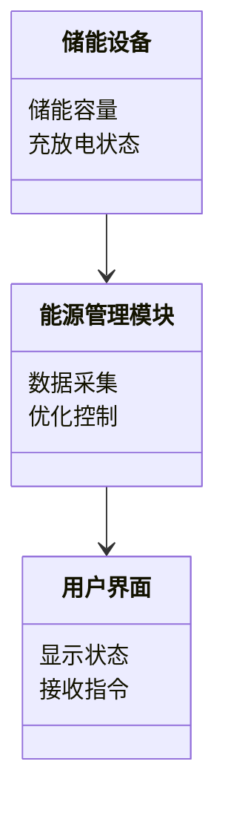
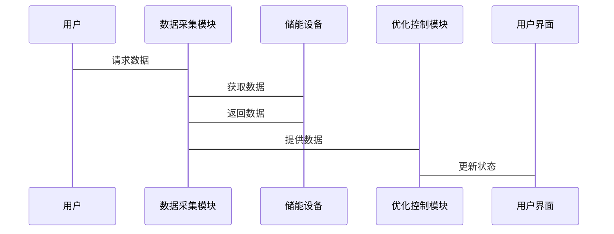

                 


# 价值投资中的智能电网分布式储能管理分析

## 关键词：
智能电网、分布式储能、价值投资、储能管理、能源优化

## 摘要：
本文探讨了价值投资在智能电网分布式储能管理中的应用，分析了储能系统的优化算法、系统架构设计以及实际案例。通过动态规划和遗传算法的优化模型，结合系统架构设计，提出了基于价值投资的储能管理策略，旨在提高能源效率、降低成本并提升系统可靠性。

---

# 第一部分：智能电网分布式储能管理背景与价值投资概述

## 第1章：智能电网分布式储能管理的背景与概念

### 1.1 智能电网的基本概念

#### 1.1.1 智能电网的定义与特点
智能电网是一种集成现代信息通信技术的电力网络，具备自我感知、分析和决策能力，能够实现能源的高效利用和智能分配。其特点包括：

- **智能化**：通过传感器和数据分析实现电网的智能监控。
- **分布式**：能源来源多样化，包括太阳能、风能等可再生能源。
- **高效性**：通过优化算法提高能源传输和利用效率。

#### 1.1.2 分布式储能的概念与作用
分布式储能是指在智能电网中分散部署储能设备，用于储存和释放电能。其作用包括：

- **平衡电网负荷**：通过储存多余电能，缓解高峰负荷压力。
- **提高供电可靠性**：在紧急情况下提供备用电源。
- **降低能源浪费**：通过优化储能，减少能源损耗。

#### 1.1.3 智能电网与分布式储能的关联性
智能电网通过分布式储能实现了能源的灵活调配和高效管理，二者相辅相成，共同构建了一个可持续的能源生态系统。

### 1.2 价值投资的基本原理

#### 1.2.1 价值投资的定义与核心理念
价值投资是一种投资策略，强调以低于内在价值的价格购买优质资产，长期持有以实现收益。其核心理念是寻找具有长期竞争优势和稳定回报的标的。

#### 1.2.2 价值投资在能源管理中的应用
在能源管理中，价值投资用于评估和选择具有长期收益潜力的项目。例如，通过分析储能系统的投资回报率（ROI）和风险，确定其投资价值。

#### 1.2.3 智能电网分布式储能管理的经济价值
分布式储能通过优化能源使用，降低运营成本，提高能源利用效率，具备较高的经济价值和投资潜力。

### 1.3 智能电网分布式储能管理的背景与意义

#### 1.3.1 当前能源管理的挑战与痛点
传统能源管理存在能源浪费、效率低下、成本高等问题，随着可再生能源的普及，对智能化管理的需求日益迫切。

#### 1.3.2 分布式储能技术的发展现状
分布式储能技术逐渐成熟，应用场景广泛，但在大规模应用中仍面临技术瓶颈和经济性挑战。

#### 1.3.3 价值投资在储能管理中的潜力与机遇
价值投资为分布式储能管理提供了新的视角和方法，通过优化投资策略，提高储能系统的经济性和可行性。

## 1.4 本章小结
智能电网和分布式储能的结合为能源管理提供了新的可能性。价值投资在其中扮演重要角色，通过优化投资策略，实现能源系统的高效管理和经济回报。

---

# 第二部分：智能电网分布式储能管理的核心概念与价值分析

## 第2章：智能电网分布式储能管理的核心概念

### 2.1 分布式储能系统的组成与功能

#### 2.1.1 储能设备的类型与特点
常见的储能设备包括：

- **电池储能**：如锂离子电池，具有高能量密度和较长寿命。
- **超级电容器**：适用于快速充放电场景。
- **飞轮储能**：适合高功率、短时间的储能需求。

#### 2.1.2 分布式储能系统的架构设计
分布式储能系统通常采用分层架构，包括数据采集层、控制层和应用层。

#### 2.1.3 系统功能模块的划分
系统功能模块包括数据采集、能量管理、优化控制和用户界面等。

### 2.2 价值投资在储能管理中的关键指标

#### 2.2.1 投资回报率（ROI）的计算方法
ROI = （净收益 / 投资成本）× 100%

#### 2.2.2 风险评估与收益预测模型
通过概率分析和蒙特卡洛模拟评估投资风险。

#### 2.2.3 储能系统的经济性分析
经济性分析包括初始投资、运营成本和收益预测。

### 2.3 智能电网分布式储能管理的优化目标

#### 2.3.1 能源效率的优化
通过优化算法提高储能系统的能量转换效率。

#### 2.3.2 成本控制的优化
通过规模效应和技术创新降低成本。

#### 2.3.3 系统可靠性的提升
通过冗余设计和实时监控提高系统可靠性。

### 2.4 核心概念对比分析

#### 2.4.1 分布式储能与集中式储能的对比
| 对比维度 | 分布式储能 | 集中式储能 |
|----------|------------|------------|
| 布置方式 | 分散部署   | 集中部署   |
| 可扩展性 | 较高       | 较低       |
| 灵活性   | 高         | 低         |

#### 2.4.2 价值投资与传统投资的对比
价值投资注重长期价值，传统投资注重短期收益。

#### 2.4.3 智能电网与传统电网的对比
智能电网具备智能化和分布式特点，传统电网较为集中和单一。

### 2.5 本章小结
通过对比分析，明确了分布式储能和价值投资在智能电网中的重要作用和优化方向。

---

# 第三部分：智能电网分布式储能管理的算法与数学模型

## 第3章：储能管理优化算法原理

### 3.1 基于动态规划的储能优化算法

#### 3.1.1 动态规划的基本原理
动态规划是一种解决多阶段决策问题的优化方法，通过分解问题、求解子问题并组合得到最优解。

#### 3.1.2 储能管理中的动态规划模型
目标函数：最大化净收益  
约束条件：储能容量、时间序列等

```python
def dynamic_planning():
    for each time step:
        for each state:
            update optimal solution
    return optimal plan
```

#### 3.1.3 算法实现步骤与流程图
1. 初始化状态和目标。
2. 迭代求解每个状态的最优解。
3. 组合最优解得到全局最优。

### 3.2 基于遗传算法的优化方法

#### 3.2.1 遗传算法的基本原理
遗传算法模拟自然选择和遗传机制，通过适应度函数筛选最优个体。

#### 3.2.2 储能管理中的遗传算法实现
1. 初始化种群。
2. 计算适应度。
3. 选择、交叉和变异生成新种群。
4. 重复迭代直至收敛。

#### 3.2.3 算法优化效果分析
通过适应度函数和收敛速度评估优化效果。

### 3.3 算法对比与选择策略

#### 3.3.1 不同优化算法的对比
| 算法类型 | 动态规划 | 遗传算法 |
|----------|----------|----------|
| 优点     | 精确解   | 全局最优   |
| 缺点     | 计算复杂 | 易陷入局部最优 |

#### 3.3.2 算法选择策略
根据问题规模和优化目标选择合适算法，动态规划适用于小规模问题，遗传算法适用于大规模复杂问题。

---

## 第4章：数学模型与公式推导

### 4.1 动态规划模型的数学表达

$$
\text{目标函数：} \quad \max \sum_{t=1}^{T} r_t
$$

$$
\text{约束条件：} \quad s_t = s_{t-1} + a_t - d_t
$$

其中，\( r_t \) 是第 \( t \) 时刻的收益，\( s_t \) 是储能容量，\( a_t \) 是充入电量，\( d_t \) 是释放电量。

### 4.2 遗传算法的适应度函数

$$
\text{适应度：} \quad f(x) = \frac{\text{收益} - \text{成本}}{\text{投资成本}}
$$

### 4.3 优化目标的数学表达

$$
\text{优化目标：} \quad \min \sum_{t=1}^{T} c_t
$$

其中，\( c_t \) 是第 \( t \) 时刻的成本。

---

# 第四部分：智能电网分布式储能管理的系统分析与架构设计

## 第5章：系统分析与架构设计方案

### 5.1 问题场景介绍
某工业园区需要建设智能电网分布式储能系统，目标是实现能源的高效管理和优化调度。

### 5.2 系统功能设计（领域模型）



### 5.3 系统架构设计（架构图）


### 5.4 系统接口设计
系统接口包括数据采集接口、用户指令接口和系统控制接口。

### 5.5 系统交互设计（序列图）



---

# 第五部分：智能电网分布式储能管理的项目实战

## 第6章：项目实战

### 6.1 环境安装

#### 6.1.1 Python环境安装
安装Python和必要的库（如numpy、pandas、scipy）。

#### 6.1.2 算法实现
实现动态规划和遗传算法的Python代码。

### 6.2 系统核心实现

#### 6.2.1 数据采集与处理
采集储能系统的运行数据，进行清洗和预处理。

#### 6.2.2 优化算法实现
基于动态规划和遗传算法实现储能管理优化。

#### 6.2.3 系统控制与监控
通过用户界面实现系统控制和运行状态监控。

### 6.3 代码解读与分析
详细解读优化算法的Python代码，并分析其运行结果。

### 6.4 实际案例分析
通过具体案例分析储能管理的优化效果和经济效益。

### 6.5 项目小结
总结项目实施过程中的经验教训，提出改进建议。

---

# 第六部分：智能电网分布式储能管理的最佳实践

## 第7章：最佳实践

### 7.1 经验总结
储能管理中动态规划和遗传算法的优缺点。

### 7.2 注意事项
数据质量、模型选择和系统维护的重要性。

### 7.3 拓展阅读
推荐相关领域的书籍和论文，供读者深入学习。

---

# 作者信息

作者：AI天才研究院/AI Genius Institute & 禅与计算机程序设计艺术 /Zen And The Art of Computer Programming

