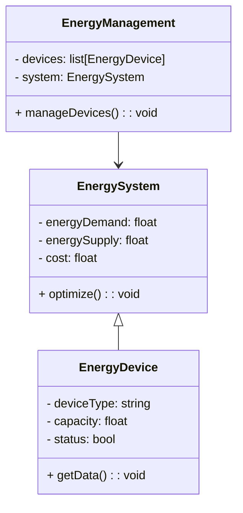
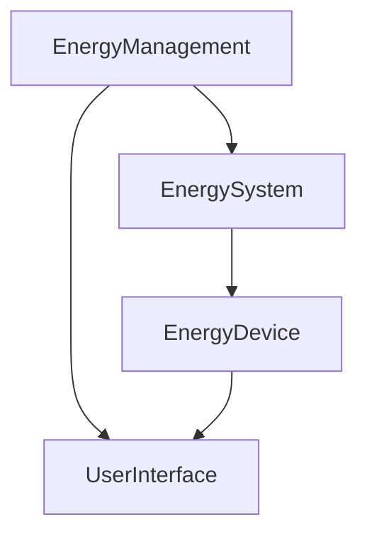
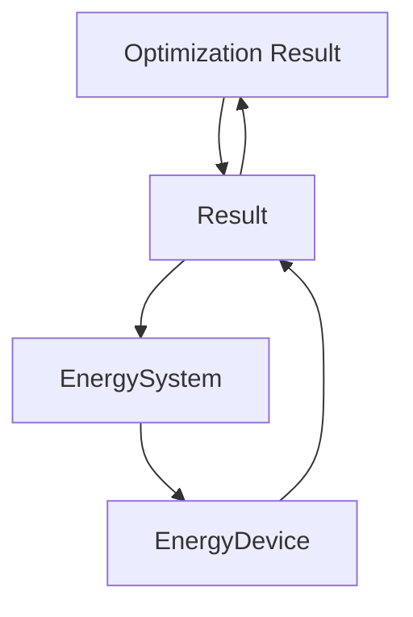

                 


# 价值投资中的智能电网分布式能源管理分析

> 关键词：价值投资，智能电网，分布式能源管理，能源系统优化，投资策略，能源经济模型

> 摘要：本文从价值投资的视角，分析智能电网分布式能源管理的经济价值和投资策略。通过建立数学模型和优化算法，探讨如何通过价值投资理念优化分布式能源管理，降低能源成本，提高能源效率，实现可持续发展。

---

## 第一部分：价值投资与智能电网分布式能源管理概述

### 1.1 价值投资的基本概念

#### 1.1.1 价值投资的定义与核心理念
价值投资是一种长期投资策略，强调以低于内在价值的价格购买优质的资产。其核心理念包括：
- 企业内在价值的评估：通过基本面分析，计算企业的未来现金流折现值。
- 安全边际：买入价格低于内在价值，以降低投资风险。
- 长期视角：关注企业的长期盈利能力，而非短期市场波动。

#### 1.1.2 价值投资在能源领域的应用前景
能源行业是价值投资的重要领域，尤其是可再生能源和分布式能源管理。随着能源结构转型，分布式能源系统具有较高的投资价值，但需要结合技术、政策和市场因素进行综合评估。

#### 1.1.3 智能电网分布式能源管理的定义与特点
智能电网分布式能源管理是指通过智能技术优化分布式能源系统（如太阳能、风能等）的生产和分配。其特点包括：
- 分布式：能源生产与消费在同一地点或附近。
- 智能化：通过现代信息技术实现能源系统的实时监控和优化。
- 可扩展性：支持多种能源形式的接入和管理。

### 1.2 智能电网分布式能源管理的背景与意义

#### 1.2.1 智能电网的发展历程
智能电网从20世纪末开始发展，经历了从传统电网到数字化、智能化的转型。随着可再生能源的兴起，智能电网在分布式能源管理中发挥越来越重要的作用。

#### 1.2.2 分布式能源管理的兴起
分布式能源管理的兴起与能源结构转型密切相关。随着环保压力和能源效率要求的提高，分布式能源系统因其灵活性和高效性受到重视。

#### 1.2.3 智能电网与分布式能源管理的结合
智能电网与分布式能源管理的结合，使得能源系统更加灵活、高效和可持续。通过智能技术优化能源分配，降低能源浪费，提高系统整体效率。

### 1.3 价值投资与智能电网分布式能源管理的结合

#### 1.3.1 价值投资在能源管理中的作用
价值投资可以帮助投资者发现被低估的分布式能源项目，通过深入分析项目的经济价值和市场潜力，制定合理的投资策略。

#### 1.3.2 智能电网分布式能源管理的经济价值
分布式能源管理可以降低能源成本，提高能源利用效率，具有较高的经济价值。同时，随着技术进步和政策支持，其市场前景广阔。

#### 1.3.3 价值投资视角下的分布式能源管理优化
通过价值投资理念，优化分布式能源管理的运营模式，降低投资风险，提高项目的长期盈利能力。

---

## 第二部分：智能电网分布式能源管理的核心概念与原理

### 2.1 智能电网分布式能源管理的系统架构

#### 2.1.1 系统架构的层次划分
智能电网分布式能源管理系统的架构通常分为三层：
- 应用层：提供用户界面和管理功能。
- 网络层：实现数据通信和信息传输。
- 设备层：包含分布式能源设备和传感器。

#### 2.1.2 各层次的功能与特点
- 应用层：负责系统的监控、优化和决策。
- 网络层：实现数据的实时传输和通信。
- 设备层：采集和处理能源数据。

#### 2.1.3 系统架构的优化与扩展
通过优化各层的功能和接口设计，提高系统的可靠性和扩展性。例如，采用模块化设计，便于后续功能的添加和升级。

### 2.2 分布式能源管理的核心概念

#### 2.2.1 分布式能源的定义与分类
分布式能源是指在用户侧或靠近用户侧的能源生产设施，如太阳能电池、风力发电机等。分布式能源可以分为小型发电设备、储能设备和能源管理设备。

#### 2.2.2 分布式能源管理的关键技术
- 自动化控制技术：实现能源设备的自动运行和优化。
- 数据采集与监控技术：实时采集和分析能源数据。
- 优化算法：通过算法优化能源分配和调度。

#### 2.2.3 分布式能源管理的经济模型
经济模型用于评估分布式能源项目的经济效益，包括初始投资、运营成本、收益和风险。

### 2.3 价值投资与分布式能源管理的关联

#### 2.3.1 价值投资在分布式能源管理中的作用
价值投资帮助识别具有长期盈利能力的分布式能源项目，优化投资组合，降低市场风险。

#### 2.3.2 分布式能源管理的经济价值评估
通过经济模型和价值评估方法，确定分布式能源项目的内在价值，指导投资决策。

#### 2.3.3 价值投资视角下的分布式能源管理优化策略
结合价值投资理念，优化分布式能源管理的运营模式和投资策略，提高项目的长期收益和抗风险能力。

---

## 第三部分：分布式能源管理的算法原理与数学模型

### 3.1 分布式能源管理的算法原理

#### 3.1.1 分布式能源管理的优化算法
优化算法用于能源设备的调度和管理，常见的算法包括动态规划、遗传算法和粒子群算法。

#### 3.1.2 算法的实现步骤与流程
- 数据采集：采集分布式能源系统的运行数据。
- 数据处理：对数据进行清洗和预处理。
- 模型建立：建立优化模型。
- 算法求解：运行优化算法，得到最优解。
- 结果分析：分析优化结果并进行调整。

#### 3.1.3 算法的优缺点分析
- 优点：提高能源效率，降低成本。
- 缺点：算法复杂性较高，计算时间较长。

### 3.2 分布式能源管理的数学模型

#### 3.2.1 数学模型的构建与优化
建立能源系统的数学模型，包括能源需求、供应、成本和收益等变量。

#### 3.2.2 数学模型的求解方法
使用线性规划、非线性规划等方法求解优化问题。

#### 3.2.3 数学模型的案例分析
以某分布式能源项目为例，建立数学模型，进行优化分析，得出最优的能源分配方案。

---

## 第四部分：分布式能源管理系统的分析与架构设计

### 4.1 分布式能源管理系统的分析

#### 4.1.1 系统的需求分析
- 功能需求：数据采集、实时监控、优化调度。
- 性能需求：高可靠性和实时性。

#### 4.1.2 系统的功能分析
- 数据采集与处理：采集能源设备的运行数据。
- 系统监控：实时监控能源系统的运行状态。
- 优化调度：优化能源分配和调度。

#### 4.1.3 系统的性能分析
- 系统效率：能源分配效率。
- 系统稳定性：系统的抗干扰能力。

### 4.2 分布式能源管理系统的架构设计

#### 4.2.1 系统架构的分层设计
- 数据采集层：采集能源数据。
- 数据处理层：处理和分析数据。
- 应用层：提供优化建议和决策支持。

#### 4.2.2 系统架构的模块划分
- 数据采集模块：负责数据的采集和传输。
- 数据处理模块：对数据进行分析和处理。
- 优化模块：运行优化算法，得出最优解。

---

## 第五部分：价值投资视角下的分布式能源管理优化

### 5.1 价值投资与分布式能源管理的结合

#### 5.1.1 价值投资在分布式能源管理中的应用
通过价值投资理念，优化分布式能源管理的运营模式和投资策略。

#### 5.1.2 分布式能源管理的经济价值评估
建立经济模型，评估分布式能源项目的经济效益和市场潜力。

#### 5.1.3 价值投资视角下的分布式能源管理优化策略
结合价值投资理念，制定长期稳定的优化策略，提高项目的盈利能力。

### 5.2 分布式能源管理的经济模型与优化

#### 5.2.1 经济模型的构建
建立分布式能源项目的经济模型，包括初始投资、运营成本、收益和风险。

#### 5.2.2 经济模型的优化
通过优化模型参数，提高项目的经济价值和投资回报率。

#### 5.2.3 经济模型的案例分析
以某分布式能源项目为例，建立经济模型，进行优化分析，得出最优的投资方案。

---

## 第六部分：系统分析与架构设计方案

### 6.1 系统分析

#### 6.1.1 问题场景介绍
分布式能源管理系统需要解决能源分配优化、数据采集和处理等问题。

#### 6.1.2 项目介绍
本项目旨在通过智能电网技术优化分布式能源管理，降低能源成本，提高系统效率。

### 6.2 系统功能设计

#### 6.2.1 领域模型类图
使用Mermaid绘制领域模型类图，展示系统的主要功能模块和它们之间的关系。



#### 6.2.2 系统架构设计
使用Mermaid绘制系统架构图，展示系统的各个模块和它们之间的关系。



#### 6.2.3 系统接口设计
系统接口包括数据采集接口、优化算法接口和用户界面接口。

#### 6.2.4 系统交互流程图
使用Mermaid绘制系统交互流程图，展示用户与系统的交互过程。



---

## 第七部分：项目实战

### 7.1 环境安装

#### 7.1.1 系统环境
- 操作系统：Linux或Windows
- 开发工具：Python、Jupyter Notebook
- 数据库：MySQL或PostgreSQL

#### 7.1.2 软件安装
- Python库：pandas、numpy、scipy、matplotlib

### 7.2 核心代码实现

#### 7.2.1 数据采集与处理
```python
import pandas as pd
import numpy as np

# 采集数据
data = pd.read_csv('energy_data.csv')

# 数据处理
data_clean = data.dropna()
data_clean['date'] = pd.to_datetime(data_clean['date'])
```

#### 7.2.2 优化算法实现
```python
from scipy.optimize import minimize

def optimization_function(x, *args):
    # 定义优化目标函数
    return np.sum((x - args[0]) ** 2)

# 优化参数
x0 = np.random.randn(5)
result = minimize(optimization_function, x0, args=(data_clean,))
```

#### 7.2.3 经济模型实现
```python
def calculate_net_present_value(cash_flows, discount_rate):
    # 计算净现值
    return np.npv(discount_rate, cash_flows)

# 示例现金流
cash_flows = [-100, 40, 40, 40]
discount_rate = 0.1
net_present_value = calculate_net_present_value(cash_flows, discount_rate)
print(f"Net Present Value: {net_present_value}")
```

### 7.3 案例分析与结果解读

#### 7.3.1 数据分析结果
通过数据分析，识别出具有较高投资价值的分布式能源项目。

#### 7.3.2 优化结果展示
展示优化算法的结果，包括能源分配的最优方案和经济效益的提升。

#### 7.3.3 投资策略调整
根据分析结果，调整投资策略，优化投资组合，降低风险，提高收益。

### 7.4 项目小结

#### 7.4.1 项目总结
总结项目的实施过程和取得的成果，评估项目的经济价值和投资回报率。

#### 7.4.2 经验与教训
总结项目中的经验教训，为后续类似项目提供参考。

---

## 第八部分：最佳实践与小结

### 8.1 最佳实践 tips

#### 8.1.1 投资策略
- 选择具有长期稳定收益的分布式能源项目。
- 结合技术、政策和市场因素进行综合评估。

#### 8.1.2 系统优化
- 定期更新优化算法和系统架构，保持系统的高效性。
- 加强数据采集和处理能力，提高系统的实时性和准确性。

### 8.2 小结

#### 8.2.1 价值投资与分布式能源管理的结合
通过价值投资理念优化分布式能源管理，降低投资风险，提高项目的长期盈利能力。

#### 8.2.2 未来展望
随着技术进步和政策支持，分布式能源管理的市场前景广阔，价值投资在其中将发挥越来越重要的作用。

### 8.3 注意事项

#### 8.3.1 投资风险
- 市场风险：能源市场价格波动可能影响项目的收益。
- 技术风险：分布式能源技术的不确定性可能影响项目的可行性。

#### 8.3.2 系统风险
- 系统故障可能导致能源分配的不均衡，影响系统的稳定运行。

### 8.4 拓展阅读

#### 8.4.1 推荐书籍
- 《智能电网与分布式能源》
- 《价值投资经典案例分析》

#### 8.4.2 相关技术
- 人工智能在能源管理中的应用
- 区块链技术在分布式能源系统中的应用

---

## 作者：AI天才研究院/AI Genius Institute & 禅与计算机程序设计艺术/Zen And The Art of Computer Programming

---

通过以上思考和规划，我可以逐步完成这篇技术博客文章，从理论到实践，全面分析价值投资在智能电网分布式能源管理中的应用，为读者提供有价值的见解和指导。

