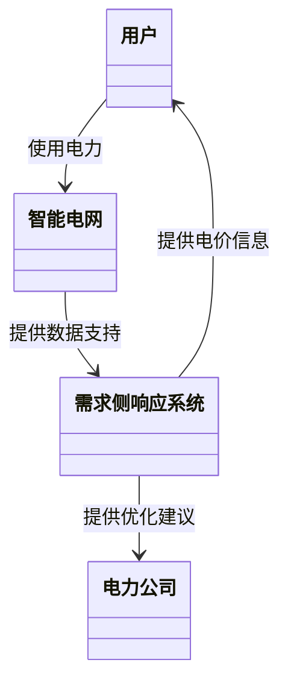
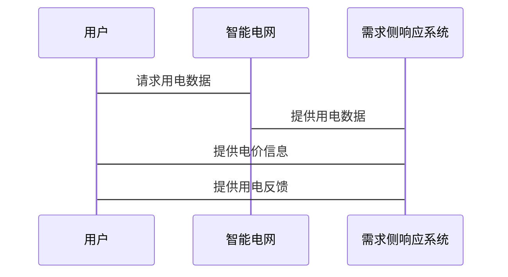

                 


# 价值投资中的智能电网需求侧响应系统分析

## 关键词：智能电网、需求侧响应系统、价值投资、能源管理、优化算法、系统架构、能源效率

## 摘要：智能电网作为现代电力系统的重要组成部分，通过智能化的管理和优化，显著提升了能源的使用效率和系统的稳定性。需求侧响应系统（Demand Side Response System，DSRS）作为智能电网的关键技术之一，通过调节用户侧的电力消耗，实现电力供需的动态平衡，从而降低电力成本，提高能源利用效率。本文将深入分析智能电网与需求侧响应系统的核心概念、算法原理、系统架构以及实际应用，探讨其在价值投资中的潜在机会和挑战，为投资者提供有价值的参考。

---

## 第1章：智能电网与需求侧响应系统概述

### 1.1 智能电网的基本概念

#### 1.1.1 智能电网的定义  
智能电网是一种利用现代信息技术、通信技术和自动化技术，实现电力系统各个环节的智能化管理的现代化电力系统。它通过实时监测、分析和优化电力的生产、传输和消费，提高电力系统的可靠性和效率。

#### 1.1.2 智能电网的核心特征  
- **智能化**：通过传感器和智能设备实时感知电网状态。  
- **自动化**：利用自动化技术实现电力系统的自动控制。  
- **互动性**：用户与电网之间可以实现双向互动，用户可以根据电网的需求调整用电行为。  
- **高效性**：通过优化电力生产和分配，提高能源利用效率。  

#### 1.1.3 智能电网的发展现状  
随着全球能源结构的变化和环保要求的提高，智能电网在全球范围内得到了广泛应用。各国纷纷投资于智能电网技术的研发和应用，以应对能源危机和气候变化的挑战。

---

### 1.2 需求侧响应系统的基本概念

#### 1.2.1 需求侧响应系统的定义  
需求侧响应系统（DSRS）是一种通过激励机制引导用户调整用电行为，以实现电力供需平衡的技术。它通过实时电价、补贴或其他激励措施，鼓励用户在高峰时段减少用电或在低谷时段增加用电。

#### 1.2.2 需求侧响应系统的运作机制  
需求侧响应系统的核心在于通过信息反馈和激励机制，实现用户侧的用电行为优化。系统通过采集用户的用电数据，分析用电需求，制定响应策略，并通过用户界面向用户传递信息。

#### 1.2.3 需求侧响应系统在智能电网中的作用  
需求侧响应系统是智能电网的重要组成部分，它通过调节用户侧的用电需求，平衡电力供需，减少电力峰谷差，降低电网的投资和运行成本。

---

### 1.3 价值投资的基本概念

#### 1.3.1 价值投资的定义  
价值投资是一种投资策略，强调以低于市场价值的价格买入优质资产，长期持有，等待其价值回归。其核心在于寻找那些被市场低估的优质资产，通过长期持有实现收益。

#### 1.3.2 价值投资的核心理念  
- **安全边际**：买入价格低于内在价值。  
- **长期视角**：关注企业的长期盈利能力。  
- **逆向思维**：在市场恐慌时买入，在市场狂热时卖出。  

#### 1.3.3 价值投资在智能电网中的应用  
智能电网和需求侧响应系统的建设和应用，为价值投资者提供了新的投资机会。例如，投资于智能电网设备制造商、能源管理服务提供商等，可以在长期获得稳定的收益。

---

### 1.4 智能电网与需求侧响应系统的结合

#### 1.4.1 智能电网与需求侧响应系统的整合  
智能电网通过实时数据采集和分析，为需求侧响应系统提供必要的信息支持。需求侧响应系统通过用户侧的响应，优化电力供需，降低电网的运行成本。

#### 1.4.2 需求侧响应系统对智能电网的影响  
需求侧响应系统通过调节用户侧的用电行为，降低电力峰谷差，减少电网的投资和运行成本，提高电力系统的稳定性。

#### 1.4.3 需求侧响应系统对价值投资的意义  
需求侧响应系统的应用，为投资者提供了新的投资方向。例如，投资于需求侧响应系统的研发和推广，可以在未来获得丰厚的回报。

---

## 第2章：智能电网与需求侧响应系统的核心概念与联系

### 2.1 智能电网与需求侧响应系统的属性特征对比

| 属性                | 智能电网               | 需求侧响应系统         |
|---------------------|-----------------------|-----------------------|
| 核心目标            | 提高电力系统的效率和可靠性 | 调节用户用电行为，平衡供需       |
| 技术基础            | 信息技术、自动化技术   | 经济激励、用户互动技术   |
| 应用范围            | 整个电力系统           | 用户侧电力消费行为     |
| 价值体现            | 提高能源利用效率       | 降低电力成本，优化供需   |

### 2.2 智能电网与需求侧响应系统的联系

#### 2.2.1 数据流的交互  
智能电网通过传感器和数据采集系统，实时采集用户用电数据，传递给需求侧响应系统。需求侧响应系统通过分析数据，制定响应策略，并向用户反馈。

#### 2.2.2 功能上的互补  
智能电网提供数据支持，需求侧响应系统通过用户互动实现电力供需的动态平衡。两者相辅相成，共同优化电力系统的运行。

---

## 第3章：需求侧响应系统的算法原理

### 3.1 负荷预测算法

#### 3.1.1 负荷预测的定义  
负荷预测是指根据历史用电数据和外部因素，预测未来的电力需求。

#### 3.1.2 负荷预测的数学模型  
负荷预测常用的模型包括线性回归模型和时间序列模型。例如，线性回归模型可以表示为：  
$$ y = \beta_0 + \beta_1x + \epsilon $$  
其中，$y$是预测的电力需求，$x$是影响因素，$\beta_0$和$\beta_1$是回归系数，$\epsilon$是误差项。

#### 3.1.3 负荷预测的流程  
1. 数据采集：收集历史用电数据。  
2. 数据预处理：清洗和标准化数据。  
3. 模型训练：使用训练数据训练模型。  
4. 模型预测：利用模型预测未来电力需求。  

### 3.2 优化算法

#### 3.2.1 优化算法的定义  
优化算法是一种通过数学方法寻找最优解的技术。在需求侧响应系统中，优化算法用于制定最优的响应策略。

#### 3.2.2 常见的优化算法  
常用的优化算法包括线性规划和动态规划。例如，动态规划的最优解可以表示为：  
$$ V(s) = \max_{a} [r(s,a) + V(next(s,a))] $$  
其中，$s$是当前状态，$a$是动作，$r(s,a)$是奖励函数，$next(s,a)$是下一个状态。

#### 3.2.3 优化算法的应用  
在需求侧响应系统中，优化算法用于制定最优的电价策略和用户激励机制，以实现电力供需的动态平衡。

---

## 第4章：系统分析与架构设计

### 4.1 问题场景介绍

#### 4.1.1 系统目标  
本系统的目标是通过智能电网和需求侧响应系统的结合，实现电力供需的动态平衡，降低电力成本，提高能源利用效率。

#### 4.1.2 问题分析  
电力系统的峰谷差大，用户用电行为难以调节，导致电力系统运行成本高，效率低。

### 4.2 系统功能设计

#### 4.2.1 功能模块  
- 数据采集模块：采集用户用电数据。  
- 数据分析模块：分析用电数据，制定响应策略。  
- 用户互动模块：与用户进行互动，传递电价信息。  
- 优化控制模块：优化电力供需，实现动态平衡。  

#### 4.2.2 领域模型  


### 4.3 系统架构设计

#### 4.3.1 系统架构  


#### 4.3.2 接口设计  
- 用户终端与服务器之间的接口：传递用电数据和电价信息。  
- 服务器与智能电网设备之间的接口：传递优化策略和控制指令。  

### 4.4 交互设计

#### 4.4.1 序列图  


---

## 第5章：项目实战

### 5.1 环境安装

#### 5.1.1 系统环境  
- 操作系统：Linux  
- 数据库：MySQL  
- 开发工具：Python、Flask  

#### 5.1.2 安装步骤  
1. 安装Python和Flask框架。  
2. 安装MySQL数据库。  
3. 配置开发环境。  

### 5.2 系统核心实现

#### 5.2.1 数据采集模块  
```python
import pandas as pd

# 读取用电数据
data = pd.read_csv('electricity.csv')
```

#### 5.2.2 数据分析模块  
```python
from sklearn.linear_model import LinearRegression

# 训练负荷预测模型
model = LinearRegression()
model.fit(X_train, y_train)
```

#### 5.2.3 用户互动模块  
```python
from flask import Flask, request, jsonify

app = Flask(__name__)

@app.route('/get_price', methods=['GET'])
def get_price():
    return jsonify({'price': current_price})
```

### 5.3 实际案例分析

#### 5.3.1 案例背景  
某地区电力系统存在用电峰谷差大的问题，通过需求侧响应系统优化用电行为，降低电力成本。

#### 5.3.2 案例分析  
通过负荷预测和优化算法，制定合理的电价策略，引导用户在高峰时段减少用电，在低谷时段增加用电，实现电力供需的动态平衡。

### 5.4 项目小结  
本项目通过实际案例展示了智能电网与需求侧响应系统的结合，验证了系统的可行性和有效性。

---

## 第6章：总结与展望

### 6.1 最佳实践 tips  
- 在投资智能电网和需求侧响应系统时，应关注技术的成熟度和市场的接受度。  
- 选择具有长期稳定收益的优质资产进行投资。  

### 6.2 小结  
智能电网和需求侧响应系统的结合，不仅优化了电力系统的运行，也为投资者提供了新的价值投资机会。通过本文的分析，投资者可以更好地理解智能电网和需求侧响应系统的核心价值，做出明智的投资决策。

### 6.3 注意事项  
- 投资者应关注政策法规的变化，确保投资的合规性。  
- 在选择投资标的时，应充分考虑技术风险和市场风险。  

### 6.4 拓展阅读  
- 《智能电网技术与应用》  
- 《价值投资实战》  

---

## 作者：AI天才研究院/AI Genius Institute & 禅与计算机程序设计艺术 /Zen And The Art of Computer Programming

