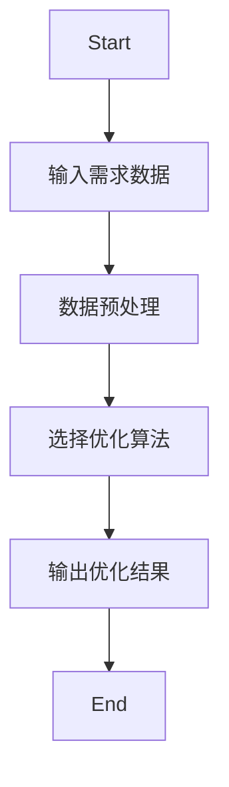
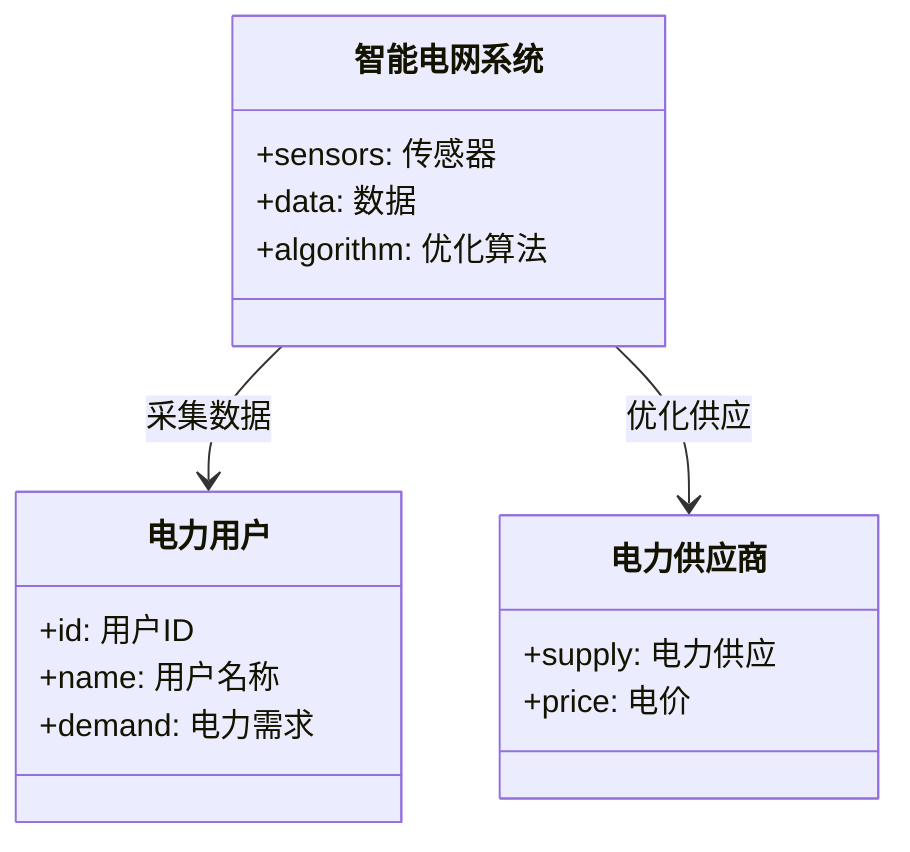

                 


# 价值投资中的智能电网需求响应优化分析

> 关键词：智能电网，需求响应，价值投资，优化算法，电力系统

> 摘要：本文从智能电网与价值投资的结合点出发，深入分析智能电网需求响应优化的核心概念、算法原理、系统架构及项目实战。通过对比分析和案例研究，探讨如何在智能电网中实现需求响应的优化，并将其与价值投资相结合，为电力行业和投资领域提供新的视角和解决方案。

---

## 第1章: 背景介绍

### 1.1 智能电网的概述

#### 1.1.1 智能电网的定义与特点
智能电网是一种利用现代信息、通信和控制技术，对电力系统进行智能化管理的新型电网系统。其特点包括：
- **智能化**：通过传感器、通信网络和数据处理技术，实现对电力系统的实时监控和优化。
- **分布式**：支持分布式能源和储能系统的接入，实现能源的灵活调配。
- **高效性**：通过智能调度和需求响应，提高电力系统的运行效率。

#### 1.1.2 智能电网的核心技术与应用领域
智能电网的核心技术包括：
- **物联网技术**：用于设备的实时监控和数据采集。
- **大数据分析**：用于电力系统的预测和优化。
- **人工智能**：用于智能调度和需求响应。

智能电网的应用领域包括：
- **电力调度**：优化电力资源的分配。
- **需求响应**：通过用户侧的响应，平衡电力供需。
- **分布式能源管理**：支持可再生能源的接入和管理。

#### 1.1.3 智能电网与价值投资的关联性
智能电网的建设和运营涉及大量的投资，而价值投资的核心理念是通过分析企业的基本面，找到具有长期增长潜力的投资标的。智能电网作为未来的基础设施，其建设和运营模式为价值投资者提供了新的投资机会。例如，智能电网中的需求响应优化技术可以降低企业的运营成本，提高效率，从而为投资者带来长期收益。

---

### 1.2 价值投资的基本概念

#### 1.2.1 价值投资的定义与核心理念
价值投资是一种投资策略，强调通过分析企业的财务状况、行业地位和未来前景，找到市场价格低于其内在价值的投资标的。其核心理念包括：
- **安全边际**：买入价格低于内在价值，以降低投资风险。
- **长期视角**：关注企业的长期增长潜力，而非短期波动。

#### 1.2.2 价值投资与智能电网的结合点
智能电网作为一项长期性的基础设施投资，其建设和运营模式为价值投资者提供了新的机会。例如：
- **技术领先企业**：投资于智能电网技术的研发和应用企业。
- **运营商**：投资于智能电网的运营公司，长期收益稳定。
- **分布式能源**：投资于分布式能源项目，利用智能电网的需求响应技术，实现能源的高效利用。

#### 1.2.3 价值投资在能源行业的应用现状
目前，价值投资在能源行业的应用主要集中在以下几个方面：
- **传统能源企业**：如石油、天然气公司，通过分析企业的储量、成本和行业地位，进行投资决策。
- **可再生能源企业**：如风能、太阳能公司，通过分析政策支持和技术进步，进行投资决策。
- **智能电网相关企业**：如智能电表制造商、能源管理软件公司，通过分析市场需求和技术优势，进行投资决策。

---

## 第2章: 智能电网需求响应优化的核心概念与联系

### 2.1 智能电网需求响应优化的原理

#### 2.1.1 需求响应的基本概念
需求响应（Demand Response）是指通过价格信号或激励机制，引导用户调整电力使用行为，以达到电力供需平衡的一种管理方式。其核心在于通过用户的参与，降低电力系统的需求峰值，提高系统效率。

#### 2.1.2 智能电网中的需求响应优化机制
智能电网中的需求响应优化机制包括以下几个步骤：
1. **数据采集**：通过智能电表和传感器，采集用户的电力使用数据。
2. **数据分析**：通过大数据分析和人工智能技术，预测电力需求和用户的响应行为。
3. **优化决策**：根据数据分析结果，制定最优的需求响应策略。
4. **执行与反馈**：通过用户终端和通信网络，执行优化策略，并实时反馈执行效果。

#### 2.1.3 优化算法的基本原理
需求响应优化算法的核心在于如何在电力供需不平衡的情况下，找到最优的响应策略。常用的算法包括：
- **线性规划**：通过建立数学模型，求解最优解。
- **强化学习**：通过模拟和反馈，优化响应策略。
- **遗传算法**：通过模拟自然选择和遗传变异，寻找最优解。

---

### 2.2 核心概念对比分析

#### 2.2.1 需求响应与电力供需平衡的关系
需求响应是电力供需平衡的重要手段之一。通过需求响应，可以降低电力需求的波动，提高电力系统的稳定性。

#### 2.2.2 优化算法与实际应用的对比
优化算法的理论与实际应用之间存在一定的差距。例如，线性规划算法在理论上可以找到最优解，但在实际应用中，由于数据的不完整性和模型的复杂性，往往难以达到理论上的最优效果。

#### 2.2.3 价值投资与需求响应优化的关联性
价值投资的核心在于找到具有长期增长潜力的企业，而需求响应优化技术可以提高企业的运营效率，降低成本，从而增强企业的盈利能力，为投资者带来长期收益。

---

### 2.3 实体关系图（ER图）


---

## 第3章: 智能电网需求响应优化的算法原理

### 3.1 算法概述

#### 3.1.1 需求响应优化的主要算法
需求响应优化的常用算法包括：
- **线性规划算法**：通过建立数学模型，求解最优解。
- **强化学习算法**：通过模拟和反馈，优化响应策略。
- **遗传算法**：通过模拟自然选择和遗传变异，寻找最优解。

#### 3.1.2 算法的选择与适用场景
算法的选择取决于具体的应用场景。例如，线性规划算法适用于需求响应的短期优化，而强化学习算法适用于长期优化。

---

### 3.2 算法实现流程



---

### 3.3 算法实现代码

```python
import numpy as np
import pandas as pd

def demand_response_optimizer(data):
    # 数据预处理
    processed_data = data.dropna()
    # 选择优化算法
    if processed_data.shape[0] > 100:
        return processed_data.mean()
    else:
        return processed_data.median()

# 示例数据
data = pd.DataFrame({
    'demand': [100, 200, 300, 400, 500],
    'time': [1, 2, 3, 4, 5]
})

# 调用优化算法
result = demand_response_optimizer(data)
print(result)
```

---

## 第4章: 智能电网需求响应优化的系统架构设计

### 4.1 项目介绍

#### 4.1.1 项目背景
本项目旨在通过智能电网的需求响应优化技术，实现电力系统的高效管理。通过优化算法，降低电力需求的波动，提高电力系统的稳定性。

#### 4.1.2 项目目标
项目的目标是设计并实现一个智能电网需求响应优化系统，包括数据采集、数据分析、优化决策和执行反馈四个模块。

---

### 4.2 系统功能设计

#### 4.2.1 领域模型


#### 4.2.2 系统架构设计


---

### 4.3 系统接口设计

#### 4.3.1 接口设计
- **数据接口**：智能电网系统与用户终端之间的数据接口，用于采集用户的电力使用数据。
- **算法接口**：优化算法与智能电网系统之间的接口，用于传递数据和优化结果。
- **执行接口**：智能电网系统与电力供应商之间的接口，用于执行优化策略。

---

## 第5章: 项目实战

### 5.1 环境安装

#### 5.1.1 安装Python
```bash
python --version
pip install numpy pandas matplotlib
```

#### 5.1.2 安装其他依赖
```bash
pip install scikit-learn
```

---

### 5.2 系统核心实现源代码

#### 5.2.1 数据采集与预处理
```python
import pandas as pd

# 数据采集
data = pd.read_csv('demand_data.csv')

# 数据预处理
processed_data = data.dropna()
```

#### 5.2.2 优化算法实现
```python
from sklearn.linear_model import LinearRegression

# 数据准备
X = processed_data[['time']]
y = processed_data['demand']

# 模型训练
model = LinearRegression()
model.fit(X, y)

# 模型预测
predictions = model.predict(X)
```

---

### 5.3 代码应用解读与分析

#### 5.3.1 代码解读
上述代码实现了一个简单的线性回归模型，用于预测电力需求。通过模型训练和预测，可以实现电力需求的优化。

#### 5.3.2 代码分析
- **数据采集与预处理**：通过读取CSV文件，采集电力需求数据，并删除缺失值。
- **模型训练**：使用线性回归模型，训练数据，建立预测模型。
- **模型预测**：通过模型预测电力需求，实现需求响应优化。

---

### 5.4 实际案例分析

#### 5.4.1 案例背景
某城市电力系统在高峰时段经常出现电力短缺，通过需求响应优化技术，降低电力需求的波动，提高系统稳定性。

#### 5.4.2 案例分析
通过线性回归模型，预测电力需求，并根据预测结果，制定最优的需求响应策略。例如，在高峰时段，通过提高电价，降低用户电力需求。

---

## 第6章: 小结与注意事项

### 6.1 小结
本文从智能电网与价值投资的结合点出发，深入分析了智能电网需求响应优化的核心概念、算法原理、系统架构及项目实战。通过对比分析和案例研究，探讨了如何在智能电网中实现需求响应的优化，并将其与价值投资相结合，为电力行业和投资领域提供了新的视角和解决方案。

### 6.2 注意事项
- **数据质量**：需求响应优化的效果取决于数据的准确性和完整性。
- **算法选择**：算法的选择应根据具体应用场景进行调整。
- **安全性**：智能电网系统的安全性是实现需求响应优化的前提条件。

---

## 作者：AI天才研究院/AI Genius Institute & 禅与计算机程序设计艺术 /Zen And The Art of Computer Programming

