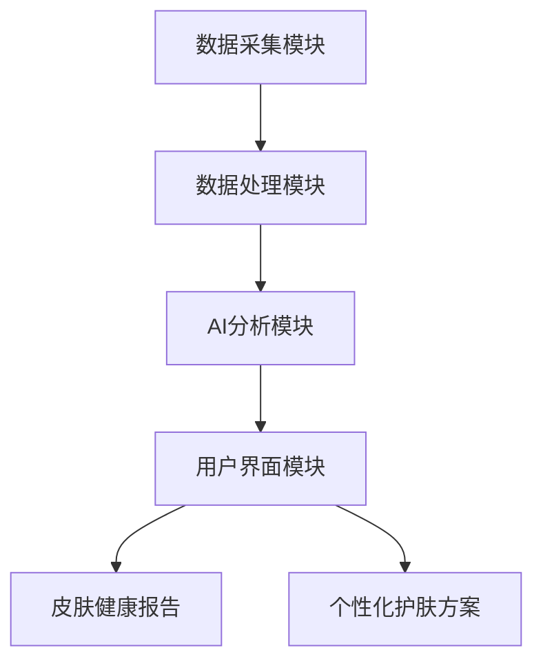
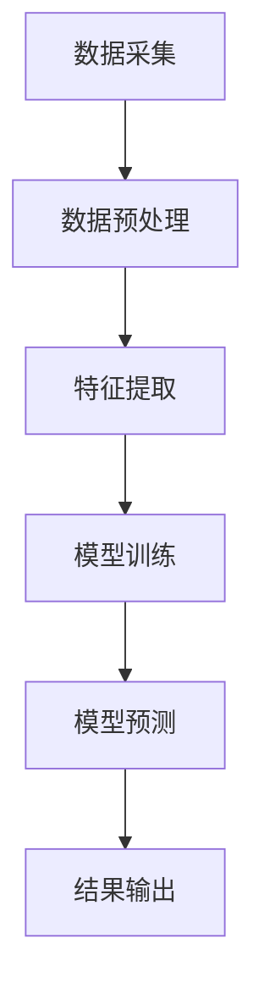

                 


# 价值投资中的智能皮肤技术商业化前景

## 关键词：价值投资、智能皮肤技术、商业化、技术分析、投资策略

## 摘要：本文从价值投资的角度，深入分析智能皮肤技术的商业化前景。通过探讨智能皮肤技术的核心技术、市场现状、商业模式和投资机会，为投资者提供数据支持和决策参考。文章结合实际案例，从技术、市场、法律等多维度进行系统分析，帮助投资者识别潜在风险，把握投资机会。

---

# 第一部分：价值投资与智能皮肤技术背景

## 第1章：价值投资与智能皮肤技术概述

### 1.1 价值投资的定义与核心理念

#### 1.1.1 价值投资的基本概念
价值投资是一种以低于公平价值的价格购买优质资产的投资策略。其核心理念是通过深入分析企业的基本面，寻找市场低估的投资标的，长期持有，获得超额收益。

- **基本面分析**：关注企业的财务状况、盈利能力、成长性和竞争优势。
- **安全边际**：买入价格低于内在价值，以降低投资风险。
- **长期主义**：价值投资强调长期持有的理念，避免短期市场波动的干扰。

#### 1.1.2 价值投资的核心理念
价值投资的核心理念包括：
1. **内在价值**：企业的真实价值由其未来现金流的现值决定。
2. **市场先生**：市场波动为理性投资者提供了低价买入的机会。
3. **Margin of Safety（安全边际）**：买入价格与内在价值的差距提供了安全空间。

#### 1.1.3 价值投资在现代金融中的地位
价值投资在现代金融中占据重要地位，尤其是在市场波动加剧、投资者寻求稳定收益的情况下，价值投资策略更受青睐。它强调深度研究和长期持有，与短期交易策略形成鲜明对比。

### 1.2 智能皮肤技术的定义与特点

#### 1.2.1 智能皮肤技术的基本概念
智能皮肤技术是一种结合了生物医学工程、人工智能和信息技术的新兴技术，用于对皮肤进行智能化分析、诊断和治疗。它通过传感器、AI算法和数据分析，实现对皮肤健康状况的实时监测和个性化护理。

- **核心技术**：光电传感器、AI算法、数据采集与处理。
- **应用场景**：医疗美容、健康管理、皮肤疾病诊断、个性化护肤。

#### 1.2.2 智能皮肤技术的核心特点
1. **精准性**：通过高精度传感器和AI算法，实现对皮肤状态的精准分析。
2. **实时性**：能够实时监测皮肤健康状况，提供即时反馈。
3. **个性化**：根据个体差异提供定制化的护肤方案。
4. **智能化**：结合AI技术，实现自动诊断和推荐。

#### 1.2.3 智能皮肤技术与传统皮肤护理的区别
智能皮肤技术与传统皮肤护理的主要区别在于技术手段和数据分析能力。传统皮肤护理依赖于经验丰富的美容师或医生的主观判断，而智能皮肤技术通过客观的数据分析提供科学依据，大幅提高了诊断的准确性和护理的精准性。

### 1.3 价值投资与智能皮肤技术的结合

#### 1.3.1 智能皮肤技术在价值投资中的应用
智能皮肤技术在价值投资中的应用主要体现在以下几个方面：
1. **市场分析**：通过分析智能皮肤技术的市场需求、竞争格局和增长潜力，评估相关企业的投资价值。
2. **企业估值**：结合企业的财务状况、技术优势和市场地位，进行合理的估值，寻找被低估的投资标的。
3. **风险控制**：通过分析智能皮肤技术的市场风险、技术风险和法律风险，制定合理的投资策略。

#### 1.3.2 价值投资视角下的智能皮肤技术商业化潜力
从价值投资的角度来看，智能皮肤技术的商业化潜力主要体现在以下几个方面：
1. **市场需求**：随着人们对健康和美的追求不断提高，智能皮肤技术的市场需求持续增长。
2. **技术创新**：AI和生物技术的快速发展为智能皮肤技术提供了坚实的技术支持。
3. **市场空间**：智能皮肤技术在医疗美容、健康管理等领域有广阔的应用前景，市场空间巨大。

#### 1.3.3 智能皮肤技术对投资决策的影响
智能皮肤技术对投资决策的影响主要体现在以下几个方面：
1. **投资标的筛选**：通过分析智能皮肤技术相关企业的技术实力、市场地位和财务状况，筛选出具有投资价值的企业。
2. **投资策略制定**：根据智能皮肤技术的市场发展趋势和竞争格局，制定合理的投资策略。
3. **风险管理**：通过分析智能皮肤技术的市场风险和法律风险，制定有效的风险管理措施。

### 1.4 本章小结
本章从价值投资和智能皮肤技术的定义、特点和结合三个方面进行了详细阐述。通过分析智能皮肤技术的核心技术和市场潜力，为后续章节的深入分析奠定了基础。

---

## 第2章：智能皮肤技术的核心技术与商业化路径

### 2.1 智能皮肤技术的核心技术

#### 2.1.1 光电传感器技术
光电传感器是智能皮肤技术的核心硬件之一，主要用于采集皮肤表面的光学信号，如颜色、纹理和温度等。常见的光电传感器包括RGB相机、光谱传感器和温度传感器。

- **RGB相机**：用于采集皮肤的颜色信息，分析皮肤的健康状况。
- **光谱传感器**：用于采集皮肤的光谱信息，分析皮肤的成分和健康状况。
- **温度传感器**：用于监测皮肤的温度变化，评估皮肤的健康状态。

#### 2.1.2 AI算法在皮肤分析中的应用
AI算法是智能皮肤技术的核心软件之一，主要用于对采集到的光学信号进行分析和处理，生成皮肤健康报告和个性化护肤方案。

- **图像处理**：通过AI算法对皮肤图像进行分割、特征提取和分类，识别皮肤问题。
- **深度学习**：利用深度学习模型（如卷积神经网络）对皮肤图像进行分类和诊断。
- **推荐系统**：基于AI算法生成个性化护肤方案，推荐合适的护肤产品。

#### 2.1.3 数据采集与处理技术
数据采集与处理技术是智能皮肤技术的关键环节，主要用于采集和处理皮肤数据，为后续分析提供支持。

- **数据采集**：通过光电传感器采集皮肤的颜色、纹理和温度等信息。
- **数据处理**：对采集到的数据进行预处理、特征提取和分析，生成皮肤健康报告。

### 2.2 智能皮肤技术的商业化路径

#### 2.2.1 市场需求分析
智能皮肤技术的市场需求主要集中在以下领域：
1. **医疗美容**：用于皮肤疾病的诊断和治疗。
2. **健康管理**：用于个人健康监测和管理。
3. **个性化护肤**：用于定制化的护肤方案。

#### 2.2.2 商业模式设计
智能皮肤技术的商业模式可以分为以下几种：
1. **硬件销售**：销售智能皮肤传感器和相关设备。
2. **软件服务**：提供基于AI算法的皮肤健康分析和个性化护肤方案。
3. **订阅模式**：通过订阅服务，提供定期的皮肤健康监测和管理。

#### 2.2.3 市场推广策略
智能皮肤技术的市场推广策略可以包括以下方面：
1. **品牌建设**：通过广告宣传、产品体验会等方式提升品牌知名度。
2. **渠道拓展**：与医疗美容机构、电商平台等合作，拓展销售渠道。
3. **用户教育**：通过教育用户智能皮肤技术的优势和应用，提升用户认知度。

### 2.3 本章小结
本章详细分析了智能皮肤技术的核心技术和商业化路径，为后续章节的市场分析和投资机会评估奠定了基础。

---

## 第3章：智能皮肤技术的市场分析与投资机会

### 3.1 智能皮肤技术的市场现状

#### 3.1.1 全球智能皮肤技术市场现状
全球智能皮肤技术市场目前处于快速发展阶段，主要驱动因素包括技术进步、市场需求增加和资本支持。

- **市场规模**：根据市场研究机构的数据，全球智能皮肤技术市场规模预计将在未来几年保持快速增长，年复合增长率超过20%。
- **主要参与者**：包括苹果、谷歌、亚马逊等科技巨头，以及一些专注于智能皮肤技术的初创企业。

#### 3.1.2 中国市场分析
中国市场是智能皮肤技术的重要市场，主要得益于国内科技企业的快速发展和政策支持。

- **市场规模**：预计未来几年中国智能皮肤技术市场规模将保持快速增长，年复合增长率超过30%。
- **主要参与者**：包括阿里巴巴、腾讯、华为等科技巨头，以及一些专注于智能皮肤技术的初创企业。

#### 3.1.3 市场规模与增长预测
根据市场研究机构的数据，全球智能皮肤技术市场规模预计将在未来几年保持快速增长，年复合增长率超过20%。中国市场规模将保持更快的增长速度，年复合增长率超过30%。

### 3.2 智能皮肤技术的投资机会

#### 3.2.1 创业公司的投资机会
创业公司可以通过以下方式抓住智能皮肤技术的投资机会：
1. **技术创新**：开发具有独特技术优势的产品，如新型光电传感器或AI算法。
2. **市场定位**：专注于特定市场领域，如医疗美容或个性化护肤。
3. **商业模式**：通过订阅模式或软件服务模式实现持续盈利。

#### 3.2.2 大型企业的投资机会
大型企业可以通过以下方式抓住智能皮肤技术的投资机会：
1. **技术合作**：与初创企业合作，获取技术优势。
2. **并购整合**：通过并购整合智能皮肤技术领域的优势企业。
3. **内部研发**：加大内部研发投入，开发具有自主知识产权的技术和产品。

#### 3.2.3 技术研发领域的投资机会
技术研发领域的投资机会主要体现在以下几个方面：
1. **AI算法优化**：投资于AI算法的优化和创新，提升智能皮肤技术的分析精度。
2. **硬件创新**：投资于新型光电传感器的研发，提升数据采集的精度和效率。
3. **系统集成**：投资于智能皮肤技术的系统集成，提升产品的用户体验和市场竞争力。

### 3.3 本章小结
本章分析了智能皮肤技术的市场现状和投资机会，为投资者提供了数据支持和决策参考。

---

## 第4章：智能皮肤技术的系统架构与实现

### 4.1 系统架构设计

#### 4.1.1 系统功能模块划分
智能皮肤技术的系统架构可以划分为以下几个功能模块：
1. **数据采集模块**：负责采集皮肤的颜色、纹理和温度等数据。
2. **数据处理模块**：负责对采集到的数据进行预处理、特征提取和分析。
3. **AI分析模块**：负责利用AI算法对皮肤数据进行分类和诊断。
4. **用户界面模块**：负责与用户的交互，展示皮肤健康报告和个性化护肤方案。

#### 4.1.2 系统架构设计图（Mermaid）


### 4.2 核心算法实现

#### 4.2.1 算法原理（Mermaid流程图）


#### 4.2.2 算法实现代码示例
```python
import numpy as np
from sklearn import svm

# 示例数据
X = np.array([[255, 255, 255], [128, 128, 128], [64, 64, 64]])
y = np.array([0, 1, 2])

# 训练模型
model = svm.SVC()
model.fit(X, y)

# 预测
print(model.predict(X))
```

#### 4.2.3 算法的数学模型和公式
智能皮肤技术的核心算法可以基于支持向量机（SVM）进行分类，其数学模型如下：
$$
\text{目标函数：} \quad \min_{w,b,\xi} \frac{1}{2}||w||^2 + C\sum_{i=1}^{n}\xi_i
$$
$$
\text{约束条件：} \quad y_i(w \cdot x_i + b) - \xi_i \geq 0, \quad \xi_i \geq 0
$$

---

## 第5章：智能皮肤技术的案例分析与投资策略

### 5.1 案例分析

#### 5.1.1 典型案例介绍
1. **案例一**：某初创公司开发了一款基于AI的智能皮肤传感器，通过RGB相机和光谱传感器采集皮肤数据，并利用深度学习模型进行皮肤健康分析。
2. **案例二**：某科技巨头开发了一款智能皮肤健康管理系统，通过手机APP和云服务提供皮肤健康监测和个性化护肤方案。

#### 5.1.2 成功经验总结
1. **技术创新**：案例一的成功在于其技术创新，特别是在光电传感器和AI算法方面的优势。
2. **市场定位**：案例二的成功在于其市场定位，通过与手机APP和云服务结合，拓展了市场空间。

### 5.2 投资策略

#### 5.2.1 短期投资策略
1. **技术驱动**：关注具有技术创新能力的企业，如在光电传感器或AI算法方面具有优势的企业。
2. **市场风险**：关注市场需求稳定、竞争格局清晰的领域，如医疗美容和个性化护肤。

#### 5.2.2 长期投资策略
1. **技术壁垒**：投资具有技术壁垒的企业，如拥有自主知识产权的光电传感器或AI算法的企业。
2. **市场空间**：关注市场空间广阔、增长潜力大的领域，如医疗美容和健康管理。

### 5.3 本章小结
本章通过案例分析和投资策略的探讨，为投资者提供了实际的操作指南。

---

## 第6章：智能皮肤技术的风险与挑战

### 6.1 智能皮肤技术的风险分析

#### 6.1.1 技术风险
智能皮肤技术面临的技术风险包括：
1. **技术瓶颈**：如光电传感器的精度和AI算法的准确性。
2. **技术更新**：如AI算法的快速迭代和技术更新。

#### 6.1.2 市场风险
智能皮肤技术面临的市场风险包括：
1. **市场竞争**：如行业内竞争加剧，价格战等。
2. **市场波动**：如市场需求变化和政策调整。

#### 6.1.3 法律风险
智能皮肤技术面临的法律风险包括：
1. **数据隐私**：如用户数据的隐私保护问题。
2. **知识产权**：如技术专利的保护和侵权问题。

### 6.2 应对策略

#### 6.2.1 技术风险应对策略
1. **加大研发投入**：通过加大研发投入，提升技术优势和竞争力。
2. **技术合作**：通过与高校、研究机构和技术公司合作，获取技术支持。

#### 6.2.2 市场风险应对策略
1. **差异化竞争**：通过差异化竞争策略，如技术创新、品牌建设等，提升市场竞争力。
2. **市场拓展**：通过市场拓展策略，如国际化布局，分散市场风险。

#### 6.2.3 法律风险应对策略
1. **合规经营**：通过合规经营，确保数据隐私和知识产权的合法性。
2. **法律咨询**：通过法律顾问和技术咨询，降低法律风险。

### 6.3 本章小结
本章分析了智能皮肤技术的风险与挑战，并提出了应对策略，为投资者提供了风险管理的参考。

---

## 第7章：智能皮肤技术的未来趋势与投资策略

### 7.1 未来趋势

#### 7.1.1 技术发展趋势
智能皮肤技术的未来发展趋势包括：
1. **技术创新**：如新型光电传感器和更先进的AI算法。
2. **多模态融合**：如结合其他传感器技术，提升数据采集和分析的精度。

#### 7.1.2 市场发展趋势
智能皮肤技术的市场发展趋势包括：
1. **个性化需求**：如个性化护肤和健康管理的市场需求持续增长。
2. **国际化布局**：如国际市场的拓展和全球化布局。

### 7.2 未来投资策略

#### 7.2.1 技术驱动型投资
1. **技术创新**：关注具有技术创新能力的企业，如在光电传感器和AI算法方面具有优势的企业。
2. **技术壁垒**：投资具有技术壁垒的企业，如拥有自主知识产权的技术。

#### 7.2.2 市场驱动型投资
1. **市场需求**：关注市场需求稳定、增长潜力大的领域，如医疗美容和个性化护肤。
2. **市场空间**：投资市场空间广阔的领域，如医疗美容和健康管理。

### 7.3 本章小结
本章分析了智能皮肤技术的未来发展趋势，并提出了相应的投资策略，为投资者提供了长期投资的参考。

---

## 附录：智能皮肤技术相关术语表

---

## 参考文献

---

作者：AI天才研究院 & 禅与计算机程序设计艺术

