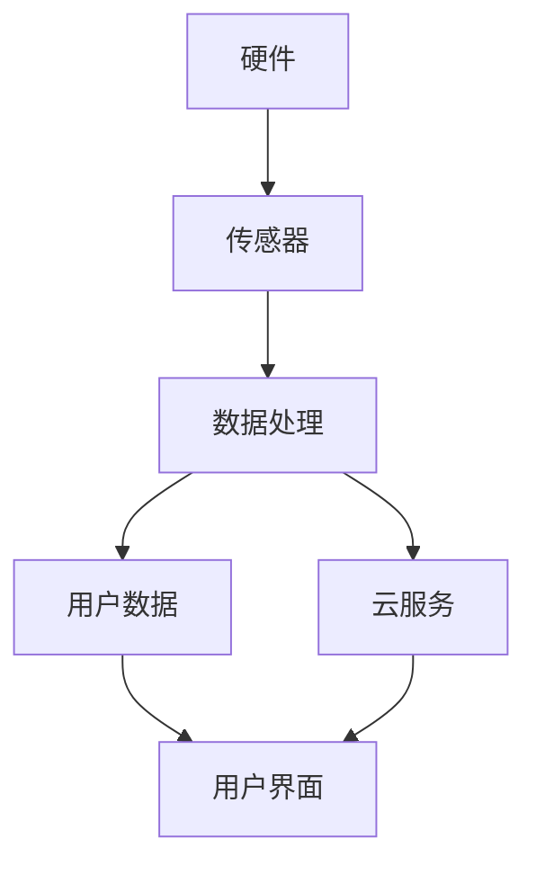
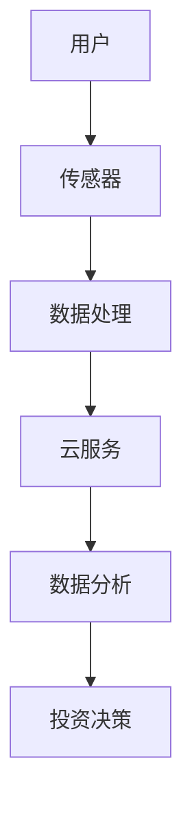

                 

# 价值投资中的智能穿戴设备生态系统分析

> 关键词：智能穿戴设备、生态系统、价值投资、数据分析、算法原理、系统架构、风险管理

> 摘要：本文从技术与商业双重视角，深入分析智能穿戴设备生态系统的投资价值，通过系统架构设计与算法原理，为价值投资者提供数据驱动的决策支持，揭示智能穿戴设备行业的市场潜力与投资机遇。

---

## 第一部分: 智能穿戴设备生态系统概述

### 第1章: 智能穿戴设备的定义与背景

#### 1.1 智能穿戴设备的定义
- **智能穿戴设备**：指可穿戴的智能设备，如智能手表、健康手环、智能眼镜等，具备数据采集、处理和通信功能，通常与手机或其他智能设备联动。

#### 1.2 智能穿戴设备的发展背景
- **技术驱动**：传感器、物联网、云计算和AI技术的进步推动了智能穿戴设备的发展。
- **市场需求**：健康监测、运动追踪、智能助手等功能满足了用户多样化需求。
- **行业现状**：全球市场规模持续增长，主要厂商包括苹果、谷歌、三星和Fitbit等。

#### 1.3 价值投资的背景
- **投资机会**：智能穿戴设备市场潜力巨大，具备长期增长空间。
- **生态系统价值**：设备与平台的协同效应是投资的关键因素。

### 第2章: 智能穿戴设备生态系统的核心概念

#### 2.1 生态系统的核心要素
| 要素 | 描述 |
|------|------|
| 硬件 | 传感器、芯片、显示屏等 |
| 软件 | 操作系统、应用程序、数据分析工具 |
| 用户 | 用户行为、数据采集与分析 |
| 服务 | 云服务、第三方应用、生态系统整合 |

#### 2.2 系统架构图

### 第3章: 生态系统中的算法原理

#### 3.1 数据采集与处理
- **传感器数据采集**：如心率、步频、环境数据。
- **数据预处理**：去噪、归一化处理。
- **特征提取**：使用PCA提取关键特征。

#### 3.2 数据分析与挖掘
- **机器学习模型**：监督学习、无监督学习。
- **时间序列分析**：预测用户行为、设备使用情况。

## 第二部分: 价值投资的算法与系统架构设计

### 第4章: 价值投资的算法原理

#### 4.1 价值投资的基本原理
- **基本面分析**：关注企业的财务状况、市场地位和竞争优势。
- **市场情绪分析**：利用自然语言处理技术分析市场情绪。

#### 4.2 生态系统价值评估模型
- **模型构建**：结合硬件、软件、用户数据等多维度评估。
- **数学模型**：使用多元回归模型预测投资价值。

### 第5章: 系统架构设计

#### 5.1 系统功能设计
- **用户数据采集**：实时采集用户行为数据。
- **数据分析**：构建用户画像，分析市场趋势。

#### 5.2 系统架构图

## 第三部分: 生态系统中的风险管理与投资策略

### 第6章: 投资中的风险管理

#### 6.1 风险识别
- **技术风险**：技术更新换代快。
- **市场风险**：市场竞争激烈。

#### 6.2 风险管理策略
- **分散投资**：降低单一投资风险。
- **动态监控**：实时跟踪市场变化。

### 第7章: 投资策略与案例分析

#### 7.1 投资策略
- **长期投资**：关注行业龙头。
- **价值挖掘**：寻找具有潜力的初创企业。

#### 7.2 案例分析
- **苹果智能手表**：市场占有率高，具备强大生态系统支持。
- **Fitbit**：健康数据采集能力强，但在市场竞争中面临挑战。

---

## 结论

智能穿戴设备生态系统具备巨大的投资价值，技术进步和市场需求共同推动其发展。通过系统架构设计和算法原理分析，投资者可以更好地识别投资机会和风险，制定科学的投资策略。未来，随着技术的不断进步，智能穿戴设备生态系统将更加完善，为价值投资者提供更多机遇。

---

**作者：AI天才研究院/AI Genius Institute & 禅与计算机程序设计艺术/Zen And The Art of Computer Programming**

