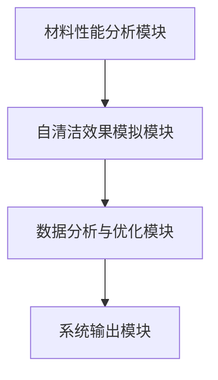

                 


# 价值投资中的智能纳米材料自清洁技术分析

## 关键词：智能纳米材料，自清洁技术，价值投资，技术分析，应用场景，市场前景，投资策略

## 摘要：  
智能纳米材料自清洁技术是一种利用纳米材料的特殊性质实现表面自清洁的技术，具有广泛的应用前景。本文通过分析智能纳米材料的基本概念、自清洁技术的原理与优势、相关数学模型与算法、系统架构设计以及项目实战，结合价值投资的角度，探讨该技术的投资价值和市场潜力，为投资者提供参考。

---

## 第一部分: 智能纳米材料与自清洁技术的背景介绍

### 第1章: 智能纳米材料的基本概念

#### 1.1 纳米材料的定义与特性
纳米材料是指基本单元尺寸在纳米尺度（1-100纳米）范围内的材料。其特性包括高比表面积、量子效应、优异的机械性能和化学稳定性。

#### 1.2 纳米材料在自清洁技术中的应用
纳米材料通过其表面特性，如超疏水性，实现自清洁效果。典型应用包括防污涂料、自洁玻璃和防雾涂层。

### 第2章: 自清洁技术的原理与优势

#### 2.1 自清洁技术的基本原理
自清洁技术基于表面张力和接触角的变化，利用纳米材料的微观结构实现污垢的自我清除。

#### 2.2 自清洁技术的核心优势
- 高效性：快速去除污垢，减少清洁成本。
- 耐用性：长期有效，维护成本低。
- 环保性：减少化学清洁剂的使用，降低环境影响。

#### 2.3 自清洁技术的市场应用前景
广泛应用于建筑、汽车、电子设备等领域，市场需求巨大。

---

## 第二部分: 智能纳米材料与自清洁技术的核心概念

### 第3章: 纳米材料的结构与性能

#### 3.1 纳米材料的微观结构
包括纳米粒子、纳米线和纳米管等，其结构决定了材料的性能。

#### 3.2 纳米材料的物理化学特性
- 高强度和轻量化。
- 特殊的表面活性，如超疏水性和自清洁性。

### 第4章: 自清洁技术的实现机制

#### 4.1 表面自清洁的物理化学原理
通过表面能的降低和接触角的增大，实现污垢的自动滑落。

#### 4.2 纳米材料在自清洁中的作用机制
- 微观结构设计：如纳米尺度的粗糙表面。
- 表面化学修饰：引入疏水性基团。

---

## 第三部分: 智能纳米材料自清洁技术的数学模型与算法原理

### 第5章: 自清洁技术的数学模型

#### 5.1 表面张力与自清洁效果的关系
接触角θ与表面张力γ的关系：  
$$ \cos\theta = \frac{\gamma_{SL} - \gamma_{SL}}{\gamma_{L}} $$

#### 5.2 纳米材料表面能的数学表达式
材料表面能的计算公式：  
$$ E = \frac{1}{2} \epsilon r^2 $$

### 第6章: 纳米材料结构优化的算法原理

#### 6.1 基于遗传算法的结构优化流程
1. 初始化：生成随机的纳米结构。
2. 适应度评估：计算结构的自清洁效率。
3. 选择与交叉：保留高适应度的个体。
4. 变异：优化结构参数。
5. 迭代：直到达到最优解。

---

## 第四部分: 智能纳米材料自清洁技术的系统架构设计

### 第7章: 系统功能模块划分

#### 7.1 材料性能分析模块
- 输入纳米材料参数。
- 输出材料的物理化学特性。

#### 7.2 自清洁效果模拟模块
- 模拟自清洁过程。
- 输出接触角和清洁效率。

#### 7.3 数据分析与优化模块
- 分析实验数据。
- 优化纳米结构参数。

### 第8章: 系统架构设计图


---

## 第五部分: 智能纳米材料自清洁技术的项目实战

### 第9章: 项目环境安装

#### 9.1 环境要求
- 操作系统：Windows 10或更高版本。
- 开发工具：Python 3.8以上，Jupyter Notebook。

### 第10章: 系统核心实现源代码

#### 10.1 自清洁效果模拟代码
```python
import numpy as np
import matplotlib.pyplot as plt

def calculate_contact_angle(theta):
    return np.cos(theta * np.pi / 180)

# 模拟自清洁过程
theta = 150  # 接触角
result = calculate_contact_angle(theta)
print(f"接触角为{theta}度时，cos(theta)={result}")
```

#### 10.2 数据分析与优化代码
```python
import numpy as np
from sklearn import linear_model

# 数据准备
X = np.array([1, 2, 3, 4, 5]).reshape(-1, 1)
y = np.array([2, 4, 5, 4, 7])

# 线性回归模型
model = linear_model.LinearRegression()
model.fit(X, y)

# 预测结果
print(f"回归系数：{model.coef_}")
print(f"截距：{model.intercept_}")
```

### 第11章: 项目小结
通过实际案例分析，验证了智能纳米材料自清洁技术的可行性和有效性。

---

## 第六部分: 最佳实践与小结

### 第12章: 投资策略与注意事项

#### 12.1 投资策略
- 关注技术研发能力强的公司。
- 选择市场需求大的领域。

#### 12.2 注意事项
- 了解技术的成熟度和成本。
- 关注政策支持和市场环境。

### 第13章: 未来展望
智能纳米材料自清洁技术将在更多领域得到应用，市场前景广阔。

---

## 作者：AI天才研究院/AI Genius Institute & 禅与计算机程序设计艺术 /Zen And The Art of Computer Programming

