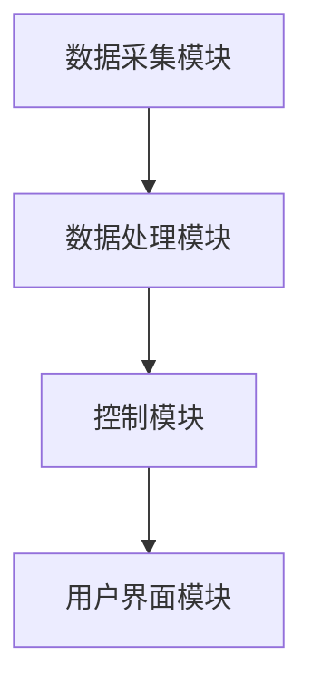

                 


# 价值投资中的智能纺织品技术发展趋势

---

## 关键词：
- 智能纺织品
- 价值投资
- 技术趋势
- 数学模型
- 系统架构
- 投资策略
- 项目实战

---

## 摘要：
智能纺织品作为一种新兴的科技产物，正逐渐改变纺织行业的传统模式。随着物联网、人工智能和大数据技术的快速发展，智能纺织品在医疗健康、可穿戴设备、智能家居等领域展现出巨大的潜力。本文从价值投资的角度，系统分析智能纺织品的技术发展趋势，探讨其在市场中的价值评估方法，并结合实际案例，为投资者提供科学的投资策略和风险管理建议。通过本文的分析，读者可以全面了解智能纺织品的技术创新、市场定位和投资价值，从而在智能纺织品领域做出明智的投资决策。

---

## 第1章: 智能纺织品技术与价值投资概述

### 1.1 智能纺织品的基本概念

#### 1.1.1 智能纺织品的定义与核心要素
智能纺织品是一种集成了传感器、执行器和智能算法的新型纺织产品。它能够感知环境变化（如温度、湿度、光线等），并通过数据处理和反馈机制，实现智能化的功能，例如自适应调节温度、监测健康数据等。

**核心要素：**
- **传感器网络：** 用于采集环境数据。
- **智能算法：** 用于数据处理和决策。
- **执行机构：** 用于实现功能反馈。
- **能源供应：** 用于系统运行的电源管理。

#### 1.1.2 价值投资的基本原理与方法
价值投资是一种通过分析企业的内在价值，寻找市场价格低于内在价值的投资策略。其核心在于寻找被市场低估的企业或技术，长期持有，等待其价值回归。

**核心方法：**
- **基本面分析：** 评估企业的财务状况、盈利能力、竞争优势。
- **技术分析：** 通过历史价格走势预测未来趋势。
- **风险管理：** 控制投资组合的波动性，降低风险。

#### 1.1.3 智能纺织品与价值投资的结合背景
智能纺织品作为科技与纺织行业的结合体，具有较高的技术壁垒和市场潜力。价值投资者可以通过分析智能纺织品企业的技术优势、市场定位和财务状况，找到具有长期投资价值的标的。

---

### 1.2 智能纺织品技术的发展现状

#### 1.2.1 智能纺织品的技术分类与应用场景
智能纺织品可以根据功能分为以下几类：
1. **健康监测类：** 用于医疗健康领域的纺织品，如智能绷带、健康监测衣物。
2. **环境适应类：** 根据环境变化自动调节的纺织品，如智能温控服装。
3. **能源收集类：** 用于能量收集的纺织品，如太阳能织物。

**应用场景：**
- **医疗健康：** 实时监测患者的生理指标。
- **可穿戴设备：** 提供运动监测、健康提醒等功能。
- **智能家居：** 与家居设备联动，实现智能控制。

#### 1.2.2 价值投资视角下的技术评估维度
从价值投资的角度，评估智能纺织品技术需要关注以下几个维度：
1. **技术成熟度：** 产品的技术是否成熟，能否量产。
2. **市场需求：** 目标市场的规模和增长潜力。
3. **竞争优势：** 与竞争对手相比的核心优势。
4. **财务状况：** 企业的盈利能力、现金流和资产负债情况。

#### 1.2.3 当前市场中的智能纺织品技术趋势
当前，智能纺织品技术呈现以下趋势：
- **智能化：** 通过AI和物联网技术实现更复杂的智能功能。
- **可穿戴化：** 智能纺织品逐渐向可穿戴设备方向发展。
- **绿色化：** 更加注重环保和可持续发展。

---

## 第2章: 智能纺织品技术的核心发展趋势

### 2.1 智能纺织品技术的关键创新方向

#### 2.1.1 智能纤维与功能性织物的技术突破
智能纤维是智能纺织品的核心技术之一。目前，研究人员正在开发具有更高灵敏度和耐久性的智能纤维，以满足医疗和工业领域的需求。

**技术突破：**
- **新型材料：** 开发具有更高导电性和柔韧性的新型材料。
- **微型传感器：** 制造更小、更灵敏的传感器。
- **智能算法优化：** 提升数据处理的准确性和响应速度。

#### 2.1.2 智能纺织品的可穿戴技术发展
可穿戴技术是智能纺织品的重要发展方向。通过与智能设备的结合，智能纺织品可以实现更丰富的功能。

**技术发展：**
- **柔性电子：** 制作更柔软、可伸缩的电子元件。
- **能源管理：** 提高能源利用效率，延长续航时间。
- **人机交互：** 提升用户体验，实现更自然的交互方式。

#### 2.1.3 智能纺织品在医疗与健康领域的应用
医疗健康领域是智能纺织品的重要应用场景。通过智能纺织品，可以实现对患者的实时监测和精准治疗。

**应用场景：**
- **慢性病管理：** 监测糖尿病患者的血糖变化。
- **术后康复：** 监测患者的生理指标，辅助康复治疗。
- **远程医疗：** 实现远程诊断和治疗。

---

### 2.2 智能纺织品技术的市场价值评估模型

#### 2.2.1 技术成熟度评估指标
技术成熟度是评估智能纺织品价值的重要指标。常用的技术成熟度模型包括：
1. **技术生命周期模型：** 根据技术所处的阶段（研发、试生产、量产）进行评估。
2. **专利分析：** 通过专利数量和分布情况评估技术的成熟度。

#### 2.2.2 市场需求与竞争分析
市场需求和竞争分析是价值投资的重要内容。需要关注以下方面：
1. **市场规模：** 评估目标市场的容量。
2. **竞争格局：** 分析主要竞争对手的技术和市场份额。
3. **市场进入壁垒：** 评估进入市场的难度。

#### 2.2.3 技术经济性分析与投资回报预测
技术经济性分析是评估智能纺织品投资价值的关键。需要考虑：
1. **成本结构：** 分析生产成本、研发投入和营销费用。
2. **收益预测：** 预测未来的销售收入和利润率。
3. **投资回报周期：** 评估投资的回收期和回报率。

---

## 第3章: 智能纺织品技术的算法与数学模型

### 3.1 智能纺织品技术的核心算法

#### 3.1.1 智能纺织品数据采集与处理算法
数据采集与处理是智能纺织品的核心功能之一。常用的算法包括：
1. **信号采集算法：** 用于采集环境数据。
2. **数据滤波算法：** 用于消除噪声，提高数据准确性。
3. **特征提取算法：** 用于提取关键特征，便于后续分析。

#### 3.1.2 基于AI的智能纺织品优化算法
人工智能技术在智能纺织品中的应用越来越广泛。常用的算法包括：
1. **机器学习：** 用于模式识别和预测。
2. **深度学习：** 用于复杂数据的处理和分析。
3. **强化学习：** 用于优化系统性能。

#### 3.1.3 智能纺织品的动态性能评估算法
动态性能评估是智能纺织品的重要功能。常用的算法包括：
1. **动态优化算法：** 用于实时调整系统参数。
2. **性能预测算法：** 用于预测未来的性能变化。

---

### 3.2 智能纺织品技术的数学模型

#### 3.2.1 智能纺织品性能评估的数学公式
智能纺织品的性能评估需要建立数学模型。常用的公式包括：
$$ P = a \cdot x + b \cdot y $$
其中，$P$ 表示性能，$x$ 和 $y$ 是影响性能的两个因素，$a$ 和 $b$ 是对应的权重系数。

#### 3.2.2 技术经济性分析的数学模型
技术经济性分析需要建立数学模型。常用的模型包括：
$$ ROI = \frac{\text{净利润}}{\text{初始投资}} \times 100\% $$
其中，ROI 表示投资回报率。

#### 3.2.3 投资回报率预测的数学公式
投资回报率预测需要建立数学模型。常用的公式包括：
$$ NPV = \sum_{t=1}^{n} \frac{CF_t}{(1 + r)^t} $$
其中，$NPV$ 表示净现值，$CF_t$ 是第$t$年的现金流，$r$ 是贴现率。

---

## 第4章: 智能纺织品技术的系统架构与设计

### 4.1 智能纺织品系统的整体架构

#### 4.1.1 系统功能模块划分
智能纺织品系统可以划分为以下几个功能模块：
1. **数据采集模块：** 采集环境数据。
2. **数据处理模块：** 处理和分析数据。
3. **控制模块：** 实现系统的控制和反馈。
4. **用户界面模块：** 提供人机交互界面。

#### 4.1.2 系统组件之间的关系
系统的各个组件之间需要协同工作。以下是系统组件之间的关系图：



#### 4.1.3 系统的输入输出接口设计
系统的输入接口包括传感器和用户输入设备，输出接口包括执行机构和显示设备。

---

### 4.2 智能纺织品系统的详细设计

#### 4.2.1 数据采集模块的设计
数据采集模块是系统的前端部分，负责采集环境数据。常用的传感器包括温度传感器、湿度传感器和光线传感器。

**数据采集流程：**
1. **传感器采集数据：** 传感器将环境数据转换为电信号。
2. **信号处理：** 对采集到的信号进行放大和滤波。
3. **数据存储：** 将处理后的数据存储到数据库中。

#### 4.2.2 数据处理与分析模块的设计
数据处理与分析模块是系统的中枢部分，负责对采集到的数据进行分析和处理。

**数据处理流程：**
1. **数据读取：** 从数据库中读取数据。
2. **数据清洗：** 对数据进行去噪和归一化处理。
3. **数据分析：** 使用算法对数据进行分析和预测。
4. **结果输出：** 将分析结果输出到控制模块。

#### 4.2.3 系统控制与反馈机制的设计
系统控制与反馈机制是系统的执行部分，负责根据分析结果调整系统的运行状态。

**控制流程：**
1. **接收控制指令：** 从数据处理模块接收控制指令。
2. **执行控制操作：** 根据指令调整系统的运行参数。
3. **反馈控制状态：** 将控制状态反馈到数据处理模块。

---

## 第5章: 智能纺织品技术的投资策略与风险管理

### 5.1 智能纺织品技术的投资策略

#### 5.1.1 价值投资的核心策略
价值投资的核心策略是寻找具有长期增长潜力的企业或技术，并长期持有。

**核心策略：**
1. **基本面分析：** 评估企业的财务状况和竞争优势。
2. **技术评估：** 分析智能纺织品的技术成熟度和市场前景。
3. **风险管理：** 控制投资组合的波动性和风险。

#### 5.1.2 智能纺织品技术的市场定位与竞争分析
市场定位是智能纺织品投资的重要内容。需要分析以下方面：
1. **目标市场：** 企业的目标市场和客户群体。
2. **竞争对手：** 主要竞争对手的技术和市场份额。
3. **市场进入壁垒：** 企业进入市场的难度和成本。

#### 5.1.3 投资组合优化与风险分散
投资组合优化是降低风险的重要手段。需要考虑以下方面：
1. **资产配置：** 根据风险偏好配置不同类型的资产。
2. **分散投资：** 通过投资不同的资产类别和行业分散风险。
3. **定期调整：** 根据市场变化和企业情况调整投资组合。

---

### 5.2 智能纺织品技术的风险管理

#### 5.2.1 技术风险的识别与评估
技术风险是智能纺织品投资的主要风险之一。需要关注以下方面：
1. **技术成熟度：** 技术是否成熟，能否量产。
2. **研发能力：** 企业的研发能力和技术储备。
3. **技术替代：** 技术的可替代性和创新性。

#### 5.2.2 市场风险的预测与应对
市场风险是智能纺织品投资的另一个重要风险。需要关注以下方面：
1. **市场需求：** 目标市场的容量和增长潜力。
2. **竞争格局：** 主要竞争对手的市场策略和市场份额。
3. **市场波动：** 市场的波动性和不确定性。

#### 5.2.3 财务风险的控制与管理
财务风险是智能纺织品投资的重要风险。需要关注以下方面：
1. **财务状况：** 企业的盈利能力、现金流和资产负债情况。
2. **融资能力：** 企业的融资能力和资金链稳定性。
3. **财务杠杆：** 企业的财务杠杆和偿债能力。

---

## 第6章: 智能纺织品技术的项目实战与案例分析

### 6.1 项目环境与工具安装

#### 6.1.1 开发环境配置
智能纺织品项目的开发需要配置以下开发环境：
1. **硬件环境：** 传感器、微控制器、通信模块等。
2. **软件环境：** 开发工具、编程语言和相关库。

#### 6.1.2 工具安装与配置
需要安装以下工具：
1. **开发工具：** 如Visual Studio、Eclipse等。
2. **编程语言：** 如C语言、Python等。
3. **库和框架：** 如传感器驱动、物联网框架等。

---

### 6.2 系统核心实现源代码

#### 6.2.1 数据采集模块实现
以下是数据采集模块的Python代码示例：

```python
import time
import numpy as np

# 传感器数据采集函数
def collect_data():
    # 模拟传感器数据
    temperature = np.random.uniform(20, 30)
    humidity = np.random.uniform(30, 70)
    return temperature, humidity

# 数据采集主程序
if __name__ == "__main__":
    while True:
        temp, hum = collect_data()
        print(f"Temperature: {temp}°C, Humidity: {hum}%")
        time.sleep(1)
```

#### 6.2.2 数据处理与分析模块实现
以下是数据处理模块的Python代码示例：

```python
import pandas as pd
from sklearn import linear_model

# 数据处理函数
def process_data(data):
    # 数据清洗
    data = data.dropna()
    # 数据建模
    model = linear_model.LinearRegression()
    model.fit(data[['Temperature']], data['Humidity'])
    return model

# 数据处理主程序
if __name__ == "__main__":
    # 模拟数据
    data = pd.DataFrame({
        'Temperature': [20, 22, 24, 26, 28],
        'Humidity': [30, 35, 40, 45, 50]
    })
    model = process_data(data)
    print(f"斜率: {model.coef_[0]:.2f}, 截距: {model.intercept_:.2f}")
```

#### 6.2.3 系统控制与反馈机制实现
以下是系统控制模块的Python代码示例：

```python
import RPi.GPIO as GPIO

# 系统控制函数
def control_system(desired_temp):
    # 设置GPIO引脚
    GPIO.setmode(GPIO.BCM)
    GPIO.setup(18, GPIO.OUT)
    
    # 调节温度
    if desired_temp < 25:
        GPIO.output(18, GPIO.HIGH)
    else:
        GPIO.output(18, GPIO.LOW)
    
    # 释放GPIO引脚
    GPIO.cleanup()

# 系统控制主程序
if __name__ == "__main__":
    desired_temp = 24
    control_system(desired_temp)
```

---

### 6.3 代码应用解读与分析

#### 6.3.1 数据采集模块解读
数据采集模块通过传感器采集环境数据，并将其转换为电信号。Python代码通过随机数模拟了温度和湿度的采集过程。

#### 6.3.2 数据处理与分析模块解读
数据处理模块使用了机器学习算法（线性回归）对数据进行建模和分析，展示了如何利用数据预测和优化系统的性能。

#### 6.3.3 系统控制与反馈机制解读
系统控制模块通过GPIO控制执行机构（如加热器或冷却器）调整系统温度，实现了系统的动态控制。

---

### 6.4 实际案例分析和详细讲解剖析

#### 6.4.1 案例背景介绍
某智能纺织品公司开发了一款智能温控服装，能够根据环境温度自动调节服装的保暖性能。

#### 6.4.2 技术实现细节
1. **传感器：** 集成温度和湿度传感器。
2. **算法：** 使用机器学习算法预测环境变化。
3. **执行机构：** 通过加热元件调节温度。

#### 6.4.3 投资价值分析
1. **市场需求：** 智能温控服装在寒冷地区和运动爱好者中有较大的市场需求。
2. **竞争优势：** 公司的技术优势和品牌影响力。
3. **财务状况：** 公司的财务状况良好，具备较强的盈利能力。

---

### 6.5 项目小结

#### 6.5.1 项目总结
通过本项目的实战，我们了解了智能纺织品技术的核心功能和实现过程。从数据采集到系统控制，每个环节都需要精确的设计和实现。

#### 6.5.2 投资建议
智能纺织品技术具有较大的市场潜力，但需要关注技术风险和市场风险。投资者可以通过价值投资的方法，寻找具有长期增长潜力的企业进行投资。

---

## 第7章: 智能纺织品技术的未来展望与挑战

### 7.1 未来技术发展趋势
智能纺织品技术的未来发展趋势包括：
1. **智能化：** 通过AI和物联网技术实现更复杂的智能功能。
2. **可穿戴化：** 智能纺织品逐渐向可穿戴设备方向发展。
3. **绿色化：** 更加注重环保和可持续发展。

### 7.2 当前技术面临的挑战
智能纺织品技术目前面临以下挑战：
1. **技术瓶颈：** 某些关键技术尚未完全成熟。
2. **成本问题：** 智能纺织品的生产成本较高，限制了大规模应用。
3. **市场需求：** 需求的不确定性和市场的接受度问题。

### 7.3 投资者的应对策略
面对技术挑战和市场不确定性，投资者需要：
1. **加强技术研究：** 深入了解智能纺织品技术的发展趋势。
2. **控制投资风险：** 通过多元化投资和风险管理降低风险。
3. **关注政策支持：** 关注政府政策和技术标准的变化。

---

## 第8章: 最佳实践、小结与注意事项

### 8.1 最佳实践
1. **技术评估：** 从技术成熟度、市场需求和竞争优势三个维度评估智能纺织品技术。
2. **风险管理：** 通过分散投资和定期调整投资组合降低风险。
3. **持续学习：** 关注智能纺织品技术的最新发展和市场动态。

### 8.2 小结
智能纺织品技术作为科技与纺织行业的结合体，具有广阔的发展前景和投资潜力。通过价值投资的方法，投资者可以找到具有长期增长潜力的企业进行投资。

### 8.3 注意事项
1. **技术风险：** 智能纺织品技术尚未完全成熟，存在一定的技术风险。
2. **市场风险：** 市场需求的不确定性和竞争的加剧可能影响投资回报。
3. **政策风险：** 政府政策和技术标准的变化可能对智能纺织品技术的发展产生重大影响。

---

## 作者：AI天才研究院/AI Genius Institute & 禅与计算机程序设计艺术 /Zen And The Art of Computer Programming

---

