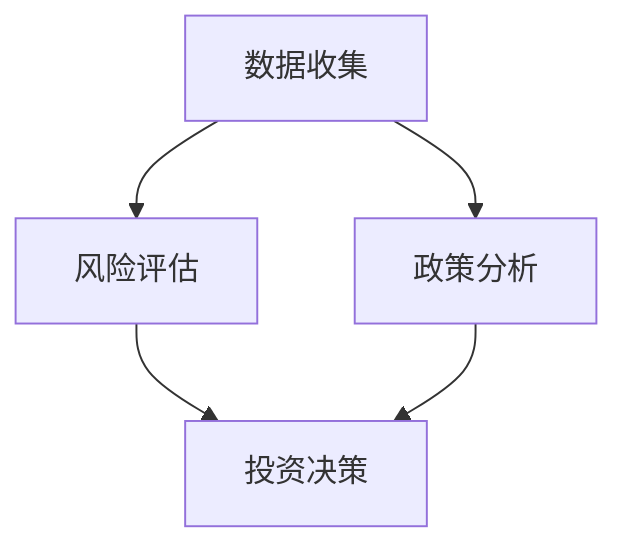

                 


```markdown
# 价值投资中的气候变化风险考量

> 关键词：价值投资、气候变化、风险管理、可持续投资、企业价值、风险评估、投资策略

> 摘要：本文探讨了气候变化对投资决策的影响，介绍了如何将气候变化因素纳入价值评估，通过数学模型和实际案例分析，展示了气候变化风险对不同行业和企业的影响，以及如何制定相应的投资策略。

---

## 第1章 价值投资与气候变化的背景

### 1.1 价值投资的基本概念
- 价值投资定义：寻找市场价格低于内在价值的证券进行投资。
- 核心理念：寻找市场先生的情绪化定价，利用市场的非理性获得超额收益。
- 主要策略：深入分析企业的基本面，关注财务指标、行业地位和竞争优势。

### 1.2 气候变化的定义与影响
- 气候变化定义：长期天气模式的显著变化，由自然和人为因素引起。
- 主要影响：极端天气事件增多，如洪水、干旱、飓风等，对经济活动产生重大影响。
- 企业层面：能源成本上升、供应链中断、碳排放罚款、品牌声誉风险。

### 1.3 气候变化与投资的关联
- 气候变化已成为影响企业价值的重要因素。
- 政府政策变化，如碳税、排放限制，直接影响企业成本和利润。
- 行业差异显著，高碳行业面临转型压力，低碳行业迎来发展机遇。

---

## 第2章 气候变化风险的核心概念与联系

### 2.1 气候变化风险的分类
- **物理风险（Physical Risk）**：气候变化导致的极端天气事件对企业造成的直接损失。
- **转型风险（Transition Risk）**：为应对气候变化而进行的政策、技术或市场结构调整带来的风险。
- **法律与政策风险（Regulatory Risk）**：与气候变化相关的法律法规变化带来的风险。

### 2.2 企业层面的气候变化影响
- **碳排放成本**：直接或间接的碳排放对企业利润的影响。
- **供应链中断**：气候变化可能导致原材料供应不稳定，增加企业的运营风险。
- **品牌声誉**：高碳排放企业可能面临消费者和投资者的负面看法，影响品牌价值。

### 2.3 气候变化风险的量化方法
- **碳足迹计算**：企业整个生命周期的温室气体排放量，分为直接排放（Scope 1）和间接排放（Scope 2）。
- **情景分析法**：基于不同气候变化情景（如温升1.5°C、2°C）评估企业未来表现。
- **风险概率模型**：结合历史数据和气候模型预测风险发生的可能性。

---

## 第3章 价值投资中的气候变化风险管理

### 3.1 现有投资模型的局限性
- 传统DCF模型未充分考虑碳排放成本。
- 忽略了政策变化对企业未来现金流的影响。
- 未将气候变化风险纳入企业估值的关键因素。

### 3.2 纳入气候变化因素的改进模型
- **调整现金流模型**：在DCF模型中加入碳排放成本的折现。
- **情景分析法**：在不同气候变化情景下评估企业的未来价值。
- **政策敏感性分析**：评估碳税、排放限制等政策变化对企业估值的影响。

### 3.3 投资策略的调整
- **行业选择**：优先选择低碳排放、适应性强的行业。
- **企业筛选**：选择碳排放管理能力强、具有可持续竞争优势的企业。
- **风险对冲**：通过投资于不同行业的资产来分散气候变化风险。

---

## 第4章 气候变化风险的数学模型与算法

### 4.1 碳排放对利润的影响公式
$$ 利润 = 收入 - 成本 - 碳排放成本 $$
- **收入**：企业的总收入。
- **成本**：生产成本、运营成本等。
- **碳排放成本**：碳税、许可证费用等。

### 4.2 气候变化风险量化模型
$$ 风险值 = 气候影响 × 概率 × 时间价值 $$
- **气候影响**：气候变化对企业造成的损失程度。
- **概率**：气候事件发生的概率。
- **时间价值**：考虑资金的时间价值，使用贴现率进行调整。

### 4.3 举例说明
- 假设某制造企业年收入1000万元，年成本800万元，碳排放成本为50万元。如果不考虑气候变化风险，净利润为150万元。如果预计未来碳排放成本将增加到200万元，净利润将降至50万元。

---

## 第5章 系统架构与投资策略

### 5.1 系统架构设计
- **数据收集模块**：收集企业的碳排放数据、行业数据、政策信息。
- **风险评估模块**：使用数学模型评估气候变化对企业价值的影响。
- **投资决策模块**：根据评估结果制定投资策略。



### 5.2 投资策略的实现
- **行业分析**：选择碳排放低、适应性强的行业。
- **企业筛选**：评估企业的碳排放管理能力。
- **动态调整**：根据气候变化政策变化及时调整投资组合。

---

## 第6章 项目实战与代码实现

### 6.1 环境安装
- **Python环境**：安装Python和必要的库，如pandas、numpy、scipy。
- **数据获取**：从公开数据源获取企业的碳排放数据和财务数据。

### 6.2 核心代码实现
```python
import numpy as np
import pandas as pd

# 示例数据：企业A和企业B的碳排放和财务数据
data = {
    '企业': ['A', 'B'],
    '收入': [1000, 1200],
    '成本': [800, 900],
    '碳排放（万吨）': [5, 3],
    '碳排放成本（元/吨）': [50, 60]
}

df = pd.DataFrame(data)

# 计算利润
df['利润'] = df['收入'] - df['成本'] - df['碳排放（万吨）'] * df['碳排放成本（元/吨）']

print(df)
```

### 6.3 结果分析
- 企业A的利润为：1000 - 800 - 5*50 = 150万元。
- 企业B的利润为：1200 - 900 - 3*60 = 120万元。
- 根据碳排放成本的变化，企业A的利润将受到更大的影响，可能不是最佳投资标的。

---

## 第7章 总结与展望

### 7.1 本章小结
- 气候变化已成为影响投资决策的重要因素。
- 通过改进的DCF模型和情景分析法，可以更好地评估气候变化风险。
- 投资者应关注低碳行业，选择碳排放管理能力强的企业。

### 7.2 未来研究方向
- 更精细的行业分析和企业层面的气候变化影响。
- 动态气候变化模型的应用。
- 新兴技术（如碳捕获、可再生能源）对企业价值的影响。

---

## 作者：AI天才研究院/AI Genius Institute & 禅与计算机程序设计艺术 /Zen And The Art of Computer Programming

---

感谢您的阅读！希望本文对您在价值投资中的气候变化风险考量有所帮助。如需进一步探讨或获取更多资料，请随时联系。
```

