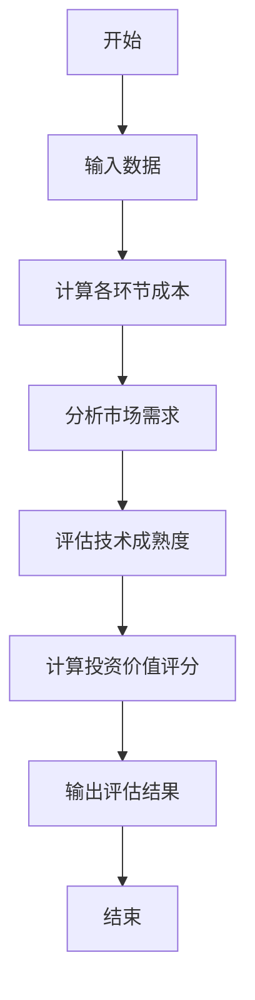
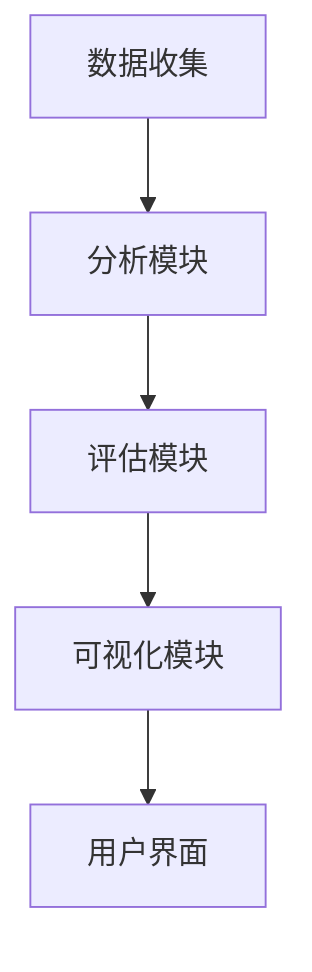
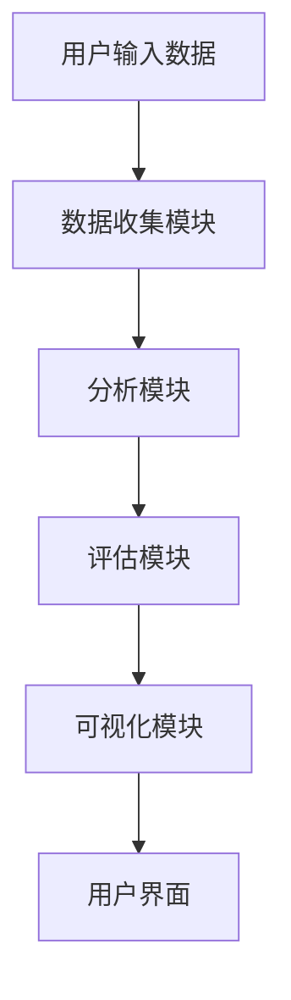

                 


# 价值投资中的氢能源产业链分析

---

## 关键词：
氢能源、产业链、价值投资、制氢、储氢、运氢、用氢

---

## 摘要：
本文从氢能源产业链的各个核心环节入手，分析其对投资价值的影响。通过详细讲解制氢、储氢、运氢和用氢四个环节的技术特点、成本结构和市场需求，构建一个系统化的分析框架。结合实际案例，利用Mermaid流程图和Python代码，展示如何通过算法评估氢能源企业的投资价值，为投资者提供科学的决策依据。

---

## 第一部分：氢能源产业链背景与价值投资概述

### 第1章：氢能源产业链概述

#### 1.1 氢能源的基本概念

氢能是一种清洁的能源，其化学能可以通过燃烧或燃料电池转化为电能，具有零碳排放的优势。氢能的应用范围广泛，包括交通、工业、建筑等领域。

- **1.1.1 氢能的定义与特点**
  - 氢能是通过氢气（H₂）燃烧或反应释放的能量。
  - 氢能具有高能量密度，单位质量的能量远高于传统化石燃料。
  - 氢能是零碳能源，燃烧只产生水，无污染物排放。

- **1.1.2 氢能的优势与挑战**
  - 优势：环保、可再生、应用广泛。
  - 挑战：制氢成本高、储存和运输困难、技术成熟度不足。

#### 1.2 氢能源产业链的构成

氢能源产业链包括制氢、储氢、运氢和用氢四个环节，每个环节的技术和市场地位直接影响整个产业链的投资价值。

- **1.2.1 制氢环节**
  - 制氢技术种类：电解水制氢、化石燃料制氢、天然气制氢等。
  - 成本结构：电费、水费、催化剂费用等。

- **1.2.2 储氢环节**
  - 储氢技术种类：高压气态储氢、液态储氢、固态储氢等。
  - 安全性：储氢容器的设计和材料直接影响储存安全。

- **1.2.3 运氢环节**
  - 运输方式：管道运输、液氢运输、高压气瓶运输。
  - 经济性：运输成本受距离和运输量影响。

- **1.2.4 用氢环节**
  - 应用领域：燃料电池汽车、工业生产、发电等。
  - 市场需求：不同应用场景对氢气纯度和压力的要求不同。

#### 1.3 价值投资的基本原理

价值投资是一种通过分析企业的基本面，寻找被市场低估的投资标的的投资方法。

- **1.3.1 价值投资的定义**
  - 价值投资是通过深入分析企业的财务状况、行业地位和竞争优势，寻找具有长期投资价值的企业。

- **1.3.2 价值投资的核心理念**
  - 价格是价值的映射，市场的短期波动不应影响长期投资决策。
  - 投资者应关注企业的内在价值，而非市场的短期情绪。

- **1.3.3 价值投资与氢能源产业链的结合**
  - 氢能源产业作为新兴行业，具有较大的增长潜力。
  - 通过分析产业链各环节的成本结构、市场需求和竞争格局，发现具有投资价值的企业。

---

## 第二部分：氢能源产业链的核心概念与联系

### 第2章：氢能源产业链的核心环节分析

#### 2.1 制氢环节的分析

制氢是氢能源产业链的起点，制氢技术的种类和成本直接影响氢气的供应能力。

- **2.1.1 制氢技术的种类与特点**
  - 电解水制氢：使用可再生能源发电，制取绿氢，成本较高。
  - 化石燃料制氢：利用天然气或煤进行蒸汽 reforming，成本较低，但会产生二氧化碳。
  - 其他制氢技术：如甲烷裂解制氢、核能制氢等。

- **2.1.2 不同制氢技术的成本与效率对比**
  - 制氢成本主要取决于能源价格和设备折旧。
  - 电解水制氢的效率较低，但随着可再生能源成本的下降，竞争力逐步提升。

#### 2.2 储氢环节的分析

储氢是氢气从生产地输送到消费地的关键环节，储氢技术的安全性和经济性直接影响氢气的可用性。

- **2.2.1 储氢技术的种类与特点**
  - 高压气态储氢：成本低，但储存压力高，安全性要求高。
  - 液态储氢：储存密度高，适合长距离运输，但液化过程能耗大。
  - 固态储氢：安全性高，但储存和释放效率较低。

- **2.2.2 不同储氢技术的安全性和成本对比**
  - 高压气态储氢的安全性较高，但储存压力需要特殊设备。
  - 液态储氢的成本较高，但储存密度高，适合远距离运输。
  - 固态储氢的安全性最佳，但储存和释放效率较低。

#### 2.3 运氢环节的分析

运氢是氢气从生产地输送到消费地的关键环节，运输方式的选择直接影响氢气的经济性和安全性。

- **2.3.1 运氢方式的种类与特点**
  - 管道运输：成本低，适合大规模长距离运输，但初始投资大。
  - 液氢运输：适合短距离运输，但需要液化和再气化设备。
  - 高压气瓶运输：灵活性高，但运输成本较高。

- **2.3.2 不同运氢方式的经济性和可行性对比**
  - 管道运输的经济性最佳，但需要较高的初始投资。
  - 液氢运输的储存密度高，但液化和再气化过程能耗大。
  - 高压气瓶运输的灵活性高，但运输成本较高。

#### 2.4 用氢环节的分析

用氢是氢能源产业链的终点，氢气的应用领域和市场需求直接影响氢气的消费量。

- **2.4.1 氢能的应用领域与市场规模**
  - 交通领域：燃料电池汽车是主要应用。
  - 工业领域：用于合成氨、炼油等过程。
  - 建筑领域：用于热电联供系统。

- **2.4.2 不同应用场景下的氢能源需求分析**
  - 交通领域对氢气的需求量大，但对氢气纯度要求高。
  - 工业领域对氢气的需求量稳定，但对成本敏感。
  - 建筑领域对氢气的需求量较小，但对热效率要求高。

### 第3章：氢能源产业链各环节的价值分析

#### 3.1 制氢环节的价值分析

制氢环节的成本结构和市场地位直接影响氢气的供应能力，进而影响整个产业链的投资价值。

- **3.1.1 制氢技术的成本结构分析**
  - 电费：制氢成本的主要组成部分，尤其是电解水制氢。
  - 催化剂费用：影响制氢效率，但随着技术进步，成本逐渐下降。
  - 维护费用：设备维护和更换费用。

- **3.1.2 不同制氢技术的市场地位对比**
  - 电解水制氢的市场地位逐渐提升，随着可再生能源成本下降。
  - 化石燃料制氢的市场地位仍然较高，但面临碳排放限制。

#### 3.2 储氢环节的价值分析

储氢环节的技术特性和市场需求直接影响氢气的储存和运输能力，进而影响整个产业链的投资价值。

- **3.2.1 储氢技术的技术特性分析**
  - 高压气态储氢：储存压力高，但储存容量有限。
  - 液态储氢：储存密度高，但液化过程能耗大。
  - 固态储氢：安全性高，但储存和释放效率较低。

- **3.2.2 不同储氢技术的市场需求对比**
  - 高压气态储氢：市场需求稳定，但应用场景有限。
  - 液态储氢：市场需求逐渐增加，但技术门槛高。
  - 固态储氢：市场需求潜力大，但技术成熟度不足。

#### 3.3 运氢环节的价值分析

运氢环节的经济性和安全性直接影响氢气的供应能力和成本，进而影响整个产业链的投资价值。

- **3.3.1 运氢方式的经济性分析**
  - 管道运输：经济性最佳，但初始投资大。
  - 液氢运输：经济性次之，但适合长距离运输。
  - 高压气瓶运输：经济性较差，但灵活性高。

- **3.3.2 不同运氢方式的安全性对比**
  - 管道运输：安全性高，但需要定期维护。
  - 液氢运输：安全性较高，但需要专业设备。
  - 高压气瓶运输：安全性一般，但灵活性高。

#### 3.4 用氢环节的价值分析

用氢环节的市场需求和应用潜力直接影响氢气的消费量和整个产业链的投资价值。

- **3.4.1 氢能应用领域的市场需求分析**
  - 交通领域：市场需求潜力大，但需要较高的基础设施投资。
  - 工业领域：市场需求稳定，但对成本敏感。
  - 建筑领域：市场需求潜力小，但对热效率要求高。

- **3.4.2 不同应用场景的投资价值对比**
  - 交通领域：投资价值较高，但需要较高的初期投资。
  - 工业领域：投资价值稳定，但技术门槛高。
  - 建筑领域：投资价值较低，但市场需求潜力小。

---

## 第三部分：氢能源产业链价值评估算法原理

### 第4章：氢能源产业链价值评估算法

#### 4.1 算法原理概述

通过分析氢能源产业链各环节的成本、市场需求和技术成熟度，构建一个综合评估模型，量化各环节的投资价值。

- **4.1.1 算法输入**
  - 各环节的成本数据
  - 市场需求数据
  - 技术成熟度数据

- **4.1.2 算法输出**
  - 各环节的投资价值评分
  - 整个产业链的投资价值评估结果

#### 4.2 算法流程图



#### 4.3 算法实现代码

```python
def calculate_investment_value(costs, demand, technology_maturity):
    investment_value = 0
    for i in range(len(costs)):
        value = costs[i] * demand[i] / technology_maturity[i]
        investment_value += value
    return investment_value

# 示例数据
costs = [10, 15, 20, 25]
demand = [5, 7, 6, 8]
technology_maturity = [0.8, 0.7, 0.6, 0.9]

investment_value = calculate_investment_value(costs, demand, technology_maturity)
print("投资价值 =", investment_value)
```

#### 4.4 数学模型与公式

投资价值的计算公式为：

$$
\text{投资价值} = \sum_{i=1}^{n} \frac{\text{成本}_i \times \text{需求}_i}{\text{技术成熟度}_i}
$$

其中，$n$ 是氢能源产业链的环节数。

---

## 第四部分：氢能源产业链系统架构设计方案

### 第5章：系统架构设计

#### 5.1 项目介绍

设计一个氢能源产业链价值评估系统，包括数据收集、分析模块、评估模块和可视化模块。

#### 5.2 系统功能设计

- **数据收集模块**
  - 收集氢能源产业链各环节的成本、市场需求和技术成熟度数据。
- **分析模块**
  - 使用加权评分法对各环节进行评估。
- **评估模块**
  - 计算整个产业链的投资价值。
- **可视化模块**
  - 展示各环节的投资价值评分和整个产业链的投资价值评估结果。

#### 5.3 系统架构设计



#### 5.4 系统接口设计

- 数据输入接口：接收氢能源产业链各环节的成本、市场需求和技术成熟度数据。
- 数据输出接口：输出各环节的投资价值评分和整个产业链的投资价值评估结果。

#### 5.5 系统交互流程图



---

## 第五部分：项目实战

### 第6章：氢能源产业链价值评估案例分析

#### 6.1 环境安装

安装必要的软件和工具，包括Python编程环境和Mermaid图表工具。

#### 6.2 核心实现

实现氢能源产业链价值评估算法，包括数据收集、分析模块、评估模块和可视化模块。

#### 6.3 应用解读与分析

通过具体案例，分析氢能源产业链各环节的投资价值，并展示可视化结果。

#### 6.4 项目小结

总结项目实施过程中的经验和教训，提出改进建议。

---

## 第六部分：最佳实践与总结

### 第7章：最佳实践

#### 7.1 小结

通过本文的分析，我们可以得出氢能源产业链各环节的投资价值评分，并基于此进行投资决策。

#### 7.2 注意事项

- 数据的准确性和完整性直接影响评估结果。
- 技术的成熟度和市场需求的变化会影响投资价值。
- 投资者应关注政策变化和行业动态。

#### 7.3 拓展阅读

- 《氢能源技术与应用》
- 《价值投资策略》
- 《能源市场分析》

---

## 作者：AI天才研究院/AI Genius Institute & 禅与计算机程序设计艺术 /Zen And The Art of Computer Programming

