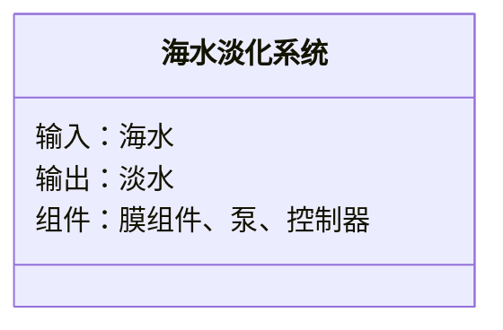
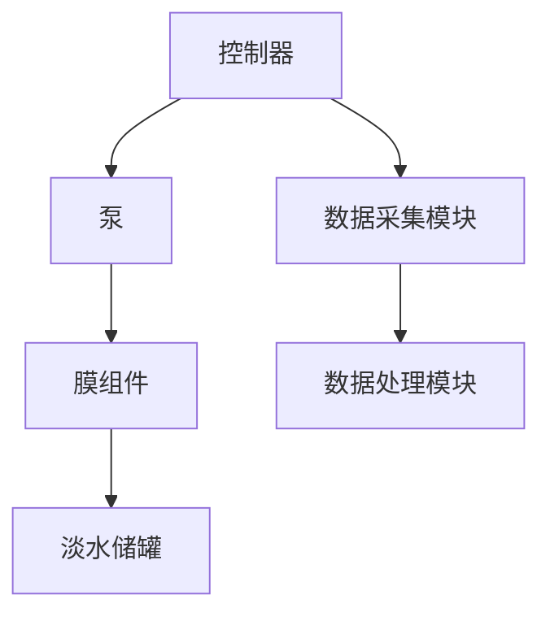
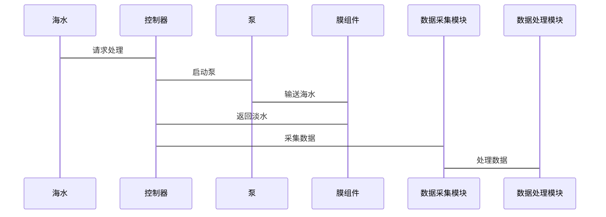

                 


# 价值投资中的海水淡化技术前景

> 关键词：海水淡化、价值投资、技术分析、投资前景、财务模型

> 摘要：本文从价值投资的角度，深入分析海水淡化技术的市场前景、技术优势和投资潜力。通过技术原理、成本分析、财务模型等多维度的探讨，为投资者提供科学的决策依据。

---

# 第1章 背景介绍

## 1.1 海水淡化的概念与发展

### 1.1.1 海水淡化的定义与基本原理

海水淡化是指通过技术手段将海水中的盐分和其他杂质去除，获得可利用的淡水的过程。其基本原理包括物理、化学和生物等多学科技术的结合，目前主要采用反渗透（RO）、蒸馏法（MSF）和多级闪蒸（MSF）等技术。

$$
\text{海水淡化的核心目标是：} \quad \text{将海水转化为可饮用水或工业用水。}
$$

### 1.1.2 海水淡化的技术发展历程

海水淡化技术的发展经历了多个阶段，从早期的蒸馏法到现代的反渗透技术，逐步实现了成本的降低和效率的提升。

- **早期技术（20世纪初）**：主要采用蒸馏法，成本高、能耗大。
- **技术改进（20世纪中叶）**：引入多级闪蒸技术和反渗透技术，显著降低能耗。
- **现代技术（21世纪）**：反渗透技术成为主流，同时结合智能化和自动化控制，进一步提升效率。

### 1.1.3 海水淡化的经济价值与社会意义

海水淡化不仅是解决水资源短缺的重要手段，也是推动经济发展和社会可持续发展的重要基础。通过海水淡化技术，可以为沿海城市提供稳定的水资源，支持工业生产和居民生活。

$$
\text{海水淡化的社会意义：} \quad \text{保障水资源安全，促进经济发展。}
$$

## 1.2 投资背景与价值分析

### 1.2.1 价值投资的基本概念与策略

价值投资是一种长期投资策略，注重分析公司的基本面，寻找市场价格低于内在价值的投资标的。其核心在于通过深入分析公司的财务状况、行业地位和技术优势，挖掘被市场低估的投资机会。

### 1.2.2 海水淡化行业的投资价值驱动因素

海水淡化行业的投资价值主要由以下几个因素驱动：

1. **市场需求**：全球水资源短缺问题日益严重，海水淡化需求持续增长。
2. **技术进步**：反渗透技术的不断改进降低了成本，提高了效率。
3. **政策支持**：各国政府纷纷出台政策支持海水淡化技术的研发和应用。
4. **行业竞争格局**：龙头企业在技术、成本和市场占有率上的优势。

### 1.2.3 行业发展的现状与未来趋势

目前，全球海水淡化市场主要集中在中东、北非和美国等地。未来，随着技术的进一步成熟和成本的降低，海水淡化技术将在更多地区得到广泛应用，市场规模将进一步扩大。

$$
\text{未来趋势：} \quad \text{海水淡化技术将向高效、低成本方向发展，市场规模持续扩大。}
$$

---

# 第2章 核心概念与联系

## 2.1 海水淡化的技术原理

### 2.1.1 反渗透技术的核心原理

反渗透技术是目前最常用的海水淡化技术之一。其原理是通过高分子膜将海水中的盐分和其他杂质阻挡，仅允许水分子通过。

$$
\text{反渗透技术的关键指标：} \quad \text{膜的孔隙率、过滤效率和能耗。}
$$

### 2.1.2 蒸馏法与膜分离技术的对比分析

蒸馏法和膜分离技术在海水淡化中的应用各有优劣：

| 技术 | 优点 | 缺点 |
|------|------|------|
| 蒸馏法 | 成熟可靠 | 能耗高、成本高 |
| 膜分离技术 | 能耗低、效率高 | �易受污染、维护成本高 |

### 2.1.3 其他海水淡化技术的优劣势分析

除了反渗透和蒸馏法，其他技术如电渗析和多级闪蒸也有一定的应用，但总体来看，反渗透技术仍占据主导地位。

---

# 第3章 算法原理讲解

## 3.1 海水淡化技术的成本分析模型

### 3.1.1 成本构成分解

海水淡化的成本主要包括：

1. **设备投资**：膜组件、泵、管道等。
2. **运营成本**：能源消耗、维护费用、药剂成本等。
3. **其他成本**：土地、人工等。

### 3.1.2 成本优化的数学模型

通过构建数学模型，可以对海水淡化技术的成本进行优化分析。以下是一个简化的成本模型：

$$
\text{总成本} = \text{设备投资} + \text{运营成本} + \text{其他成本}
$$

### 3.1.3 实例分析与优化建议

通过具体案例分析，可以发现反渗透技术的成本优势。例如，某海水淡化项目通过优化膜组件的清洗周期和降低能源消耗，显著降低了运营成本。

---

# 第4章 系统分析与架构设计方案

## 4.1 系统功能设计

### 4.1.1 领域模型

通过构建领域模型，可以清晰地了解海水淡化系统的各个组成部分及其相互关系。以下是一个简单的领域模型类图：



### 4.1.2 系统架构设计

以下是海水淡化系统的架构设计图：



### 4.1.3 接口设计

系统主要接口包括：

1. **输入接口**：海水进入系统。
2. **输出接口**：淡水输出和浓盐水排放。
3. **控制接口**：与控制器连接，实现系统自动化运行。

### 4.1.4 交互流程

以下是系统的交互流程图：



---

# 第5章 项目实战

## 5.1 海水淡化项目的环境安装

### 5.1.1 硬件安装

硬件安装包括膜组件、泵、控制器等设备的安装和调试。以下是一个简单的安装流程：

1. **设备安装**：安装膜组件、泵和控制器。
2. **连接管道**：确保海水和淡水管道连接正确。
3. **系统调试**：测试系统运行是否正常。

### 5.1.2 软件安装

软件安装包括数据采集模块和数据处理模块的安装。以下是Python代码示例：

```python
import pandas as pd

# 读取数据
data = pd.read_csv('data.csv')

# 数据处理
data['cost'] = data['investment'] * 0.05  # 假设投资回报率为5%
```

## 5.2 核心系统实现

### 5.2.1 核心代码实现

以下是反渗透系统的Python代码实现：

```python
class ROSystem:
    def __init__(self, membrane, pump):
        self.membrane = membrane
        self.pump = pump

    def process_water(self, seawater):
        # 处理海水
       淡水 = self.membrane.filter(seawater)
        return 淡水

    def calculate_cost(self):
        return self.pump.energy_consumption + self.membrane.maintenance_cost
```

### 5.2.2 代码解读与分析

上述代码定义了一个反渗透系统的类，包含膜组件和泵的初始化、海水处理和成本计算功能。通过该类可以实现海水淡化系统的模拟运行。

## 5.3 案例分析与解读

### 5.3.1 典型案例分析

以下是一个海水淡化项目的案例分析：

1. **项目背景**：某沿海城市面临水资源短缺问题，计划建设一个海水淡化厂。
2. **技术选择**：采用反渗透技术，设计处理能力为10万吨/天。
3. **投资分析**：设备投资为5000万美元，运营成本为每年100万美元，投资回报期为5年。

### 5.3.2 投资分析与解读

通过对上述案例的分析，可以得出以下结论：

1. **技术选择**：反渗透技术是最佳选择，成本低、效率高。
2. **投资回报**：项目投资回报期短，具有较高的投资价值。

---

# 第6章 总结与展望

## 6.1 总结

本文从价值投资的角度，深入分析了海水淡化技术的市场前景、技术优势和投资潜力。通过技术原理、成本分析、财务模型等多维度的探讨，为投资者提供了科学的决策依据。

## 6.2 展望

未来，随着技术的进一步成熟和成本的降低，海水淡化技术将在更多地区得到广泛应用，市场规模将进一步扩大。同时，智能化和自动化技术的应用将显著提升海水淡化的效率和降低成本。

---

# 作者：AI天才研究院 & 禅与计算机程序设计艺术

