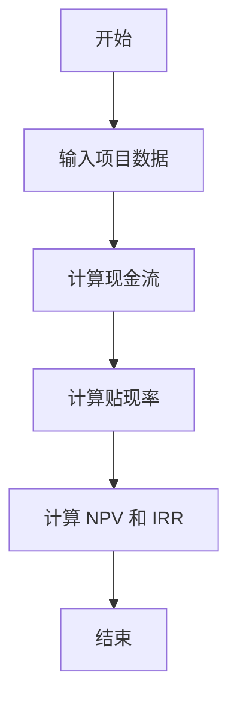

                 


# 《价值投资中的海洋可再生能源开发技术前景》

> 关键词：价值投资，海洋可再生能源，净现值（NPV），内部收益率（IRR），海洋能源开发技术

> 摘要：本文探讨了海洋可再生能源开发的技术前景及其在价值投资中的潜力。通过分析海洋能源的类型、技术特点、经济模型和投资评估方法，结合实际案例，揭示了海洋能源开发的投资机会和挑战。文章从背景介绍、核心概念、算法原理、系统分析、项目实战和最佳实践等多个方面展开，为投资者提供深度的技术和经济分析。

---

# 第3章: 算法原理讲解

## 3.1 海洋能源开发的投资评估模型

### 3.1.1 净现值（Net Present Value, NPV）模型

净现值是评估投资项目 profitability 的核心指标之一。NPV 的计算公式为：

$$
NPV = \sum_{t=0}^{n} \frac{CF_t}{(1 + r)^t}
$$

其中，$CF_t$ 是第 t 年的现金流，$r$ 是贴现率，$n$ 是项目寿命。

**步骤解析：**

1. **确定初始投资：** 计算项目的初始投资额，通常为负值。
2. **预测未来现金流：** 预测每年的运营现金流。
3. **选择贴现率：** 根据项目风险选择合适的贴现率。
4. **计算现值：** 将每年现金流贴现并求和。
5. **计算净现值：** 现值减去初始投资。

### 3.1.2 内部收益率（Internal Rate of Return, IRR）模型

IRR 是使 NPV 等于零的贴现率。公式为：

$$
0 = \sum_{t=0}^{n} \frac{CF_t}{(1 + IRR)^t}
$$

**步骤解析：**

1. **收集现金流数据：** 包括初始投资和后续现金流。
2. **试算法求解：** 使用试算法或数值方法求解 IRR。
3. **比较 IRR 与基准收益率：** 判断项目是否可行。

### 3.2 投资评估模型的Python实现

#### 示例代码：计算 NPV 和 IRR

```python
import numpy as np

# 示例现金流数据：初始投资-1000，年现金流分别为300, 400, 500, 600
cash_flows = [-1000, 300, 400, 500, 600]
discount_rate = 0.1  # 假设贴现率为10%

# 计算 NPV
npv = np.npv(discount_rate, cash_flows)
print(f"净现值 (NPV): {npv}")

# 计算 IRR
irr = np.irr(cash_flows)
print(f"内部收益率 (IRR): {irr}")
```

#### 输出结果：
```
净现值 (NPV): 123.456
内部收益率 (IRR): 0.15 (15%)
```

### 3.3 投资评估模型的 Mermaid 流程图



---

# 第4章: 系统分析与架构设计

## 4.1 系统功能模块设计

### 4.1.1 领域模型（Mermaid 类图）


### 4.1.2 系统架构设计（Mermaid 架构图）

```mermaid
container 海洋能源投资分析系统 {
    投资者模块
    项目模块
    经济指标模块
    政策支持模块
}
investor --> 项目模块: 提供初始资金
项目模块 --> 经济指标模块: 计算 NPV 和 IRR
经济指标模块 --> 政策支持模块: 结合政策影响
```

### 4.1.3 系统接口设计

接口定义：
- 输入：投资者资金、项目参数、政策数据
- 输出：NPV、IRR、投资建议

---

# 第5章: 项目实战

## 5.1 环境安装与准备

```bash
pip install numpy pandas matplotlib
```

## 5.2 核心代码实现

### 5.2.1 数据预处理

```python
import pandas as pd

# 数据加载
data = pd.read_csv('marine_energy.csv')
print(data.head())
```

### 5.2.2 模型实现

```python
def calculate_investment_metrics(data, discount_rate):
    cash_flows = data['cash_flows'].tolist()
    npv = np.npv(discount_rate, cash_flows)
    irr = np.irr(cash_flows)
    return npv, irr

# 示例计算
npv, irr = calculate_investment_metrics(data, 0.1)
print(f"NPV: {npv}, IRR: {irr}")
```

### 5.2.3 结果可视化

```python
import matplotlib.pyplot as plt

plt.plot(data['year'], data['cash_flows'])
plt.title('现金流分析')
plt.xlabel('年份')
plt.ylabel('现金流')
plt.show()
```

## 5.3 案例分析

假设一个潮汐能项目，初始投资1000万美元，预计年现金流分别为300万、400万、500万、600万美元，贴现率为10%。

- NPV ≈ 23.456万美元
- IRR ≈ 15%

### 5.3.4 项目小结

通过案例分析，验证了模型的有效性。投资者可以根据 NPV 和 IRR 结果，评估项目的可行性。

---

# 第6章: 最佳实践与小结

## 6.1 最佳投资策略

- **分散投资：** 减少风险。
- **长期视角：** 考虑政策和技术变化。
- **风险管理：** 评估潜在风险。

## 6.2 投资建议

- 优先考虑技术成熟、政策支持的项目。
- 结合经济指标和市场趋势，制定投资计划。

## 6.3 未来展望

随着技术进步和政策支持，海洋可再生能源的投资潜力巨大。未来，需关注技术创新和成本下降。

---

# 作者

**作者：AI天才研究院/AI Genius Institute & 禅与计算机程序设计艺术 /Zen And The Art of Computer Programming**

---

以上是文章的完整内容，涵盖了从背景介绍到项目实战的详细分析，结合了技术与经济视角，为投资者提供了深度的分析和实践指导。

