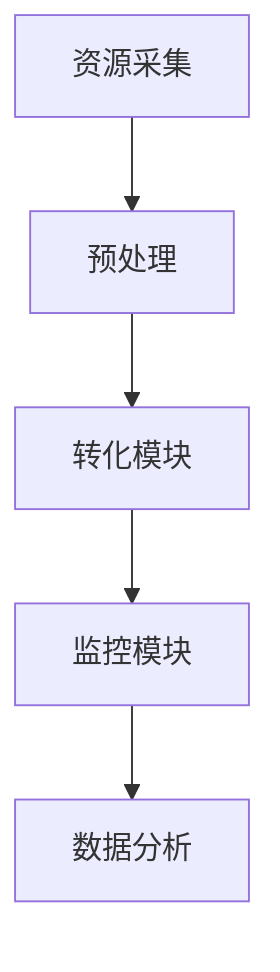

                 


# 价值投资中的海洋生物质能源开发技术前景

## 关键词：海洋生物质能源、价值投资、技术前景、经济模型、投资分析、可持续发展、风险管理

## 摘要：
海洋生物质能源作为一种新兴的可持续能源形式，正逐渐受到投资者的关注。本文从技术开发和经济分析两个方面，深入探讨海洋生物质能源的开发前景及其在价值投资中的潜力。通过分析核心技术、经济模型和风险管理策略，本文为投资者提供了科学的决策依据，同时也指出了未来技术发展的方向。

---

# 第1章: 海洋生物质能源的背景与定义

## 1.1 海洋生物质能源的定义
### 1.1.1 海洋生物质能源的内涵
海洋生物质能源是指从海洋生态系统中获取的有机物质，通过生物化学或物理化学过程转化为能源的形式，如生物柴油、生物天然气等。这些能源具有可再生、低碳排放的特点，符合可持续发展的要求。

### 1.1.2 海洋生物质能源的分类
海洋生物质能源主要分为以下几类：
1. **海洋藻类**：包括海藻、蓝藻等，可用于生产生物柴油和生物燃料。
2. **海洋微生物**：如某些细菌和真菌，可用于生产生物燃料和化学品。
3. **海洋植物**：如红树林、海草等，可用于生产生物质能。

### 1.1.3 海洋生物质能源的资源潜力
海洋生物质能源的资源潜力巨大。根据研究，全球海洋中可利用的生物质资源每年可支持超过10亿吨的能源产量，这为全球能源转型提供了重要支持。

## 1.2 价值投资与海洋生物质能源的结合
### 1.2.1 价值投资的基本概念
价值投资是一种以低于内在价值的价格购买优质资产的投资策略。其核心在于通过深入分析企业的基本面，寻找被市场低估的投资机会。

### 1.2.2 海洋生物质能源的经济价值
海洋生物质能源的经济价值体现在以下几个方面：
1. **替代传统能源**：生物质能可以替代化石能源，减少对石油、天然气的依赖。
2. **低碳排放**：生物质能的使用能够显著降低碳排放，符合全球应对气候变化的目标。
3. **资源丰富**：海洋生物质资源分布广泛，开发潜力巨大。

### 1.2.3 价值投资在海洋生物质能源开发中的作用
价值投资在海洋生物质能源开发中的作用主要体现在以下几个方面：
1. **识别优质企业**：通过分析企业的技术实力、财务状况和市场前景，选择具有竞争优势的企业进行投资。
2. **风险管理**：通过分散投资和严格的风险评估，降低投资风险。
3. **长期价值创造**：关注企业的长期发展潜力，投资于具有技术创新能力和市场竞争力的企业。

---

# 第2章: 海洋生物质能源开发的核心技术

## 2.1 海洋生物质的收集与处理技术
### 2.1.1 海洋生物质的收集方法
海洋生物质的收集方法主要包括以下几种：
1. **人工采集**：通过人工方式采集海洋藻类、植物等生物质资源。
2. **机械采集**：利用机械设备进行大规模采集，适用于资源分布较集中的区域。
3. **生物技术采集**：通过基因工程技术改良生物体的生长速度和产量，提高采集效率。

### 2.1.2 生物质的预处理技术
预处理技术是生物质能开发的关键步骤，主要包括：
1. **干燥处理**：去除生物质中的水分，提高能量密度。
2. **破碎处理**：将生物质破碎成小颗粒，便于后续处理。
3. **化学预处理**：通过化学方法改变生物质的物理性质，提高其可加工性。

### 2.1.3 生物质的高效分离与纯化
分离与纯化技术是生物质能开发的重要环节，主要包括：
1. **物理分离**：通过筛分、浮选等方法分离生物质中的杂质。
2. **化学分离**：利用化学试剂分离生物质中的有用成分。
3. **生物分离**：通过生物技术手段分离生物质中的目标成分。

## 2.2 海洋生物质的转化技术
### 2.2.1 生物质转化为燃料的技术路径
生物质转化为燃料的主要技术路径包括：
1. **生物柴油生产**：通过酯交换反应将植物油转化为生物柴油。
2. **生物天然气生产**：通过 anaerobic digestion（厌氧消化）技术将有机废弃物转化为沼气。
3. **生物乙醇生产**：通过发酵技术将淀粉类生物质转化为乙醇。

### 2.2.2 生物质转化为高附加值产品的技术
生物质转化为高附加值产品的技术主要包括：
1. **生物基塑料生产**：通过聚合反应将生物质中的单体物质转化为可降解塑料。
2. **生物基化学品生产**：通过化学合成技术将生物质中的活性成分转化为精细化学品。
3. **生物基材料生产**：通过材料合成技术将生物质转化为高性能材料。

### 2.2.3 生物质能的高效利用技术
生物质能的高效利用技术主要包括：
1. **高效燃烧技术**：通过改进燃烧设备和优化燃烧条件，提高生物质的燃烧效率。
2. **热电联产技术**：将生物质能转化为电能和热能，实现能源的梯级利用。
3. **生物质气化技术**：通过气化反应将生物质转化为可燃气体，用于发电或工业用途。

## 2.3 海洋生物质能源开发的技术挑战
### 2.3.1 技术瓶颈与解决方案
目前海洋生物质能源开发面临的主要技术挑战包括：
1. **资源收集效率低**：海洋生物质资源分散，收集成本高。
2. **转化效率低**：现有技术的能源转化效率有待提高。
3. **技术稳定性差**：部分技术在实际应用中存在稳定性问题。

解决方案包括：
1. **优化收集技术**：通过技术创新提高资源收集效率。
2. **改进转化技术**：研发高效、稳定的能源转化技术。
3. **加强技术研发**：加大对海洋生物质能源技术的研发投入。

### 2.3.2 技术创新与未来发展方向
技术创新是推动海洋生物质能源开发的关键。未来发展方向包括：
1. **智能化技术**：利用人工智能和大数据技术优化能源开发过程。
2. **绿色技术**：开发更加环保的生物质能转化技术，减少对环境的负面影响。
3. **集成技术**：推动多技术的集成应用，提高能源开发的整体效率。

---

# 第3章: 海洋生物质能源开发的经济模型与投资分析

## 3.1 海洋生物质能源开发的经济模型
### 3.1.1 生物质能源开发的初始投资成本
初始投资成本是海洋生物质能源开发的重要组成部分，主要包括：
1. **设备投资**：包括采集设备、处理设备、转化设备等。
2. **土地投资**：用于生物质资源的种植和采集。
3. **研发投入**：用于技术研发和技术改进。

### 3.1.2 运营成本与收益分析
运营成本主要包括：
1. **原料成本**：生物质资源的收购成本。
2. **能源成本**：生产过程中的水、电、气等能源消耗。
3. **人工成本**：员工工资和福利。

收益分析主要包括：
1. **销售收入**：生物质能产品的销售收入。
2. **政府补贴**：政府对可再生能源项目的财政补贴。
3. **碳信用交易**：通过碳信用交易获得额外收益。

### 3.1.3 经济模型的构建与应用
经济模型的构建需要考虑以下因素：
1. **市场需求**：生物质能产品的市场需求量和价格。
2. **技术参数**：设备效率、能源转化率等。
3. **政策环境**：政府政策、法律法规对生物质能开发的影响。

## 3.2 价值投资中的风险评估与管理
### 3.2.1 投资风险的分类与评估
投资风险主要包括：
1. **市场风险**：市场需求波动对投资的影响。
2. **技术风险**：技术失败或技术落后对投资的影响。
3. **政策风险**：政策变化对投资的影响。

### 3.2.2 风险管理策略
风险管理策略包括：
1. **分散投资**：通过投资不同类型的项目降低风险。
2. **加强监控**：定期评估投资项目的风险状况。
3. **建立应急预案**：制定应对风险的应急预案。

### 3.2.3 投资组合优化与风险管理
投资组合优化是降低风险的重要手段。通过科学配置不同类型的投资项目，可以有效分散风险，提高投资的稳定性。

## 3.3 投资回报率与可持续性分析
### 3.3.1 投资回报率的计算与影响因素
投资回报率的计算需要考虑初始投资、运营成本、销售收入等多个因素。影响投资回报率的主要因素包括市场需求、技术效率、政策环境等。

### 3.3.2 可持续性分析与长期投资价值
可持续性分析是评估长期投资价值的重要依据。海洋生物质能源作为一种可再生能源，具有较高的可持续性，符合全球能源转型的趋势。

### 3.3.3 政策支持与市场环境对投资的影响
政策支持和市场环境对投资具有重要影响。政府的财政补贴、税收优惠等政策，以及市场需求的快速增长，都对投资具有积极影响。

---

# 第4章: 海洋生物质能源开发的技术与经济可行性分析

## 4.1 技术可行性分析
### 4.1.1 技术成熟度评估
技术成熟度评估需要考虑技术的稳定性、可靠性以及应用案例。目前，海洋生物质能源开发技术已取得一定进展，但仍需进一步完善。

### 4.1.2 技术经济性分析
技术经济性分析需要综合考虑技术的成本、效率和收益。通过技术创新和规模效应，可以有效降低成本，提高经济效益。

### 4.1.3 技术的可扩展性与 scalability
技术的可扩展性是评估技术可行性的重要指标。海洋生物质能源开发技术具有较强的可扩展性，适合大规模应用。

## 4.2 经济可行性分析
### 4.2.1 投资成本与回收期分析
投资成本包括设备投资、土地投资、研发投入等。回收期是投资成本与预期收益的比值，是评估经济可行性的重要指标。

### 4.2.2 市场需求与价格波动
市场需求与价格波动对经济可行性具有重要影响。随着全球能源需求的增长和环保政策的推动，生物质能的需求将保持增长。

### 4.2.3 经济模型的验证与优化
经济模型的验证需要通过实际数据进行校核，优化模型参数，提高模型的准确性和可靠性。

## 4.3 技术与经济的综合评估
### 4.3.1 技术与经济的平衡点
技术与经济的平衡点是实现最优投资回报的关键。需要在技术创新和成本控制之间找到平衡点。

### 4.3.2 综合评估模型的构建
综合评估模型需要考虑技术、经济、政策等多个因素，构建一个全面的评估体系。

### 4.3.3 综合评估结果与投资决策
综合评估结果为投资决策提供科学依据。通过综合评估，投资者可以更好地把握投资机会，降低投资风险。

---

# 第5章: 海洋生物质能源开发的系统架构与实现方案

## 5.1 系统架构设计
### 5.1.1 系统功能模块划分
系统功能模块主要包括：
1. **资源采集模块**：负责生物质资源的采集和处理。
2. **转化模块**：负责生物质能的转化过程。
3. **监控模块**：实时监控系统运行状态，及时发现和解决问题。
4. **数据分析模块**：对系统数据进行分析，为投资决策提供支持。

### 5.1.2 系统架构的 Mermaid 图


### 5.1.3 系统功能的实现
系统功能的实现需要依托先进的技术和设备，确保系统运行的高效性和稳定性。

## 5.2 系统实现方案
### 5.2.1 项目介绍
本项目旨在开发一套高效的海洋生物质能开发系统，实现从资源采集到能源转化的全流程自动化。

### 5.2.2 系统功能设计
系统功能设计包括：
1. **资源采集功能**：实现生物质资源的自动化采集和处理。
2. **转化功能**：实现生物质能的高效转化。
3. **监控功能**：实时监控系统运行状态，确保系统稳定运行。
4. **数据分析功能**：对系统数据进行分析，为投资决策提供支持。

### 5.2.3 系统架构设计
系统架构设计采用模块化设计，各模块之间相互独立，便于系统的维护和升级。

### 5.2.4 系统接口设计
系统接口设计需要考虑不同模块之间的数据交互，确保系统的高效运行。

### 5.2.5 系统交互的 Mermaid 序列图
```mermaid
sequenceDiagram
参与者：投资者
系统：海洋生物质能开发系统
投资者 -> 系统：提交投资需求
系统 -> 数据分析模块：进行数据分析
数据分析模块 -> 监控模块：监控系统运行状态
监控模块 -> 转化模块：启动能源转化过程
转化模块 -> 资源采集模块：采集生物质资源
资源采集模块 -> 系统：反馈采集状态
```

---

# 第6章: 项目实战与案例分析

## 6.1 项目实战
### 6.1.1 环境安装
项目实战需要以下环境：
1. **软件环境**：安装 Python、Mermaid、Latex 等工具。
2. **硬件环境**：配置足够的计算资源，确保系统运行的流畅性。

### 6.1.2 核心实现代码
以下是核心实现代码示例：
```python
# 生物质能开发系统的核心代码
class BioEnergySystem:
    def __init__(self):
        self.resources = []  # 生物质资源列表
        self.devices = []    # 设备列表
        self.data = {}       # 系统数据

    def collect_resources(self):
        # 收集生物质资源
        pass

    def process_resources(self):
        # 处理生物质资源
        pass

    def convert_energy(self):
        # 转化为能源
        pass

    def monitor_system(self):
        # 监控系统运行状态
        pass

    def analyze_data(self):
        # 分析系统数据
        pass

# 示例代码
bio_system = BioEnergySystem()
bio_system.collect_resources()
bio_system.process_resources()
bio_system.convert_energy()
bio_system.monitor_system()
bio_system.analyze_data()
```

### 6.1.3 代码应用解读与分析
上述代码实现了生物质能开发系统的核心功能，包括资源收集、处理、转化、监控和数据分析。通过这些功能的实现，可以完成从资源采集到能源转化的全流程开发。

### 6.1.4 实际案例分析
以某海洋生物质能开发项目为例，分析其投资回报率和风险评估。通过实际案例分析，可以更好地理解理论知识的实际应用。

## 6.2 项目小结
### 6.2.1 核心代码实现
通过项目实战，掌握了生物质能开发系统的核心代码实现，包括资源收集、处理、转化等关键步骤。

### 6.2.2 技术与经济的综合应用
项目实战中，将技术与经济分析相结合，实现了系统的优化设计和高效运行。

### 6.2.3 项目经验总结
通过项目实战，总结了海洋生物质能开发的技术难点和经济挑战，为未来的投资决策提供了宝贵经验。

---

# 第7章: 总结与展望

## 7.1 本章小结
海洋生物质能开发是一项具有重要意义的新兴技术，其在价值投资中的潜力巨大。通过技术开发和经济分析，可以为投资者提供科学的决策依据。

## 7.2 投资建议
### 7.2.1 关注技术创新
技术创新是推动海洋生物质能开发的关键。投资者应关注具有技术创新能力的企业。

### 7.2.2 重视风险管理
投资风险是海洋生物质能开发的重要挑战。投资者应加强风险管理，降低投资风险。

### 7.2.3 长期投资视角
海洋生物质能开发具有较高的可持续性，投资者应采取长期投资视角，关注企业的长期发展潜力。

## 7.3 注意事项
### 7.3.1 技术风险
技术失败或技术落后可能对投资造成重大影响。

### 7.3.2 市场风险
市场需求波动可能对投资收益造成影响。

### 7.3.3 政策风险
政策变化可能对投资环境造成影响。

## 7.4 拓展阅读
### 7.4.1 推荐书籍
1. 《价值投资原理》
2. 《可再生能源技术与经济分析》

### 7.4.2 推荐网站
1. 国际可再生能源机构（IRENA）官网
2. 全球海洋能源网络（GOEN）官网

## 7.5 未来展望
海洋生物质能开发是全球能源转型的重要方向。未来，随着技术进步和政策支持的加强，海洋生物质能开发将迎来更广阔的发展空间。

---

# 作者：AI天才研究院 & 禅与计算机程序设计艺术

---

通过以上结构和内容，您可以逐步扩展每一部分的具体内容，确保文章的深度和广度。每一章都可以进一步细化，加入具体的案例分析、公式推导和代码实现，使文章更加丰富和实用。

