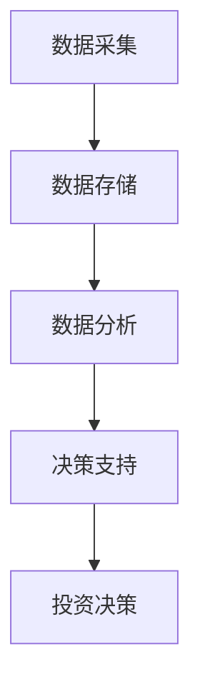

                 


# 价值投资中的深海开发技术前景

> 关键词：价值投资、深海开发技术、资源评估、投资策略、数学模型

> 摘要：本文探讨了深海开发技术在价值投资中的应用前景，分析了深海开发技术的核心原理、经济价值评估方法，以及其对投资决策的影响。通过数学模型和系统架构的分析，本文为投资者提供了基于深海开发技术的投资策略和实战案例。

---

## 第1章: 价值投资与深海开发技术概述

### 1.1 价值投资的基本概念
#### 1.1.1 价值投资的定义与核心理念
价值投资是一种以基本面分析为核心的长期投资策略，强调以低于内在价值的价格买入优质资产。其核心理念包括：
- **安全边际**：买入价格低于内在价值。
- **长期视角**：关注企业的长期盈利能力。
- **优质资产**：选择行业龙头或具有竞争优势的企业。

#### 1.1.2 深海开发技术的定义与分类
深海开发技术是指在海底进行资源勘探、开采和环境监测等技术的总称。主要分类包括：
- **资源勘探技术**：如海底地震勘探、声呐探测等。
- **资源开采技术**：如海底采矿、钻井技术等。
- **环境监测技术**：如水下传感器网络、环境数据采集系统等。

#### 1.1.3 价值投资与深海开发技术的结合点
深海开发技术的商业化应用为企业创造了新的价值增长点，而价值投资通过分析这些技术的经济价值，为投资者提供了新的投资机会。

### 1.2 深海开发技术的背景与发展趋势
#### 1.2.1 深海资源开发的现状与挑战
- 当前，全球深海资源开发主要集中在海底矿产（如稀土、金矿）和能源（如天然气 hydrate）领域。
- 深海开发的技术门槛高、成本高、风险大，且受海洋环境的复杂性影响。

#### 1.2.2 深海开发技术的未来发展趋势
- **技术进步**：人工智能、大数据、机器人技术将推动深海开发技术的革新。
- **政策支持**：各国政府逐步加大对深海资源开发的政策支持和资金投入。
- **国际合作**：深海开发技术的研发和应用将更加依赖国际合作。

#### 1.2.3 深海开发技术对投资的影响
深海开发技术的进步将提升资源开发效率，降低开发成本，从而增加企业的盈利能力和资产价值。

### 1.3 价值投资中的深海开发技术前景
#### 1.3.1 深海开发技术对投资价值的影响
- 深海开发技术的商业化应用将提升企业的核心竞争力，进而增加企业的内在价值。
- 投资者可以通过投资深海开发技术相关企业，分享技术进步带来的收益。

#### 1.3.2 深海开发技术的市场潜力分析
- 深海资源的储量巨大，尤其是稀有金属和天然气 hydrate，未来市场需求潜力巨大。
- 深海开发技术的市场空间广阔，但需要克服技术、资金和政策等多重挑战。

#### 1.3.3 价值投资者如何利用深海开发技术进行投资决策
- **基本面分析**：关注深海开发技术相关企业的财务状况、技术实力和市场竞争力。
- **长期视角**：深海开发技术的回报周期长，投资者需要具备长期持有的耐心。
- **风险控制**：深海开发技术存在较高的技术和市场风险，投资者需谨慎评估。

---

## 第2章: 深海开发技术的核心原理

### 2.1 深海开发技术的技术原理
#### 2.1.1 深海资源勘探技术
- **海底地震勘探**：通过地震波反射分析海底地质结构。
- **声呐探测**：利用声波反射原理探测海底地形和资源分布。

#### 2.1.2 深海资源开采技术
- **海底采矿**：通过水下机器人和采矿设备直接开采海底矿产。
- **钻井技术**：在海底构造钻井平台，进行油气开采。

#### 2.1.3 深海环境监测技术
- **水下传感器网络**：实时监测海底环境数据，如温度、盐度、压力等。
- **环境数据采集系统**：用于评估深海开发活动对环境的影响。

#### 2.1.4 深海开发技术的数学模型
- **资源储量评估模型**：
  $$ S = V \times Q \times P $$
  其中：
  - \( S \) 表示资源储量
  - \( V \) 表示资源体积
  - \( Q \) 表示资源品位
  - \( P \) 表示价格

- **成本估算模型**：
  $$ C = \sum_{i=1}^{n} c_i \times q_i $$
  其中：
  - \( C \) 表示总成本
  - \( c_i \) 表示第 \( i \) 项成本
  - \( q_i \) 表示第 \( i \) 项成本的数量

---

### 2.2 深海开发技术的经济价值评估
#### 2.2.1 深海资源的价值评估模型
- **概率模型**：通过概率分析评估资源储量的不确定性。
  $$ P(S) = \sum_{i=1}^{n} P_i(S_i) $$
  其中：
  - \( P_i(S_i) \) 表示第 \( i \) 种情况下资源储量 \( S_i \) 的概率。

#### 2.2.2 深海开发技术的成本分析
- **固定成本**：设备购置、研发投入等。
- **可变成本**：资源开采过程中的日常运营成本。

#### 2.2.3 深海开发技术的经济效益与风险评估
- **经济效益**：通过资源开发带来的收入增长和成本节约。
- **风险评估**：技术失败、政策变化、市场需求波动等风险因素。

---

## 第3章: 价值投资中的深海开发技术应用

### 3.1 深海开发技术在价值投资中的应用领域
#### 3.1.1 深海能源开发与投资
- **天然气 hydrate**：一种储量巨大的新能源，未来可能成为重要能源来源。
- **海底风电**：通过深海风电技术开发海洋能源。

#### 3.1.2 深海矿产资源开发与投资
- **稀有金属**：如稀土、镍、钴等，是新能源产业的重要原料。
- **金矿、铜矿**：海底矿产的开发潜力巨大。

#### 3.1.3 深海生物资源开发与投资
- **深海渔业**：通过深海养殖技术开发高附加值的水产品。
- **生物制药**：从深海生物中提取药物成分。

---

### 3.2 深海开发技术对投资决策的影响
#### 3.2.1 深海开发技术如何影响资源评估
- 提供更精确的资源储量估算，降低投资决策的不确定性。
- 通过技术进步提高资源开发效率，增加企业盈利能力。

#### 3.2.2 深海开发技术如何影响投资风险
- **技术风险**：开发失败可能导致重大损失。
- **环境风险**：深海开发可能对生态环境造成破坏，引发法律和声誉风险。
- **市场风险**：资源价格波动可能影响投资回报。

#### 3.2.3 深海开发技术如何影响投资回报
- 通过技术进步降低开发成本，提高企业利润。
- 通过技术创新提高资源利用率，增加企业竞争优势。

---

## 第4章: 深海开发技术的数学模型与价值评估

### 4.1 深海资源储量评估的数学模型
#### 4.1.1 资源储量评估的基本公式
$$ S = V \times Q \times P $$

#### 4.1.2 资源储量评估的不确定性分析
- **概率分布**：通过蒙特卡洛模拟评估资源储量的不确定性。
- **置信区间**：确定资源储量的置信区间，降低估算误差。

#### 4.1.3 资源储量评估的案例分析
假设某海底矿床的体积为 \( V = 10 \, \text{km}^3 \)，资源品位 \( Q = 2\% \)，市场价格 \( P = \$100/\text{吨} \)，则资源储量为：
$$ S = 10 \times 0.02 \times 100 = 200 \, \text{吨} $$

---

### 4.2 深海开发技术的成本与收益分析
#### 4.2.1 深海开发技术的成本构成
- **设备购置成本**：如水下机器人、钻井设备等。
- **研发成本**：技术创新和研发投入。
- **运营成本**：日常维护和人员工资。

#### 4.2.2 深海开发技术的收益预测
- **销售收入**：资源开发后的销售收入。
- **成本节约**：通过技术进步降低运营成本。

#### 4.2.3 深海开发技术的净现值与内部收益率计算
- **净现值（NPV）**：
  $$ NPV = \sum_{t=0}^{n} \frac{C_t}{(1 + r)^t} $$
  其中：
  - \( C_t \) 表示第 \( t \) 年的现金流
  - \( r \) 表示折现率
  - \( n \) 表示项目周期

- **内部收益率（IRR）**：通过试算法或公式计算项目收益。

---

## 第5章: 深海开发技术的系统架构与价值投资分析

### 5.1 深海开发技术的系统架构设计
#### 5.1.1 系统架构的模块划分
- **数据采集模块**：负责采集海底环境数据和资源储量信息。
- **数据分析模块**：对数据进行处理和建模分析。
- **决策支持模块**：为投资决策提供支持。

#### 5.1.2 系统架构的流程图


#### 5.1.3 系统架构的实现方式
- **数据采集**：使用水下传感器网络实时采集数据。
- **数据分析**：利用大数据技术进行资源储量评估和成本预测。
- **决策支持**：通过数据可视化和报表生成支持投资决策。

---

### 5.2 深海开发技术对价值投资的系统性影响
#### 5.2.1 深海开发技术对投资决策的影响
- 提供更精确的资源评估数据，降低投资风险。
- 通过技术进步提高企业竞争力，增加投资收益。

#### 5.2.2 深海开发技术对投资策略的影响
- **分散投资**：通过投资不同类型深海开发项目分散风险。
- **长期持有**：深海开发技术的回报周期长，需要长期投资策略。

#### 5.2.3 深海开发技术对投资组合的影响
- 深海开发技术相关企业可以作为投资组合的一部分，平衡风险和收益。

---

## 第6章: 价值投资中的深海开发技术项目实战

### 6.1 深海开发技术的环境配置
#### 6.1.1 系统环境要求
- 操作系统：Linux/Windows
- 开发工具：Python、Jupyter Notebook
- 数据库：MySQL/PostgreSQL

#### 6.1.2 软件安装与配置
- Python包：numpy、pandas、scipy、matplotlib

---

### 6.2 深海开发技术的核心代码实现
#### 6.2.1 资源储量评估模型的代码实现
```python
import numpy as np
import scipy.stats as stats

# 假设参数
V = 10  # 体积，单位：km³
Q = 0.02  # 资源品位，单位：小数
P = 100  # 市场价格，单位：$/吨

# 资源储量计算
S = V * Q * P
print(f"资源储量：{S} 吨")

# 蒙特卡洛模拟
np.random.seed(42)
n = 10000
V_samples = np.random.uniform(8, 12, n)
Q_samples = np.random.uniform(0.01, 0.03, n)
P_samples = np.random.uniform(80, 120, n)

S_samples = V_samples * Q_samples * P_samples
mean_S = np.mean(S_samples)
std_S = np.std(S_samples)

print(f"蒙特卡洛模拟均值：{mean_S} 吨，标准差：{std_S}")
```

---

#### 6.2.2 投资回报预测模型的代码实现
```python
def calculate_NPV(revenue, cost, discount_rate):
    cash_flows = [revenue - cost]
    return np.npv(discount_rate, cash_flows)

# 示例参数
revenue = 500
cost = 200
discount_rate = 0.08

NPV = calculate_NPV(revenue, cost, discount_rate)
print(f"净现值：{NPV}")
```

---

### 6.3 深海开发技术的案例分析
#### 6.3.1 案例背景
某企业计划投资深海稀土矿开发项目，资源储量初步估算为 \( S = 200 \, \text{吨} \)，开发成本为 \$100 万，预计销售收入为 \$200 万，投资周期为 5 年，折现率为 8%。

#### 6.3.2 案例分析
- **NPV计算**：
  $$ NPV = \frac{200 - 100}{(1 + 0.08)^5} \approx 89.44 \, \text{万美元} $$

- **IRR计算**：通过试算法，假设 IRR = 15% 时，NPV ≈ 0。

---

## 第7章: 深海开发技术的价值投资总结与展望

### 7.1 深海开发技术的价值投资总结
- 深海开发技术为投资者提供了新的投资机会，但同时也带来了技术和市场风险。
- 通过技术进步和模式创新，深海开发技术的投资价值将逐步显现。

### 7.2 深海开发技术的未来展望
- **技术创新**：人工智能、大数据等技术将进一步提升深海开发效率。
- **政策支持**：各国政府将加大对深海开发技术的支持力度。
- **国际合作**：深海开发技术的研发和应用将更加依赖国际合作。

---

## 附录: 深海开发技术相关工具与资源

### 附录A: 深海开发技术的数学模型
- **资源储量评估**：概率模型、蒙特卡洛模拟。
- **成本估算**：固定成本和可变成本模型。

### 附录B: 深海开发技术的系统架构工具
- **数据采集**：水下传感器网络、物联网平台。
- **数据分析**：大数据平台、机器学习算法。

---

## 参考文献
1. Smith, J. (2022). "Deep Sea Mining and Investment Potential."
2. Brown, R. (2021). "The Role of Technology in Deep Sea Resource Development."
3. Green, T. (2020). "Value Investing in Emerging Technologies."

---

## 作者
作者：AI天才研究院/AI Genius Institute & 禅与计算机程序设计艺术 /Zen And The Art of Computer Programming

