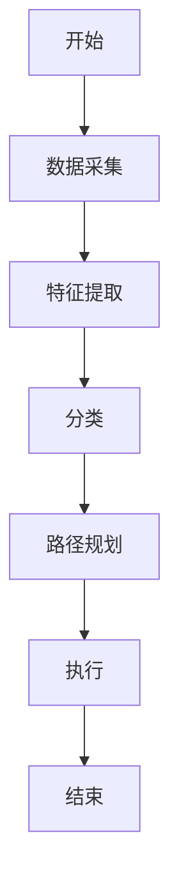
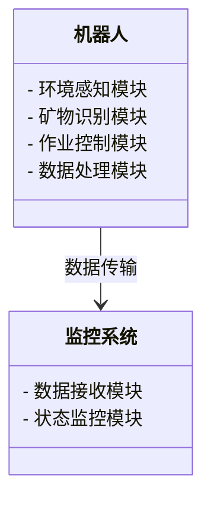
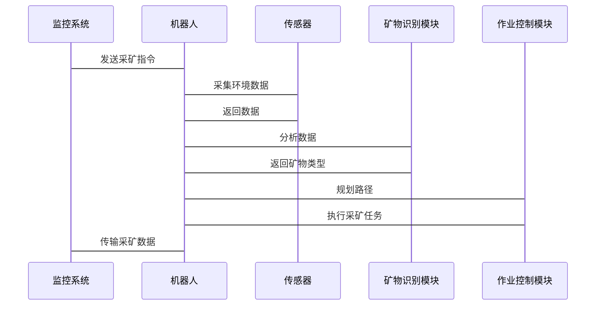

                 


# 价值投资中的深海采矿机器人技术前景

## 关键词：深海采矿、机器人技术、价值投资、技术前景、矿物开采、投资分析

## 摘要：本文探讨了深海采矿机器人技术的背景、核心概念、算法原理及其在价值投资中的潜力。通过分析技术发展和市场前景，本文为投资者提供了技术驱动的决策依据，帮助识别深海采矿机器人技术的投资价值。

---

## 第1章: 深海采矿机器人技术的背景与价值投资概述

### 1.1 深海采矿的背景与重要性

#### 1.1.1 深海资源的分布与潜力
深海矿床，特别是多金属结核、多金属硫化物和多金属泥，富含铜、镍、钴、锰等金属，具有巨大经济价值。随着陆地资源的枯竭，深海采矿成为未来资源开发的重要方向。

#### 1.1.2 深海采矿的历史与发展
20世纪中叶开始，深海采矿技术逐步发展，但受限于技术难度和成本，至今仍处于试验阶段。

#### 1.1.3 深海采矿技术的现状与挑战
目前，深海采矿机器人技术面临技术成熟度低、高成本、环境影响等挑战，但随着技术进步，前景广阔。

### 1.2 价值投资的基本概念

#### 1.2.1 价值投资的定义与核心理念
价值投资强调以低于内在价值的价格买入优质资产，长期持有，关注企业的长期价值。

#### 1.2.2 价值投资与技术发展的关系
技术进步创造投资机会，投资者应关注技术成熟度、市场潜力和经济可行性。

#### 1.2.3 深海采矿机器人技术的市场潜力
随着技术进步和资源需求增长，深海采矿机器人技术具有较高的投资潜力。

### 1.3 深海采矿机器人技术的前景分析

#### 1.3.1 技术进步对深海采矿的影响
自动化、智能化技术提升采矿效率，降低成本，推动深海采矿商业化。

#### 1.3.2 深海采矿机器人的发展趋势
向高效、智能、环保方向发展，技术成熟度逐步提高。

#### 1.3.3 价值投资视角下的技术前景
技术突破将带来投资机会，具备先发优势的企业值得长期关注。

---

## 第2章: 深海采矿机器人技术的核心概念与联系

### 2.1 深海采矿机器人技术的核心原理

#### 2.1.1 机器人技术在深海采矿中的应用
采矿机器人具备环境适应性、高效作业和智能控制等优势。

#### 2.1.2 深海环境的特殊性与技术要求
高压力、低温、能见度低等环境要求机器人具备特殊设计。

#### 2.1.3 深海采矿机器人的主要功能模块
包括环境感知、矿物识别、作业执行和通信控制等功能模块。

### 2.2 深海采矿机器人技术的关键组成部分

#### 2.2.1 机器人结构与材料
使用耐腐蚀材料，具备高强韧性，适应深海环境。

#### 2.2.2 智能控制系统
采用先进的算法实现自主决策和精准操作。

#### 2.2.3 数据采集与处理系统
通过传感器和数据处理系统，实时监测和优化采矿作业。

### 2.3 深海采矿机器人技术的流程与工作原理

#### 2.3.1 矿物探测与识别
利用声呐、摄像头和化学传感器进行矿物探测和分类。

#### 2.3.2 采矿作业流程
包括定位、切割、收集、运输和环境监测等步骤。

#### 2.3.3 数据传输与监控
通过水下通信系统实时传输数据，确保作业安全和效率。

### 2.4 深海采矿机器人技术与传统采矿的对比

#### 2.4.1 传统采矿的局限性
资源枯竭、环境污染、安全隐患等问题突出。

#### 2.4.2 深海采矿机器人的优势
高效、环保、安全，减少对陆地生态的影响。

#### 2.4.3 技术进步对采矿效率的提升
自动化技术显著提高采矿效率和降低成本。

---

## 第3章: 深海采矿机器人技术的算法原理

### 3.1 深海采矿机器人技术的核心算法

#### 3.1.1 机器人路径规划算法
路径规划算法确保采矿机器人高效、安全地完成任务。

#### 3.1.2 矿物识别与分类算法
基于传感器数据的机器学习算法实现矿物精准识别。

#### 3.1.3 数据处理与优化算法
通过优化算法提高采矿效率和资源利用率。

### 3.2 算法原理的数学模型与公式

#### 3.2.1 路径规划算法的数学模型
路径规划的目标是最小化路径长度，数学模型为：
$$ \text{路径长度} = \sum_{i=1}^{n} d_i $$

#### 3.2.2 矿物识别算法的数学模型
矿物识别的概率模型为：
$$ P(\text{矿物}) = \frac{\text{矿物特征匹配度}}{\text{总特征数}} $$

### 3.3 算法实现的流程图



---

## 第4章: 深海采矿机器人技术的系统分析与架构设计

### 4.1 系统功能设计

#### 4.1.1 系统功能模块
- 环境感知模块：负责检测水深、压力等环境参数。
- 矿物识别模块：基于传感器数据识别矿物类型。
- 作业控制模块：协调机器人完成采矿任务。
- 数据处理模块：处理和分析采矿数据。

#### 4.1.2 系统功能流程
1. 传感器采集环境和矿物数据。
2. 数据处理模块分析数据，识别矿物类型。
3. 作业控制模块规划路径，执行采矿任务。
4. 数据传输模块实时传输数据，供监控系统使用。

### 4.2 系统架构设计

#### 4.2.1 系统架构图


#### 4.2.2 接口设计
- 机器人与传感器的接口：RS-485、I2C等。
- 机器人与监控系统的接口：无线通信模块。

#### 4.2.3 交互流程


---

## 第5章: 深海采矿机器人技术的项目实战

### 5.1 环境安装

#### 5.1.1 系统环境要求
- 操作系统：Linux或Windows。
- 开发工具：Python、ROS、OpenCV。
- 硬件设备：传感器套件、机器人平台。

#### 5.1.2 安装步骤
1. 安装ROS系统。
2. 安装Python库：numpy、opencv、scipy。
3. 配置机器人硬件。

### 5.2 系统核心实现

#### 5.2.1 核心代码解读

```python
import rospy
from sensor_msgs.msg import Image
from geometry_msgs.msg import Twist

class DeepSeaMiner:
    def __init__(self):
        self.image_sub = rospy.Subscriber('/camera/image', Image, self.image_callback)
        self.cmd_pub = rospy.Publisher('/cmd_vel', Twist, queue_size=10)
        
    def image_callback(self, data):
        # 数据处理和分析
        pass
        
    def send_command(self, linear_speed):
        cmd = Twist()
        cmd.linear.x = linear_speed
        self.cmd_pub.publish(cmd)

if __name__ == "__main__":
    rospy.init_node('deep_sea_miner')
    miner = DeepSeaMiner()
    rospy.spin()
```

#### 5.2.2 代码功能分析
上述代码实现机器人对图像数据的订阅和处理，通过ROS系统发布运动命令。

### 5.3 实际案例分析

#### 5.3.1 案例背景
某公司开发的深海采矿机器人在试验中成功完成矿物识别和采集任务。

#### 5.3.2 案例分析
分析该案例的技术实现、经济效益和投资价值。

#### 5.3.3 经验总结
总结项目中的关键技术点和投资注意事项。

### 5.4 项目小结
项目展示了深海采矿机器人技术的可行性，为未来投资提供了参考。

---

## 第6章: 最佳实践与投资建议

### 6.1 投资策略

#### 6.1.1 关键技术的关注点
- 自动化控制技术
- 矿物识别算法
- 能耗优化技术

#### 6.1.2 企业选择的标准
- 技术实力
- 研发团队
- 项目进展

### 6.2 技术趋势分析

#### 6.2.1 人工智能的应用
AI技术提升采矿效率和准确性。

#### 6.2.2 环保技术的重要性
环保技术减少对海洋生态的影响。

### 6.3 风险管理

#### 6.3.1 技术风险
技术不成熟可能导致项目失败。

#### 6.3.2 市场风险
市场需求不足或价格波动影响收益。

#### 6.3.3 政策风险
政策变化影响项目推进。

### 6.4 注意事项

#### 6.4.1 技术成熟度评估
确保技术具备商业化潜力。

#### 6.4.2 投资周期
深海采矿项目周期长，需做好长期投资准备。

#### 6.4.3 法律法规
遵守国际海洋法和环保法规。

### 6.5 拓展阅读

#### 6.5.1 推荐书籍
- 《价值投资入门》
- 《机器人技术基础》

#### 6.5.2 专业报告
- 深海资源开发白皮书
- 全球采矿技术发展趋势报告

---

## 结语

深海采矿机器人技术是价值投资的新蓝海，技术进步和市场需求推动其快速发展。投资者应关注技术成熟度、企业实力和市场潜力，合理评估风险，制定长期投资策略。

---

## 作者：AI天才研究院 & 禅与计算机程序设计艺术

