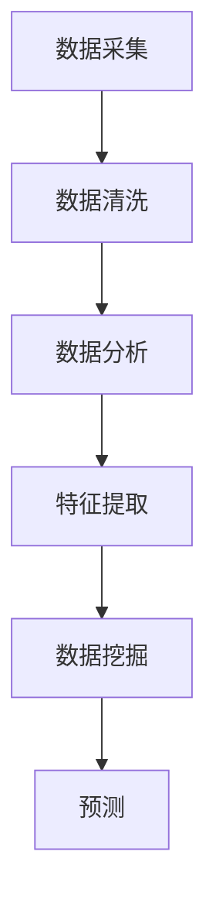
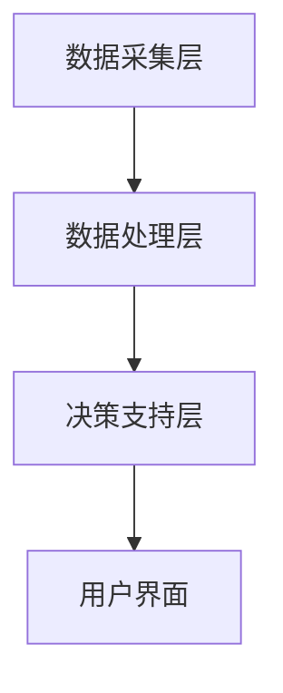
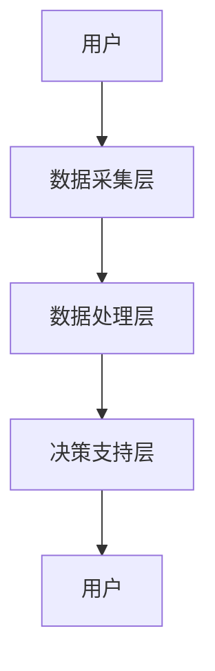

                 


# 价值投资中的深海采矿环境监测技术前景

> 关键词：深海采矿、环境监测技术、价值投资、投资前景、环境影响评估

> 摘要：随着深海采矿等技术的发展，环境监测技术在其中扮演着越来越重要的角色。本文将从环境监测技术在深海采矿中的应用、价值投资的角度出发，分析环境监测技术对深海采矿项目的影响，探讨如何通过环境监测技术评估深海采矿的投资前景，从而为投资者提供科学依据。

---

## 第一部分: 深海采矿环境监测技术与价值投资的结合

### 第1章: 背景介绍

#### 1.1 深海采矿的现状与挑战

- 1.1.1 深海采矿的定义与现状
  - 深海采矿是指在海底或海底附近区域进行矿物资源的开采活动。
  - 当前深海采矿主要集中在多金属结核、多金属硫化物和富钴结壳等资源的开发。
  - 深海采矿的市场需求主要来自于对稀有金属的需求，尤其是在新能源汽车、电子设备等领域。

- 1.1.2 深海采矿中的环境问题
  - 深海采矿可能对海洋生态系统造成破坏，包括海底地形改变、海洋生物多样性减少等。
  - 深海采矿活动可能释放有害物质，影响海水质量。

- 1.1.3 深海采矿技术的发展趋势
  - 深海采矿技术逐渐从试验阶段向商业化阶段过渡。
  - 智能化、自动化和环保型的深海采矿设备正在研发和应用中。

#### 1.2 价值投资的基本概念

- 1.2.1 价值投资的定义与核心理念
  - 价值投资是一种长期投资策略，强调以低于内在价值的价格买入优质资产。
  - 核心理念是寻找市场低估的公司，长期持有，获得超额收益。

- 1.2.2 价值投资在现代金融中的地位
  - 价值投资是金融投资的重要流派之一，尤其在股票投资中占据重要地位。
  - 价值投资强调基本面分析，注重公司质地、行业地位和财务状况。

- 1.2.3 价值投资与深海采矿的结合背景
  - 深海采矿项目具有高投入、高风险、回报周期长的特点，与价值投资的长期视角相契合。
  - 深海采矿项目的估值需要综合考虑资源储量、开采成本、环境风险等因素。

#### 1.3 深海采矿环境监测技术的必要性

- 1.3.1 环境监测在深海采矿中的作用
  - 环境监测技术可以实时监控深海采矿活动对环境的影响，确保合规性。
  - 通过环境监测数据，可以评估深海采矿活动的环境风险，制定应对措施。

- 1.3.2 环境监测技术对价值投资的影响
  - 环境监测数据可以帮助投资者评估深海采矿项目的环境风险，从而影响其估值。
  - 环境监测技术可以提高深海采矿项目的透明度，增强投资者信心。

- 1.3.3 深海采矿环境监测技术的边界与外延
  - 深海采矿环境监测技术的边界包括数据采集、处理和分析。
  - 外延包括环境影响评估、风险预警和环境修复技术。

### 第2章: 深海采矿环境监测技术的核心概念与联系

#### 2.1 环境监测技术的原理与实现

- 2.1.1 深海环境监测的主要技术手段
  - 多参数传感器：包括温度、盐度、深度、浊度、溶解氧、pH值等传感器。
  - 声呐技术：用于海底地形测绘和矿床定位。
  - 摄像技术：用于观察海洋生物和环境变化。

- 2.1.2 不同监测技术的优缺点对比
  | 技术类型       | 优点                       | 缺点                       |
  |----------------|---------------------------|---------------------------|
  | 多参数传感器   | 数据全面，实时性强         | 成本较高，维护复杂         |
  | 声呐技术       | 精确性强，适用范围广       | 易受水文条件影响，数据处理复杂 |
  | 摄像技术       | 视觉效果直观               | 依赖光照条件，数据量大     |

- 2.1.3 环境监测技术的ER实体关系图
  ```mermaid
  graph TD
    A[环境监测系统] --> B[传感器]
    A --> C[数据采集模块]
    A --> D[数据处理模块]
    B --> C
    C --> D
    D --> E[环境评估报告]
  ```

#### 2.2 环境监测数据与价值投资的关联

- 2.2.1 环境数据对深海采矿项目价值的影响
  - 环境监测数据可以评估深海采矿项目的环境风险，影响其市场价值。
  - 环境监测数据可以作为深海采矿项目估值的重要参考。

- 2.2.2 环境监测数据与投资决策的关系
  - 投资者可以通过环境监测数据评估深海采矿项目的可持续性。
  - 环境监测数据可以帮助投资者预测深海采矿项目的环境风险，制定投资策略。

- 2.2.3 环境监测技术对投资风险的评估作用
  - 环境监测技术可以提供实时环境数据，帮助投资者及时调整投资策略。
  - 环境监测技术可以提高深海采矿项目的透明度，降低投资者的不确定性。

### 第3章: 环境监测技术的算法原理

#### 3.1 数据处理与分析算法

- 3.1.1 数据清洗与预处理算法
  - 数据清洗是去除噪声数据和异常值的过程。
  - 数据预处理包括数据标准化、数据归一化等步骤。

- 3.1.2 数据分析与特征提取算法
  - 数据分析包括统计分析、时间序列分析等方法。
  - 特征提取是通过降维技术（如主成分分析）提取关键特征。

- 3.1.3 数据挖掘与预测算法
  - 数据挖掘包括分类、回归、聚类等算法。
  - 预测算法可以用于预测环境变化趋势和深海采矿项目的环境风险。

#### 3.2 算法流程图



#### 3.3 环境监测数据的数学模型

- 线性回归模型：
  $$ y = \beta_0 + \beta_1 x + \epsilon $$
  其中，$y$ 是目标变量，$x$ 是自变量，$\beta_0$ 是截距，$\beta_1$ 是回归系数，$\epsilon$ 是误差项。

- 环境监测数据与深海采矿项目价值的关系：
  $$ Value = \alpha \cdot E + \beta \cdot R + \gamma \cdot Risk + \delta $$
  其中，$E$ 是环境因素，$R$ 是资源储量，$Risk$ 是环境风险，$\alpha, \beta, \gamma$ 是回归系数，$\delta$ 是误差项。

### 第4章: 系统分析与架构设计方案

#### 4.1 问题场景介绍

- 深海采矿环境监测系统的应用场景包括海底资源勘探、环境实时监测、环境风险预警等。

#### 4.2 项目介绍

- 深海采矿环境监测系统是一个集数据采集、处理、分析和决策支持于一体的综合系统。

#### 4.3 系统功能设计

- 数据采集层：包括多参数传感器、声呐设备和摄像设备。
- 数据处理层：包括数据清洗、分析和特征提取。
- 决策支持层：包括环境评估报告生成和风险预警。

#### 4.4 系统架构设计



#### 4.5 系统接口设计

- 数据接口：包括传感器数据接口和外部数据接口。
- 用户接口：包括数据可视化界面和报告生成界面。

#### 4.6 系统交互流程



### 第5章: 项目实战

#### 5.1 环境监测系统安装与调试

- 系统安装包括传感器部署、数据采集模块配置和数据处理模块安装。
- 系统调试包括数据采集测试、数据处理测试和环境评估报告生成测试。

#### 5.2 系统核心实现源代码

```python
import numpy as np
import pandas as pd

# 数据预处理
def data_cleaning(data):
    data = data.dropna()
    data = data[(data['temp'] > 0) & (data['temp'] < 30)]
    return data

# 数据分析与特征提取
def data_analysis(data):
    from sklearn.decomposition import PCA
    pca = PCA(n_components=2)
    principal_components = pca.fit_transform(data)
    return principal_components

# 预测模型
def prediction_model(data):
    from sklearn.linear_model import LinearRegression
    model = LinearRegression()
    model.fit(data[['feature1', 'feature2']], data['target'])
    return model
```

#### 5.3 代码应用解读与分析

- 数据清洗函数用于去除缺失值和异常值。
- 数据分析函数使用主成分分析提取关键特征。
- 预测模型使用线性回归预测环境变化趋势。

#### 5.4 实际案例分析

- 案例背景：某深海采矿项目，需要评估环境风险。
- 数据采集：部署多参数传感器和声呐设备。
- 数据处理：清洗和分析数据，提取关键特征。
- 投资决策：根据环境监测数据评估项目环境风险，制定投资策略。

#### 5.5 项目小结

- 深海采矿环境监测系统在实际应用中表现出色。
- 环境监测技术对深海采矿项目的估值和投资决策具有重要影响。

### 第6章: 最佳实践

#### 6.1 小结

- 深海采矿环境监测技术在价值投资中的应用前景广阔。
- 环境监测技术可以帮助投资者评估深海采矿项目的环境风险，制定科学的投资策略。

#### 6.2 注意事项

- 深海采矿环境监测技术的应用需要考虑技术可行性、经济性和安全性。
- 投资者需要综合考虑环境监测数据和其他因素，制定全面的投资策略。

#### 6.3 拓展阅读

- 推荐阅读《价值投资入门》、《深海采矿技术与环境影响》等书籍。
- 关注行业动态，了解深海采矿技术和环境监测技术的最新进展。

---

# 作者：AI天才研究院/AI Genius Institute & 禅与计算机程序设计艺术 /Zen And The Art of Computer Programming

