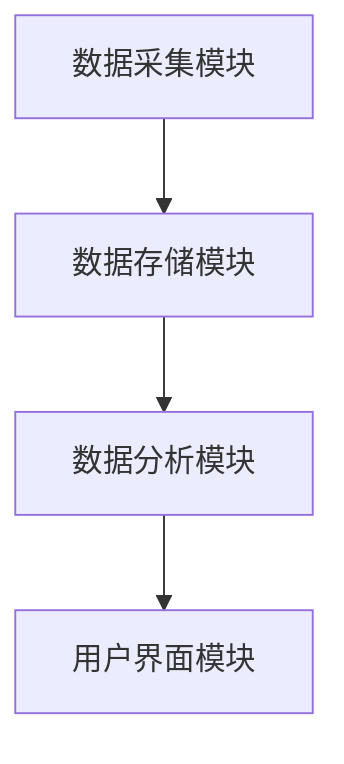

                 


# 价值投资中的物联网生态系统分析

## 关键词：价值投资、物联网生态系统、数据驱动、投资策略、系统架构

## 摘要：  
本文深入探讨物联网技术如何改变价值投资的分析框架和决策过程。通过分析物联网生态系统的核心要素、数据采集与处理、价值评估模型构建以及投资策略优化，本文构建了一个系统化的分析框架。文章结合实际案例，详细讲解了物联网技术在投资决策中的应用，旨在为投资者提供更高效、更精准的投资分析工具。

---

## 第1章：物联网与价值投资的结合

### 1.1 物联网的基本概念

#### 1.1.1 物联网的定义与特点
物联网（Internet of Things, IoT）是指通过各种信息传感设备，如传感器、射频识别（RFID）、全球定位系统（GPS）、红外感应器等，按照约定的协议，把任何物品与互联网连接起来，进行信息交换和通信，以实现智能化识别、定位、跟踪、监控和管理。物联网的核心特征包括：
- **万物互联**：将物理世界中的设备、物品与数字世界连接。
- **实时感知**：通过传感器实时采集数据。
- **智能分析**：利用大数据和人工智能技术进行分析和决策。

#### 1.1.2 物联网在金融领域的应用
物联网技术在金融领域的应用日益广泛，主要体现在以下几个方面：
- **智能投顾**：通过物联网设备采集市场数据，为投资者提供实时建议。
- **风险管理**：利用物联网实时监控企业运营状况，评估投资风险。
- **供应链优化**：通过物联网技术优化企业供应链管理，降低投资风险。

#### 1.1.3 价值投资的基本原理
价值投资是一种以基本面分析为核心的长期投资策略，强调通过分析企业的财务状况、行业地位、竞争优势等因素，寻找被市场低估的投资标的。物联网技术的引入，为价值投资提供了更丰富的数据来源和更精准的分析工具。

---

### 1.2 物联网生态系统的核心要素

#### 1.2.1 物联网感知层
感知层是物联网的最底层，负责数据的采集和初步处理。主要组成部分包括：
- **传感器**：用于采集物理世界中的数据，如温度、湿度、压力等。
- **采集模块**：将传感器数据转换为数字信号，并通过通信模块传输到云端。

#### 1.2.2 物联网网络层
网络层负责数据的传输和通信，主要包括：
- **通信协议**：如MQTT、HTTP等，用于设备间的数据传输。
- **网络设备**：如路由器、交换机，用于数据的路由和转发。

#### 1.2.3 物联网应用层
应用层是物联网系统的最高层，负责数据的处理和应用。主要功能包括：
- **数据存储**：将采集到的数据存储在数据库中，便于后续分析。
- **数据分析**：利用大数据和人工智能技术对数据进行处理和分析。
- **用户界面**：为用户提供直观的数据展示和操作界面。

---

### 1.3 物联网与价值投资的结合点

#### 1.3.1 物联网数据在投资决策中的作用
物联网数据的实时性和准确性为价值投资提供了更全面的参考。例如：
- 通过传感器数据，可以实时监控企业的生产状况，评估企业的盈利能力和运营效率。
- 通过供应链数据，可以评估企业的供应链稳定性，降低投资风险。

#### 1.3.2 物联网生态系统对投资价值的影响
物联网生态系统通过优化企业的运营效率、降低生产成本、提升产品质量等方式，间接影响企业的投资价值。

#### 1.3.3 物联网技术如何提升投资效率
物联网技术可以通过实时数据分析，帮助投资者快速发现市场机会和风险，提升投资效率。

---

## 第2章：物联网生态系统的核心概念与联系

### 2.1 物联网生态系统的核心要素分析

#### 2.1.1 物联网设备
物联网设备是物联网系统的核心组成部分，包括传感器、智能终端等。这些设备通过采集数据并上传到云端，为投资决策提供支持。

#### 2.1.2 数据采集与传输
数据采集与传输是物联网系统的关键环节。通过传感器采集数据后，需要通过通信模块将数据传输到云端。常用的通信协议包括MQTT、HTTP等。

#### 2.1.3 数据分析与处理
数据分析与处理是物联网系统的核心功能。通过大数据和人工智能技术，对采集到的数据进行清洗、建模、预测等处理，为投资决策提供支持。

---

### 2.2 物联网生态系统与价值投资的关系

#### 2.2.1 物联网数据对投资决策的影响
物联网数据的实时性和准确性，为价值投资提供了更全面的参考。例如，通过传感器数据，可以实时监控企业的生产状况，评估企业的盈利能力和运营效率。

#### 2.2.2 物联网生态系统对投资价值的影响
物联网生态系统通过优化企业的运营效率、降低生产成本、提升产品质量等方式，间接影响企业的投资价值。

#### 2.2.3 物联网技术如何优化投资流程
物联网技术可以通过实时数据分析，帮助投资者快速发现市场机会和风险，优化投资流程。

---

## 第3章：物联网生态系统中的数据采集与分析

### 3.1 数据采集技术

#### 3.1.1 物联网传感器技术
物联网传感器技术是数据采集的核心技术。常用的传感器包括温度传感器、湿度传感器、压力传感器等。

#### 3.1.2 数据采集协议
数据采集协议是物联网系统中设备间通信的规则。常用的协议包括MQTT、HTTP等。

#### 3.1.3 数据采集的挑战与解决方案
数据采集过程中可能会遇到信号干扰、数据丢失等问题。为了解决这些问题，可以通过优化传感器布局、增加冗余设备等方式进行改善。

---

### 3.2 数据分析方法

#### 3.2.1 数据清洗与预处理
数据清洗是数据分析的第一步。通过去除噪声数据、填补缺失值等方法，确保数据的准确性。

#### 3.2.2 数据挖掘与机器学习
通过数据挖掘和机器学习技术，可以从海量数据中提取有用信息，为投资决策提供支持。

#### 3.2.3 数据可视化
数据可视化是数据分析的重要环节。通过图表、仪表盘等方式，直观展示数据，帮助投资者快速理解数据。

---

## 第4章：物联网生态系统中的价值评估模型

### 4.1 价值评估模型的构建

#### 4.1.1 数据驱动的评估方法
通过物联网数据，构建数据驱动的价值评估模型。例如，可以通过企业生产数据预测企业的盈利能力。

#### 4.1.2 传统价值评估方法的改进
传统价值评估方法（如PE、PB等）可以通过结合物联网数据进行优化。

#### 4.1.3 综合评估模型的设计
综合评估模型是将物联网数据与其他因素（如财务数据、行业趋势等）结合起来，构建更全面的价值评估模型。

---

### 4.2 案例分析：物联网在某行业的应用

#### 4.2.1 案例背景
假设某制造企业希望通过物联网技术优化生产管理，降低生产成本。

#### 4.2.2 数据分析与模型构建
通过传感器数据，分析设备的运行状况，预测设备的故障率，优化设备维护策略。

#### 4.2.3 结果与启示
通过物联网技术，该企业成功降低了设备故障率，提高了生产效率，从而提升了投资价值。

---

## 第5章：物联网生态系统中的投资策略优化

### 5.1 投资策略的优化方法

#### 5.1.1 数据驱动的投资决策
通过物联网数据，实时监控企业的生产状况，评估企业的投资价值。

#### 5.1.2 风险评估与管理
通过物联网数据，实时监控企业的运营状况，评估投资风险。

#### 5.1.3 投资组合优化
通过物联网数据，优化投资组合，降低投资风险，提高投资收益。

---

### 5.2 实际案例分析

#### 5.2.1 某行业物联网应用案例
例如，某化工企业通过物联网技术实时监控生产线的运行状况，预测设备故障率，优化设备维护策略，降低生产成本。

#### 5.2.2 数据驱动的投资决策
通过物联网数据，投资者可以实时监控企业的生产状况，评估企业的投资价值，制定更科学的投资策略。

---

## 第6章：系统架构与实现

### 6.1 系统架构设计

#### 6.1.1 系统功能设计
- 数据采集模块：负责采集物联网设备的数据。
- 数据存储模块：负责存储采集到的数据。
- 数据分析模块：负责对数据进行清洗、建模、预测等处理。
- 用户界面模块：为用户提供直观的数据展示和操作界面。

#### 6.1.2 系统架构图


---

### 6.2 系统实现

#### 6.2.1 环境安装
需要安装以下软件：
- Python 3.8+
- Pandas、NumPy等数据处理库
- scikit-learn等机器学习库

#### 6.2.2 核心代码实现

##### 数据采集模块
```python
import serial

ser = serial.Serial('COM3', 9600)
data = ser.readline().decode().strip()
print(data)
```

##### 数据分析模块
```python
from sklearn.linear_model import LinearRegression

model = LinearRegression()
X = [[1], [2], [3], [4]]
y = [2, 4, 6, 8]
model.fit(X, y)
print(model.predict([[5]]))
```

---

## 第7章：总结与展望

### 7.1 总结
本文深入探讨了物联网技术在价值投资中的应用，构建了一个系统化的分析框架，详细讲解了物联网生态系统的核心要素、数据采集与分析方法、价值评估模型构建以及投资策略优化。

### 7.2 展望
未来，随着物联网技术的不断发展，价值投资的分析框架和决策工具将更加智能化和数据化。物联网技术将进一步提升投资决策的效率和准确性，为投资者创造更大的价值。

---

## 作者：AI天才研究院/AI Genius Institute & 禅与计算机程序设计艺术 /Zen And The Art of Computer Programming

