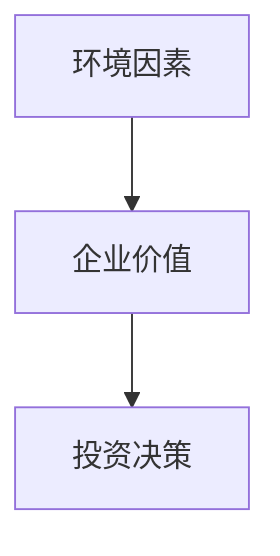
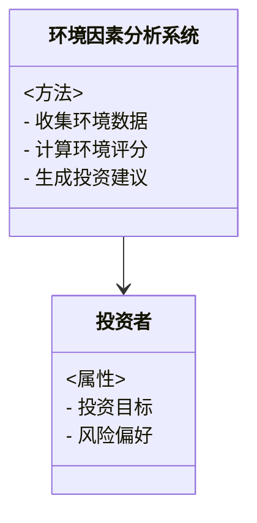
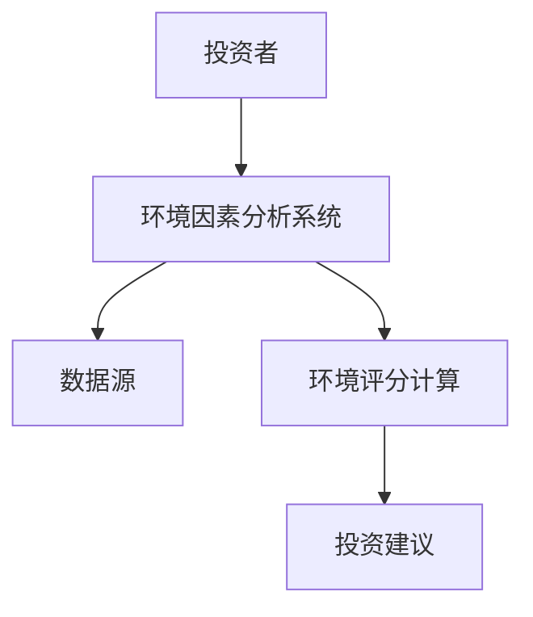

                 


# 价值投资中的环境因素考量

## 关键词：环境因素、价值投资、宏观经济、行业分析、企业治理、ESG评分

## 摘要

在价值投资中，环境因素扮演着至关重要的角色。本文将深入探讨环境因素如何影响投资决策，包括宏观经济分析、行业动态评估和企业治理结构等内容。通过量化模型和实际案例分析，展示环境因素如何转化为投资优势，帮助投资者优化决策。

---

## 第一章：环境因素在价值投资中的重要性

### 1.1 环境因素的定义与核心概念

#### 1.1.1 环境因素的定义
环境因素是指影响企业外部运营的各种条件，包括宏观经济状况、行业趋势、政策法规等。这些因素与企业的盈利能力、成长潜力密切相关。

#### 1.1.2 环境因素的核心概念
- 宏观经济环境：GDP增长率、利率水平、通货膨胀等。
- 行业动态：行业生命周期、竞争格局、技术创新。
- 政策法规：环保法规、税收政策、贸易政策等。

#### 1.1.3 环境因素与价值投资的关系
环境因素影响企业的长期发展，投资者需通过分析这些因素评估企业的潜在风险和机会。

### 1.2 环境因素的背景介绍

#### 1.2.1 问题背景
当前全球经济不确定性增加，环境因素对企业的影响日益显著。投资者需准确识别并评估这些因素。

#### 1.2.2 问题描述
环境因素复杂多变，如何将其量化并融入投资决策是投资者面临的挑战。

#### 1.2.3 问题解决方法
通过系统分析和量化模型，将环境因素转化为可操作的投资策略。

#### 1.2.4 边界与外延
环境因素分析的边界包括宏观经济、行业和政策法规，外延则涉及企业的社会和环境责任。

#### 1.2.5 核心要素组成
- 宏观经济指标
- 行业竞争结构
- 企业治理和政策合规性

---

## 第二章：环境因素的核心概念与联系

### 2.1 环境因素的核心原理

#### 2.1.1 环境因素的属性特征对比表格

| 环境因素 | 宏观经济 | 行业 | 企业治理 |
|----------|----------|------|----------|
| 例子     | GDP增长率 | 行业集中度 | 经营合规性 |
| 影响     | 影响整体经济 | 影响行业竞争 | 影响企业声誉和风险 |

#### 2.1.2 环境因素的ER实体关系图

```mermaid
erDiagram
    actor 投资者 {
        <属性>
        - 宏观经济指标
        - 行业动态
        - 企业治理
    }
    actor 企业 {
        <属性>
        - 经营状况
        - 财务数据
        - 发展战略
    }
    relation 环境因素关系 {
        <关联>
        投资者分析企业环境因素以评估投资价值。
    }
```

### 2.2 环境因素与投资决策的联系

#### 2.2.1 环境因素对投资决策的影响
环境因素通过影响企业的盈利能力和风险水平，直接改变其投资价值。

#### 2.2.2 环境因素与企业价值的关系
环境因素优化时，企业面临的风险降低，价值提升。

---

## 第三章：环境因素的算法原理

### 3.1 环境因素的量化方法

#### 3.1.1 环境评分计算的算法流程

```mermaid
graph TD
    A[开始] -> B[收集环境数据]
    B -> C[计算各因素权重]
    C -> D[计算环境评分]
    D -> E[结束]
```

#### 3.1.2 环境因素对估值的影响模型



### 3.2 环境因素的数学模型

#### 3.2.1 环境评分计算公式

$$ \text{环境评分} = \sum (\text{权重}_i \times \text{指标值}_i) $$

#### 3.2.2 企业价值调整模型

$$ \text{调整后价值} = \text{原价值} \times (1 + \text{环境因素影响}) $$

---

## 第四章：环境因素对估值的影响

### 4.1 环境因素的数学模型

#### 4.1.1 环境因素对现金流的影响

$$ \text{现金流} = \text{收入} - \text{成本} - \text{环境影响成本} $$

#### 4.1.2 贴现率的调整公式

$$ \text{调整后贴现率} = \text{基准贴现率} + \text{环境风险溢价} $$

---

## 第五章：环境因素的系统分析与架构设计

### 5.1 系统分析

#### 5.1.1 问题场景介绍
投资者需要量化环境因素以优化投资组合。

#### 5.1.2 项目介绍
构建一个环境因素分析系统，帮助投资者评估投资标的。

#### 5.1.3 系统功能设计(领域模型)



#### 5.1.4 系统架构设计



---

## 第六章：环境因素的项目实战

### 6.1 项目实战环境安装

#### 6.1.1 环境依赖与安装步骤

- 安装Python和必要的库（如Pandas、Scikit-learn）
- 数据源获取（宏观经济数据、行业数据）

### 6.2 核心实现源代码

#### 6.2.1 环境因素分析的Python代码

```python
import pandas as pd

def calculate_environment_score(data, weights):
    return pd.dot(data, weights)

# 示例数据
data = pd.DataFrame({
    '宏观经济': [0.8, 0.7, 0.9],
    '行业': [0.6, 0.8, 0.7],
    '治理': [0.9, 0.8, 0.8]
})

weights = {'宏观经济': 0.4, '行业': 0.3, '治理': 0.3}
score = calculate_environment_score(data, weights)
print(score)
```

---

## 项目小结

环境因素是价值投资中不可忽视的关键因素。通过系统的分析和量化模型，投资者能够更准确地评估投资标的的价值和风险，制定更优化的投资策略。

---

## 最佳实践 Tips

1. **定期更新环境因素分析**，以应对不断变化的外部条件。
2. **结合多种因素**，避免单一因素主导决策。
3. **关注政策变化**，特别是环保和税收政策，对企业影响深远。

---

## 结论

环境因素在价值投资中的重要性不容忽视。通过系统的方法和量化模型，投资者可以更全面地评估投资标的，优化决策并降低风险。

---

## 作者

**作者：AI天才研究院/Zen And The Art of Computer Programming**

联系邮箱：contact@aitalentinstitute.com

---

通过以上结构，文章详细分析了环境因素在价值投资中的各个方面，从理论到实践，帮助投资者提升决策能力。

