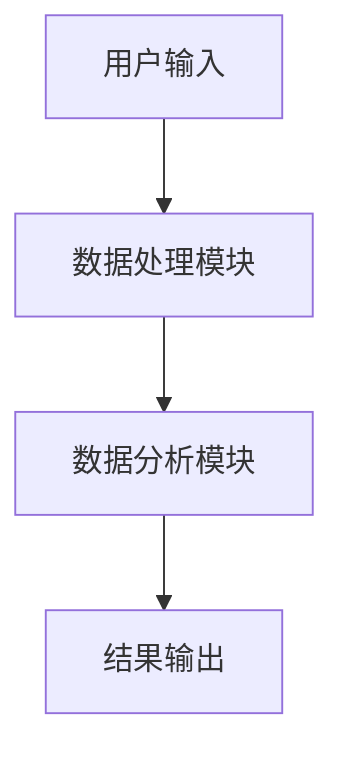

                 


# 价值投资中的生物制药研发管线分析

## 关键词：
- 价值投资
- 生物制药
- 研发管线
- NPV模型
- 风险评估

## 摘要：
本文系统地探讨了在价值投资中分析生物制药研发管线的重要性。通过详细分析研发管线的各个阶段，结合数学模型和实际案例，本文提出了如何利用NPV模型和风险评估方法来评估研发管线的价值，从而为投资者提供科学决策依据。

---

# 第1章: 价值投资中的生物制药研发管线分析背景介绍

## 1.1 生物制药研发管线的定义与特点

### 1.1.1 生物制药研发管线的定义
生物制药研发管线是指从药物发现到商业化过程中的一系列研发阶段。它通常包括临床前研究、临床试验（I、II、III期）以及商业化阶段。研发管线的复杂性和不确定性是生物制药行业的显著特点。

### 1.1.2 生物制药研发管线的核心要素
- **时间跨度**：从药物发现到商业化通常需要10-15年。
- **成本**：每个阶段的研发成本逐步增加。
- **成功率**：各阶段的成功率差异显著，后期阶段的成功率远低于早期阶段。

### 1.1.3 价值投资与生物制药研发管线的关联
价值投资强调长期基本面分析，而研发管线的评估是生物制药公司长期价值的核心。通过分析研发管线的潜力和风险，投资者可以更好地判断公司的未来盈利能力。

---

## 1.2 价值投资的基本概念

### 1.2.1 价值投资的定义
价值投资是一种投资策略，旨在通过深入分析企业的基本面，寻找市场价格低于其内在价值的投资机会。

### 1.2.2 价值投资的核心原则
- **安全边际**：买入价格低于内在价值。
- **长期视角**：关注企业的长期盈利能力。
- **风险管理**：避免重大投资风险。

### 1.2.3 生物制药行业的特殊性与价值投资的结合
生物制药行业的高风险和高回报特性要求投资者具备专业的知识和分析能力。通过深入分析研发管线，投资者可以更好地评估公司的长期价值。

---

## 1.3 本章小结
本章介绍了生物制药研发管线的定义、核心要素及其与价值投资的关联。通过理解研发管线的阶段性和不确定性，投资者可以更好地评估公司的长期价值。

---

# 第2章: 生物制药研发管线的阶段划分与风险评估

## 2.1 研发管线的阶段划分

### 2.1.1 临床前研究阶段
- **目标**：评估药物的安全性和有效性。
- **时间**：1-3年。
- **成本**：中等成本。

### 2.1.2 临床试验阶段
- **临床I期**：初步评估药物的安全性和耐受性。
- **临床II期**：评估药物的有效性和剂量反应关系。
- **临床III期**：大规模随机对照试验，评估药物的有效性和安全性。

### 2.1.3 商业化阶段
- **目标**：将药物推向市场并实现盈利。
- **时间**：5-10年。
- **成本**：高成本，但回报潜力大。

---

## 2.2 每一阶段的风险与成功率分析

### 2.2.1 临床前研究的风险与成功率
- **成功率**：约30%进入临床阶段。
- **主要风险**：药物安全性和有效性未达标。

### 2.2.2 临床试验阶段的成功率对比
- **临床I期**：约70%成功进入II期。
- **临床II期**：约60%成功进入III期。
- **临床III期**：约30%成功通过。

### 2.2.3 商业化阶段的风险与挑战
- **成功率**：约70%的药物成功商业化。
- **主要风险**：市场竞争、生产成本、专利风险。

---

## 2.3 研发管线的价值评估模型

### 2.3.1 简单的NPV模型
$$ NPV = \sum_{t=1}^{n} \frac{CF_t}{(1 + r)^t} $$
其中，\( CF_t \)为第t年的现金流，\( r \)为贴现率。

### 2.3.2 考虑概率加权的NPV模型
$$ NPV = \sum_{i=1}^{m} P_i \times NPV_i $$
其中，\( P_i \)为阶段i的成功概率，\( NPV_i \)为阶段i的净现值。

---

## 2.4 本章小结
本章详细分析了生物制药研发管线的阶段划分及其风险。通过概率加权的NPV模型，投资者可以更好地评估研发管线的潜在价值和风险。

---

# 第3章: 研发管线价值评估的数学模型

## 3.1 NPV模型的数学公式

### 3.1.1 NPV的基本公式
$$ NPV = \sum_{t=1}^{n} \frac{CF_t}{(1 + r)^t} $$

### 3.1.2 考虑概率加权的NPV公式
$$ NPV = \sum_{i=1}^{m} P_i \times NPV_i $$

---

## 3.2 研发管线阶段的现金流模型

### 3.2.1 临床前阶段的现金流
- **初始投资**：1000万美元。
- **后续现金流**：每年增加200万美元，持续3年。

### 3.2.2 临床试验阶段的现金流
- **初始投资**：5000万美元。
- **后续现金流**：每年增加1000万美元，持续5年。

### 3.2.3 商业化阶段的现金流
- **初始投资**：1亿美元。
- **后续现金流**：每年增加5000万美元，持续10年。

---

## 3.3 风险调整的模型

### 3.3.1 风险调整贴现率
$$ r = r_{\text{无风险}} + \text{风险溢价} $$

### 3.3.2 风险调整现金流
$$ CF_t = P_i \times CF_t $$

---

## 3.4 本章小结
本章通过数学模型详细分析了研发管线的价值评估方法。通过考虑风险和概率，投资者可以更准确地评估研发管线的潜在价值。

---

# 第4章: 研发管线分析系统的功能设计

## 4.1 系统功能模块划分

### 4.1.1 数据收集模块
- **功能**：收集研发管线的阶段数据和市场数据。

### 4.1.2 数据分析模块
- **功能**：分析研发管线的NPV和风险。

### 4.1.3 风险评估模块
- **功能**：评估研发管线的整体风险。

---

## 4.2 系统架构设计

### 4.2.1 数据流图


### 4.2.2 模

---

# 第五部分: 项目实战与拓展阅读

## 5.1 项目实战

### 5.1.1 环境安装
- **工具**：Python、Pandas、NumPy、Matplotlib。

### 5.1.2 核心实现代码
```python
import pandas as pd
import numpy as np

def calculate_npv(cash_flows, discount_rate):
    return sum([cf / (1 + discount_rate)**t for t, cf in enumerate(cash_flows)])

# 示例现金流
cash_flows = [1000, 2000, 3000, 4000]
discount_rate = 0.1

npv = calculate_npv(cash_flows, discount_rate)
print(f"净现值 (NPV): ${npv:.2f}")
```

### 5.1.3 实际案例分析
- **案例公司**：假设一家公司有三个研发项目，分别处于临床II期、III期和商业化阶段。
- **分析结果**：计算每个项目的NPV，并综合评估整体研发管线的价值。

---

## 5.2 最佳实践 tips

### 5.2.1 小结
- 通过分析研发管线的阶段和风险，投资者可以更好地评估公司的长期价值。
- 使用数学模型和系统工具，提高分析的准确性和效率。

### 5.2.2 注意事项
- 数据质量是关键，确保输入数据的准确性和完整性。
- 模型假设需合理，避免过度简化或复杂化。

### 5.2.3 拓展阅读
- 建议进一步学习NPV模型在其他行业的应用。
- 探索更多风险评估方法，如蒙特卡洛模拟。

---

# 作者：AI天才研究院/AI Genius Institute & 禅与计算机程序设计艺术 /Zen And The Art of Computer Programming

