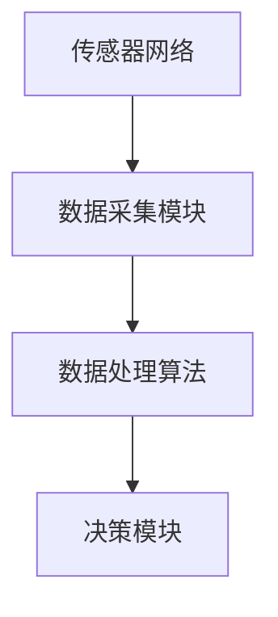
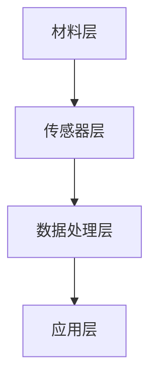
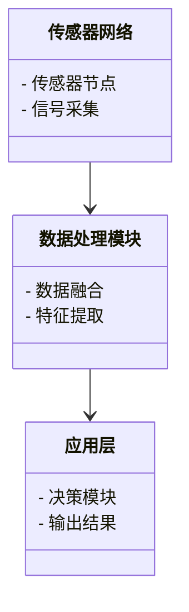
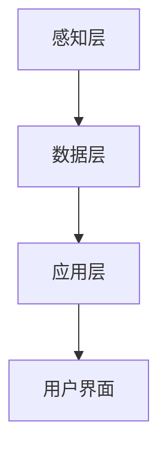

                 


# 价值投资中的生物可降解电子皮肤技术前景

> 关键词：生物可降解电子皮肤，价值投资，技术前景，传感器，材料科学，投资策略

> 摘要：本文深入探讨生物可降解电子皮肤技术的市场潜力、技术优势以及其在价值投资中的应用前景。通过分析技术原理、系统架构、算法原理和实际案例，本文为投资者提供基于技术分析的决策支持，帮助投资者识别高潜力的技术投资机会。

---

## 第一部分: 生物可降解电子皮肤技术的背景与价值投资概述

### 第1章: 生物可降解电子皮肤技术的定义与背景

#### 1.1 生物可降解电子皮肤技术的定义

生物可降解电子皮肤技术是一种结合了生物可降解材料和电子皮肤技术的创新科技。它利用生物可降解材料（如聚乳酸、聚己内酯等）作为基底，集成传感器、数据处理算法和柔性电子元件，形成一种可穿戴或植入式的电子皮肤系统。这种技术的核心在于其材料的生物可降解性和电子部分的高灵敏度感知能力。

#### 1.2 生物可降解电子皮肤技术的发展现状

当前，生物可降解电子皮肤技术的研究主要集中在以下几个方面：

1. **材料科学**：研究新型生物可降解材料的性能优化，如PLA（聚乳酸）、PCL（聚己内酯）和PHA（聚羟基脂肪酸酯）等。
2. **传感器技术**：开发高灵敏度、高稳定性的传感器，用于感知压力、温度、湿度等参数。
3. **数据处理算法**：研究如何将多源传感器数据进行融合和分析，以实现对复杂环境的准确感知。

#### 1.3 价值投资与生物可降解电子皮肤技术的关系

价值投资的核心在于识别那些具有持续增长潜力、竞争优势明显且估值合理的公司或技术。生物可降解电子皮肤技术由于其在医疗、可穿戴设备、人机交互等领域的重要应用潜力，正在成为投资者关注的热点。投资者需要从技术的市场前景、技术壁垒、商业模式等多个维度进行分析，以确定其投资价值。

---

## 第二部分: 生物可降解电子皮肤技术的核心概念与联系

### 第2章: 生物可降解材料的特性与应用

#### 2.1 生物可降解材料的分类与特性

生物可降解材料可以根据其降解环境分为生物降解和化学降解两类。以下是几种常见材料的对比：

| 材料类型 | 生物降解性 | 力学性能 | 加工性能 |
|----------|------------|----------|----------|
| PLA      | 良好       | 较低     | 良好     |
| PCL      | 良好       | 较高     | 优秀     |
| PHA      | 良好       | 较低     | 良好     |

（以上表格为材料特性的对比）

#### 2.2 电子皮肤技术的核心组件

电子皮肤技术的核心组件包括传感器网络、数据采集模块和数据处理算法。以下是一个简单的系统架构图：



#### 2.3 生物可降解电子皮肤技术的系统架构

以下是生物可降解电子皮肤技术的系统架构图：



---

## 第三部分: 生物可降解电子皮肤技术的算法原理与数学模型

### 第3章: 生物可降解电子皮肤技术的信号处理算法

#### 3.1 传感器信号采集与预处理

传感器信号的采集和预处理是电子皮肤技术的核心步骤。以下是信号预处理的数学模型：

$$ y_{\text{filtered}} = y_{\text{raw}} \times (1 - \alpha) + y_{\text{filtered}} \times \alpha $$

其中，$\alpha$ 是滤波系数，$y_{\text{raw}}$ 是原始信号，$y_{\text{filtered}}$ 是滤波后的信号。

#### 3.2 数据融合与决策算法

数据融合算法可以采用加权融合的方式，如下：

$$ y_{\text{final}} = \sum_{i=1}^{n} w_i y_i $$

其中，$w_i$ 是第 $i$ 个传感器的权重，$y_i$ 是第 $i$ 个传感器的输出。

---

## 第四部分: 生物可降解电子皮肤技术的系统分析与架构设计

### 第4章: 生物可降解电子皮肤技术的系统架构设计

#### 4.1 系统功能设计

以下是系统功能设计的类图：



#### 4.2 系统架构设计

以下是系统的分层架构图：



---

## 第五部分: 生物可降解电子皮肤技术的项目实战

### 第5章: 生物可降解电子皮肤技术的环境安装与核心代码

#### 5.1 环境安装

以下是安装步骤：

1. 安装Python和必要的开发工具（如PyCharm）。
2. 安装传感器驱动和数据采集库（如PySerial）。
3. 安装数据分析库（如NumPy、Pandas）。
4. 安装可视化库（如Matplotlib）。

#### 5.2 核心代码

以下是数据采集和处理的核心代码：

```python
import numpy as np
import matplotlib.pyplot as plt

# 传感器数据采集
def read_sensor():
    # 读取传感器数据并返回数组
    return np.random.random(100)

# 数据预处理
def preprocess(data):
    # 对数据进行滑动平均滤波
    alpha = 0.2
    filtered = np.zeros_like(data)
    filtered[0] = data[0]
    for i in range(1, len(data)):
        filtered[i] = data[i] * alpha + filtered[i-1] * (1 - alpha)
    return filtered

# 数据融合
def fuse_data(data1, data2):
    # 简单的加权融合
    weight = 0.5
    fused = data1 * weight + data2 * (1 - weight)
    return fused

# 主程序
data1 = read_sensor()
data2 = read_sensor()
processed_data = preprocess(data1)
fused_data = fuse_data(processed_data, data2)

# 数据可视化
plt.plot(fused_data)
plt.title('Fused Data')
plt.xlabel('Time')
plt.ylabel('Value')
plt.show()
```

---

## 第六部分: 生物可降解电子皮肤技术的价值投资分析

### 第6章: 生物可降解电子皮肤技术的投资策略与风险分析

#### 6.1 投资策略

1. **技术壁垒**：重点关注那些拥有自主知识产权和核心技术的企业。
2. **市场需求**：关注医疗、可穿戴设备等领域的需求增长。
3. **商业模式**：选择具有清晰商业模式和市场渠道的企业。

#### 6.2 风险分析

1. **技术风险**：技术不成熟可能导致产品失败。
2. **市场竞争**：行业竞争激烈可能导致利润下降。
3. **政策风险**：政策变化可能影响行业发展。

---

## 作者：AI天才研究院/AI Genius Institute & 禅与计算机程序设计艺术 /Zen And The Art of Computer Programming

