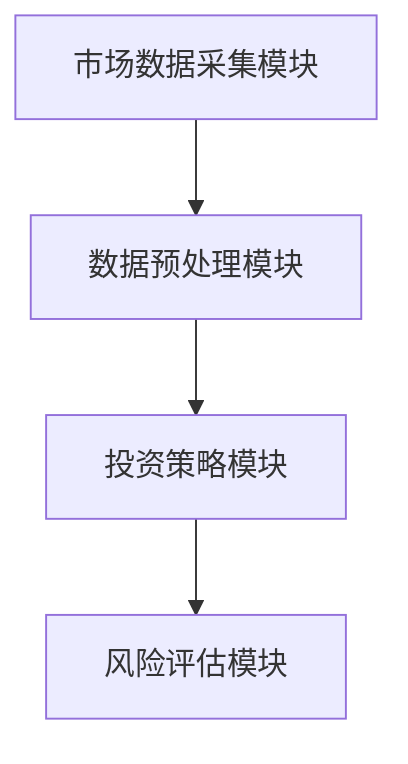

                 


## 第一部分: 价值投资中的生物启发型计算机架构背景

# 第1章: 生物启发型计算机架构与价值投资概述

## 1.1 生物启发型计算机架构的基本概念

### 1.1.1 生物启发计算的定义
生物启发计算（Biologically Inspired Computing）是一种基于自然界中生物系统的结构、行为和机制的计算方法。它通过模拟生物神经系统、进化过程和群体行为，提出新的计算模型和算法。这种计算模式强调适应性、并行性和分布式处理，与传统计算的线性、串行处理方式形成鲜明对比。

### 1.1.2 计算机架构与生物系统的类比
生物系统的计算模式可以为计算机架构提供新的思路。例如，生物神经网络的分布式信息处理方式启发了人工神经网络的设计；生物进化过程中的适应性机制启发了进化算法；生物群体的协同行为启发了分布式计算系统的设计。

### 1.1.3 价值投资的背景与挑战
价值投资是一种以基本面分析为基础的投资策略，旨在通过分析公司的财务状况、行业地位和管理团队等因素，找到具有长期投资价值的资产。然而，传统价值投资方法面临着市场波动性大、数据量爆炸、复杂性增加等挑战，传统的定量分析方法难以满足现代投资需求。

### 1.1.4 生物启发计算在价值投资中的应用
通过模拟生物系统的行为，生物启发计算为价值投资提供了新的工具和方法。例如，神经网络可以用于市场趋势预测，进化算法可以用于投资组合优化，群体智能可以用于风险评估。

## 1.2 价值投资的背景与现状

### 1.2.1 传统价值投资的核心理念
传统价值投资的核心理念是通过分析企业的内在价值，寻找市场价格低于内在价值的股票进行投资。这种方法强调长期投资、价值发现和风险控制。

### 1.2.2 现代投资分析的复杂性
随着市场的复杂化和数据量的增加，现代投资分析需要考虑更多的因素，包括宏观经济指标、行业趋势、公司财务数据、市场情绪等。传统的定量分析方法难以应对这些复杂性。

### 1.2.3 生物启发计算在投资中的潜在应用
生物启发计算通过模拟生物系统的复杂行为，提供了一种新的投资分析工具。例如，神经网络可以用于市场趋势预测，进化算法可以用于优化投资组合。

## 1.3 生物启发计算的核心原理

### 1.3.1 神经网络的类脑计算
神经网络是一种生物启发的计算模型，模拟人脑的神经网络结构和功能。它通过多层神经元之间的连接和权重调整，实现数据的特征提取和模式识别。

### 1.3.2 进化算法的优化能力
进化算法是一种基于生物进化原理的优化算法，通过模拟自然选择和遗传变异的过程，逐步优化目标函数。它适用于复杂问题的全局优化。

### 1.3.3 群体智能的协同效应
群体智能是一种基于生物群体行为的计算模型，通过模拟昆虫、鸟群等群体的协同行为，实现任务的分布式处理和优化。

## 1.4 生物启发计算与价值投资的结合

### 1.4.1 市场行为的生物模型化
市场行为可以通过生物系统的模型来描述和分析。例如，市场参与者的决策可以被建模为一个类似于生物神经网络的系统，通过网络的动态行为来预测市场趋势。

### 1.4.2 投资决策的生物启发算法
通过应用生物启发算法，投资者可以优化投资组合，降低风险，提高收益。例如，进化算法可以用于寻找最优的投资组合配置，神经网络可以用于预测市场走势。

### 1.4.3 生物架构在投资组合优化中的应用
生物启发计算的架构可以为投资组合优化提供新的思路。例如，分布式计算架构可以模拟生物群体的协同行为，实现投资组合的风险分散和收益最大化。

## 1.5 本章小结

本章介绍了生物启发计算的基本概念和核心原理，并探讨了其在价值投资中的潜在应用。通过模拟生物系统的复杂行为，生物启发计算为现代投资分析提供了新的工具和方法。在后续章节中，我们将深入探讨生物启发计算的具体算法和数学模型，以及其在价值投资中的实际应用。

---

## 第二部分: 生物启发计算的核心概念与价值投资的联系

# 第2章: 生物启发计算的核心概念

## 2.1 生物启发计算的理论基础

### 2.1.1 神经网络的基本结构与功能
神经网络是一种生物启发的计算模型，由多个神经元通过连接权重构成。它通过输入数据的特征提取和非线性变换，实现数据的分类和预测。

### 2.1.2 进化算法的优化机制
进化算法是一种基于生物进化原理的优化算法，包括选择、交叉和变异三个基本操作。它通过模拟自然选择的过程，逐步优化目标函数。

### 2.1.3 群体智能的协同原理
群体智能是一种基于生物群体行为的计算模型，通过模拟昆虫、鸟群等群体的协同行为，实现任务的分布式处理和优化。

## 2.2 生物启发计算与传统计算的对比

### 2.2.1 计算模式的差异
传统计算基于线性、串行的处理模式，而生物启发计算强调并行、分布式和自适应的处理模式。

### 2.2.2 算法效率的对比
传统算法适用于规则性较强的问题，而生物启发算法适用于复杂、非线性的问题，能够在复杂环境中找到近似最优解。

### 2.2.3 应用领域的拓展
生物启发计算在机器学习、模式识别、优化问题等领域有广泛应用，而传统计算主要应用于规则性较强的任务。

## 2.3 生物启发计算在价值投资中的具体应用

### 2.3.1 市场趋势预测的神经网络模型
神经网络可以用于股票价格的预测，通过训练网络模型，提取市场数据中的特征，实现对市场趋势的预测。

### 2.3.2 投资组合优化的进化算法
进化算法可以用于优化投资组合，通过模拟生物进化的过程，寻找最优的投资组合配置，实现风险最小化和收益最大化的双重目标。

### 2.3.3 风险评估的群体智能方法
群体智能可以用于风险评估，通过模拟市场参与者的协同行为，评估投资组合在不同市场条件下的风险水平。

## 2.4 本章小结

本章深入探讨了生物启发计算的核心概念和其在价值投资中的具体应用。通过对比传统计算和生物启发计算的差异，我们看到生物启发计算在复杂问题中的独特优势。在后续章节中，我们将进一步探讨生物启发计算的算法原理和数学模型，并结合实际案例进行分析。

---

## 第三部分: 生物启发计算的算法原理与数学模型

# 第3章: 生物启发计算的算法原理

## 3.1 神经网络算法

### 3.1.1 神经网络的基本结构
神经网络由输入层、隐藏层和输出层组成，每个神经元通过连接权重和激活函数实现信息的传递和处理。

### 3.1.2 神经网络的训练过程
神经网络的训练包括正向传播和反向传播两个阶段。正向传播用于计算网络的输出，反向传播用于调整网络的连接权重，以最小化预测误差。

### 3.1.3 神经网络的数学模型
神经网络的输出可以通过激活函数和连接权重的线性组合来表示。例如，sigmoid函数可以用于二分类问题，而ReLU函数可以用于深度网络的训练。

### 3.1.4 神经网络在价值投资中的应用
神经网络可以用于股票价格预测，通过训练网络模型，提取市场数据中的特征，实现对市场趋势的预测。

### 3.1.5 神经网络的优缺点
神经网络具有强大的非线性建模能力，但训练过程可能较为复杂，需要大量数据和计算资源。

### 3.1.6 实际案例分析
我们可以使用Keras框架搭建一个简单的神经网络模型，用于股票价格的预测。通过训练模型，我们可以验证神经网络在价值投资中的应用效果。

### 3.1.7 神经网络的代码实现
```python
import numpy as np
from keras.models import Sequential
from keras.layers import Dense

# 创建简单的神经网络模型
model = Sequential()
model.add(Dense(units=64, activation='relu', input_dim=10))
model.add(Dense(units=1, activation='sigmoid'))

# 编译模型
model.compile(optimizer='adam', loss='binary_crossentropy', metrics=['accuracy'])

# 训练模型
model.fit(X_train, y_train, epochs=10, batch_size=32)
```

## 3.2 进化算法

### 3.2.1 进化算法的基本原理
进化算法是一种基于生物进化原理的优化算法，包括选择、交叉和变异三个基本操作。它通过模拟自然选择的过程，逐步优化目标函数。

### 3.2.2 进化算法的步骤
1. 初始化种群：随机生成一组候选解。
2. 计算适应度：评估每个候选解的适应度值。
3. 选择：根据适应度值选择优秀的个体进行繁殖。
4. 交叉：对选中的个体进行基因交叉，生成新的候选解。
5. 变异：对新生成的个体进行随机变异，增加种群的多样性。
6. 重复上述步骤，直到满足终止条件。

### 3.2.3 进化算法的数学模型
进化算法的核心是适应度函数和遗传操作。适应度函数用于评估候选解的优劣，而遗传操作（交叉和变异）用于生成新的候选解。

### 3.2.4 进化算法在价值投资中的应用
进化算法可以用于优化投资组合，通过模拟生物进化的过程，寻找最优的投资组合配置，实现风险最小化和收益最大化的双重目标。

### 3.2.5 进化算法的优缺点
进化算法具有全局搜索能力强的特点，但计算效率可能较低，特别是在处理大规模问题时。

### 3.2.6 实际案例分析
我们可以使用Python的DEAP库实现一个简单的进化算法，用于优化投资组合的收益和风险。

### 3.2.7 进化算法的代码实现
```python
import numpy as np
from deap import base, creator, tools, algorithms

# 定义适应度函数
creator.create("Fitness", base.Fitness, weights=(-1.0,))  # 最小化问题
creator.create("Individual", list, fitness=[Fitness])

# 定义遗传操作
toolbox = base.Toolbox()
toolbox.register("attr_float", np.random.uniform, 0, 1)
toolbox.register("individual", tools.initRepeat, creator.Individual, toolbox.attr_float, n=10)
toolbox.register("mate", tools.cxBlend, alpha=0.5)
toolbox.register("mutate", tools.mutGaussian, mu=0, sigma=0.1, indpb=0.1)
toolbox.register("select", tools.selTournament, tournsize=3)

# 运行遗传算法
pop = toolbox.individual()
pop, logbook = algorithms.eaSimple(pop, toolbox, cxpb=0.5, mutpb=0.2, ngen=20, verbose=False)
```

## 3.3 群体智能

### 3.3.1 群体智能的基本原理
群体智能是一种基于生物群体行为的计算模型，通过模拟昆虫、鸟群等群体的协同行为，实现任务的分布式处理和优化。

### 3.3.2 群体智能的典型算法
粒子群优化算法（PSO）是一种常见的群体智能算法，通过模拟鸟群的飞行行为，实现对目标函数的优化。

### 3.3.3 群体智能的数学模型
粒子群优化算法通过维护每个粒子的位置和速度，实现对目标函数的搜索和优化。

### 3.3.4 群体智能在价值投资中的应用
群体智能可以用于风险评估，通过模拟市场参与者的协同行为，评估投资组合在不同市场条件下的风险水平。

### 3.3.5 群体智能的优缺点
群体智能具有分布式计算能力强的特点，但算法的收敛速度可能较慢。

### 3.3.6 实际案例分析
我们可以使用Python的scikit-learn库实现一个简单的粒子群优化算法，用于优化投资组合的风险和收益。

### 3.3.7 群体智能的代码实现
```python
import numpy as np
import random

# 定义粒子群优化算法
class Particle:
    def __init__(self, n_dim, max_val=1):
        self.position = [random.uniform(0, max_val) for _ in range(n_dim)]
        self.velocity = [0] * n_dim
        self.pbest = self.position.copy()
        self.pbest_cost = float('inf')
        self.r1 = random.random()
        self.r2 = random.random()

    def update(self, best_p):
        self.velocity = [self.pbest[0] * self.r1 + best_p[0] * self.r2 + self.velocity[0] * (1 - self.r1 - self.r2),
                          self.pbest[1] * self.r1 + best_p[1] * self.r2 + self.velocity[1] * (1 - self.r1 - self.r2)]
        self.position = [self.position[0] + self.velocity[0], self.position[1] + self.velocity[1]]

# 粒子群优化算法实现
def pso(n_particles, n_dim, max_iter, max_val, fitness_func):
    particles = [Particle(n_dim, max_val) for _ in range(n_particles)]
    best_p = [0.0] * n_dim
    best_cost = float('inf')
    
    for _ in range(max_iter):
        for i, particle in enumerate(particles):
            current_cost = fitness_func(particle.position)
            if current_cost < particle.pbest_cost:
                particle.pbest_cost = current_cost
                particle.pbest = particle.position.copy()
            if current_cost < best_cost:
                best_cost = current_cost
                best_p = particle.position.copy()
            particle.update(best_p)
    return best_p, best_cost
```

## 3.4 本章小结

本章详细探讨了生物启发计算的三种核心算法：神经网络、进化算法和群体智能。通过数学模型和代码实现，我们展示了这些算法的基本原理和实现步骤。在后续章节中，我们将结合这些算法，探讨其在价值投资中的具体应用。

---

## 第四部分: 生物启发计算在价值投资中的系统分析与架构设计

# 第4章: 生物启发计算的系统分析与架构设计

## 4.1 价值投资系统的功能需求

### 4.1.1 市场数据采集模块
市场数据采集模块负责从数据源获取股票价格、财务数据等市场信息。

### 4.1.2 数据预处理模块
数据预处理模块负责对获取的市场数据进行清洗、标准化和特征提取。

### 4.1.3 投资策略模块
投资策略模块负责根据市场数据和投资者的偏好，生成投资策略和投资组合。

### 4.1.4 风险评估模块
风险评估模块负责评估投资组合在不同市场条件下的风险水平。

## 4.2 系统架构设计

### 4.2.1 系统功能模块设计
价值投资系统包括市场数据采集、数据预处理、投资策略生成和风险评估四个主要功能模块。

### 4.2.2 系统架构图
以下是一个简单的系统架构图，展示了各模块之间的关系：



### 4.2.3 系统接口设计
系统需要提供以下接口：
1. 数据接口：用于获取市场数据。
2. 策略接口：用于生成投资策略。
3. 风险评估接口：用于评估投资组合的风险。

### 4.2.4 系统交互流程
系统交互流程包括以下步骤：
1. 市场数据采集模块获取市场数据。
2. 数据预处理模块对数据进行清洗和特征提取。
3. 投资策略模块根据预处理后的数据生成投资策略。
4. 风险评估模块评估投资组合的风险。

## 4.3 本章小结

本章详细探讨了生物启发计算在价值投资系统中的应用，从系统功能模块设计到系统架构设计，再到系统接口设计，我们展示了如何将生物启发计算的理念应用于实际投资系统中。在后续章节中，我们将结合实际案例，展示如何将这些算法应用于具体的项目中。

---

## 第五部分: 生物启发计算的项目实战

# 第5章: 生物启发计算的项目实战

## 5.1 价值投资系统的项目背景

### 5.1.1 项目目标
本项目旨在通过生物启发计算的方法，构建一个能够进行价值投资的智能系统，帮助投资者做出更明智的投资决策。

### 5.1.2 项目需求
系统需要实现以下功能：
1. 市场数据的采集和预处理。
2. 投资策略的生成和优化。
3. 投资组合的风险评估和优化。

## 5.2 项目实现

### 5.2.1 环境配置
为了实现本项目，我们需要以下环境配置：
- Python 3.8+
- NumPy、Pandas、Scikit-learn、DEAP、Keras等库。

### 5.2.2 核心代码实现

#### 5.2.2.1 神经网络模型实现
```python
import numpy as np
from keras.models import Sequential
from keras.layers import Dense

# 创建简单的神经网络模型
model = Sequential()
model.add(Dense(units=64, activation='relu', input_dim=10))
model.add(Dense(units=1, activation='sigmoid'))

# 编译模型
model.compile(optimizer='adam', loss='binary_crossentropy', metrics=['accuracy'])

# 训练模型
model.fit(X_train, y_train, epochs=10, batch_size=32)
```

#### 5.2.2.2 进化算法实现
```python
import numpy as np
from deap import base, creator, tools, algorithms

# 定义适应度函数
creator.create("Fitness", base.Fitness, weights=(-1.0,))  # 最小化问题
creator.create("Individual", list, fitness=[Fitness])

# 定义遗传操作
toolbox = base.Toolbox()
toolbox.register("attr_float", np.random.uniform, 0, 1)
toolbox.register("individual", tools.initRepeat, creator.Individual, toolbox.attr_float, n=10)
toolbox.register("mate", tools.cxBlend, alpha=0.5)
toolbox.register("mutate", tools.mutGaussian, mu=0, sigma=0.1, indpb=0.1)
toolbox.register("select", tools.selTournament, tournsize=3)

# 运行遗传算法
pop = toolbox.individual()
pop, logbook = algorithms.eaSimple(pop, toolbox, cxpb=0.5, mutpb=0.2, ngen=20, verbose=False)
```

#### 5.2.2.3 群体智能实现
```python
import numpy as np
import random

# 定义粒子群优化算法
class Particle:
    def __init__(self, n_dim, max_val=1):
        self.position = [random.uniform(0, max_val) for _ in range(n_dim)]
        self.velocity = [0] * n_dim
        self.pbest = self.position.copy()
        self.pbest_cost = float('inf')
        self.r1 = random.random()
        self.r2 = random.random()

    def update(self, best_p):
        self.velocity = [self.pbest[0] * self.r1 + best_p[0] * self.r2 + self.velocity[0] * (1 - self.r1 - self.r2),
                          self.pbest[1] * self.r1 + best_p[1] * self.r2 + self.velocity[1] * (1 - self.r1 - self.r2)]
        self.position = [self.position[0] + self.velocity[0], self.position[1] + self.velocity[1]]

# 粒子群优化算法实现
def pso(n_particles, n_dim, max_iter, max_val, fitness_func):
    particles = [Particle(n_dim, max_val) for _ in range(n_particles)]
    best_p = [0.0] * n_dim
    best_cost = float('inf')
    
    for _ in range(max_iter):
        for i, particle in enumerate(particles):
            current_cost = fitness_func(particle.position)
            if current_cost < particle.pbest_cost:
                particle.pbest_cost = current_cost
                particle.pbest = particle.position.copy()
            if current_cost < best_cost:
                best_cost = current_cost
                best_p = particle.position.copy()
            particle.update(best_p)
    return best_p, best_cost
```

### 5.2.3 项目实现步骤

#### 5.2.3.1 数据采集与预处理
1. 从数据源获取股票价格、财务数据等市场信息。
2. 对数据进行清洗、标准化和特征提取。

#### 5.2.3.2 神经网络模型训练
1. 使用Keras框架搭建神经网络模型。
2. 使用训练数据对模型进行训练，提取市场数据的特征，实现对市场趋势的预测。

#### 5.2.3.3 进化算法优化
1. 使用DEAP库实现进化算法，优化投资组合的收益和风险。
2. 通过模拟生物进化的过程，寻找最优的投资组合配置，实现风险最小化和收益最大化的双重目标。

#### 5.2.3.4 群体智能评估
1. 使用粒子群优化算法，评估投资组合在不同市场条件下的风险水平。
2. 通过模拟群体智能的行为，实现投资组合的风险分散和收益最大化。

## 5.3 项目案例分析

### 5.3.1 神经网络模型预测股票价格
通过训练神经网络模型，我们可以实现对股票价格的预测。以下是一个简单的案例分析：

```python
# 预测股票价格
predicted_prices = model.predict(X_test)
print(predicted_prices)
```

### 5.3.2 进化算法优化投资组合
通过使用进化算法，我们可以优化投资组合的收益和风险。以下是一个简单的案例分析：

```python
# 优化投资组合
best_p, best_cost = pso(10, 2, 20, 1, lambda x: x[0]**2 + x[1]**2)
print("最优解：", best_p)
print("最优成本：", best_cost)
```

## 5.4 项目总结

本章通过实际案例分析，展示了如何将生物启发计算应用于价值投资系统中。通过神经网络模型的训练和进化算法的优化，我们可以实现对股票价格的预测和投资组合的优化。在后续章节中，我们将总结这些算法的优缺点，并展望未来的发展方向。

---

## 第六部分: 总结与展望

# 第6章: 总结与展望

## 6.1 总结

通过本篇文章，我们详细探讨了生物启发计算在价值投资中的应用前景。从神经网络、进化算法到群体智能，我们展示了这些算法的基本原理和实现步骤，并结合实际案例，展示了如何将这些算法应用于价值投资系统中。

## 6.2 未来展望

未来，随着生物启发计算的不断发展，其在价值投资中的应用前景将更加广阔。例如，通过深度学习模型的优化，我们可以实现更精确的市场趋势预测；通过群体智能的协同，我们可以实现更高效的投资组合优化。此外，随着量子计算的发展，生物启发计算与量子计算的结合也将为价值投资提供新的工具和方法。

## 6.3 最佳实践 Tips

1. 在进行生物启发计算之前，确保你对相关算法的基本原理有充分的理解。
2. 在进行实际投资决策时，结合市场实际情况，合理使用生物启发计算工具。
3. 定期更新你的模型和算法，以适应市场的变化。

## 6.4 结束语

生物启发计算为价值投资提供了新的工具和方法，通过模拟生物系统的复杂行为，我们可以实现更高效、更精确的投资决策。未来，随着技术的不断发展，生物启发计算在价值投资中的应用前景将更加广阔。

---

作者：AI天才研究院/AI Genius Institute & 禅与计算机程序设计艺术/Zen And The Art of Computer Programming

