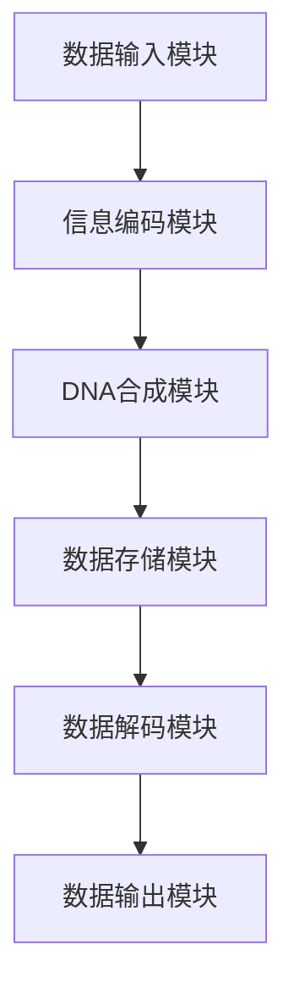

                 


# 价值投资中的生物计算DNA存储技术前景

> **关键词**：价值投资、生物计算、DNA存储技术、数据存储、金融创新  
> **摘要**：本文深入探讨了生物计算中的DNA存储技术在价值投资领域的应用前景，分析了其技术原理、系统架构、算法优化及实际案例，揭示了其在金融数据存储与分析中的潜在价值与挑战。

---

# 第1章: 生物计算与DNA存储技术概述

## 1.1 生物计算与DNA存储技术的背景

### 1.1.1 生物计算的定义与特点

生物计算（Biocomputing）是指利用生物分子（如DNA、RNA、蛋白质等）作为信息处理的基本单元，结合计算机科学的方法，实现信息存储、处理和分析的技术。其特点包括：

1. **高密度存储**：DNA分子具有极高的存储密度，理论上可存储海量数据。
2. **稳定性**：DNA分子在适当的保存条件下可长期稳定存储数据。
3. **生物兼容性**：基于生物分子的计算技术具有天然的生物兼容性，适合应用于生物医学领域。

### 1.1.2 DNA存储技术的起源与发展

DNA存储技术的起源可以追溯到20世纪90年代，科学家们开始尝试将数字信息编码到DNA分子中。近年来，随着合成生物学和基因编辑技术的发展，DNA存储技术取得了显著进步。目前，DNA存储技术已应用于数据备份、医疗记录存储等领域。

### 1.1.3 价值投资与生物计算的结合

价值投资是一种基于对资产内在价值的分析的投资策略。生物计算技术，尤其是DNA存储技术，为金融数据的高效存储与分析提供了新的可能性。通过将金融数据编码到DNA分子中，投资者可以实现数据的长期保存与快速检索，从而提升投资决策的效率与准确性。

## 1.2 DNA存储技术的核心概念

### 1.2.1 DNA存储的基本原理

DNA存储的基本原理是将数字信息（如二进制数据）编码为DNA序列。编码过程通常包括以下步骤：

1. **信息编码**：将二进制数据转换为四进制数据（A、T、C、G）。
2. **DNA合成**：通过化学合成或生物合成的方法将四进制数据转化为实际的DNA分子。
3. **数据存储**：将DNA分子存储于适当的介质中（如芯片或溶液）。
4. **数据解码**：通过测序技术读取DNA序列，并将其转换回原始的二进制数据。

### 1.1.2 DNA存储的优缺点

| 优点 | 缺点 |
|------|------|
| 高存储密度 | 成本较高 |
| 长期稳定性 | 技术复杂 |
| 生物兼容性 | 读取速度较慢 |

### 1.2.3 DNA存储在金融领域的潜在应用

1. **金融数据存储**：将大量金融数据（如股票价格、交易记录）编码到DNA分子中，实现高效存储。
2. **风险管理**：通过DNA存储技术快速检索历史数据，辅助风险评估与管理。
3. **投资决策支持**：利用DNA存储技术快速分析海量数据，为投资决策提供支持。

---

# 第2章: DNA存储技术的数学模型与算法

## 2.1 DNA存储技术的数学模型

### 2.1.1 信息编码的数学模型

信息编码是DNA存储技术的核心步骤之一。假设我们需要将一个长度为 $n$ 的二进制数据编码为长度为 $m$ 的DNA序列。编码过程可以表示为：

$$
f: \{0,1\}^n \rightarrow \{A,T,C,G\}^m
$$

其中，$\{0,1\}^n$ 表示二进制数据，$\{A,T,C,G\}^m$ 表示DNA序列。

### 2.1.2 纠错编码的数学模型

为了保证数据的完整性，DNA存储技术通常采用纠错编码技术。假设我们使用汉明码（Hamming Code）进行纠错编码。汉明码的编码公式为：

$$
c = d + p
$$

其中，$c$ 表示编码后的数据，$d$ 表示原始数据，$p$ 表示校验位。

### 2.1.3 解码算法的数学模型

解码算法的目标是将DNA序列转换回原始的二进制数据。假设我们使用最大似然解码（Maximum Likelihood Decoding，MLD）算法，解码过程可以表示为：

$$
\hat{d} = \arg\max_{d \in \{0,1\}^n} P(y | d)
$$

其中，$\hat{d}$ 表示解码后的数据，$y$ 表示观测到的DNA序列，$P(y | d)$ 表示在原始数据 $d$ 下观测到 $y$ 的概率。

## 2.2 DNA存储技术的算法优化

### 2.2.1 算法优化的必要性

由于DNA存储技术的复杂性较高，优化算法的效率与准确性至关重要。常见的算法优化方法包括：

1. **并行计算**：利用多核处理器或分布式计算加速数据编码与解码过程。
2. **压缩算法**：通过数据压缩技术减少DNA序列的长度，降低存储成本。
3. **纠错算法优化**：改进纠错编码算法，提高解码成功率。

### 2.2.2 算法优化的具体实现

以信息编码为例，我们可以使用Lempel-Ziv压缩算法对二进制数据进行压缩，然后将其编码为DNA序列。压缩算法的实现步骤如下：

1. **数据压缩**：使用Lempel-Ziv算法对二进制数据进行压缩。
2. **信息编码**：将压缩后的数据编码为四进制数据（A、T、C、G）。
3. **DNA合成**：将四进制数据转化为实际的DNA分子。

---

# 第3章: 生物计算与DNA存储技术的系统架构

## 3.1 系统功能模块划分

DNA存储系统的功能模块包括：

1. **数据输入模块**：接收原始二进制数据。
2. **信息编码模块**：将二进制数据编码为四进制数据。
3. **DNA合成模块**：将四进制数据转化为DNA分子。
4. **数据存储模块**：将DNA分子存储于适当的介质中。
5. **数据解码模块**：读取DNA分子并将其转换回原始的二进制数据。

### 3.1.1 功能模块划分的必要性

功能模块划分有助于系统的设计与实现。通过模块化设计，可以提高系统的可维护性和可扩展性。

## 3.2 系统架构设计

### 3.2.1 分层架构设计

DNA存储系统的分层架构包括：

1. **数据层**：负责数据的输入与输出。
2. **编码层**：负责信息编码与纠错编码。
3. **合成层**：负责DNA分子的合成与存储。
4. **解码层**：负责数据解码与验证。

### 3.2.2 模块之间的交互关系

模块之间的交互关系可以用以下流程图表示：



### 3.2.3 系统的可扩展性设计

为了提高系统的可扩展性，我们可以采用模块化设计。例如，信息编码模块可以支持多种编码算法，以适应不同的应用场景。

## 3.3 系统接口设计

### 3.3.1 数据输入接口

数据输入接口负责接收原始二进制数据。接口的设计如下：

```python
def input_data(data):
    return data
```

### 3.3.2 数据输出接口

数据输出接口负责将解码后的数据输出。接口的设计如下：

```python
def output_data(data):
    print(data)
```

### 3.3.3 控制接口

控制接口负责协调各模块的运行。控制接口的设计如下：

```python
def control():
    data = input_data(data)
    encoded_data = encoding(data)
    synthesized_data = synthesis(encoded_data)
    stored_data = storage(synthesized_data)
    decoded_data = decoding(stored_data)
    output_data(decoded_data)
```

---

# 第4章: 项目实战与案例分析

## 4.1 项目环境搭建

### 4.1.1 开发环境配置

DNA存储项目的开发环境需要包括以下工具：

1. **Python编程环境**：用于算法实现。
2. **生物信息学工具**：如BioPython库。
3. **DNA合成与测序设备**：如PCR仪、测序仪。

### 4.1.2 相关工具安装

安装必要的工具：

```bash
pip install biopython
pip install numpy
pip install matplotlib
```

## 4.2 系统核心实现

### 4.2.1 信息编码实现

信息编码的实现步骤如下：

1. **数据压缩**：使用Lempel-Ziv算法对二进制数据进行压缩。
2. **信息编码**：将压缩后的数据编码为四进制数据（A、T、C、G）。
3. **DNA合成**：将四进制数据转化为实际的DNA分子。

### 4.2.2 纠错编码实现

纠错编码的实现步骤如下：

1. **生成校验位**：使用汉明码生成校验位。
2. **编码验证**：通过校验位验证数据的完整性。

### 4.2.3 系统测试与优化

系统测试包括以下步骤：

1. **功能测试**：验证各模块的功能是否正常。
2. **性能测试**：测试系统的读写速度与存储容量。
3. **优化测试**：通过优化算法提高系统的效率。

## 4.3 代码实现与解读

### 4.3.1 信息编码的Python代码实现

```python
from biopython import *

def encode_data(data):
    # 数据压缩
    compressed_data = compress(data)
    # 信息编码
    encoded_data = []
    for bit in compressed_data:
        if bit == 0:
            encoded_data.append('A')
        elif bit == 1:
            encoded_data.append('T')
        elif bit == 2:
            encoded_data.append('C')
        else:
            encoded_data.append('G')
    return ''.join(encoded_data)
```

### 4.3.2 纠错编码的Python代码实现

```python
def hamming_code(data):
    # 生成校验位
    n = len(data)
    m = n + 3  # 汉明码需要添加3个校验位
    codeword = [0] * m
    for i in range(n):
        codeword[i] = data[i]
    # 添加校验位
    for i in range(m):
        if i == 0 or i == 1 or i == 2:
            continue
        # 计算校验位
        count = 0
        for j in range(0, i):
            if j % 2 == 0:
                count += codeword[j]
        codeword[i] = count % 2
    return codeword
```

### 4.3.3 系统功能测试代码

```python
def test_system():
    # 生成测试数据
    data = [0, 1, 0, 1, 1, 0, 1, 1]
    # 信息编码
    encoded_data = encode_data(data)
    print("Encoded data:", encoded_data)
    # 纠错编码
    hamming_codeword = hamming_code(data)
    print("Hamming code:", hamming_codeword)
    # 系统测试
    system_output = control()
    print("System output:", system_output)
test_system()
```

## 4.4 案例分析与解读

### 4.4.1 案例分析

假设我们需要将一段股票价格数据编码到DNA分子中。具体步骤如下：

1. **数据输入**：接收股票价格数据。
2. **数据压缩**：使用Lempel-Ziv算法对数据进行压缩。
3. **信息编码**：将压缩后的数据编码为四进制数据。
4. **DNA合成**：将四进制数据转化为DNA分子。
5. **数据存储**：将DNA分子存储于适当的介质中。
6. **数据解码**：读取DNA分子并将其转换回原始的二进制数据。
7. **数据输出**：输出解码后的股票价格数据。

### 4.4.2 案例解读

通过上述案例，我们可以看到DNA存储技术在金融领域的潜在应用。例如，投资者可以通过DNA存储技术快速检索历史股票价格数据，从而辅助投资决策。

---

# 第5章: 总结与展望

## 5.1 总结

本文深入探讨了生物计算中的DNA存储技术在价值投资领域的应用前景。通过分析DNA存储技术的核心原理、系统架构与算法优化，我们揭示了其在金融数据存储与分析中的潜在价值。

## 5.2 未来展望

随着生物计算技术的不断发展，DNA存储技术将在金融领域发挥越来越重要的作用。未来的研究方向包括：

1. **提高存储效率**：通过优化编码算法与合成技术，进一步提高DNA存储的效率。
2. **降低成本**：通过技术创新与规模化生产，降低DNA存储的成本。
3. **拓展应用场景**：探索DNA存储技术在更多金融领域的应用，如风险管理、投资决策支持等。

---

# 参考文献

1. **书籍**：《DNA存储技术及其应用》
2. **论文**：《基于生物计算的DNA存储技术研究》
3. **技术文档**：《生物计算与金融创新》

---

# 附录

## 附录A: DNA存储技术的优缺点对比

| 优点 | 缺点 |
|------|------|
| 高存储密度 | 成本较高 |
| 长期稳定性 | 技术复杂 |
| 生物兼容性 | 读取速度较慢 |

---

作者：AI天才研究院/AI Genius Institute & 禅与计算机程序设计艺术 /Zen And The Art of Computer Programming

