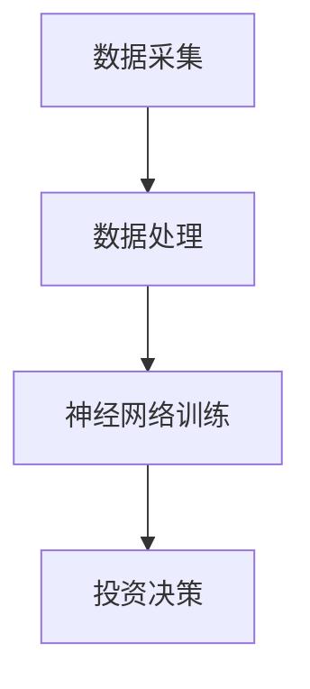
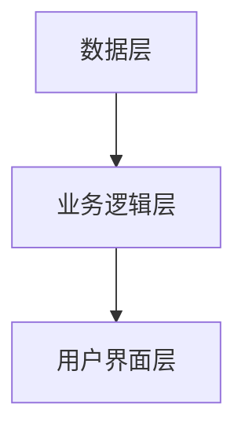

                 


# 价值投资中的生物计算神经网络技术前景

> **关键词**：价值投资、生物计算、神经网络、金融科技、人工智能、投资策略

> **摘要**：本文探讨了生物计算神经网络技术在价值投资中的应用前景。通过分析神经网络的基本原理、生物计算的特点，结合金融数据分析，提出了基于生物计算神经网络的价值投资策略。文章详细讲解了生物计算神经网络的算法原理、系统架构设计，并通过实际案例展示了其在价值投资中的应用效果，最后展望了未来的发展方向。

---

# 第1章: 价值投资与生物计算神经网络技术概述

## 1.1 价值投资的核心概念

### 1.1.1 价值投资的定义与历史发展

价值投资是一种以基本面分析为基础的投资策略，旨在通过识别市场中的价值低估资产，长期持有以实现超额收益。该策略最早由本杰明·格雷厄姆提出，后经 Warren Buffett 等投资者的发展和完善，成为投资领域的重要流派。

### 1.1.2 价值投资的基本原理

价值投资的核心在于寻找市场价格低于其内在价值的资产。内在价值的计算通常基于企业的财务状况、行业地位、竞争优势等因素。投资者通过深入分析这些因素，识别出具有长期竞争优势的企业，进行长期投资。

### 1.1.3 价值投资在现代金融中的地位

随着金融市场的复杂化和数据化的推进，传统价值投资需要结合现代技术手段，如人工智能和大数据分析，以提高分析效率和准确性。生物计算神经网络技术的出现，为价值投资提供了新的工具和方法。

---

## 1.2 生物计算神经网络技术的定义与特点

### 1.2.1 生物计算神经网络的定义

生物计算神经网络是一种模拟生物神经系统结构和功能的计算模型，通过多层次的神经元和突触连接，实现数据的处理和模式识别。与传统神经网络相比，生物计算神经网络更强调模拟生物神经系统的动态特性。

### 1.2.2 生物计算神经网络的核心特点

1. **生物启发性**：模拟生物神经系统的结构和功能。
2. **非线性处理能力**：能够处理复杂的非线性关系。
3. **自适应学习**：通过调整权重实现自适应优化。
4. **并行计算**：具备高效的并行计算能力。

### 1.2.3 生物计算神经网络与传统神经网络的区别

| 属性             | 生物计算神经网络             | 传统神经网络             |
|------------------|------------------------------|--------------------------|
| 模型复杂度       | 更接近生物神经系统，复杂度高 | 结构相对简单，复杂度低   |
| 学习机制         | 基于生物突触的动态调整       | 基于反向传播的梯度下降   |
| 应用领域         | 生物医学、金融分析等         | 图像识别、自然语言处理等 |

---

## 1.3 价值投资与生物计算神经网络技术的结合

### 1.3.1 生物计算神经网络在金融分析中的应用

生物计算神经网络可以用于股票价格预测、市场趋势分析、风险评估等金融领域。其强大的非线性处理能力和自适应学习能力，使其在复杂金融市场中表现出色。

### 1.3.2 价值投资中的数据驱动决策

通过生物计算神经网络对大量金融数据的分析，投资者可以发现市场中的潜在价值低估资产，提高价值投资的效率和准确性。

### 1.3.3 生物计算神经网络技术的前景展望

随着技术的进步，生物计算神经网络在价值投资中的应用将更加广泛和深入，可能成为未来投资决策的重要工具。

---

# 第2章: 生物计算神经网络技术的核心概念

## 2.1 生物计算神经网络的基本原理

### 2.1.1 神经网络的基本结构

生物计算神经网络的基本结构包括输入层、隐藏层和输出层。输入层接收金融市场数据，隐藏层通过神经元和突触连接进行数据处理，输出层生成预测结果。

### 2.1.2 生物计算神经网络的激活函数

激活函数是神经网络的重要组成部分，常用的激活函数包括sigmoid、relu和tanh。这些函数决定了神经网络的非线性处理能力。

### 2.1.3 生物计算神经网络的损失函数

损失函数用于衡量预测值与真实值之间的差异。常用的损失函数包括均方误差（MSE）和交叉熵损失。

---

## 2.2 生物计算神经网络与传统神经网络的对比

### 2.2.1 核心概念对比表格

| 属性             | 生物计算神经网络             | 传统神经网络             |
|------------------|------------------------------|--------------------------|
| 模型复杂度       | 更接近生物神经系统，复杂度高 | 结构相对简单，复杂度低   |
| 学习机制         | 基于生物突触的动态调整       | 基于反向传播的梯度下降   |
| 应用领域         | 生物医学、金融分析等         | 图像识别、自然语言处理等 |

### 2.2.2 生物计算神经网络的ER实体关系图

```mermaid
erd
  股票价格 --|> 神经网络: 输入
  神经网络 --|> 预测结果: 输出
  预测结果 --|> 投资决策: 输入
```

---

# 第3章: 生物计算神经网络技术的算法原理

## 3.1 神经网络的基本算法

### 3.1.1 前馈神经网络的算法流程

1. 输入数据经过输入层，传递到隐藏层。
2. 隐藏层通过激活函数处理数据，传递到输出层。
3. 输出层生成预测结果。

### 3.1.2 反向传播算法的数学模型

反向传播算法通过计算损失函数的梯度，调整神经网络的权重。数学模型如下：

$$
\frac{\partial L}{\partial w} = \frac{\partial L}{\partial a} \cdot \frac{\partial a}{\partial w}
$$

其中，\( L \) 是损失函数，\( w \) 是权重，\( a \) 是激活函数的输出。

### 3.1.3 激活函数的数学表达式

常用的激活函数sigmoid的数学表达式为：

$$
f(x) = \frac{1}{1 + e^{-x}}
$$

---

## 3.2 生物计算神经网络的优化算法

### 3.2.1 随机梯度下降算法

随机梯度下降是一种常用的优化算法，通过随机抽取样本更新权重。数学表达式为：

$$
w = w - \eta \frac{\partial L}{\partial w}
$$

其中，\( \eta \) 是学习率。

### 3.2.2 动量优化算法

动量优化算法通过引入动量项加速收敛。数学表达式为：

$$
v = \beta v + \eta \frac{\partial L}{\partial w}
$$

$$
w = w - v
$$

### 3.2.3 Adam优化算法

Adam优化算法结合了动量和自适应学习率。数学表达式为：

$$
m = \beta_1 m + (1 - \beta_1) \frac{\partial L}{\partial w}
$$

$$
n = \beta_2 n + (1 - \beta_2) \left( \frac{\partial L}{\partial w} \right)^2
$$

$$
w = w - \eta \frac{m}{\sqrt{n + \epsilon}}
$$

---

## 3.3 生物计算神经网络的训练过程

### 3.3.1 数据预处理与特征提取

1. 数据清洗：处理缺失值、异常值等。
2. 特征提取：提取有用的特征，如市盈率、市净率等。

### 3.3.2 网络训练的正向传播

输入数据经过神经网络的正向传播，生成预测结果。

### 3.3.3 网络训练的反向传播

通过反向传播算法调整权重，最小化损失函数。

---

# 第4章: 生物计算神经网络技术的系统架构设计

## 4.1 金融价值分析系统的功能设计

### 4.1.1 系统功能模块划分

1. 数据采集模块：采集金融市场数据。
2. 数据处理模块：处理和预处理数据。
3. 神经网络训练模块：训练生物计算神经网络。
4. 投资决策模块：生成投资建议。

### 4.1.2 系统功能流程图



---

## 4.2 系统架构设计

### 4.2.1 系统架构的分层设计

1. 数据层：存储金融市场数据。
2. 业务逻辑层：处理数据和训练模型。
3. 用户界面层：展示投资建议。

### 4.2.2 系统架构的组件关系



---

## 4.3 系统接口设计

### 4.3.1 系统输入接口

1. 数据接口：接收金融市场数据。
2. 用户输入接口：接收用户的输入指令。

### 4.3.2 系统输出接口

1. 预测结果接口：输出预测的股票价格。
2. 投资建议接口：输出投资建议。

---

# 第5章: 生物计算神经网络技术的项目实战

## 5.1 环境搭建与数据准备

### 5.1.1 环境安装与配置

安装Python、TensorFlow、Keras等工具。

### 5.1.2 数据收集与预处理

从金融数据库中获取股票价格数据，并进行清洗和特征提取。

## 5.2 神经网络模型的实现

### 5.2.1 模型定义与训练

定义生物计算神经网络模型，并进行训练。

### 5.2.2 模型训练与优化

通过优化算法调整模型参数，提高预测精度。

---

## 5.3 实际案例分析

### 5.3.1 案例背景

以某只股票为例，分析其内在价值和市场价格。

### 5.3.2 数据分析与模型预测

通过模型预测股票价格，判断其是否低估。

### 5.3.3 投资决策

根据模型预测结果，生成投资建议。

---

# 第6章: 未来展望与最佳实践

## 6.1 未来技术趋势

随着人工智能和大数据技术的不断发展，生物计算神经网络在价值投资中的应用将更加广泛和深入。

## 6.2 投资策略建议

投资者应结合生物计算神经网络技术和基本面分析，制定科学的投资策略。

## 6.3 风险管理

在使用生物计算神经网络技术进行投资时，应注重风险管理，避免过度依赖模型。

---

# 小结

生物计算神经网络技术为价值投资提供了新的工具和方法，通过其强大的数据处理能力和自适应学习能力，投资者可以更高效地识别市场中的价值低估资产，提高投资收益。

---

# 作者

作者：AI天才研究院 & 禅与计算机程序设计艺术

---

这篇文章详细介绍了生物计算神经网络技术在价值投资中的应用前景，从理论到实践，从算法到系统设计，全面分析了其在金融领域的潜力和价值。

