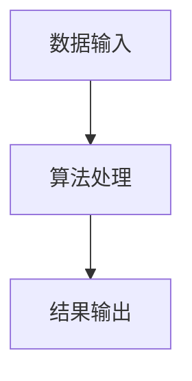

                 

# 价值投资中的生物计算蛋白质折叠技术前景

> 关键词：价值投资，生物计算，蛋白质折叠，药物研发，投资决策，算法

> 摘要：本文探讨了生物计算在蛋白质折叠技术中的应用及其对价值投资的潜在影响。通过分析蛋白质折叠的核心原理、生物计算工具的应用以及技术进步对投资决策的影响，本文为投资者提供了新的视角和策略。

---

# 第1章: 生物计算与蛋白质折叠技术概述

## 1.1 生物计算的定义与特点

生物计算（Bioinformatics）是生物科学与信息科学的交叉领域，通过计算方法研究生物数据，如基因序列、蛋白质结构等。其特点包括：

- 数据驱动：依赖大量生物数据进行分析。
- 跨学科：结合生物学、计算机科学和数学。
- 应用广泛：在药物研发、疾病诊断等领域有重要应用。

生物计算的核心目标是利用计算工具揭示生物系统的规律。

## 1.2 蛋白质折叠技术的背景与应用

蛋白质折叠是生物科学中的重要问题。蛋白质的功能由其三维结构决定，折叠错误可能导致疾病。蛋白质折叠技术通过计算模拟预测蛋白质结构，已在药物设计和疾病研究中广泛应用。

## 1.3 价值投资中的生物计算应用

价值投资关注企业长期价值，生物计算为投资者提供了新的工具。蛋白质折叠技术可以帮助评估生物技术企业的潜力，优化投资决策。

---

# 第2章: 蛋白质折叠技术的核心原理

## 2.1 蛋白质结构与功能的关系

蛋白质的功能由其结构决定。正确折叠是功能正常的基础。通过生物计算模拟蛋白质折叠，可以预测结构和功能。

## 2.2 蛋白质折叠算法的基本原理

### 2.2.1 分子动力学模拟

分子动力学（MD）模拟通过计算原子间作用力，模拟分子运动。公式如下：

$$ F = -\frac{\partial U}{\partial r} $$

其中，$F$ 是力，$U$ 是势能，$r$ 是距离。

### 2.2.2 同源建模

同源建模基于已知结构预测新蛋白质结构。其步骤包括序列比对、模建模和能量优化。

---

# 第3章: 生物计算在价值投资中的应用前景

## 3.1 蛋白质折叠技术在药物研发中的价值

蛋白质折叠技术加速药物研发，降低研发成本。例如，AlphaFold的成功展示了计算在预测蛋白质结构中的潜力。

## 3.2 蛋白质折叠技术在市场分析中的应用

生物计算可以帮助投资者评估生物技术企业的技术优势。例如，预测技术进步对企业盈利能力的影响。

---

# 第4章: 蛋白质折叠算法的数学模型与实现

## 4.1 蛋白质折叠算法的数学模型

能量函数是蛋白质折叠的核心。常用的能量函数包括：

$$ E = \sum_{i<j} V(r_ij) $$

其中，$V$ 是距离$r_ij$的势能函数。

---

# 第5章: 系统架构与案例分析

## 5.1 系统架构设计

系统架构包括数据输入、算法处理和结果输出模块。使用Mermaid图展示系统流程。

## 5.2 案例分析

以某生物技术公司为例，分析蛋白质折叠技术如何影响投资决策。例如，预测新药研发的可行性。

---

# 作者

作者：AI天才研究院 & 禅与计算机程序设计艺术

