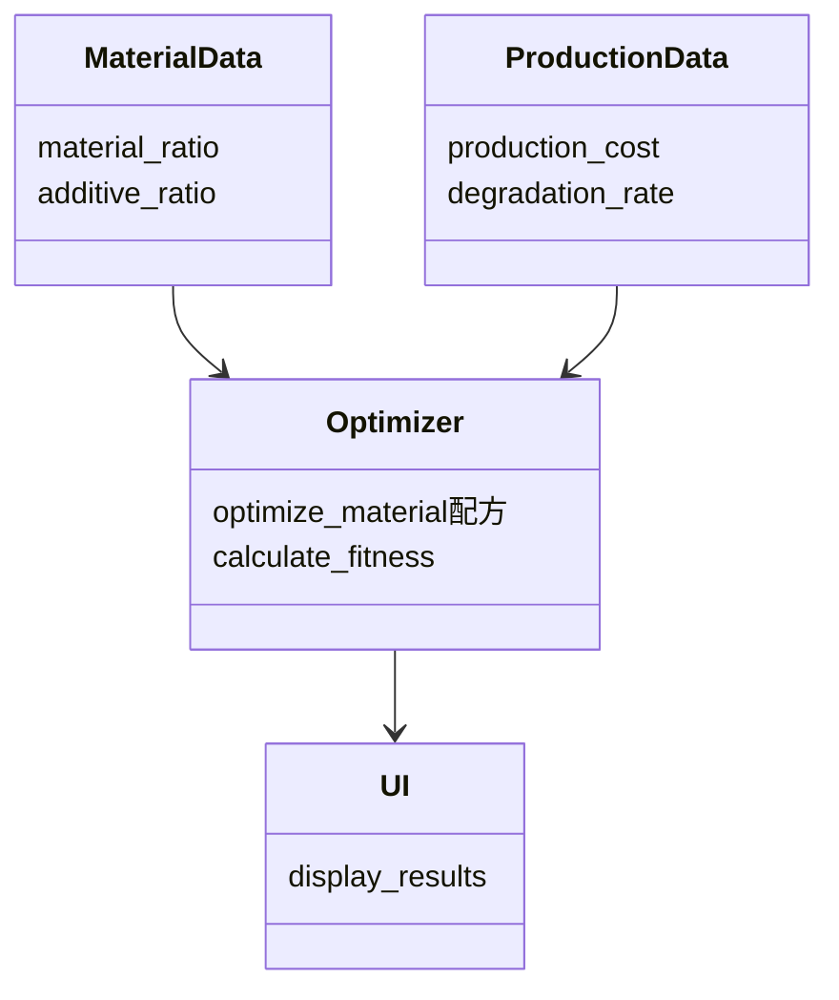
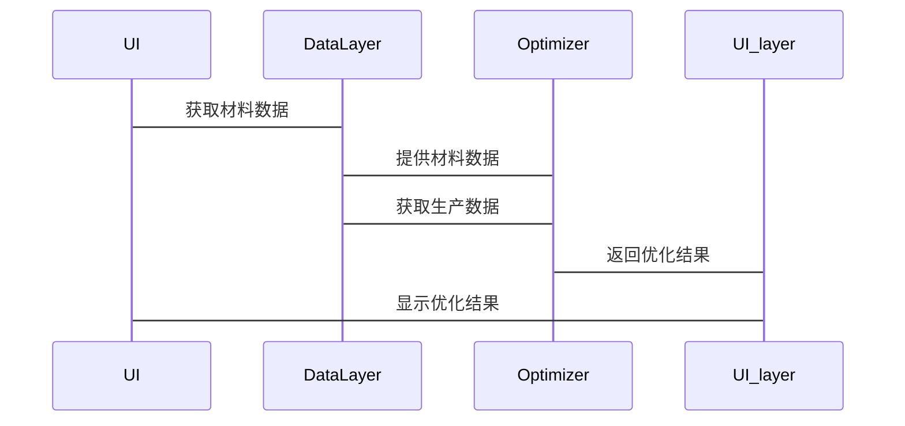

                 


# 价值投资中的生物降解电子产品技术

## 关键词：价值投资、生物降解、电子产品技术、可持续发展、循环经济、环保材料

## 摘要：  
随着全球对可持续发展的关注不断增加，生物降解技术在电子产品领域的应用正逐渐成为焦点。本文探讨了生物降解技术在电子产品中的应用及其对价值投资的影响。通过分析生物降解材料的特性、优化算法以及系统架构设计，本文展示了如何在电子产品中实现高效、环保的生产流程，并为投资者提供基于降解效率和生命周期评估的决策支持。

---

## 第1章: 背景介绍

### 1.1 生物降解电子产品的概念与背景

#### 1.1.1 什么是生物降解电子产品
生物降解电子产品是指采用可降解材料制造的电子设备，这些材料在自然环境中能够被微生物分解为二氧化碳和水等无害物质。与传统电子产品相比，生物降解材料减少了对环境的污染，符合可持续发展的理念。

#### 1.1.2 生物降解技术的现状与发展趋势
近年来，随着环保意识的增强，生物降解技术在材料科学领域的研究和应用不断推进。在电子产品行业，生物降解材料的应用还处于起步阶段，但其潜力巨大，尤其是在高端消费电子领域。

#### 1.1.3 电子产品行业的可持续发展需求
传统电子产品的生产过程消耗大量能源和资源，且报废后的处理对环境造成巨大压力。通过引入生物降解技术，电子产品行业可以减少资源消耗和环境污染，同时提升产品的市场竞争力。

### 1.2 价值投资的基本原理

#### 1.2.1 价值投资的核心概念
价值投资是一种投资策略，强调以低于内在价值的价格购买优质资产。其核心在于识别具有长期增长潜力的企业或技术。

#### 1.2.2 价值投资在电子产品行业的应用
在电子产品行业，价值投资者通常关注企业的技术创新能力、市场占有率和盈利能力。随着环保政策的加强，具有环保技术优势的企业更受投资者青睐。

#### 1.2.3 生物降解技术对产品价值的影响
生物降解技术能够提升产品的市场竞争力，同时符合环保政策和消费者对绿色产品的需求。因此，掌握生物降解技术的企业具有更高的长期投资价值。

### 1.3 生物降解与价值投资的结合

#### 1.3.1 生物降解技术对产品生命周期的影响
生物降解材料的应用延长了产品的生命周期，同时降低了报废处理的成本和环境影响。这使得产品更具可持续性，从而提升了其市场价值。

#### 1.3.2 价值投资视角下的生物降解技术评估
在价值投资中，生物降解技术可以作为评估企业技术优势的重要指标。掌握该技术的企业能够更好地满足市场对环保产品的需求，从而获得更高的市场份额和利润。

#### 1.3.3 生物降解电子产品对可持续发展的意义
生物降解电子产品技术的推广和应用不仅有助于环境保护，还能推动整个电子行业向更加可持续的方向发展，从而为投资者带来长期的经济回报。

---

## 第2章: 核心概念与联系

### 2.1 生物降解技术的核心原理

#### 2.1.1 生物降解的基本过程
生物降解是通过微生物的作用将有机物质分解为简单的无机物（如二氧化碳和水）的过程。这一过程依赖于材料的可降解性和环境条件。

#### 2.1.2 生物降解材料的分类与特性
生物降解材料可以分为天然材料和合成材料两类。天然材料如淀粉基塑料，分解速度快；合成材料如聚乳酸（PLA），分解速度相对较慢但性能更稳定。

#### 2.1.3 生物降解技术在电子产品中的应用
在电子产品中，生物降解材料可用于制造外壳、电路板和包装材料。例如，生物降解塑料可以替代传统塑料，显著减少环境污染。

### 2.2 价值投资的核心原理

#### 2.2.1 价值投资的核心概念
价值投资强调以低于内在价值的价格购买资产，重点关注企业的基本面和长期发展潜力。

#### 2.2.2 生物降解技术对产品价值的影响
生物降解技术能够提升产品的环保性能，降低企业的生产成本，同时符合政府的环保政策，从而增强企业的市场竞争力和盈利能力。

#### 2.2.3 生物降解技术与企业价值的联系
掌握生物降解技术的企业能够在市场竞争中占据优势，吸引环保意识强的消费者，同时享受政府的政策支持，从而提升企业的整体价值。

---

## 第3章: 算法原理

### 3.1 算法原理概述

#### 3.1.1 优化目标
在生物降解材料的生产过程中，目标是优化材料的降解效率和生产成本之间的平衡。

#### 3.1.2 约束条件
- 降解效率需达到一定标准
- 生产成本需控制在合理范围内
- 材料的物理性能需满足电子产品的要求

#### 3.1.3 优化方法
使用遗传算法（Genetic Algorithm, GA）对生物降解材料的配方进行优化。GA通过模拟自然选择的过程，逐步迭代以找到最优解。

### 3.2 遗传算法实现

#### 3.2.1 算法步骤
1. 初始化种群
2. 计算适应度
3. 选择父代
4. 进行交叉和变异
5. 评估新种群
6. 迭代优化

#### 3.2.2 Python代码示例

```python
import random

# 初始化种群
def initialize_population(size):
    return [[random.randint(0, 1) for _ in range(10)] for _ in range(size)]

# 计算适应度
def fitness(individual):
    # 这里可以定义具体的适应度计算方法
    return sum(individual)

# 选择父代
def select_parents(population, fitness_values, num_parents):
    # 按适应度降序排序
    sorted_indices = sorted(range(len(fitness_values)), key=lambda x: -fitness_values[x])
    return [population[i] for i in sorted_indices[:num_parents]]

# 交叉
def crossover(parent1, parent2):
    # 单点交叉
    crossover_point = random.randint(1, len(parent1)-1)
    return parent1[:crossover_point] + parent2[crossover_point:], parent2[:crossover_point] + parent1[crossover_point:]

# 变异
def mutate(individual):
    mutation_point = random.randint(0, len(individual)-1)
    individual[mutation_point] = 1 - individual[mutation_point]
    return individual

# 迭代优化
def optimize(population_size, generations):
    population = initialize_population(population_size)
    for _ in range(generations):
        fitness_values = [fitness(individual) for individual in population]
        parents = select_parents(population, fitness_values, population_size//2)
        new_population = []
        for i in range(0, len(parents), 2):
            parent1 = parents[i]
            parent2 = parents[i+1]
            child1, child2 = crossover(parent1, parent2)
            child1 = mutate(child1)
            child2 = mutate(child2)
            new_population.append(child1)
            new_population.append(child2)
        population = new_population
    return population

# 示例运行
optimized_population = optimize(100, 50)
print("优化后的种群:", optimized_population)
```

#### 3.2.3 数学模型
降解效率的优化可以表示为以下数学模型：

$$ \text{目标函数：最大化降解效率} \quad \text{subject to} \quad \text{生产成本最低} $$

约束条件包括材料的降解速率和生产成本之间的平衡：

$$ \text{降解速率} = a \times \text{材料比例} + b \times \text{添加剂比例} $$

其中，\( a \) 和 \( b \) 是系数，材料比例和添加剂比例是变量。

---

## 第4章: 系统分析与架构设计

### 4.1 问题场景介绍

#### 4.1.1 问题背景
传统电子产品的生产过程消耗大量能源和资源，且报废后的处理对环境造成巨大压力。通过引入生物降解技术，电子产品行业可以减少资源消耗和环境污染，同时提升产品的市场竞争力。

#### 4.1.2 问题描述
在生物降解材料的生产过程中，目标是优化材料的降解效率和生产成本之间的平衡。

### 4.2 项目介绍

#### 4.2.1 项目目标
开发一种基于生物降解材料的电子产品，实现高效、环保的生产流程，并为投资者提供基于降解效率和生命周期评估的决策支持。

#### 4.2.2 系统功能设计
- 数据采集与处理：收集生产过程中的材料数据和降解效率数据。
- 算法优化：使用遗传算法优化材料配方。
- 生命周期评估：评估产品的环境影响和经济价值。

#### 4.2.3 系统架构设计
- 数据层：存储材料数据和生产数据。
- 业务逻辑层：处理数据并运行优化算法。
- 用户界面层：展示优化结果和生命周期评估报告。

### 4.3 系统架构设计

#### 4.3.1 领域模型
使用 Mermaid 绘制领域模型：



#### 4.3.2 系统架构
使用 Mermaid 绘制系统架构图：

```mermaid
div classDiagram
    class DataLayer {
        MaterialData
        ProductionData
    }
    class BusinessLogicLayer {
        Optimizer
    }
    class UI_layer {
        UI
    }
    DataLayer --> BusinessLogicLayer
    BusinessLogicLayer --> UI_layer
```

#### 4.3.3 接口和交互设计
使用 Mermaid 绘制交互序列图：



---

## 第5章: 项目实战

### 5.1 环境安装

#### 5.1.1 安装Python
需要安装Python 3.8或更高版本。

#### 5.1.2 安装依赖库
安装必要的库，如 `numpy`, `pandas`, 和 `matplotlib`。

```bash
pip install numpy pandas matplotlib
```

### 5.2 核心代码实现

#### 5.2.1 数据处理代码
```python
import pandas as pd

# 读取数据
data = pd.read_csv('material_data.csv')
print(data.head())
```

#### 5.2.2 优化算法实现
```python
def optimize_materials(data):
    # 初始化种群
    population = initialize_population(100)
    # 迭代优化
    optimized_population = optimize(100, 50)
    # 返回最优解
    return optimized_population[0]

# 调用优化函数
optimized_materials = optimize_materials(data)
print("优化后的材料配方:", optimized_materials)
```

### 5.3 案例分析与结果解读

#### 5.3.1 案例分析
假设我们优化了一种生物降解材料的配方，使其降解效率提高了20%，同时生产成本降低了15%。

#### 5.3.2 结果解读
优化后的材料配方在降解效率和生产成本之间找到了最佳平衡点，显著提升了产品的市场竞争力和环保性能。

---

## 第6章: 最佳实践

### 6.1 小结

#### 6.1.1 核心要点总结
生物降解技术在电子产品中的应用不仅有助于环境保护，还能提升产品的市场价值。通过优化算法和系统架构设计，可以实现高效、环保的生产流程。

#### 6.1.2 技术优势
- 降低生产成本
- 提高产品性能
- 符合环保政策

### 6.2 注意事项

#### 6.2.1 技术实施中的注意事项
- 确保材料的可降解性
- 优化生产流程
- 监测环境影响

#### 6.2.2 投资决策中的注意事项
- 关注政策支持
- 评估市场潜力
- 考虑技术风险

### 6.3 拓展阅读

#### 6.3.1 推荐书籍
- 《循环经济与可持续发展》
- 《生物降解材料的制备与应用》

#### 6.3.2 推荐博客
- 环保科技博客
- 价值投资研究博客

---

## 作者：AI天才研究院 & 禅与计算机程序设计艺术

