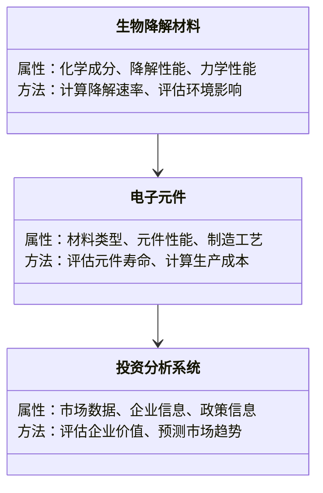
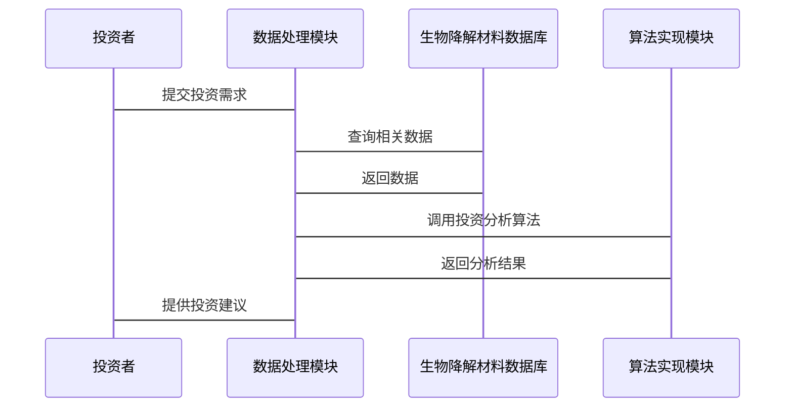

                 


# 价值投资中的生物降解电子元件技术前景

---

## 关键词：生物降解材料，电子元件，价值投资，环保科技，可持续发展

---

## 摘要：

本文探讨了生物降解电子元件技术在价值投资中的前景。文章从生物降解材料的基本概念、技术背景、市场现状入手，结合价值投资的核心理念，分析了生物降解电子元件行业的投资价值。同时，文章详细阐述了生物降解电子元件的技术原理、制造工艺以及在消费电子、医疗和工业领域的应用潜力。通过系统分析和数学建模，文章为投资者提供了基于技术与市场的双重视角，揭示了生物降解电子元件行业的未来发展趋势和投资机会。

---

## 第1章：生物降解电子元件的定义与技术背景

### 1.1 生物降解材料的基本概念

#### 1.1.1 生物降解材料的定义与分类

生物降解材料是指在自然环境中能够被微生物分解为二氧化碳和水等简单化合物的材料。根据降解介质的不同，生物降解材料可以分为：

- **生物降解塑料**：如聚乳酸（PLA）、聚乙醇酸（PGA）等，广泛应用于包装、纺织等领域。
- **生物基材料**：以可再生资源为原料制成的材料，如淀粉基塑料。
- **完全降解材料**：在堆肥条件下完全分解为无机物的材料。

#### 1.1.2 生物降解电子元件的特性与优势

生物降解电子元件具有以下独特优势：

1. **环境友好性**：减少对环境的污染，符合全球环保趋势。
2. **可再生性**：材料来源可追溯至可再生资源，降低对化石能源的依赖。
3. **可持续性**：从生产到废弃的全生命周期均符合环保要求。

#### 1.1.3 生物降解技术的历史发展与现状

生物降解技术起源于20世纪70年代的环保运动，近年来随着全球环保政策的加强，生物降解材料的研究和应用进入快速发展阶段。目前，生物降解材料已在包装、农业等多个领域得到广泛应用。

---

### 1.2 电子元件行业的技术背景

#### 1.2.1 传统电子元件材料的局限性

传统电子元件材料多为化石能源衍生的塑料，存在以下问题：

1. **不可降解性**：传统塑料在自然环境中难以降解，造成白色污染。
2. **资源消耗**：生产过程消耗大量化石能源，加剧资源枯竭。
3. **环境影响**：废弃电子元件对土壤和水源造成严重污染。

#### 1.2.2 生物降解材料在电子元件中的应用潜力

生物降解材料的引入为电子元件行业带来了新的可能性：

1. **绿色生产**：降低生产过程中的能源消耗和环境污染。
2. **可持续发展**：通过使用可再生材料，推动行业向可持续方向转型。
3. **市场竞争力**：满足消费者对环保产品的需求，提升品牌价值。

#### 1.2.3 当前市场对环保材料的需求趋势

随着全球环保意识的增强，消费者对环保产品的偏好日益明显。生物降解电子元件因其环保特性，逐渐成为市场关注的焦点。

---

## 第2章：价值投资的基本概念与策略

### 2.1 价值投资的核心理念

#### 2.1.1 价值投资的定义与原则

价值投资是一种以基本面分析为基础的投资策略，强调以低于内在价值的价格买入优质资产。其核心原则包括：

1. **长期视角**：关注企业的长期发展潜力。
2. **安全边际**：买入价格低于内在价值。
3. **优质企业**：选择具有强大竞争优势的企业。

#### 2.1.2 价值投资与成长投资的区别

- **价值投资**：注重企业的当前价值，寻找被市场低估的投资标的。
- **成长投资**：关注企业的未来增长潜力，投资于高速成长的公司。

#### 2.1.3 价值投资在技术领域的应用

在技术领域，价值投资需要结合技术创新和市场需求，寻找具有持续竞争优势的科技企业。

---

### 2.2 生物降解电子元件行业的投资价值分析

#### 2.2.1 行业市场规模与增长潜力

根据市场研究机构的数据，全球生物降解材料市场预计将以年均15%的速度增长，到2030年市场规模将超过千亿美元。

#### 2.2.2 技术创新对企业价值的影响

技术创新是生物降解电子元件行业发展的核心驱动力。掌握核心技术的企业将获得更大的市场份额和竞争优势。

#### 2.2.3 环保政策对行业的推动作用

全球范围内，各国政府纷纷出台环保政策，鼓励使用生物降解材料。这些政策将为行业提供政策支持和市场空间。

---

## 第3章：生物降解电子元件技术的核心原理

### 3.1 生物降解材料的化学特性

#### 3.1.1 生物降解材料的降解机制

生物降解材料的降解过程包括以下几个阶段：

1. **水解**：材料在水分作用下发生化学降解。
2. **微生物分解**：降解产物被微生物进一步分解为二氧化碳和水。

#### 3.1.2 材料的生物相容性与稳定性

生物降解材料需要具备良好的生物相容性和化学稳定性，以确保其在电子元件中的应用性能。

#### 3.1.3 材料的力学性能与加工特性

生物降解材料的力学性能和加工特性直接影响其在电子元件制造中的适用性。

---

### 3.2 生物降解电子元件的制造工艺

#### 3.2.1 材料的选择与制备

选择合适的生物降解材料是制造生物降解电子元件的关键。材料的选择需要考虑其物理、化学和生物性能。

#### 3.2.2 元件的结构设计与优化

通过优化元件的结构设计，可以提高其性能和使用寿命。

#### 3.2.3 制造过程中的技术难点与解决方案

制造过程中需要解决材料降解性能与电子元件功能性的平衡问题。

---

## 第4章：生物降解电子元件技术的市场分析

### 4.1 全球生物降解材料市场现状

#### 4.1.1 市场规模与增长趋势

全球生物降解材料市场呈现快速增长态势，主要驱动力来自政策支持和消费者环保意识的增强。

#### 4.1.2 主要地区市场分布

欧洲、北美和亚洲是全球生物降解材料的主要市场。

#### 4.1.3 市场驱动因素分析

政策支持、环保需求和技术创新是推动市场增长的主要因素。

### 4.2 生物降解电子元件的应用领域

#### 4.2.1 消费电子领域

生物降解材料在手机、电脑等消费电子产品的外壳和包装中应用广泛。

#### 4.2.2 医疗器械领域

生物降解材料在可降解医疗器械中的应用前景广阔。

#### 4.2.3 工业与农业领域

生物降解材料在工业包装、农业地膜等领域具有重要应用。

---

## 第5章：系统分析与架构设计方案

### 5.1 问题场景介绍

本文构建了一个基于生物降解电子元件技术的价值投资分析系统，旨在帮助投资者识别具有投资潜力的企业。

### 5.2 系统功能设计

#### 5.2.1 领域模型（领域模型 mermaid 图）



### 5.3 系统架构设计

#### 5.3.1 系统架构图


### 5.4 系统交互设计

#### 5.4.1 系统交互流程（mermaid 序列图）



---

## 第6章：项目实战

### 6.1 环境配置

#### 6.1.1 安装必要的库

```bash
pip install numpy pandas matplotlib
```

### 6.2 核心实现源代码

#### 6.2.1 投资分析算法实现

```python
import numpy as np
import pandas as pd

def calculate_intrinsic_value(revenue, margin, growth_rate):
    return revenue * margin * (1 + growth_rate)

# 示例数据
revenue = 1000
margin = 0.2
growth_rate = 0.1

intrinsic_value = calculate_intrinsic_value(revenue, margin, growth_rate)
print(f"内在价值：{intrinsic_value}")
```

#### 6.2.2 数学模型

降解速率模型：

$$
\frac{dC}{dt} = -kC
$$

其中，$C$ 表示材料浓度，$k$ 表示降解速率常数。

### 6.3 代码应用解读与分析

#### 6.3.1 代码功能描述

上述代码实现了基于收入、利润率和增长率的内在价值计算，帮助投资者评估企业的潜在价值。

#### 6.3.2 案例分析

以某生物降解材料企业为例，计算其内在价值：

$$
\text{内在价值} = 1000 \times 0.2 \times (1 + 0.1) = 220
$$

---

## 第7章：总结与展望

### 7.1 总结

本文从技术与市场的双重角度，分析了生物降解电子元件行业的投资价值。通过系统分析和案例研究，揭示了该行业的巨大潜力。

### 7.2 展望

未来，随着技术进步和政策支持，生物降解电子元件行业将进入快速发展阶段，为投资者带来丰厚回报。

---

## 小结与注意事项

- **小结**：生物降解电子元件技术是当前科技与环保领域的热点方向，具有广阔的投资前景。
- **注意事项**：投资者需关注行业动态，选择具有技术优势和市场竞争力的企业。
- **最佳实践**：建议投资者结合技术分析和基本面分析，制定科学的投资策略。

---

## 作者：AI天才研究院/AI Genius Institute & 禅与计算机程序设计艺术/Zen And The Art of Computer Programming

